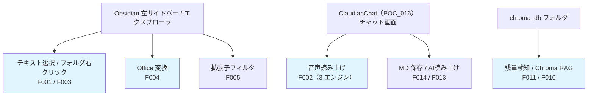
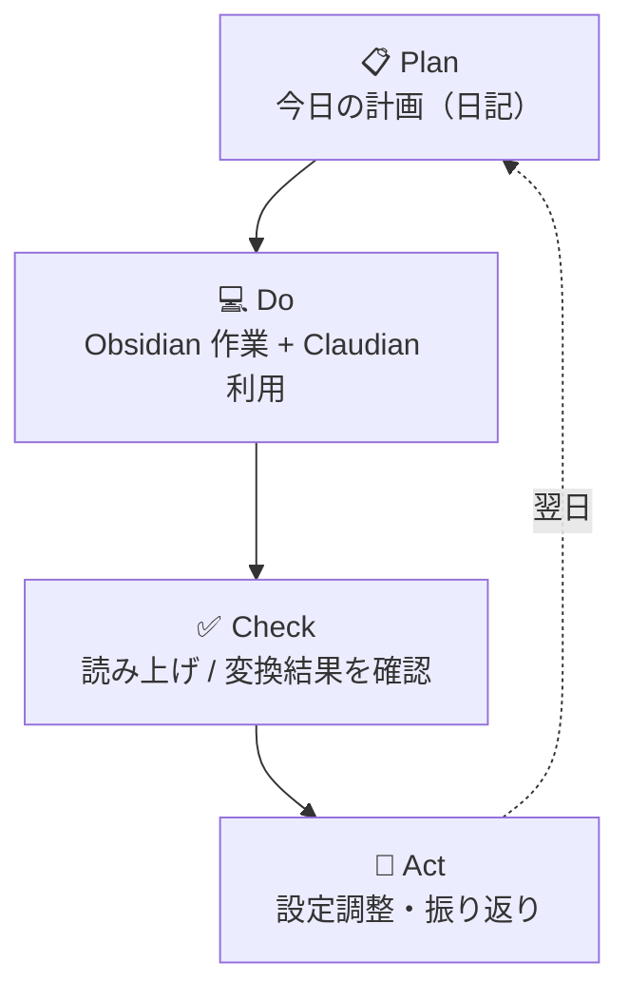

> 📂 **パス**: `80_POC_Projects/POC_017_ClaudianBridge/00_使用ガイド.md`
> 🎯 **用途**: ご主人様が Claudian Bridge（POC_017）を使用・運用するための PDCA フローと日常操作

# 🚀 Claudian Bridge 使用ガイド

> 本ガイドは、Claudian Bridge を **日常の Obsidian 作業** で最大限活用するための手順を紹介する。
> POC_015（ClaudeTTS）・POC_016（ClaudianChat）との連携も含む。

---

## 🎯 1枚の図で全体像

---

## 📋 フェーズ 0：インストール・有効化

### 手順

1. **ビルド済み成果物**を `.obsidian/plugins/claudian-bridge/` に配置（`scripts/deploy.mjs` 使用）
2. Obsidian の設定 → コミュニティプラグイン → **Claudian Bridge** を有効化
3. 初回起動時に **旧プラグイン（claudian-selection-bridge / extension-whitelist / vault-office-bridge / chroma-inspector / claude-tts-settings）** のデータが自動取り込み・無効化される
4. 設定画面（8タブ）で各機能を確認・調整

> ⚠️ 旧プラグインが無効化されても data.json は退避されるため、設定を戻したい場合は「一般」タブの移行リセットを実行。

---

## 📋 フェーズ 1：日常 PDCA フロー

### 日常作業一覧

- [ ] **テキスト選択 → Add to Claudian**：ノート本文・Web で調べた内容を Claudian に送信
- [ ] **Add to TTS**：長文の要点を音声で確認（edge / WebSpeech / Plachta）
- [ ] **フォルダ右クリック → Add to Claudian**：資料フォルダの参照をチャットに追加
- [ ] **ファイル右クリック → Convert to Markdown**：Office/PDF/HTML/CSV を MD 化して Vault に取り込み
- [ ] **LLM 残量確認**：realclaudian 隣の信号色インジケータで残量を監視
- [ ] **Chroma RAG 検索**：chroma_db フォルダの右クリック → 質問を投げて類似文書を検索
- [ ] **MD 保存ボタン**：回答ブロックをワンクリックで Markdown 保存

---

## 🔗 POC_015 / POC_016 / POC_017 連携

| 連携 | 内容 | 関連バージョン |
|------|------|:------:|
| **POC_015 ClaudeTTS** | voice-config.json を Claudian Bridge が SSOT として双方向同期（初回 import + 保存時 export） | v0.10.0 |
| **POC_015 ClaudeTTS** | CLI Stop hook 由来の読み上げを廃止し、プラグインに一元化（二重読み上げ解消） | v0.13.0 |
| **POC_015 ClaudeTTS** | 旧 claude-tts-settings プラグインを無効化対象に追加（ボタン二重注入・設定非同期の解消） | v0.11.1 |
| **POC_016 ClaudianChat** | realclaudian のチャット入力欄へテキスト挿入・ツールバーボタン（ミュート/全文/✨/📝）注入 | v0.1.0〜 |
| **POC_016 ClaudianChat** | メッセージ結果欄の読上げボタン・MD 保存ボタン（コピーボタン隣） | v0.14.0 / v0.17.0 |
| **POC_016 ClaudianChat** | タスク終了時自動読み上げ（ストリーミング完了検出 + 最終回答ゲート） | v0.11.0 / v0.19.0 |

---

## ⚙️ 設定画面 8 タブ

| タブ | 内容 |
|------|------|
| **一般** | プラグイン有効化・移行状態・リセット・コードコピーフェンス・Mermaid 自動描画 |
| **テキスト読み上げ** | TTS（3 エンジン・音色・チャンク上限・自動読み上げ・AI読み上げ・フィルタ・ハイライト色プリセット・スクロール位置%・聴き手プロファイル（7 種）・用語辞書） |
| **テキスト挿入** | Selection（ポップアップ遅延・フォルダ挿入 ON/OFF） |
| **テキスト読み上げ** | TTS（3 エンジン・音色・チャンク上限・自動読み上げ・AI読み上げ・フィルタ） |
| **ファイル変換** | Office（Python パス・拡張子・競合ポリシー・frontmatter テンプレート） |
| **拡張子フィルタ** | Whitelist（プリセット 5 種・タグ UI・フォルダ常時表示） |
| **残量検知** | Quota（5 プロバイダ API キー・表示ウィンドウ・更新間隔） |
| **Chroma** | Chroma DB（パス・クエリ結果数・内部非表示・RAG 検索 ON/OFF） |
| **Memory** | MD 保存（ツールバー/回答ブロックの保存ボタン設定） |

---

## 🔗 関連ドキュメント

- [[README|プロジェクト README]]
- [[CHANGELOG|CHANGELOG]]
- [[01_移行ガイド|移行ガイド]]
- [[08_説明書/02_ユーザーマニュアル/クイックスタート|クイックスタート]]

---

## 📝 更新履歴

| バージョン | 日付 | 修正内容 | 修正者 |
|------|------|---------|--------|
| v1.0.0 | 2026-08-17 | 実内容を記入（インストール・PDCA・POC_015/016/017 連携・8タブ） | MiuMiu 🐾 |

---

*🚀 使用ガイド v1.0.0 · POC_017 Claudian Bridge · MiuMiu 🐾*
