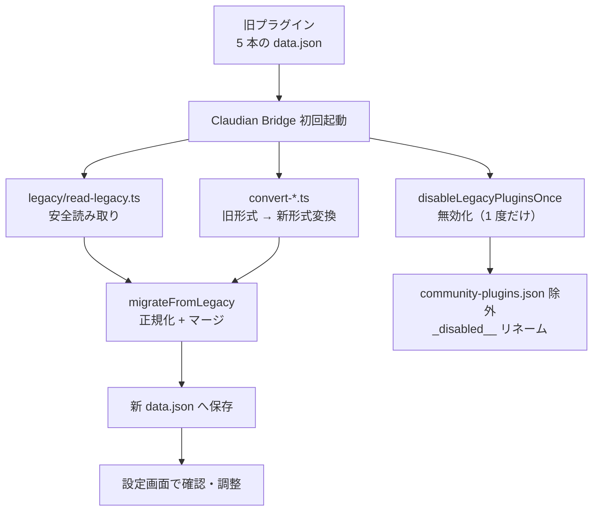

> 📂 **パス**: `80_POC_Projects/POC_017_ClaudianBridge/01_移行ガイド.md`
> 📍 **ソース**: `D:\AI-Agent\ClaudianBridge\src\legacy\`
> 🎯 **用途**: 旧 5 プラグインから Claudian Bridge へ移行する詳細ガイド

# 📋 旧プラグイン → Claudian Bridge 移行ガイド

> 本ガイドは、既存の Claudian 連携プラグインを **Claudian Bridge 1 本** に統合するための移行手順を説明する。
> データ移行は **初回起動時に自動実行** されるため、通常は手動作業は不要。

---

## 🎯 移行対象一覧

| 旧プラグイン | 移行データ | 移行コード | 無効化 |
|------|------|------|:----:|
| **claudian-selection-bridge** | selection / tts / general 設定 | `convert-csb.ts` | ✅ |
| **extension-whitelist** | whitelist 設定 | `convert-ew.ts` | ✅ |
| **vault-office-bridge** | office 設定 | `convert-vob.ts` | ✅ |
| **chroma-inspector** | chroma 設定 | `convert-chroma.ts` | ✅ |
| **claude-tts-settings** | voice-config.json（import） | `voice-config-sync.ts` | ✅ |

---

## 🔄 移行フロー



---

## ✅ 移行手順

### 手順 1：バックアップ（推奨）

```bash
# 移行前に旧プラグインフォルダを退避
cp -r "$OBSIDIAN_VAULT/.obsidian/plugins" "$OBSIDIAN_VAULT/.obsidian/plugins.bak_YYYYMMDD"
```

### 手順 2：Claudian Bridge を配置・有効化

1. ビルド成果物（`main.js` / `manifest.json` / `styles.css` / `versions.json`）を `.obsidian/plugins/claudian-bridge/` へ配置
2. Obsidian のコミュニティプラグインで **Claudian Bridge** を有効化

### 手順 3：初回起動（自動移行）

- 旧プラグインの data.json が読み取られ、新形式に変換・正規化されて `data.json` へ保存
- 旧プラグインが community-plugins.json から除外され、`_disabled__` プレフィックス付きにリネーム（**1 度だけ**実行）
- claude-tts-settings が残していく `voice-config.json` は初回 import 後に Claudian Bridge が SSOT 化

### 手順 4：移行結果の確認

| 確認項目 | 期待結果 |
|------|------|
| 設定画面（一般タブ） | 移行済みプラグインが「✅ 移行済み」表示 |
| 旧プラグイン | `community-plugins.json` に存在しない |
| 各タブの設定 | 旧プラグインで設定した値が引き継がれている |
| voice-config.json | Claudian Bridge の保存時に自動同期 |

### 手順 5：移行リセット（やり直し）

- 一般タブの「移行リセット」で `migratedFrom` フラグをクリア → 再起動で移行をやり直し可能
- 旧プラグインの data.json が残っている場合に有効

---

## ⚠️ 注意点

| # | 注意 |
|---|------|
| 1 | 移行は**初回起動の 1 回のみ**（`migratedFrom` フラグで冪等化） |
| 2 | 旧プラグインの **物理削除は不要**（無効化 + リネームで停止。削除は P5 後に実施） |
| 3 | 旧プラグインの `_disabled__` リネーム後は手動再有効化しない（二重注入の原因） |
| 4 | 移行データの「後勝ち」優先順は設定ごとに実装（旧値が無ければデフォルト補完） |

---

## 🔗 POC_015 / POC_016 との関係

| 連携 | 内容 |
|------|------|
| **POC_015 ClaudeTTS** | `claude-tts-settings` プラグインを無効化（v0.11.1）。`voice-config.json` は Claudian Bridge が SSOT として同期（v0.10.0）。CLI Stop hook 読み上げは v0.13.0 で廃止 |
| **POC_016 ClaudianChat** | realclaudian のチャット UI にツールバー・読上げ・MD 保存ボタンを注入。旧 claude-tts-settings 製ボタンと置換 |

---

## 🔗 関連ドキュメント

- [[00_使用ガイド|使用ガイド]]
- [[README|プロジェクト README]]
- [[03_開発文書/06_ビルド設定|ビルド設定]]

---

## 📝 更新履歴

| バージョン | 日付 | 修正内容 | 修正者 |
|------|------|---------|--------|
| v1.0.0 | 2026-08-17 | 実内容を記入（旧 5 プラグイン移行手順・POC_015/016 連携） | MiuMiu 🐾 |

---

*📋 移行ガイド v1.0.0 · 旧プラグイン → Claudian Bridge · MiuMiu 🐾*
