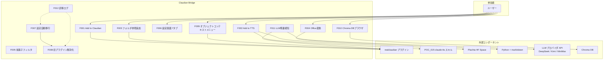

> 📂 路径：`80_POC_Projects/POC_017_ClaudianBridge/01_要件定義/03_ユースケース図.md`
> 📍 源码：`D:\AI-Agent\ClaudianBridge\src\`（manifest v0.8.0）

# 📋 ユースケース図（As-Built v0.8.0）

## アクター + ユースケース

## 補助説明

| UC | トリガー | 主な依存先 |
|------|------|------|
| F001 / F002 | テキスト選択 → 遅延ポップアップ（300ms） | realclaudian / claude-tts・WebSpeech・Plachta |
| F003 / F009 | 右クリック（フォルダ / UI 要素） | realclaudian |
| F004 | ファイル右クリック（単体/分割/複数選択） | Python + markitdown |
| F005 | 自動（onload 時 CSS 注入） | なし |
| F010 | ribbon / コマンド（`chroma.enabled=true` 時のみ） | Chroma DB（Python スクリプト経由） |
| F011 | 自動（`quotaEnabled=true` 時に onload 起動） | realclaudian（表示アンカー）、各社 API |
| F007 / F008 | 自動（初回 onload、フラグで 1 度だけ） | 旧 4 プラグインの data.json |
| F012 | 自動（モジュールロード時） | なし |

## 📝 更新履歴

| バージョン | 日付 | 修正内容 | 修正人 |
|------|------|---------|--------|
| v1.0.0 | 2026-08-10 | 初版 | MiuMiu 🐾 |
| v2.0.0 | 2026-08-13 | As-Built 全面改訂：F009-F012 追加、外部コンポーネント（realclaudian / claude-tts / Plachta / markitdown / LLM API / Chroma DB）をアクターとして明記、補助説明表を追加 | MiuMiu 🐾 |
