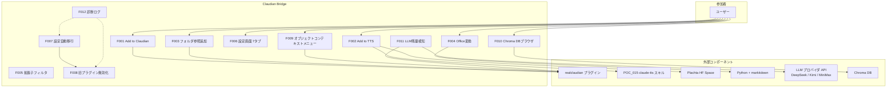

```mermaid
graph TB
    subgraph 参加者
      U[ユーザー]
    end

    subgraph Claudian Bridge
      UC1["F001 Add to Claudian"]
      UC2["F002 Add to TTS"]
      UC3["F003 フォルダ参照追加"]
      UC4["F004 Office変換"]
      UC5["F005 拡張子フィルタ"]
      UC6["F006 設定画面 8タブ"]
      UC9["F009 オブジェクトコンテキストメニュー"]
      UC10["F010 Chroma DBブラウザ"]
      UC11["F011 LLM残量検知（5プロバイダ）"]
      UC7["F007 設定自動移行"]
      UC8["F008 旧プラグイン無効化"]
      UC12["F012 診断ログ"]
      UC13["F013 AI読み上げボタン（✨）"]
      UC14["F014 MD保存ボタン"]
      UC15["F015 TTS読み上げ仕様統一（speakText）"]
      UC16["F016 EdgeTTSチャンク上限"]
      UC17["F017 自動読み上げ最終回答のみ"]
      UC18["F018 Chroma-fs RAG検索"]
      UC19["F019 右クリックバックアップ"]
      UC20["F020 _フォルダ非表示"]
      UC21["F021 方案ボタン常時表示"]
      UC22["F022 クイック返信ボタン全体ON/OFF"]
      UC23["F023 方案検出パターン拡張"]
      UC24["F024 TTSエンジン変更（edge_tts同梱）"]
      UC25["F025 Thought読上げ除外強化"]
      UC26["F026 完了報告スクリプト整形"]
      UC27["F027 トークン速度（tok/s）表示"]
      UC28["F028 MD読み上げ位置ハイライト"]
      UC30["F030 チャット内Mermaid自動描画"]
      UC31["F031 MD読み上げ再生制御強化"]
    end

    subgraph 外部コンポーネント
      RC["realclaudian プラグイン"]
      CT["edge_tts（v7.2.8 同梱）"]
      WST["WebSpeech API"]
      PL["Plachta Cloud VITS（HF Space）"]
      CLI["Claude Code CLI（claude -p）"]
      PY["Python + markitdown / word-pdf-rag"]
      API["LLM プロバイダ API<br/>Anthropic / DeepSeek / Kimi / MiniMax / Zhipu"]
      DB["Chroma DB"]
      MR["Obsidian MarkdownRenderer<br/>(Mermaid 非同梱)"]
      FS["Vault ファイルシステム<br/>(fs.promises.cp / fs.watch)"]
    end

    U --> UC1
    U --> UC2
    U --> UC3
    U --> UC4
    U --> UC6
    U --> UC9
    U --> UC10
    U --> UC13
    U --> UC14
    U --> UC15
    U --> UC19
    U --> UC21
    U --> UC22
    U --> UC27
    U --> UC28
    U --> UC30
    U --> UC31
    UC1 --> RC
    UC3 --> RC
    UC9 --> RC
    UC11 --> RC
    UC2 --> CT
    UC2 --> WST
    UC2 --> PL
    UC13 --> CLI
    UC4 --> PY
    UC10 --> PY
    UC18 --> PY
    UC11 --> API
    UC10 --> DB
    UC19 --> FS
    UC20 --> FS
    UC30 --> MR
    UC7 --> UC8
    UC12 -.-> UC7
    UC12 -.-> UC8
    UC26 -.-> UC15
    UC28 -.-> UC2
    UC31 -.-> UC28
```

> 📂 路径：`80_POC_Projects/POC_017_ClaudianBridge/01_要件定義/03_ユースケース図.md`
> 📍 源码：`D:\AI-Agent\ClaudianBridge\src\`（manifest v0.35.1）

# 📋 ユースケース図（As-Built v0.35.1）

> ⚠️ **v2.1.0 改版说明**：As-Built v0.35.1 へ同期（2026-09-05）。UC 図に F013/F015/F016/F017/F018/F019/F020/F021/F022/F023/F024/F025/F026/F027/F028/F030/F031 を追加（F029 は欠番）、補助説明表・外部コンポーネントを拡張。

## アクター + ユースケース

## アクター + ユースケース

## 補助説明

| UC | トリガー | 主な依存先 |
|------|------|------|
| F001 / F002 | テキスト選択 → 遅延ポップアップ（300ms） | realclaudian / edge_tts・WebSpeech・Plachta |
| F003 / F009 | 右クリック（フォルダ / UI 要素） | realclaudian |
| F004 | ファイル右クリック（単体/分割/複数選択） | Python + markitdown |
| F005 | 自動（onload 時 CSS 注入） | なし |
| F006 | 設定タブ → ClaudianBridge を開く | ConfigStore（`data.json`） |
| F007 / F008 | 自動（初回 onload、フラグで 1 度だけ） | 旧 4 プラグインの data.json |
| F010 | ribbon / コマンド（`chroma.enabled=true` 時のみ） | Chroma DB（Python スクリプト経由） |
| F011 | 自動（`quotaEnabled=true` 時に onload 起動） | realclaudian（表示アンカー）、5 社 API |
| F012 | 自動（モジュールロード時） | なし |
| F013 | 入力ツールバー ✨ ボタンクリック | Claude Code CLI（`claude -p`、30s タイムアウト） |
| F014 | 回答ブロック右クリック / ツールバー | Vault ファイルシステム |
| F015 | あらゆる TTS 経路（selection/autoRead/message/inputAi） | 既存エンジン設定 |
| F016 | エンジン別チャンク上限の解決 | エンジン別 `{ edge:500 / webspeech:140 / plachta:140 }` |
| F017 | マルチターンタスク応答の最終到着 | DOM 終端検出（`.claudian-text-block`） |
| F018 | `chroma_db` 内ドキュメント右クリック | Python `word-pdf-rag query.py --json` |
| F019 | ファイルツリー右クリック → 💾 バックアップ | `fs.promises.cp` |
| F020 | ファイル一覧の onload | CSS 注入（`display:none` for `data-path*="/_"`） |
| F021 / F022 / F023 | チャット応答受信 | quickReply 設定 + LLM 応答テキスト |
| F024 | 設定画面 TTS タブのエンジン dropdown | edge_tts 同梱（pip 依存ゼロ）/ HTTPS プロキシ / Linux |
| F025 | 自動（TTS 抽出） | realclaudian v2.2.4+ DOM 構造（thinking 系クラス） |
| F026 | タスク完了報告の DOM 抽出 | `tts.autoReadReportScript` |
| F027 | 自動（LLM 応答ストリーム計測） | `data-interval` 属性 + rescan |
| F028 | MD「Add to TTS」本文 | Obsidian Preview + フローティングオーバーレイ |
| F030 | チャットメッセージの DOM post-process | Obsidian 標準 MarkdownRenderer |
| F031 | F028 再生中の ⏸/⏭ 押下 | PlaybackController（音声本体制御） |

## 📝 更新履歴

| バージョン | 日付 | 修正内容 | 修正人 |
|------|------|---------|--------|
| v1.0.0 | 2026-08-10 | 初版 | MiuMiu 🐾 |
| v2.0.0 | 2026-08-13 | As-Built 全面改訂：F009-F012 追加、外部コンポーネント（realclaudian / claude-tts / Plachta / markitdown / LLM API / Chroma DB）をアクターとして明記、補助説明表を追加 | MiuMiu 🐾 |
| v2.1.0 | 2026-09-05 | As-Built v0.35.1 同期：UC 図に F013/F015/F016/F017/F018/F019/F020/F021/F022/F023/F024/F025/F026/F027/F028/F030/F031 を追加（F029 は欠番）、外部コンポーネントに edge_tts 同梱 / Claude Code CLI / Zhipu / Obsidian MarkdownRenderer / fs.promises.cp を追加、補助説明表に F006/F013-F031 トリガーと依存先を追記 | MiuMiu 🐾 |
