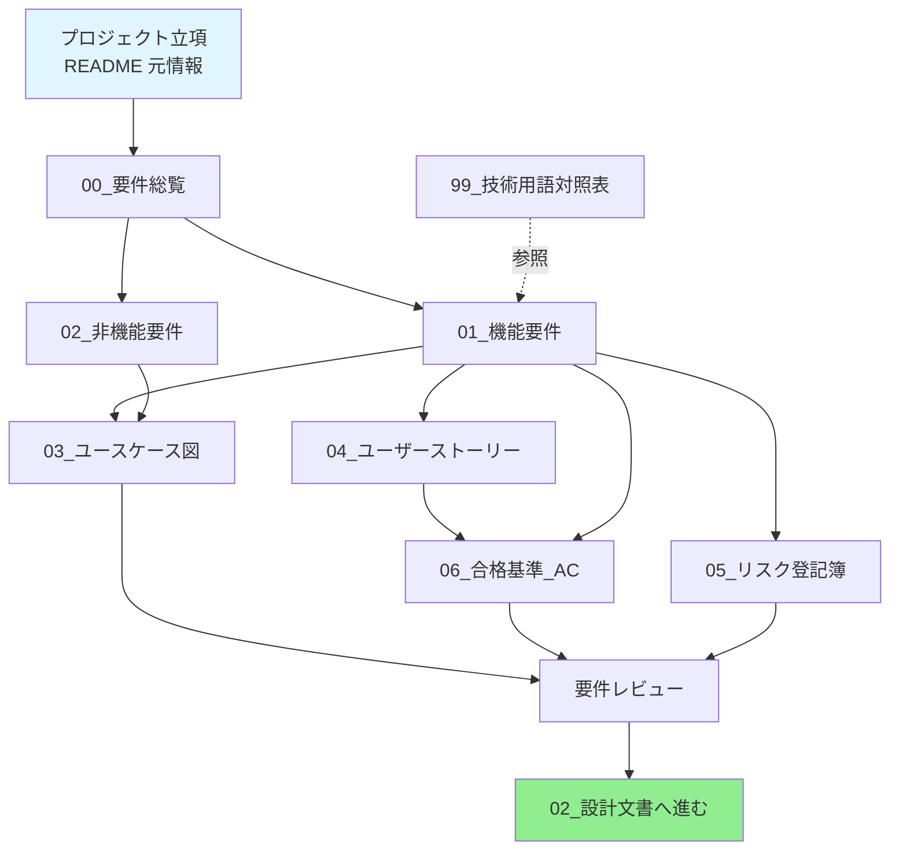

> 📂 **パス**: `80_POC_Projects/POC_017_ClaudianBridge/01_要件定義/README.md`
> 📌 **フェーズ**: フェーズ1 · 要件定義
> 🎯 **用途**: 01_要件定義/ 目次インデックス + 記入ガイド
> ⚠️ **v3.7.0**: 00_要件総覧 / 01_機能要件 を As-Built **v0.35.1（F001〜F031）** へ同期（2026-09-05）
> ⚠️ **v3.6.0**: 子ドキュメントを As-Built v0.8.0 要件として全面改訂済み（2026-08-13）

# 📋 01_要件定義 · フェーズインデックス

> 本目次には POC プロジェクトの**要件定義フェーズ**のすべてのドキュメントが含まれる
> 子ドキュメント 8 件 + 本インデックスファイル 1 件

---

## 📊 フェーズ概要

| 属性 | 値 |
|------|-----|
| **フェーズ番号** | フェーズ1 |
| **想定期間** | 1-2 日 |
| **目標アウトプット** | 明確な業務要件 + 機能リスト + ユースケース図 |
| **依存** | プロジェクト立項（README 元情報） |
| **次のステップ** | [[../02_設計文書/README|02_設計文書]] |

---

## 🗂️ 子ドキュメント一覧（8 件）

| # | ファイル | コア内容 | UML 元素 | 必須 | 状態 |
|---|------|---------|---------|:----:|:----:|
| 0 | **README.md**（本ファイル） | フェーズインデックス | — | ✅ | v3.7.0 |
| 1 | [[00_要件総覧|00_要件総覧.md]] | 業務背景/範囲/目標（As-Built v0.35.1・F001〜F031） | パッケージ図（graph） | ✅ | v2.3.0 ✅改訂済 |
| 2 | [[01_機能要件|01_機能要件.md]] | F001〜F031 機能リスト + フロー詳細 | — | ✅ | v2.4.0 ✅改訂済 |
| 3 | [[02_非機能要件|02_非機能要件.md]] | パフォーマンス/セキュリティ/互換性 + クランプ表 | — | ✅ | v2.0.0 ✅改訂済 |
| 4 | [[03_ユースケース図|03_ユースケース図.md]] | アクター + 機能 + 外部コンポーネント | **graph（ユースケース図）** | ⭐ | v2.0.0 ✅改訂済 |
| 5 | [[04_ユーザーストーリー|04_ユーザーストーリー.md]] | User Story US01〜US31（US29 欠番） | — | ⭐ | v2.1.0 ✅改訂済 |
| 6 | [[05_リスク登記簿|05_リスク登記簿.md]] | 実リスク 14 件（R-01〜R-14） | — | ⭐ | v2.1.0 ✅改訂済 |
| 7 | [[06_合格基準_AC|06_合格基準_AC.md]] | Given-When-Then AC 34 件 + RTM | — | ⭐ | v2.1.0 ✅改訂済 |
| 8 | [[99_技術用語対照表|99_技術用語対照表.md]] | 実用語 60+ 件の日英対照 | — | ⭐ | v2.1.0 ✅改訂済 |

> 📝 **更新方針**: 01_要件定義 配下 8 文書すべてを As-Built v0.35.1 へ同期済み（2026-09-05）。00_要件総覧 / 01_機能要件 は各リリースで更新、02〜06 / 99 は今回フル拡張を反映。次回以降の更新もこの粒度で同期する。

---

## 🔄 ドキュメントフローチャート

---

## 📋 各ドキュメントの記入ポイント

### 00_要件総覧.md（必須）

| セクション | 記入ポイント | 文字数の目安 |
|------|---------|---------|
| プロジェクト背景 | なぜこの POC を行うか | 100-200 文字 |
| プロジェクト目標 | 1-3 個の測定可能な目標 | 50-100 文字 |
| プロジェクト範囲 | In Scope / Out of Scope | 表形式 |
| 成功基準 | POC 成功をどう判定するか | 3-5 項目 |
| リスク評価 | 既知リスク + 緩和 | 表形式 |

### 01_機能要件.md（必須）

| セクション | 記入ポイント |
|------|---------|
| F-番号リスト | F001 / F002 / ... 表形式 |
| F-番号詳細 | 各機能に：説明/入力/出力/フロー/優先度 |
| 業務ルール | 業務ロジックの制約 |

### 02_非機能要件.md（必須）

| 観点 | 内容 | 例 |
|------|------|------|
| パフォーマンス | 応答時間/同時接続/スループット | 応答 < 200ms |
| セキュリティ | 認証/暗号化/監査 | OAuth 2.0 |
| 互換性 | プラットフォーム/ブラウザ/バージョン | Chrome 100+ |
| 可用性 | SLA/フォールトトレランス/復旧 | 99.9% 可用 |
| 保守性 | モジュール化/ドキュメント化 | 100% コメント |

### 03_ユースケース図.md（推奨）

- **コア図**：graph LR 形式でアクター + ユースケースを表示
- **補助説明**：ユースケースの詳細説明

### 04_ユーザーストーリー.md（推奨）

- **フォーマット**：As a [ロール] / I want [要件] / So that [価値]
- **カバレッジ**：少なくとも 3 個のコア User Story

---

## ✅ フェーズ完了検証チェックリスト

- [x] 子ドキュメント 8 件すべてを記入（00/01 は 2026-09-05 As-Built v0.35.1 同期）
- [x] F-番号機能（F001〜F031・F029 欠番の 30 件）
- [x] 少なくとも 3 つの非機能要件観点（8 観点 + クランプ表 + 設計制約）
- [x] ユースケース図がコアフローをカバー（外部コンポーネント 6 件含む）
- [x] F 番号機能（F001〜F031・F029 欠番の 30 件）に整合した User Story（US01〜US31・US29 欠番の 30 件）
- [x] 合格 [[00_Vault管理/MD生成ルール|MD 規範]] 5 観点のセルフチェックに合格

---

## 🔗 関連

- [[../README|プロジェクト README]]
- [[../00_使用ガイド|使用ガイド]]
- [[../02_設計文書/README|次のステップ:02_設計文書]]
- [[../../_テンプレート_v2.0/README|_テンプレート v2.0]]

---

*📋 01_要件定義 フェーズインデックス v3.7.0 · MiuMiu 🐾 · 2026-09-05 As-Built v0.35.1 対応*
