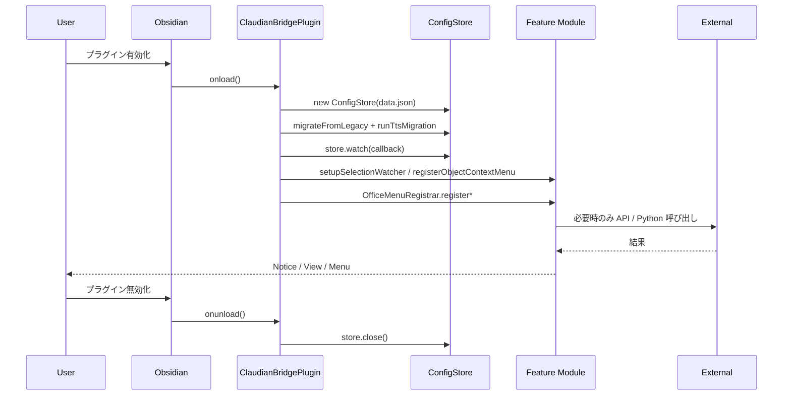

> 📂 路径：`80_POC_Projects/POC_017_ClaudianBridge/02_設計文書/00_アーキテクチャ総覧.md`
> 📍 源码：`D:\AI-Agent\ClaudianBridge\src`

# 🏗️ Claudian Bridge アーキテクチャ総覧

> 📖 **アーキテクチャって何？**
> **アーキテクチャ** は「システム全体の設計図」です。家を建てるときに「どこに玄関を作り、どこに部屋を配置するか」を決める全体設計図があれば、大工さん（開発者）は迷わずに作業できます。
> 本書は Claudian Bridge というプラグインの「全体の構造と部品の配置」をまとめたものです。まず本書を読むと、ほかの設計文書の位置づけが分かります。

## 🎯 設計原則

- **機能モジュール分割**: `src/features/{selection,tts,office,whitelist,object,quota,chroma,llm,token-rate,quick-reply,mermaid-render,memory,self-update,image-gen,outputs-mirror,...}/` で各機能を独立ユニット化（各機能を別の箱に分けて管理）
- **SSOT (Single Source of Truth「唯一の情報源」)**: 統合 `data.json` を1ファイルで管理（`src/core/config-store.ts`）
- **実コードファースト**: 設計文書は `manifest.json` v0.8.0 の実コードを正とし、未実装機能は書かない（実際に動くコードに基づいて書く）
- **段階的統合完了**: P1 選択挿入 → P2 コア → P3 Office → P4 Whitelist → P5 Chroma Inspector → P6 Quota → P7/P8 拡張（段階的に機能を統合）
- **外部依存の明示的境界**: realclaudian プラグイン、Python サブプロセス（別プログラム呼び出し）、各種 Web API（HuggingFace / Anthropic / DeepSeek / Kimi / MiniMax / Plachta）との接続は専用レイヤーで抽象化（外部との接続を整理）

## 📂 全体構造ツリー

```
claudian-bridge/                                  # manifest.json v0.8.0
├── main.ts                                       # ClaudianBridgePlugin エントリ
├── styles.css                                    # UI スタイル
│
├── core/                                         # プラグイン全体の SSOT レイヤ
│   ├── settings.ts                               # ClaudianBridgeSettings スキーマ + normalize/validate
│   ├── config-store.ts                           # fs I/O + fs.watch + アトミック保存 + 外部変更監視
│   ├── migrator.ts                               # v0.6.0 TTS 簡素化マイグレーション
│   ├── i18n.ts                                   # ja/zh/en 3言語ラベル
│   ├── events.ts                                 # クォータ更新イベントの re-export
│   └── diag.ts                                   # 起動時診断ログ + グローバルエラーハンドラ
│
├── settings/                                     # 設定タブ UI（1ページ / 内部タブ切替）
│   ├── ClaudianBridgeSettingTab.ts               # 内部タブコンテナ
│   ├── SettingTabGeneral.ts                      # 一般・移行状態・トークン速度・自己更新
│   ├── SettingTabSelection.ts                    # 選択テキスト + オブジェクト右クリック + ポップアップ位置
│   ├── SettingTabTts.ts                          # TTS エンジン・音声・読上げハイライト・聴き手プロファイル
│   ├── SettingTabOffice.ts                       # ファイル変換
│   ├── SettingTabWhitelist.ts                    # 🗂️ Vault表示（旧 拡張子フィルタ）+ Outputs ミラリング
│   ├── SettingTabQuota.ts                        # LLM 残量検出
│   ├── SettingTabMemory.ts                       # 📄 MD 保存（メモリ）設定
│   ├── SettingTabImageGen.ts                     # 🎨 文生図設定
│   ├── SettingTabChangelog.ts                    # 📜 改定履歴タブ（v0.41.0 新設・CHANGELOG.md を SSOT 表示）
│   └── color-palette.ts                          # 読上げハイライト等の色パレット（16 色）
│
├── features/
│   ├── selection/
│   │   ├── core.ts                               # addTextToClaudian / addFolderToClaudian
│   │   ├── watcher.ts                            # setupSelectionWatcher (selectionchange → popup)
│   │   └── popup.ts                              # buildPopup / positionPopup
│   │
│   ├── tts/
│   │   ├── core.ts                               # addTextToTTS ディスパッチャ（エンジン別チャンキング）
│   │   ├── auto-read.ts                          # v0.11.0: setupAutoReadTTS（📢 報告の自動読み上げ hook・v0.11.1 で tabManager.callbacks 経由に修正）
│   │   ├── extract-report.ts                     # v0.11.0: extractReportText（📢 blockquote 抽出・重複マーク）
│   │   ├── speak-coordinator.ts                  # v0.11.0: createLatestWinsSpeaker（latest-wins 直列化）
│   │   ├── toolbar-buttons.ts                    # v0.12.0: ツールバー操作ボタン（ミュート 3 状態 + 📖全文、旧 toolbar-fulltext-button.ts を吸収）
│   │   ├── playback-registry.ts                  # v0.12.0: 再生ハンドル一元管理（isTtsPlaying / stopAllPlayback）
│   │   ├── message-read-button.ts                # v0.14.0: メッセージ結果欄の読上げボタン（コピーボタン左隣）
│   │   ├── input-ai-read-button.ts               # v0.16.0: ✨AI読み上げボタン（入力文→整形→上書き→読み上げ）
│   │   ├── chunking.ts                           # v0.10.0: chunkText / speakChunks（長文分割）
│   │   ├── voice-config-sync.ts                  # v0.10.0: voice-config.json 双方向同期
│   │   ├── edge-tts-local.ts                     # v0.27.0: edge_tts 完全同梱（py/edge_tts・LGPLv3+MIT）+ クラウド HTTPS プロキシ
│   │   ├── md-read-highlight/                    # v0.33.0: MD 読み上げ位置ハイライト（Preview 下線 + ⏸/▶/⏭/🔇 オーバーレイ・v0.33.2 で DOM 配線修正）
│   │   ├── playback-controller.ts                # v0.35.0: 読上げ再生制御（⏸/⏭ 実働化・abort フラグ）
│   │   ├── profile.ts                            # v0.36.0: 聴き手プロファイル 7 種（workplace/customer/family/classroom/boss/dr）
│   │   ├── llm-rewrite.ts / llm-rewrite-cache.ts # v0.37.0: LLM 原稿書き換え（claude -p・100 件 LRU キャッシュ）
│   │   ├── llm-session.ts                        # v0.37.1: 並列原稿生成（1〜8・既定 2・世代ガード）
│   │   └── plachta-tts.ts                        # Plachta Cloud VITS (HF Space) 連携
│   │
│   ├── llm/                                     # v0.16.0: LLM 呼び出し（UI 非依存・v0.39/0.40 でマルチプロバイダ化）
│   │   ├── claude-cli.ts                         # claude -p 実行（stdin 渡し・30s タイムアウト）+ polishInstruction
│   │   ├── dispatch.ts                           # F-039/F-040: Think モード dispatch（プロバイダ振分け）
│   │   ├── deepseek-api.ts / kimi-api.ts         # DeepSeek / Kimi 直接呼び出し
│   │   ├── minimax-api.ts / zhipu-api.ts         # MiniMax / Zhipu 直接呼び出し
│   │   └── types.ts                              # LlmClient 抽象化の型定義
│   │
│   ├── office/
│   │   ├── converter.ts                          # OfficeConverter.convertItem / convertMany
│   │   ├── markitdown.ts                         # MarkItDownRunner (Python markitdown 呼び出し)
│   │   ├── splitter.ts                           # SplitterRunner (分割変換)
│   │   ├── frontmatter.ts                        # FrontmatterApplier (テンプレ展開)
│   │   ├── path.ts                               # VaultPath (Vault パス解決)
│   │   ├── progress-modal.ts                     # ProgressModal (Office 進捗 UI)
│   │   ├── summary.ts                            # ConversionSummary
│   │   └── menu.ts                               # OfficeMenuRegistrar (file-menu / files-menu)
│   │
│   ├── whitelist/
│   │   ├── css-builder.ts                        # buildWhitelistCss
│   │   ├── injector.ts                           # installWhitelistCss / removeWhitelistCss
│   │   └── presets.ts                            # WHITELIST_PRESETS
│   │
│   ├── object/
│   │   ├── context-menu.ts                       # registerObjectContextMenu / isExcluded
│   │   ├── inspector.ts                          # getMeaningfulInfo / ObjectInfo 型
│   │   ├── formatter.ts                          # formatObject
│   │   └── index.ts                              # 公開エクスポート
│   │
│   ├── quota/
│   │   ├── core.ts                               # ClaudeQuotaService (Anthropic usage API)
│   │   ├── service.ts                            # MultiQuotaService + testProviderConnection
│   │   ├── index.ts                              # registerClaudeQuota / unregisterClaudeQuota
│   │   ├── view.ts                               # QuotaBarView
│   │   ├── llm-info.ts                           # Claude Code settings.json 読み取り
│   │   ├── http.ts                               # httpGet / requestUrl ラッパ
│   │   ├── types.ts                              # QuotaProvider / ProviderQuota / QuotaSnapshot 等
│   │   └── providers/
│   │       ├── deepseek.ts                       # createDeepSeekProvider
│   │       ├── kimi.ts                           # createKimiProvider
│   │       └── minimax.ts                        # createMiniMaxProvider
│   │
│   └── chroma/
│       ├── chroma/                               # Python CLI への Façade
│       │   ├── ChromaService.ts                  # list/get/where/query/version のタイプラッパ
│       │   ├── chroma-runner.ts                  # Python subprocess + JSON envelope
│       │   ├── FilterBuilder.ts                  # FilterSpec → where / where_document JSON
│       │   ├── RawSqlService.ts                  # chroma.sqlite3 読み取り専用 SQL
│       │   └── ResultNormalizer.ts               # JSON → typed result
│       ├── defaults.ts                           # MIN/MAX_QUERY_RESULTS, MIN/MAX_PREVIEW_LENGTH
│       ├── types.ts                              # ChromaSettings / FilterSpec / ListResult 等
│       ├── util/
│       │   ├── app.ts                            # vaultBasePath
│       │   └── path.ts                           # resolveChromaPath / resolveScriptPath
│       ├── settings/
│       │   └── ChromaSettingsTab.ts              # renderChromaTab (Chroma 設定 UI)
│       └── views/
│           ├── DatabaseBrowserView.ts            # ItemView (chroma-inspector-browser)
│           ├── CollectionList.ts                 # 左ペインのコレクションメニュー
│           ├── SearchPanel.ts                    # ヒーロー検索 + 詳細フィルタ
│           ├── RecordCardView.ts                 # 検索結果カード表示
│           ├── RawSqlModal.ts                    # SELECT-only SQL モーダル
│           ├── ProgressModal.ts                  # Chroma 用進捗モーダル
│           └── ChromaMenuRegistrar.ts            # リボン + コマンドパレット
│
│   ├── token-rate/                              # v0.30.0: トークン速度（tok/s）ライブ表示（4 値・TTFT 実測・更新周期設定）
│   ├── quick-reply/                              # v0.29/v0.30.2: クイック返信ボタン（SVG アイコン化・👑N 推奨検出）
│   ├── mermaid-render/                           # v0.34.0: チャット内 Mermaid 自動描画（Obsidian 標準 MarkdownRenderer）
│   ├── memory/                                   # v0.16: MD 保存ボタン（message-md-save-button / serialize / save）
│   ├── self-update/                              # v0.32.10: 自己更新（GitHub Releases semver 比較 → backup → DL → reload）
│   ├── image-gen/                                # v0.41 前後: 文生図（providers / registry / save / modal）
│   ├── outputs-mirror/                           # v0.41.0: Outputs フォルダミラリング（NTFS ジャンクション）
│   │   └── manager.ts                            # OutputsMirrorManager（作成/削除/状態取得・lstat 保護・deps DI）
│   ├── code-copy-fence/                          # v0.9.0: コードブロックコピーの ``` フェンス補完
│   └── chroma-fs/                                # v0.19: ChromaFs 仮想フォルダ（chroma_db ジャンクション）
│
└── legacy/
    ├── migration.ts                              # migrateFromLegacy (4プラグインの自動取り込み)
    ├── disable-legacy.ts                         # disableLegacyPluginsOnce
    ├── read-legacy.ts                            # legacyDataJsonPath / readLegacyDataJson
    ├── convert-csb.ts                            # convertFromClaudianSelectionBridge
    ├── convert-ew.ts                             # convertFromExtensionWhitelist
    ├── convert-vob.ts                            # convertFromVaultOfficeBridge
    └── convert-chroma.ts                         # convertFromChromaInspector
```

## 📊 責務分担表

| レイヤー | 主なディレクトリ | 責務 |
|------|------|------|
| core | `src/core/` | 設定スキーマ・永続化・マイグレーション（データ移行）・i18n（多言語対応）・診断ログ。プラグイン全体の SSOT（唯一の情報源） |
| settings | `src/settings/` | 設定タブ UI。`ClaudianBridgeSettingTab` が内部 10 タブ（general / selection / tts / office / whitelist(Vault表示) / quota / chroma / memory / image-gen / changelog）を切り替え、各 `SettingTab*` が項目を描画 |
| features | `src/features/` | 16+ の独立機能ユニット (selection「選択挿入」 / tts「テキスト読み上げ」 / office「Office変換」 / whitelist「Vault表示」 / object「オブジェクト」 / quota「使用量制限」 / chroma「データベースシステム」 / llm「LLM 呼び出し」 / token-rate「トークン速度」 / quick-reply「クイック返信」 / mermaid-render「Mermaid 描画」 / memory「MD 保存」 / self-update「自己更新」 / image-gen「文生図」 / outputs-mirror「Outputs ミラリング」 / chroma-fs「ChromaFs」) |
| legacy | `src/legacy/` | 旧4プラグイン (claudian-selection-bridge / vault-office-bridge / extension-whitelist / chroma-inspector) からの設定取り込みと無効化 |

## 🔄 モジュール依存図

```mermaid
graph TB
    subgraph Core["core/ (SSOT「唯一の情報源」)"]
        Main["main.ts"]
        Settings["core/settings.ts"]
        ConfigStore["core/config-store.ts"]
        Migrator["core/migrator.ts"]
        I18n["core/i18n.ts"]
        Diag["core/diag.ts"]
    end

    subgraph SettingsTab["settings/ (内部タブUI)"]
        SettingTab["settings/ClaudianBridgeSettingTab.ts"]
        TabGeneral["settings/SettingTabGeneral.ts"]
        TabSelection["settings/SettingTabSelection.ts"]
        TabTts["settings/SettingTabTts.ts"]
        TabOffice["settings/SettingTabOffice.ts"]
        TabWhitelist["settings/SettingTabWhitelist.ts"]
        TabQuota["settings/SettingTabQuota.ts"]
        TabChangelog["settings/SettingTabChangelog.ts<br/>（📜 改定履歴・v0.41.0）"]
        TabChroma["features/chroma/settings/ChromaSettingsTab.ts"]
    end

    subgraph Features["features/ (16+ 機能)"]
        Selection["features/selection「選択挿入」"]
        TTS["features/tts「テキスト読み上げ」<br/>+ md-read-highlight / profile / llm-rewrite"]
        LLM["features/llm「LLM 呼び出し」<br/>+ dispatch（Think モード）"]
        Office["features/office「Office変換」"]
        Whitelist["features/whitelist「Vault表示」"]
        Object["features/object「オブジェクト」"]
        Quota["features/quota「使用量制限」"]
        Chroma["features/chroma「データベースシステム」"]
        TokenRate["features/token-rate「トークン速度」"]
        MermaidRender["features/mermaid-render「Mermaid 描画」"]
        SelfUpdate["features/self-update「自己更新」"]
        OutputsMirror["features/outputs-mirror「Outputs ミラリング」<br/>v0.41.0"]
    end

    subgraph Legacy["legacy/ (旧プラグイン変換)"]
        Migration["legacy/migration.ts"]
        DisableLegacy["legacy/disable-legacy.ts"]
    end

    subgraph External["外部システム"]
        RealClaudian["realclaudian プラグイン"]
        PyMarkItDown["Python markitdown"]
        PySplitter["Python splitter 群"]
        PyChroma["Python _chroma_inspect.py"]
        Anthropic["Anthropic usage API"]
        DeepSeek["DeepSeek API"]
        Kimi["Kimi API"]
        MiniMax["MiniMax API"]
        Plachta["Plachta HF Space"]
        ClaudeTTS["ClaudeTTS スキル"]
        ClaudeCLI["Claude Code CLI (claude -p)"]
        Zhipu["Zhipu API（Think モード）"]
        EdgeLocal["edge_tts 同梱 Python<br/>（py/edge_tts）"]
        GitHubReleases["GitHub Releases<br/>（自己更新・Plugin/ 配布源）"]
        NTFSSource["Documents/ObsidainOutputs<br/>（実体フォルダ）"]
    end

    Main --> ConfigStore
    Main --> SettingTab
    Main --> Selection
    Main --> Object
    Main --> Office
    Main --> Whitelist
    Main --> Quota
    Main --> Chroma
    Main --> LLM
    Main --> Migration
    Main --> DisableLegacy
    Main --> Migrator
    Main --> TokenRate
    Main --> MermaidRender
    Main --> SelfUpdate
    Main --> OutputsMirror

    ConfigStore --> Settings
    SettingTab --> TabGeneral
    SettingTab --> TabSelection
    SettingTab --> TabTts
    SettingTab --> TabOffice
    SettingTab --> TabWhitelist
    SettingTab --> TabQuota
    SettingTab --> TabChangelog
    SettingTab --> TabChroma

    Selection --> RealClaudian
    Selection --> TTS
    Object --> RealClaudian
    TTS --> Plachta
    TTS --> ClaudeTTS
    TTS --> LLM
    LLM --> ClaudeCLI
    Office --> PyMarkItDown
    Office --> PySplitter
    Whitelist --> Main
    Quota --> Anthropic
    Quota --> DeepSeek
    Quota --> Kimi
    Quota --> MiniMax
    Chroma --> PyChroma
    LLM --> Zhipu
    TTS --> EdgeLocal
    SelfUpdate --> GitHubReleases
    OutputsMirror -->|fs.symlink junction| NTFSSource

    TabGeneral --> Migration
    TabQuota --> Quota
    TabChroma --> Chroma
```


<div style="max-width:1000px">




</div>

## ⚙️ onload / onunload ライフサイクル

### 🟢 onload 初期化ステップ（実コード `main.ts` の実行順）

| # | ステップ | 実装ファイル | 備考 |
|:--:|------|------|------|
| 0 | diag 起動 | `core/diag.ts` | `initDiagAuto()` + `installGlobalErrorHandlers()` をモジュールトップで実行（ロード失敗時の原因特定用） |
| 1 | Vault ルート解決 | `main.ts` | `app.vault.adapter.getBasePath()` を優先。`__dirname` / `process.cwd()` は信用しない |
| 2 | ConfigStore 生成 | `core/config-store.ts` | `<vault>/.obsidian/plugins/claudian-bridge/data.json` に紐付け |
| 3 | `migrateFromLegacy` | `legacy/migration.ts` | 旧4プラグインの `data.json` を自動取り込み（`general.migratedFrom` フラグで多重実行防止） |
| 4 | `disableLegacyPluginsOnce` | `legacy/disable-legacy.ts` | `community-plugins.json` から旧プラグインを除外 + フォルダを `_disabled__` 接頭辞でリネーム |
| 5 | `runTtsMigration` | `core/migrator.ts` | v0.6.0 TTS 簡素化（minimax 削除 + voices ネスト化 + Notice 1 回） |
| 6 | Whitelist CSS 注入 | `features/whitelist/{css-builder,injector}.ts` | `general.enabled && whitelist.enabled` 時のみ。`buildWhitelistCss` → `installWhitelistCss` |
| 7 | 設定タブ登録 | `settings/ClaudianBridgeSettingTab.ts` | `addSettingTab(new ClaudianBridgeSettingTab(...))`。`resetMigration` クロージャを渡す |
| 8 | `general.enabled` 判定 | `main.ts` | `false` なら以降の機能登録をスキップし `onload COMPLETE (disabled)` で早期 return |
| 9 | `setupSelectionWatcher` | `features/selection/watcher.ts` | `selectionchange` イベント監視 + ポップアップ発火。`addTextToTTS` を TTS ハンドラに注入 |
| 10 | `registerObjectContextMenu` | `features/object/context-menu.ts` | オブジェクト右クリックメニュー項目を `file-menu` イベントへ登録 |
| 11 | `store.watch` | `core/config-store.ts` | 外部変更検知 → Whitelist CSS 再注入 / 除去（500ms 自己書き込みデバウンス） |
| 12 | Office menu 登録 | `features/office/menu.ts` | `OfficeMenuRegistrar.registerFileMenu` (単一) + `registerMultiSelect` (複数選択) |
| 13 | フォルダ右クリック「Add to Claudian」 | `main.ts` | `selection.folderEnabled` 時のみ `file-menu` に項目追加 |
| 14 | Chroma 統合 | `features/chroma/views/{ChromaMenuRegistrar,DatabaseBrowserView}.ts` | `chroma.enabled` 時のみ `registerView('chroma-inspector-browser', ...)` + ribbon + command |
| 15 | `registerClaudeQuota` | `features/quota/index.ts` | `general.quotaEnabled` 時のみ起動。モバイルでは null。`layout-change` で再マウント。冪等 |
| 16 | `setupInputAiReadButton` | `features/tts/input-ai-read-button.ts` | v0.16.0: ✨AI読み上げボタン注入。`polishInstruction`（`features/llm/claude-cli.ts`）と `addTextToTTS` を配線 |
| 17 | トークン速度 counter | `features/token-rate/index.ts` | v0.30.0: `general.tokenRateEnabled` 時に入力欄へ tok/s カウンタ注入（設定変更で破棄・再注入） |
| 18 | Mermaid 自動描画 | `features/mermaid-render/index.ts` | v0.34.0: チャット内 Mermaid コードブロック検知 → Obsidian 標準 `MarkdownRenderer` で描画（確定判定 1.2s・図⇔コード切替） |
| 19 | Quick Reply 注入 | `features/quick-reply/nav-buttons.ts` | v0.29.0: クイック返信 SVG ボタンを NewTab 左隣へ注入。`recommend-detector` で 👑N / 数字選択肢を検出 |
| 20 | Outputs ミラリング適用 | `features/outputs-mirror/manager.ts` | v0.41.0: `general.outputsMirrorEnabled` 時にジャンクション作成/維持・無効化時に lstat 確認のうえ削除。実フォルダ既存時は無視 |
| 21 | 自己更新チェック | `features/self-update/index.ts` | v0.32.10: 設定一般タブ「更新を確認」ボタン → GitHub Releases semver 比較 → backup → 3 ファイル DL → reload |
| - | `onload COMPLETE` | `main.ts` | `console.log('[claudian-bridge] loaded')` + `diag('onload COMPLETE')` |

### 🔴 onunload 後始末

| # | ステップ | 実装ファイル | 備考 |
|:--:|------|------|------|
| 1 | `removeWhitelistCss` | `features/whitelist/injector.ts` | 注入した `<style>` を DOM から除去 |
| 2 | `unregisterClaudeQuota` | `features/quota/index.ts` | 残量サービス停止 + ビュー unmount + イベント解除 |
| 3 | `store.close` | `core/config-store.ts` | `fs.watch` close + ポーリングタイマー停止 + debounce クリア |

## 🧩 内部状態・データフロー


<div style="max-width:1000px">




</div>

## 🔌 外部連携一覧

| 連携先 | 用途 | 実装ファイル | 備考 |
|------|------|------|------|
| realclaudian プラグイン | テキスト・フォルダ・オブジェクトを Claudian 入力欄へ挿入 | `features/selection/core.ts`, `features/object/context-menu.ts` | `activateView` / `getView` / `appendToActiveInput` 内部 API |
| Anthropic usage API | Claude Code OAuth 利用状況取得 | `features/quota/core.ts` | macOS Keychain または `~/.claude/.credentials.json` からトークン読み取り |
| DeepSeek API | 残金取得 | `features/quota/providers/deepseek.ts` | `GET /user/balance` |
| Kimi API | 5時間使用量取得 | `features/quota/providers/kimi.ts` | `GET /coding/v1/usages` |
| MiniMax API | chat モデル残量取得 | `features/quota/providers/minimax.ts` | `GET /v1/token_plan/remains` |
| Plachta HF Space | クラウド VITS 音声合成 | `features/tts/plachta-tts.ts` | `POST /call/tts_fn` → poll `/results` → 音声再生 |
| Python markitdown | Office/PDF/HTML/CSV → Markdown | `features/office/markitdown.ts` | `<vault>/00_Vault管理/_設定ファイル/_scripts/_run_markitdown.py` |
| Python splitter 群 | 変換後 .md の単位分割 | `features/office/splitter.ts` | `split_{docx,xlsx,pptx,pdf,html,csv}.py` |
| Python `_chroma_inspect.py` | ChromaDB 閲覧・検索 | `features/chroma/chroma/chroma-runner.ts` | Vault ルートから呼び出し |
| ClaudeTTS スキル | edge-TTS 読み上げ | `features/tts/core.ts` | `~/.claude/skills/claude-tts/scripts/commands.py speak` |
| Web SpeechSynthesis API | ブラウザ標準 TTS | `features/tts/core.ts` | `pickWebSpeechLang` で自動言語判定 |
| Claude Code settings.json | 現在の LLM 情報取得 | `features/quota/llm-info.ts` | `env.ANTHROPIC_MODEL` / `ANTHROPIC_BASE_URL` |
| Claude Code CLI（`claude -p`） | v0.16.0: 入力文の意図解釈・指令文整形 / v0.37.0: MD 読み上げの LLM 原稿書き換え | `features/llm/claude-cli.ts`, `features/tts/llm-rewrite.ts` | プロンプトは stdin 渡し（CJK クォート問題回避）。Windows は `where` で解決・30 秒タイムアウト |
| DeepSeek / Kimi / MiniMax / Zhipu 直接 API | v0.39/v0.40: Think モード選択（F-039/F-040） | `features/llm/dispatch.ts`, `features/llm/{deepseek,kimi,minimax,zhipu}-api.ts` | `LlmClient` 抽象化 + dispatch で 5 プロバイダ対応（Claude / DeepSeek / Zhipu / MiniMax / Kimi） |
| edge_tts 同梱 Python | v0.27.0: ローカル EdgeTTS 読み上げ（既定エンジン `edge-local`） | `features/tts/edge-tts-local.ts`, `py/edge_tts/` | `git subtree` バンドル（LGPLv3 + MIT）。クラウド HTTPS プロキシ（`edgeCloud.*`）も設定可 |
| GitHub Releases API | v0.32.10: 自己更新の最新版検知・ダウンロード | `features/self-update/update-checker.ts`, `update-downloader.ts` | 配布源はリポジトリ `Plugin/` ディレクトリ（main.js / manifest.json / styles.css）。バックアップ `.backup/<UTC-ISO>/` |
| NTFS ジャンクション（ローカル fs） | v0.41.0: Outputs フォルダミラリング | `features/outputs-mirror/manager.ts` | `fs.symlinkSync(外部, Vault, "junction")`。削除前に `lstat` でジャンクション判定（実フォルダ保護） |

## 🕘 改定履歴（プラグイン v0.33.0 → v0.41.0）

> 対応する ClaudianBridge リリースの機能改良（SSOT: `D:\AI-Agent\ClaudianBridge\CHANGELOG.md`）

| バージョン | 日付 | 機能改良内容 |
|-----------|:----:|-------------|
| v0.33.0/0.33.2 | 2026-09-02 | **MD 読み上げ位置ハイライト（F-028）**: Preview チャンク位置のハイライト + ⏸/▶/⏭/🔇 フローティングオーバーレイ + 見出しスキップ。v0.33.2 で `setupMdReadHighlight` の DOM 配線漏れ（span 注入・overlay mount）を修正し、ハイライト色を `--cb-md-read-highlight` CSS 変数化 |
| v0.34.0 | 2026-09-04 | **チャット内 Mermaid 自動描画**: 確定判定 1.2s → Obsidian 標準 `MarkdownRenderer` で描画、図⇔コード切替、`general.mermaidRender` 既定 ON |
| v0.35.0/0.35.1 | 2026-09-04 | **MD 読み上げ再生制御強化**: ⏸/⏭ ボタン実働化（`PlaybackController` 新設・明示 abort フラグ）、Edge 先行音声変換、見出し境界チャンク最適化、ハイライト色パレット 16 色、スクロール位置 % 設定 |
| v0.36.0 | 2026-09-05 | **聴き手プロファイル（F-032）**: 7 種（workplace/customer/family/classroom/boss/dr/original）+ 用語辞書（`tts.termsDict`）+ DR の [BEEP] マーカーと Web Audio 警告音 |
| v0.37.0〜0.37.2 | 2026-09-05 | **MD 読み上げ LLM 原稿書き換え（F-033）**: 見出し単位セクションを Claude CLI で口頭原稿化・100 件 LRU キャッシュ・並列生成（1〜8・既定 2）・です・ます調統一・Notice 残留バグ根治・`scripts/deploy.mjs` 自立化 |
| v0.38.0 | 2026-09-07 | **選択ポップアップ位置設定（F-032 系）**: `selection.popupPosition: 'top-right' \| 'bottom'`（既定 `'top-right'`）+ `positionPopup` 第 3 引数 `mode` |
| v0.39.0/v0.40.0 | 2026-09-11 | **Think モード選択（F-039/F-040）**: `LlmClient` 抽象化 + `dispatch.ts` で Claude / DeepSeek / Zhipu / MiniMax / Kimi の 5 プロバイダ直接呼び出し対応 |
| v0.41.0 | 2026-09-13 | **Outputs フォルダミラリング**: `features/outputs-mirror/`（NTFS ジャンクション・`general.outputsMirrorEnabled/outputsMirrorPath`）+ 「📂 開く」ボタン + 「`.` で始まるフォルダを非表示」（`general.hideDotFolders`）+ **「📜 改定履歴」設定タブ**（`SettingTabChangelog` + `ChangelogParser`・CHANGELOG.md を SSOT 表示）+ リリースゲート `scripts/check-changelog.mjs`。設定タブ「🗂️ 拡張子フィルタ」を「🗂️ Vault表示」に改名 |

---

## 📝 更新履歴

| バージョン | 日付 | 修正内容 | 修正人 |
|------|------|---------|--------|
| v1.0.0 | 2026-08-10 | 初版 | MiuMiu 🐾 |
| v2.0.0 | 2026-08-13 | 実コード v0.8.0 と同期（全量書き直し） | MiuMiu 🐾 |
| v3.0.0 | 2026-08-13 | 実コード v0.8.0 と同期（全面書き直し） | MiuMiu 🐾 |
| v3.1.0 | 2026-08-14 | v0.10.0 同期（chunking.ts / voice-config-sync.ts 追加） | MiuMiu 🐾 |
| v3.2.0 | 2026-08-15 | v0.11.0 同期（auto-read.ts / extract-report.ts / speak-coordinator.ts 追加） | MiuMiu 🐾 |
| v3.2.1 | 2026-08-15 | v0.11.1 同期（toolbar-fulltext-button.ts 追加・auto-read.ts の hook 先修正を反映） | MiuMiu 🐾 |
| v3.3.0 | 2026-08-16 | v0.16.0 同期（features/llm/ 新設 + input-ai-read-button.ts 追加 + onload/外部連携に反映） | MiuMiu 🐾 |
| v3.4.0 | 2026-09-13 | v0.41.0 準拠更新（改定履歴セクション新設 + outputs-mirror / self-update / token-rate / mermaid-render / SettingTabChangelog 追記・Think モード LLM プロバイダ反映） | MiuMiu 🐾 |