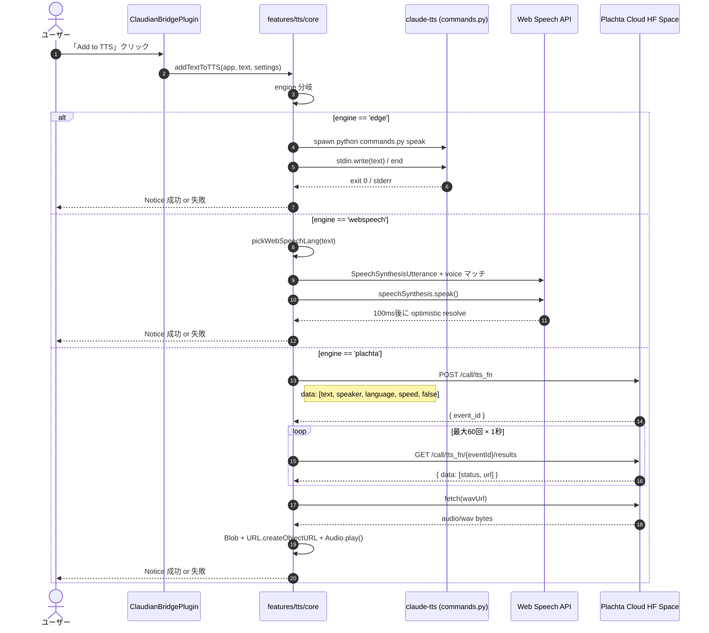
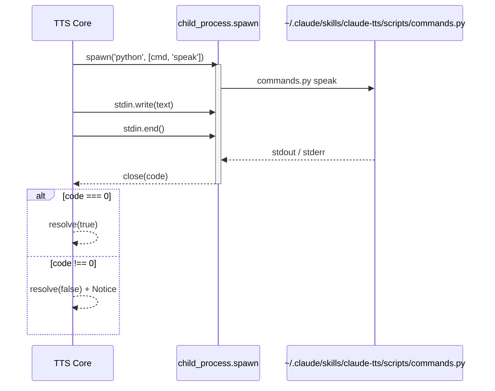
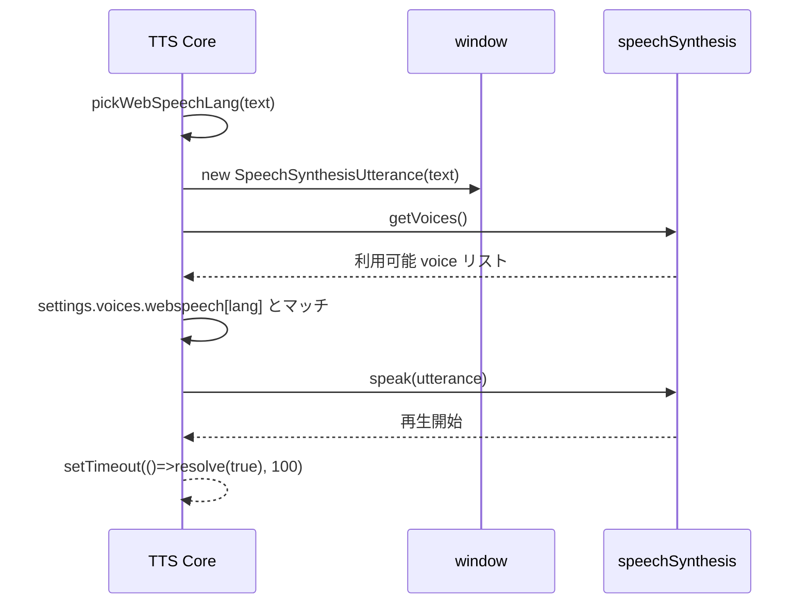
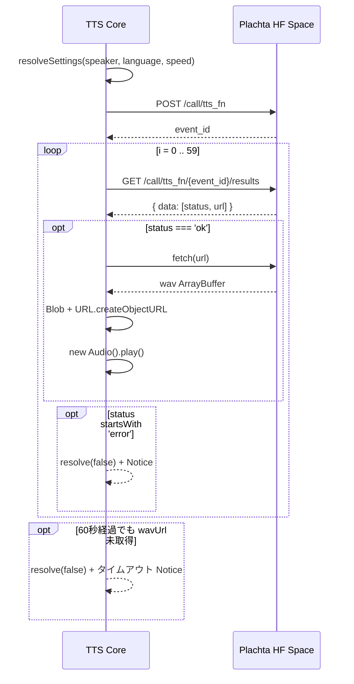
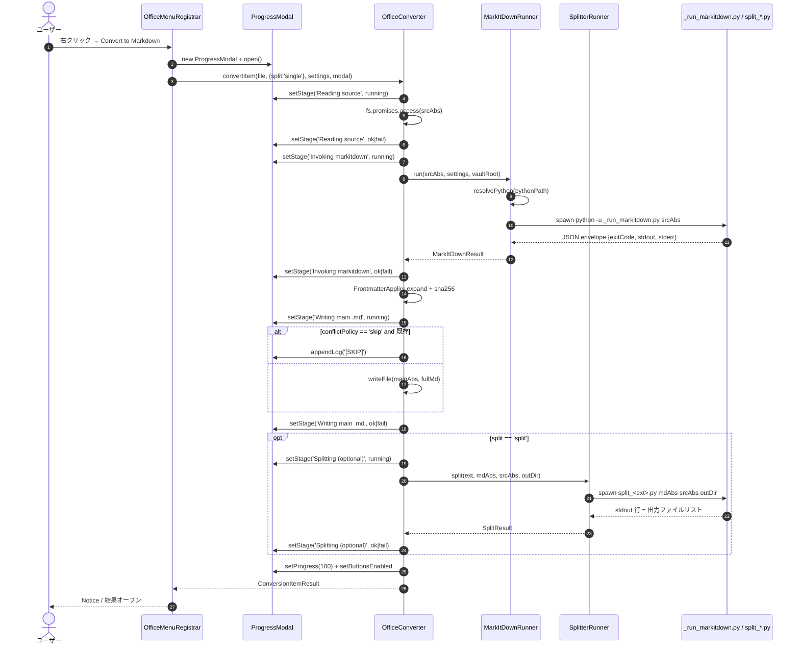
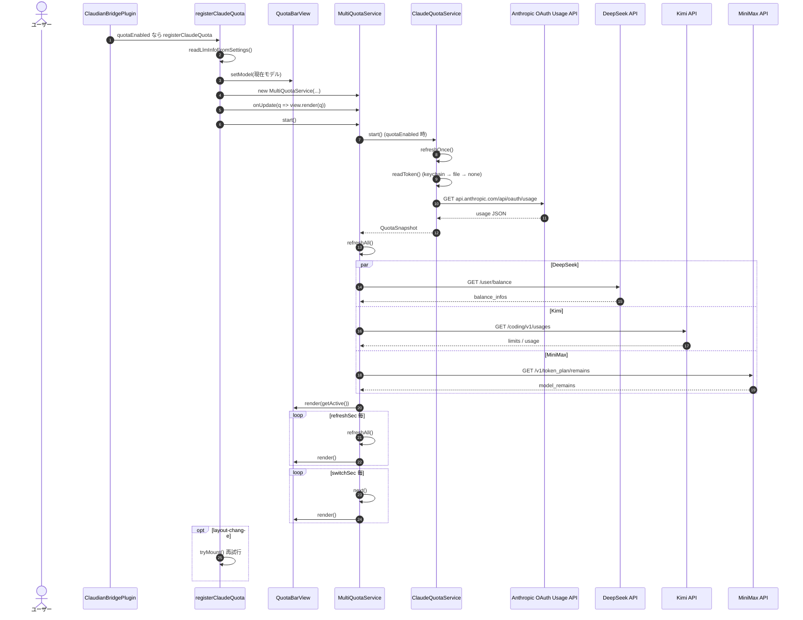
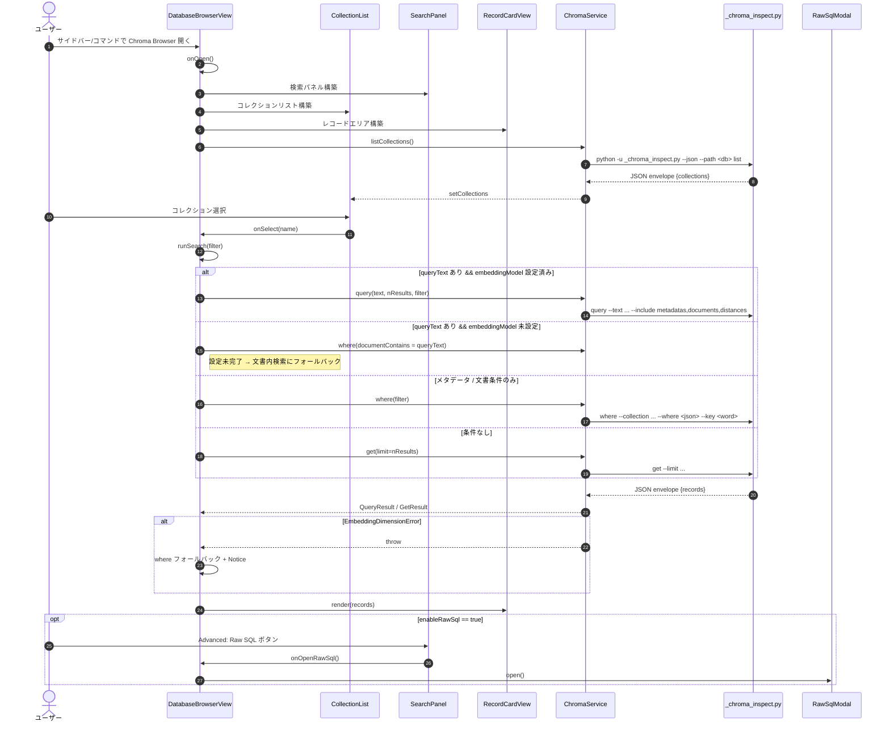

> 📂 路径：`80_POC_Projects/POC_017_ClaudianBridge/02_設計文書/02_シーケンス図.md`
> 📍 源码：`D:/AI-Agent/ClaudianBridge/src`

# 🔄 シーケンス図

> 📖 **シーケンス図って何？**
> **シーケンス図** は「複数の登場人物（プログラム）が、どの順番で何をするか」を時系列で表した図です。
> 例えるなら、レストランのやり取りを「客→店員→厨房」の順に矢印で書き出したようなものです。誰が誰に何を渡すかが一目で分かります。
> 図中の「→」は「依頼やデータを送る」ことを意味します。

本書は Claudian Bridge v0.8.0 の主要フローを [[../../POC_017_ClaudianBridge]] の実コードを SSOT（唯一の情報源）として Mermaid `sequenceDiagram`（処理の順序を図で表現）で記述する。

---

## 🖱️ F001: 選択ポップアップ → realclaudian 連携

```mermaid
sequenceDiagram
    autonumber
    actor U as ユーザー
    participant Obs as Obsidian
    participant SW as SelectionWatcher「選択監視プログラム」
    participant Pop as 選択ポップアップ
    participant CB as ClaudianBridgePlugin
    participant RC as realclaudian「Claude AI 送信機能拡張」

    U->>Obs: テキスト選択
    Obs->>SW: selectionchange / pointerup
    activate SW
    SW->>SW: enabled / スコープ / 長さチェック
    SW->>SW: setTimeout(delayMs)
    deactivate SW

    ...delayMs 後...

    SW->>Pop: buildPopup + appendToBody + positionPopup
    Pop-->>U: 「Add to Claudian」「Add to TTS」表示

    alt Add to Claudian
        U->>Pop: クリック
        Pop->>SW: onClaudian コールバック
        SW->>SW: cancelAndHide
        SW->>CB: addTextToClaudian(app, text)
        CB->>RC: plugins.plugins['realclaudian'] 取得
        CB->>RC: activateView()
        CB->>RC: getView().appendToActiveInput(text)
        RC-->>CB: true / false / 例外
        CB-->>U: Notice 成功 or 失敗
    else Add to TTS
        U->>Pop: クリック
        Pop->>SW: onTts コールバック
        SW->>SW: cancelAndHide
        SW->>CB: addTextToTTS(app, text, cfg.tts)
        CB-->>U: Notice 成功 or 失敗
    end
```

### ポップアップ制御の補足

| イベント | SelectionWatcher の動作 |
|------|------|
| pointerdown | `pointerDown=true`、ポップアップ外なら `dismissed=true` で消去 |
| pointerup | ポップアップ内ならクリックを届ける；外なら `onSelectionChange` 再判定 |
| scroll / blur / Escape | `cancelAndHide` |
| pointerInPopup | クリック中はポップアップを消さないガード |

---

## 🔊 F002: TTS 読み上げ（エンジン分岐）



### 各エンジンの詳細フロー

#### F002-1 edge-tts（ClaudeTTS HTTP ブリッジ経由）



#### F002-2 Web Speech（ブラウザ API）



#### F002-3 Plachta Cloud VITS



---

## 📄 F003: Office → Markdown 変換



### StageStatus の遷移

| ステージ名 | StageStatus |
|------|------|
| Reading source | pending → running → ok / fail |
| Invoking markitdown | pending → running → ok / fail |
| Writing main .md | pending → running → ok / fail |
| Splitting (optional) | pending → running → ok / fail |

---

## 💳 F004: Quota 更新（Claude + プロバイダローテーション）



### プロバイダと環境変数

| プロバイダ | API エンドポイント | 設定キー / 環境変数 |
|------|------|------|
| Claude | api.anthropic.com/api/oauth/usage | macOS keychain / ~/.claude/.credentials.json |
| DeepSeek | api.deepseek.com/user/balance | quota.deepseekApiKey / DEEPSEEK_API_KEY |
| Kimi | api.kimi.com/coding/v1/usages | quota.kimiApiKey / KIMI_CODING_API_KEY, KIMI_API_KEY |
| MiniMax | api.minimaxi.com/v1/token_plan/remains | quota.minimaxApiKey / MINIMAX_CN_API_KEY, MINIMAX_API_KEY |

---

## 🧬 F005: Chroma 検索（Python CLI 経由）



### ChromaService 公開メソッド

| メソッド | Python CLI サブコマンド | 用途 |
|------|------|------|
| listCollections | `list` | 全コレクション取得 |
| get | `get` | 条件なし / ID 指定でレコード取得 |
| where | `where` | メタデータ + 文書内検索 |
| query | `query` | 埋め込みモデルを使った意味検索 |
| version | `version` | DB / Python 接続テスト |

---

## 🔗 関連ドキュメント

- [[03_状態マシン|状態マシン]]
- [[01_クラス設計|クラス設計]]
- [[04_データモデル|データモデル]]

---

## 📝 更新履歴

| バージョン | 日付 | 修正内容 | 修正人 |
|------|------|------|------|
| v1.0.0 | 2026-08-10 | 初版 | MiuMiu 🐾 |
| v2.0.0 | 2026-08-13 | 実コード v0.8.0 と同期（全面書き直し） | MiuMiu 🐾 |
