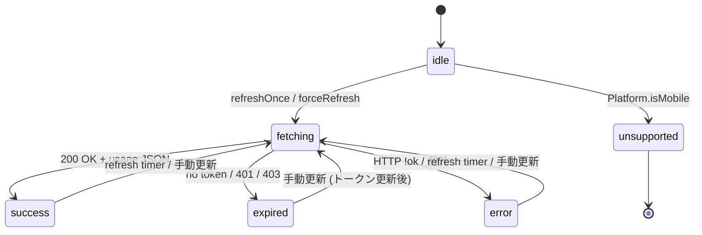
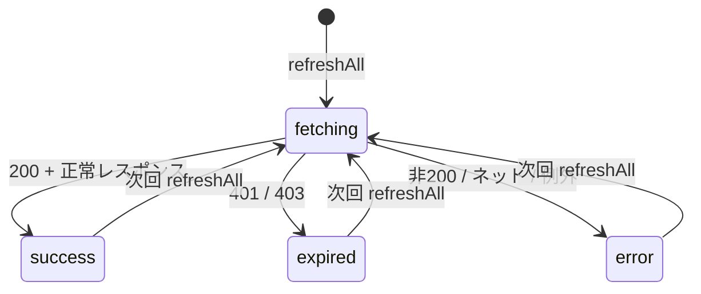
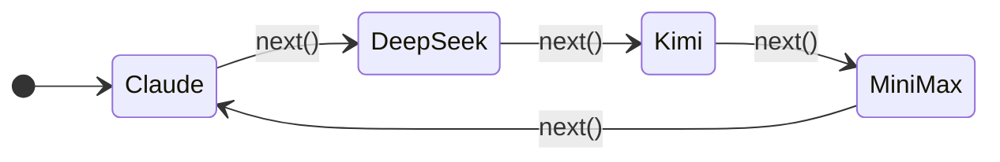
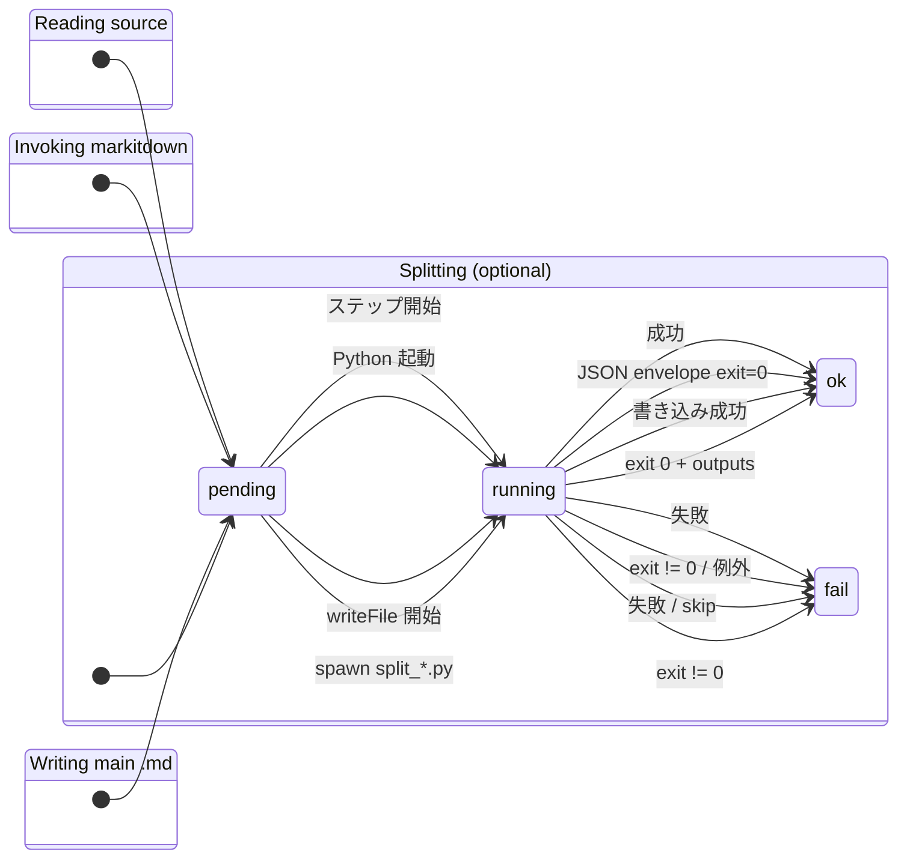
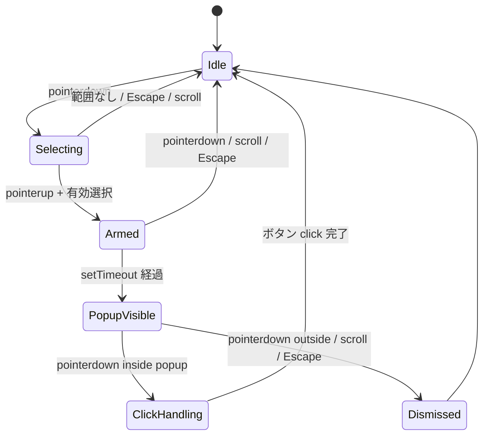
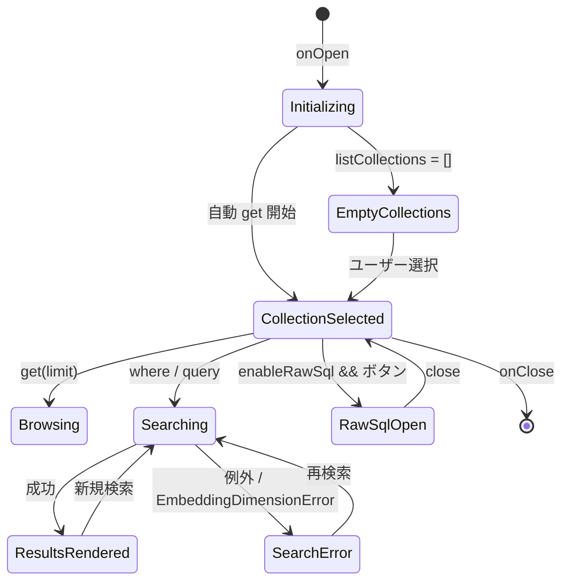
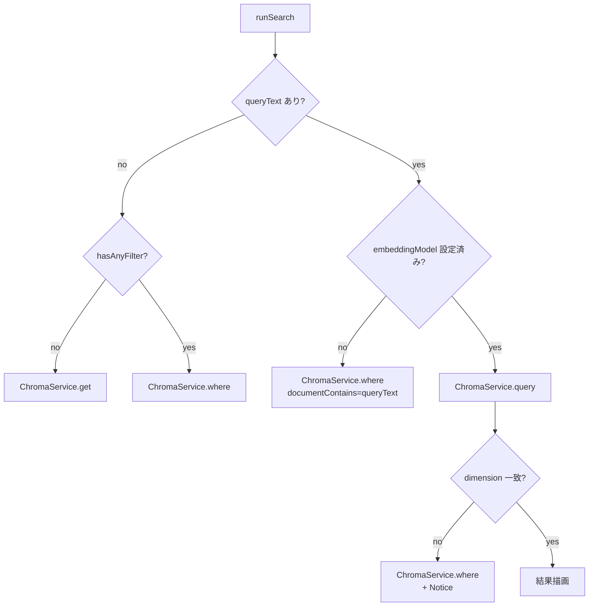

> 📂 路径：`80_POC_Projects/POC_017_ClaudianBridge/02_設計文書/03_状態マシン.md`
> 📌 フェーズ：フェーズ2 · 技術設計
> 🎯 用途：Claudian Bridge v0.8.0 の主要状態遷移
> 📍 源码：`D:/AI-Agent/ClaudianBridge/src`

# 🔄 状態マシン（状態遷移図）

> 📖 **状態マシンって何？**
> **状態マシン** は「ものの状態が、どんなきっかけで別の状態に変わるか」を表した図です。
> 例えるなら、信号機の状態遷移です。「青 →（時間経過）→ 黄 →（時間経過）→ 赤」のように、状態と変化のきっかけを明確にします。
> この図を見れば「今どの状態にいるか」「次にどうなるか」が予測できます。

本書は Claudian Bridge v0.8.0 の主要状態（QuotaStatus「使用量制限の状態」 / Office StageStatus「Office変換の進捗状態」 / 選択ウォッチャー / Chroma Browser）を [[02_シーケンス図|シーケンス図]] と対にして定義する。実コードを SSOT（唯一の情報源）とする。

---

## 📐 UML 元素説明

| 属性 | 値 |
|------|------|
| UML タイプ | 状態図（State Machine Diagram「状態遷移図」） |
| Mermaid 実装 | `stateDiagram-v2` |
| コア要素 | 状態（State「現在の状態」）+ 遷移（Transition「変化」）+ イベント（Event「きっかけ」） |
| 特殊記号 | `[*]` は開始／終了 |

---

## 💳 状態マシン 1: ClaudeQuotaService の QuotaStatus



### 状態説明

| 状態 | 説明 | 主な遷移先 |
|------|------|------|
| idle | 起動直後／リセット直後の静止状態 | → fetching |
| fetching | `inFlight=true` で API 呼び出し中 | → success / expired / error |
| success | 直近フェッチが 200 で完了 | → fetching |
| expired | 401／403／no token | → fetching |
| error | HTTP 失敗／ネットワーク例外／JSON 異常 | → fetching |
| unsupported | Platform.isMobile（デスクトップ専用機能） | → `[*]` |

### 補足

- `429`（Rate Limit）は前回値を保持して `success` 扱い（quota/core.ts）。
- `tokenSource` は `keychain` → `file` → `none` の優先順で更新される。

---

## 🌐 状態マシン 2: マルチプロバイダ残量（ProviderQuota）



### ローテーション

`MultiQuotaService.next()` は `getAvailableIds()` の循環順で表示対象を進める。



### 状態説明

| 状態 | 説明 |
|------|------|
| fetching | refreshAll 直後に即時セットされるプレースホルダ |
| success | API から 200 + 正常 JSON 受信 |
| expired | 401／403（再ログインまたは API キー更新が必要） |
| error | HTTP エラー／ネットワーク例外／JSON 異常 |

`getAvailableIds()` で `error`/`expired` または `zeroBalance` のプロバイダは表示対象外となる。

---

## 📄 状態マシン 3: Office 変換 ProgressModal StageStatus

### 全体遷移

```mermaid
stateDiagram-v2
    direction LR
    [*] --> "Reading source"
    "Reading source" --> "Invoking markitdown"
    "Invoking markitdown" --> "Writing main .md"
    "Writing main .md" --> "Splitting (optional)" : split='split'
    "Writing main .md" --> [*] : split='single'
    "Splitting (optional)" --> [*]
```

### 各ステージの StageStatus



### 状態説明

| 状態 | 説明 |
|------|------|
| pending | ステージ未着手（アイコン `·`） |
| running | 実行中（アイコン `▶`） |
| ok | 成功（アイコン `✓`） |
| fail | 失敗（アイコン `✗`、ログにエラー出力） |

ステージ一覧は `progress-modal.ts` の `stages` 定数および `setStage(name, status)` API で更新される。

---

## 🖱️ 状態マシン 4: 選択ウォッチャー内部フラグ



### 内部フラグ対応表

| 状態 | pointerDown | dismissed | pointerInPopup | popupEl | timer |
|------|------|------|------|------|------|
| Idle | false | false | false | null | null |
| Selecting | true | false | false | null | null |
| Armed | false | false | false | null | セット済 |
| PopupVisible | false | false | false | 表示中 | null |
| ClickHandling | true | false | true | 表示中 | null |
| Dismissed | true | true | false | 消去済 | null |

### 補足

- `pointerInPopup` が true の間は `selectionchange` で popup を消さない（クリック前に DOM から外れるのを防止）。
- `dismissed` は popup 外 pointerdown でセットされ、pointerup で再アームを抑制する。
- `cancelAndHide` で timer 解除 + popup 削除 + `pointerInPopup=false`。

---

## 🧬 状態マシン 5: Chroma DatabaseBrowserView



### 状態説明

| 状態 | 説明 |
|------|------|
| Initializing | `onOpen` で UI 構築 + `refreshCollections` 開始 |
| EmptyCollections | `listCollections` が空配列を返した |
| CollectionSelected | 左ペインからコレクション選択済み |
| Browsing | 条件なしで `get` を実行 |
| Searching | `where` または `query` を実行中（requestToken でステイル抑止） |
| ResultsRendered | 結果が `RecordCardView` に描画済み |
| SearchError | 例外発生 → Notice ＋空レコード描画 |
| RawSqlOpen | `enableRawSql=true` で RawSqlModal を開いている |

### 検索モードの決定ルール



---

## 🔗 関連ドキュメント

- [[02_シーケンス図|シーケンス図]]
- [[01_クラス設計|クラス設計]]
- [[04_データモデル|データモデル]]

---

## 📝 更新履歴

| バージョン | 日付 | 修正内容 | 修正者 |
|------|------|------|------|
| v2.0.0 | 2026-06-13 | 初版（4 状態マシン + 実装示例） | MiuMiu 🐾 |
| v2.0.0 | 2026-08-13 | 実コード v0.8.0 と同期（全面書き直し） | MiuMiu 🐾 |
