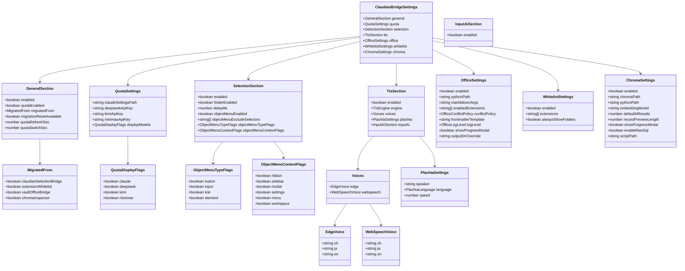
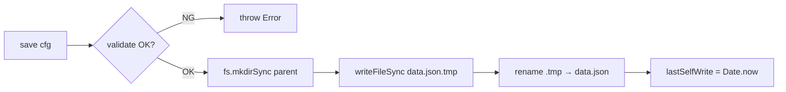
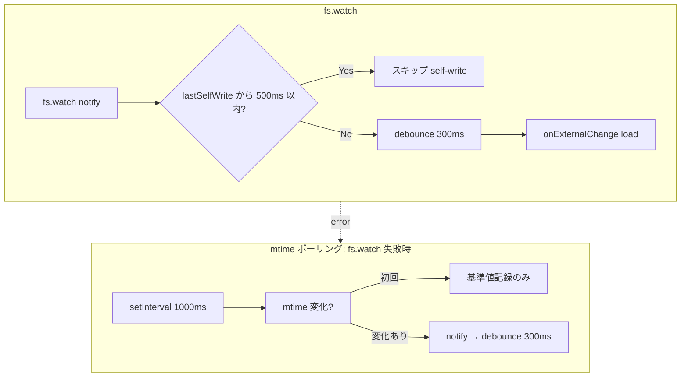
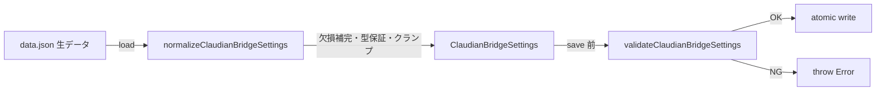

> 📂 路径：`80_POC_Projects/POC_017_ClaudianBridge/02_設計文書/04_データモデル.md`
> 📍 源码：`src/core/settings.ts`, `src/core/config-store.ts`

# 🗄️ データモデル

> **関連プロジェクト**: [[../README|フェーズインデックス]] | [[01_クラス設計|クラス設計]]
> **対応バージョン**: Claudian Bridge v0.8.0（v0.16.0: `tts.inputAi` 追記）

---

### 📖 データモデルって何？

**データモデル** は「データの保管場所と形式を決めた設計書」です。本プラグインでは、ユーザーの設定を **1 つの `data.json` ファイル** にまとめて保存します。

例えるなら：
- **データモデル** = 収納ボックスの設計図（どこに何を入れるか決めている）
- **data.json** = 実際の収納ボックス（設定が詰まっている）

1 つのファイルにまとめる利点は「どこを見れば設定が分かるか」が明確になり、管理が簡単になることです。

---

## 📐 モデル概要

Claudian Bridge の永続化データは **1 つの `data.json`** に集約されています。
スキーマ（データの型定義）は `src/core/settings.ts` の `ClaudianBridgeSettings` インターフェースが SSOT（唯一の情報源）で、以下 **7 セクション** で構成されます。

| セクション | 概要 | ソース |
|------|------|------|
| `general` | プラグイン全体 ON/OFF・マイグレーション（データ移行）状態・Quota（使用量制限）有効化/更新間隔 | `src/core/settings.ts` |
| `quota` | 各 LLM API キー・Claude Code 設定ファイルパス・表示モデル ON/OFF | `src/core/settings.ts` |
| `selection` | テキスト選択・フォルダ右クリック・オブジェクトコンテキストメニュー設定 | `src/core/settings.ts` |
| `tts` | 読み上げエンジン（edge/webspeech/plachta）とボイス設定・`inputAi`（✨AI読み上げボタンの有効化） | `src/core/settings.ts` |
| `office` | Office→Markdown 変換設定 | `src/core/settings.ts` |
| `whitelist` | ファイル拡張子ホワイトリスト（許可リスト）設定 | `src/core/settings.ts` |
| `chroma` | ChromaDB ブラウザ設定 | `src/core/settings.ts`, `src/features/chroma/defaults.ts` |

> ⚠️ **SSOT 注記**: 本書は `src/core/settings.ts`（v0.8.0）の `ClaudianBridgeSettings` を真実とします。
> タスク指示の「`general.migratedFrom.{csb, ew, vob, chroma}`」「`general.language`」「`plachta.{enabled, presetId, speakerText}` 等の差分は実コードに存在しないため、**実在するフィールド名**で記述しています。

---

## 🗄️ コア Class Diagram



---

## 📋 セクション詳細

### ⚙️ general

| フィールド | 型 | デフォルト値 | 説明 |
|------|------|------|------|
| `enabled` | `boolean` | `true` | プラグイン全体の有効化トグル |
| `quotaEnabled` | `boolean` | `false` | Quota 機能の有効化トグル |
| `migratedFrom.claudianSelectionBridge` | `boolean` | `false` | claudian-selection-bridge からの移行済みフラグ |
| `migratedFrom.extensionWhitelist` | `boolean` | `false` | extension-whitelist からの移行済みフラグ |
| `migratedFrom.vaultOfficeBridge` | `boolean` | `false` | vault-office-bridge からの移行済みフラグ |
| `migratedFrom.chromaInspector` | `boolean` | `false` | chroma-inspector からの移行済みフラグ |
| `migrationResetAvailable` | `boolean` | `true` | 設定画面で「旧設定をやり直す」が可能か |
| `quotaRefreshSec` | `number` | `60` | Quota ポーリング間隔（秒）。`0` は更新停止。範囲外は `[10, 600]` にクランプ |
| `quotaSwitchSec` | `number` | `5` | マルチプロバイダ自動切替間隔（秒）。`0` は切替停止。範囲外は `[5, 600]` にクランプ |

---

### 💰 quota

| フィールド | 型 | デフォルト値 | 説明 |
|------|------|------|------|
| `claudeSettingsPath` | `string` | `~/.claude/settings.json`（OS ホームから解決） | Claude Code 設定ファイルパス。読み取り専用 |
| `deepseekApiKey` | `string` | `''` | DeepSeek API キー |
| `kimiApiKey` | `string` | `''` | KIMI CODE API キー |
| `minimaxApiKey` | `string` | `''` | MiniMax API キー |
| `displayModels.claude` | `boolean` | `true` | Claude 残量を表示する |
| `displayModels.deepseek` | `boolean` | `true` | DeepSeek 残量を表示する |
| `displayModels.kimi` | `boolean` | `true` | KIMI 残量を表示する |
| `displayModels.minimax` | `boolean` | `true` | MiniMax 残量を表示する |

---

### 🖱️ selection

| フィールド | 型 | デフォルト値 | 説明 |
|------|------|------|------|
| `enabled` | `boolean` | `true` | テキスト選択「Add to Claudian」機能の ON/OFF |
| `folderEnabled` | `boolean` | `true` | フォルダ右クリック「Add to Claudian」の ON/OFF |
| `delayMs` | `number` | `300` | テキスト選択後、ボタンを表示するまでの遅延（ms） |
| `objectMenuEnabled` | `boolean` | `true` | オブジェクトコンテキストメニュー全体の ON/OFF |
| `objectMenuExcludeSelectors` | `string[]` | `['.cb-popup', '.claudian-popup', '.menu', '.suggestion-container']` | メニューを出さない DOM セレクターリスト |
| `objectMenuTypeFlags.button` | `boolean` | `true` | ボタン要素でメニューを出す |
| `objectMenuTypeFlags.input` | `boolean` | `true` | 入力要素でメニューを出す |
| `objectMenuTypeFlags.link` | `boolean` | `true` | リンク要素でメニューを出す |
| `objectMenuTypeFlags.element` | `boolean` | `true` | その他要素でメニューを出す |
| `objectMenuContextFlags.ribbon` | `boolean` | `true` | リボン領域で有効 |
| `objectMenuContextFlags.sidebar` | `boolean` | `true` | サイドバー領域で有効 |
| `objectMenuContextFlags.modal` | `boolean` | `true` | モーダル領域で有効 |
| `objectMenuContextFlags.settings` | `boolean` | `true` | 設定画面で有効 |
| `objectMenuContextFlags.menu` | `boolean` | `true` | メニュー領域で有効 |
| `objectMenuContextFlags.workspace` | `boolean` | `true` | ワークスペース領域で有効 |

---

### 🔊 tts

| フィールド | 型 | デフォルト値 | 説明 |
|------|------|------|------|
| `enabled` | `boolean` | `true` | TTS 機能全体の ON/OFF |
| `engine` | `'edge' \| 'webspeech' \| 'plachta'` | `'edge'` | 使用する TTS エンジン |
| `voices.edge.zh` | `string` | `'xiaoxiao'` | Edge TTS 中国語ボイス |
| `voices.edge.ja` | `string` | `'nanami'` | Edge TTS 日本語ボイス |
| `voices.edge.en` | `string` | `'aria'` | Edge TTS 英語ボイス |
| `voices.webspeech.zh` | `string` | `''` | Web Speech 中国語ボイス |
| `voices.webspeech.ja` | `string` | `''` | Web Speech 日本語ボイス |
| `voices.webspeech.en` | `string` | `''` | Web Speech 英語ボイス |
| `plachta.speaker` | `string` | `'特别周 Special Week (Umamusume Pretty Derby)'` | Plachta 話者名 |
| `plachta.language` | `'日本語' \| '简体中文' \| 'English' \| 'Mix'` | `'日本語'` | Plachta 言語 |
| `plachta.speed` | `number` | `1.0` | Plachta 再生速度。`[0.5, 2.0]` にクランプ |

> **補足**: v0.8.0 時点で TTS エンジンは `edge` / `webspeech` / `plachta` の **3 種のみ**。v0.6.0 で `minimax` 関連フィールドは廃止済み（`core/migrator.ts` の `runTtsMigration` で Notice 1 回通知）。

---

### 📄 office

| フィールド | 型 | デフォルト値 | 説明 |
|------|------|------|------|
| `enabled` | `boolean` | `true` | Office 変換機能の ON/OFF |
| `pythonPath` | `string` | Windows: `'py'`, 他: `'python3'` | Python インタープリタ実行パス |
| `markitdownArgs` | `string` | `''` | markitdown 追加コマンドライン引数 |
| `enabledExtensions` | `string[]` | `['docx', 'xlsx', 'pptx', 'pdf', 'html', 'htm', 'csv']` | 変換対象拡張子 |
| `conflictPolicy` | `'overwrite' \| 'skip' \| 'timestamp'` | `'overwrite'` | 出力ファイル衝突時のポリシー |
| `frontmatterTemplate` | `string` | Office 変換用 YAML テンプレート | 変換後 Markdown の frontmatter テンプレート |
| `logLevel` | `'debug' \| 'info' \| 'warn' \| 'error'` | `'info'` | ログレベル |
| `showProgressModal` | `boolean` | `true` | 変換進捗モーダルを表示する |
| `outputDirOverride` | `string` | `''` | 出力先ディレクトリの上書き（空ならソースと同階層） |

---

### 🛡️ whitelist

| フィールド | 型 | デフォルト値 | 説明 |
|------|------|------|------|
| `enabled` | `boolean` | `true` | ホワイトリスト CSS 注入の ON/OFF |
| `extensions` | `string[]` | `['md', 'canvas', 'pdf', 'png', 'doc', 'docx', 'xls', 'xlsx', 'ppt', 'pptx']` | 表示対象拡張子。ピリオドを除去して小文字化して正規化される |
| `alwaysShowFolders` | `boolean` | `true` | フォルダは常に表示する |

---

### 🧬 chroma

| フィールド | 型 | デフォルト値 | 説明 |
|------|------|------|------|
| `enabled` | `boolean` | `false` | Chroma Inspector 統合のマスタースイッチ（既定 OFF） |
| `chromaPath` | `string` | `'chroma_db'` | ChromaDB ディレクトリパス |
| `pythonPath` | `string` | Windows: `'py'`, 他: `'python3'` | Python インタープリタ実行パス |
| `embeddingModel` | `string` | `''` | 埋め込みモデル名（空なら意味検索無効） |
| `defaultNResults` | `number` | `5` | デフォルト取得件数。`[1, 100]` にクランプ |
| `recordPreviewLength` | `number` | `240` | レコードプレビュー文字数。`[20, 10000]` にクランプ |
| `showProgressModal` | `boolean` | `true` | 長時間処理時の進捗モーダル |
| `enableRawSql` | `boolean` | `false` | 高度な生 SQL 実行の ON/OFF（セキュリティのため既定 OFF） |
| `scriptPath` | `string` | `''` | `_chroma_inspect.py` のパス（空なら Vault ルート） |

---

## 💾 data.json 保存形式

Obsidian プラグイン規約に従い、設定は以下に保存されます。

```
{VAULT_ROOT}/.obsidian/plugins/claudian-bridge/data.json
```

内容は `ClaudianBridgeSettings` の完全な JSON シリアライズです。例（抜粋）:

```json
{
  "general": {
    "enabled": true,
    "quotaEnabled": false,
    "migratedFrom": {
      "claudianSelectionBridge": false,
      "extensionWhitelist": false,
      "vaultOfficeBridge": false,
      "chromaInspector": false
    },
    "migrationResetAvailable": true,
    "quotaRefreshSec": 60,
    "quotaSwitchSec": 5
  },
  "quota": {
    "claudeSettingsPath": "C:\\Users\\superlambkin\\.claude\\settings.json",
    "deepseekApiKey": "",
    "kimiApiKey": "",
    "minimaxApiKey": "",
    "displayModels": {
      "claude": true,
      "deepseek": true,
      "kimi": true,
      "minimax": true
    }
  },
  "selection": {
    "enabled": true,
    "folderEnabled": true,
    "delayMs": 300,
    "objectMenuEnabled": true,
    "objectMenuExcludeSelectors": [".cb-popup", ".claudian-popup", ".menu", ".suggestion-container"],
    "objectMenuTypeFlags": { "button": true, "input": true, "link": true, "element": true },
    "objectMenuContextFlags": { "ribbon": true, "sidebar": true, "modal": true, "settings": true, "menu": true, "workspace": true }
  },
  "tts": {
    "enabled": true,
    "engine": "edge",
    "voices": {
      "edge": { "zh": "xiaoxiao", "ja": "nanami", "en": "aria" },
      "webspeech": { "zh": "", "ja": "", "en": "" }
    },
    "plachta": {
      "speaker": "特别周 Special Week (Umamusume Pretty Derby)",
      "language": "日本語",
      "speed": 1.0
    }
  },
  "office": {
    "enabled": true,
    "pythonPath": "py",
    "markitdownArgs": "",
    "enabledExtensions": ["docx", "xlsx", "pptx", "pdf", "html", "htm", "csv"],
    "conflictPolicy": "overwrite",
    "frontmatterTemplate": "---\ntitle: {{title}}\ntype: office-conversion\n...\n---\n",
    "logLevel": "info",
    "showProgressModal": true,
    "outputDirOverride": ""
  },
  "whitelist": {
    "enabled": true,
    "extensions": ["md", "canvas", "pdf", "png", "doc", "docx", "xls", "xlsx", "ppt", "pptx"],
    "alwaysShowFolders": true
  },
  "chroma": {
    "enabled": false,
    "chromaPath": "chroma_db",
    "pythonPath": "py",
    "embeddingModel": "",
    "defaultNResults": 5,
    "recordPreviewLength": 240,
    "showProgressModal": true,
    "enableRawSql": false,
    "scriptPath": ""
  }
}
```

---

## 🏪 ConfigStore の役割

`src/core/config-store.ts` の `ConfigStore` は `data.json` の読み書き・監視を担当します。

| メソッド | 役割 |
|------|------|
| `load()` | `data.json` が無ければデフォルト値で作成。存在すれば JSON をパースし `normalizeClaudianBridgeSettings()` で正規化。**破損 JSON は `.broken.json` にリネームしてからデフォルト値で復帰** |
| `save(cfg)` | `validateClaudianBridgeSettings()` で検証後、**一時ファイル書き込み + `rename` で原子性を担保**（書き込み中は `lastSelfWrite = Date.now()` を記録） |
| `watch(cb)` | `fs.watch` で外部変更を監視。**SMB 等で `fs.watch` が失敗/エラー**する場合は `mtime` ポーリング（**1 秒間隔**）にフォールバック |
| `close()` | ウォッチャー/ポーリング/デバウンスタイマーを解放 |

### 🔐 書き込み原子性



### 👁️ 外部変更検知



- **debounce: 300ms** — 連続書き込みを集約
- **lastSelfWrite guard: 500ms** — 自前の書き込みが watcher にフィードバックするのを防止
- **mtime ポーリング: 1000ms 間隔** — ネットワークドライブ互換性

---

## 🔒 正規化・検証の責務分界



- **normalize**: 旧フィールドの互換読み取り（v0.6.0 平型 voices → ネスト型など）、デフォルト値補完、数値クランプを担当
- **validate**: 正規化後のオブジェクトがスキーマ制約を満たすか検証

---

## 🔗 関連ドキュメント

- [[01_クラス設計|クラス設計]]
- [[00_アーキテクチャ総覧|アーキテクチャ総覧]]
- [[04_データ移行設計|データ移行設計]]
- [[../03_開発文書/01_環境設定|環境設定]]

---

## 📝 更新履歴

| バージョン | 日付 | 修正内容 | 修正者 |
|------|------|---------|--------|
| v2.0.0 | 2026-06-13 | 初版（8 エンティティ + ER 図 + インデックス戦略） | MiuMiu 🐾 |
| 2.0.0 | 2026-08-13 | 実コード v0.8.0 と同期（全面書き直し） | MiuMiu 🐾 |
| 3.0.0 | 2026-08-13 | 実コード v0.8.0 と同期（全面書き直し） | MiuMiu 🐾 |

---

*🗄️ データモデル v3.0.0 · Claudian Bridge v0.8.0 · MiuMiu 🐾*
