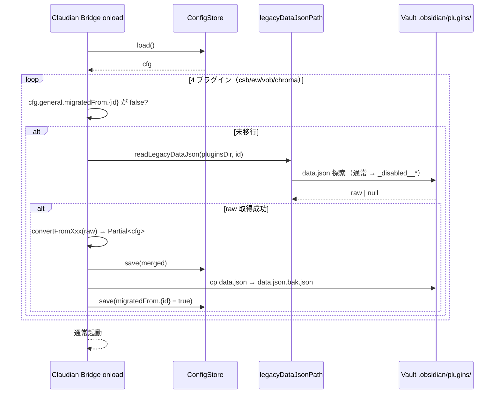
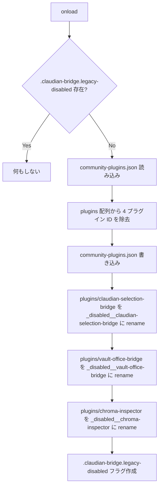
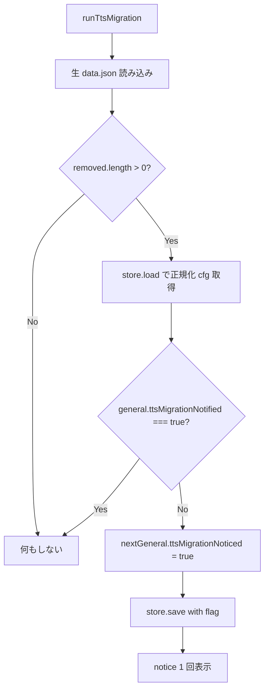

> 📂 路径：`80_POC_Projects/POC_017_ClaudianBridge/02_設計文書/04_データ移行設計.md`
> 📍 源码：`src/legacy/migration.ts`, `src/legacy/disable-legacy.ts`, `src/legacy/convert-*.ts`, `src/legacy/read-legacy.ts`, `src/core/migrator.ts`

# 🔄 データ移行設計

> **対応バージョン**: Claudian Bridge v0.8.0
> **関連**: [[04_データモデル|データモデル]] | [[01_クラス設計|クラス設計]]

---

### 📖 データ移行って何？

**データ移行（マイグレーション）** は「引っ越し」のようなものです。今まで A という家（旧プラグイン）に住んでいた荷物（設定データ）を、新しい家 B（統合プラグイン）へ、形を整えながら運び込みます。

例えるなら：
- **移行前** = 4 つの別々のプラグインに散らばった設定
- **移行後** = 1 つのプラグインに統合された設定
- **変換器** = 荷物を新居の収納に合う形に詰め直す引っ越し業者

ポイントは「**冪等（べきとう）**」という性質です。これは「何度実行しても結果が同じになる」という意味で、移行が二重に実行されても壊れないように設計されています。

---

## 🎯 移行スコープ

Claudian Bridge は **4 つの旧プラグイン** の設定を統合しました。すべて **マイグレーションフラグで再実行を防止** する冪等設計です。

| # | 旧プラグイン ID | 旧 `data.json` パス（探索順） | 移行先（新スキーマ） | 変換器 |
|---|---|---|---|---|
| 1 | `claudian-selection-bridge` | `plugins/{claudian-selection-bridge\|_disabled__claudian-selection-bridge}/data.json` | `selection` / `tts` | `convert-csb.ts` |
| 2 | `extension-whitelist` | `plugins/{extension-whitelist\|_disabled__extension-whitelist}/data.json` | `whitelist` | `convert-ew.ts` |
| 3 | `vault-office-bridge` | `plugins/{vault-office-bridge\|_disabled__vault-office-bridge}/data.json` | `office` | `convert-vob.ts` |
| 4 | `chroma-inspector` | `plugins/{chroma-inspector\|_disabled__chroma-inspector}/data.json` | `chroma` | `convert-chroma.ts` |

> ⚠️ **SSOT 注記**: 旧プラグインフォルダは `legacyDataJsonPath()`（`read-legacy.ts`）で「**通常名 → `_disabled__` プレフィックス付き**」の順で検索します。旧来の命名揺れ（旧 whiltelist・旧 `_disabled__whitelist`）もカバー。

---

## 📐 変換ロジック（4 変換器）

各変換器は **生 data.json → `Partial<ClaudianBridgeSettings>`** を返します。呼び出し側（`migration.ts`）が新スキーマにマージして `save` します。

### 1️⃣ `convertFromClaudianSelectionBridge` (convert-csb.ts)

| 旧キー | 新キー | 変換ロジック |
|------|------|------|
| `enabled` | `selection.enabled` | boolean そのまま転送。未定義なら `true` |
| `delayMs` | `selection.delayMs` | number そのまま転送。未定義なら `300` |
| `tts.engine` | `tts.engine` | `'webspeech'` 以外は全て `'edge'` にフォールバック（v0.6.0: 非対応エンジン除去） |
| `tts.voices.{zh,ja,en}`（平型） | `tts.voices.edge.{zh,ja,en}` | **旧平型** を `edge` にマッピング（v0.6.0 後方互換） |
| `tts.voices.edge.{zh,ja,en}`（ネスト） | `tts.voices.edge.{zh,ja,en}` | そのまま転送 |
| `tts.voices.webspeech.{zh,ja,en}` | `tts.voices.webspeech.{zh,ja,en}` | そのまま転送（無ければ空文字） |
| （旧 `tts.minimax` / `tts.voice`） | （削除） | v0.6.0 で廃止。`core/migrator.ts` の `runTtsMigration` で Notice 1 回 |
| （未設定） | `selection.folderEnabled` | `true` 固定 |
| （未設定） | `selection.objectMenu*` | 既定値で初期化（`DEFAULT_OBJECT_EXCLUDE_SELECTORS` ＋ type/context 全 true） |
| （未設定） | `tts.enabled` | `true` 固定 |

### 2️⃣ `convertFromExtensionWhitelist` (convert-ew.ts)

| 旧キー | 新キー | 変換ロジック |
|------|------|------|
| `enabled` | `whitelist.enabled` | boolean そのまま転送 |
| `extensions` | `whitelist.extensions` | `string[]` を `trim().toLowerCase().replace(/^\./, '')` で正規化 |
| `alwaysShowFolders` | `whitelist.alwaysShowFolders` | boolean そのまま転送 |

### 3️⃣ `convertFromVaultOfficeBridge` (convert-vob.ts)

| 旧キー | 新キー | 変換ロジック |
|------|------|------|
| （未設定） | `office.enabled` | `true` 固定 |
| `pythonPath` | `office.pythonPath` | string、空文字は `DEFAULT_OFFICE_SETTINGS.pythonPath`（Win: `'py'`/他: `'python3'`） |
| `markitdownArgs` | `office.markitdownArgs` | string そのまま転送 |
| `enabledExtensions` | `office.enabledExtensions` | `string[]` をフィルタして転送 |
| `conflictPolicy` | `office.conflictPolicy` | `['overwrite','skip','timestamp']` 以外は既定値 |
| `frontmatterTemplate` | `office.frontmatterTemplate` | string そのまま転送 |
| `logLevel` | `office.logLevel` | `['debug','info','warn','error']` 以外は既定値 |
| `showProgressModal` | `office.showProgressModal` | boolean そのまま転送 |
| `outputDirOverride` | `office.outputDirOverride` | string そのまま転送 |

### 4️⃣ `convertFromChromaInspector` (convert-chroma.ts)

旧プラグインは **トップレベル直書き**（ラッパーオブジェクト無し）。全フィールドを `chroma.*` ブロックにマッピングします。

| 旧キー | 新キー | 変換ロジック |
|------|------|------|
| `chromaPath` | `chroma.chromaPath` | string、空文字は `DEFAULT_CHROMA_SETTINGS.chromaPath` (`'chroma_db'`) |
| `pythonPath` | `chroma.pythonPath` | string、空文字は `DEFAULT_CHROMA_SETTINGS.pythonPath` |
| `embeddingModel` | `chroma.embeddingModel` | string そのまま転送 |
| `defaultNResults` | `chroma.defaultNResults` | number、正規化時に `[1, 100]` にクランプ |
| `recordPreviewLength` | `chroma.recordPreviewLength` | number、正規化時に `[20, 10000]` にクランプ |
| `showProgressModal` | `chroma.showProgressModal` | boolean そのまま転送 |
| `enableRawSql` | `chroma.enableRawSql` | boolean そのまま転送 |
| `scriptPath` | `chroma.scriptPath` | string そのまま転送 |
| （旧プラグイン自体が動作していた事実） | `chroma.enabled` | **強制 `true`**（ユーザーが能動的に使っていたため） |

---

## 🔄 マイグレーション本体 (`migration.ts`)

### 起動フロー



### フラグベース冪等性

各プラグインごとに `general.migratedFrom.{id}` フラグをチェックします。フラグが `true` なら再実行しません。これにより：

- **途中失敗で再起動しても安全**
- **設定画面で「旧設定をやり直す」を押すまで再適用されない**

### バックアップ戦略

| ファイル | 役割 |
|------|------|
| `data.json.bak.json` | 旧プラグインの生 data.json を **cp（コピー）** で退避。元ファイルはそのまま残す |
| `data.json.broken.json` | 破損 JSON を **rename** で退避（`config-store.ts` `load()` 内） |
| `.claudian-bridge.legacy-disabled` | 旧プラグイン無効化フラグ（disable-legacy.ts の二重実行防止） |

---

## 🚫 旧プラグイン無効化 (`disable-legacy.ts`)

`disableLegacyPluginsOnce()` は **1 回だけ** 走る初期化処理です。



### 重要ポイント

- **対象 4 ID**: `claudian-selection-bridge`, `vault-office-bridge`, `extension-whitelist`, `chroma-inspector`
- **フォルダ rename 対象は 3 プラグインのみ**: `extension-whitelist` は既に `_disabled__extension-whitelist` として配布されるため rename 不要
- **二重実行防止**: `.obsidian/.claudian-bridge.legacy-disabled` ファイルが存在すれば即 return
- **失敗時**: `renameSync` が失敗しても握り潰す（次の起動で再試行）

---

## 🗑️ v0.6.0 TTS 簡素化マイグレーション (`core/migrator.ts`)

旧 TTS 形式（`minimax` ブロック・`voice` 単一フィールド・平型 voices）を新形式に揃える **インプレース移行** です。**Notice を 1 回だけ** 表示します。

### 旧フィールド検出

```typescript
detectRemovedTtsFields(raw) {
  removed = []
  if ('minimax' in raw.tts)           removed.push('tts.minimax')
  if ('voice' in raw.tts)             removed.push('tts.voice')
  if (voices has {zh,ja,en} and NOT {edge,webspeech})
                                       removed.push('tts.voices[flat]')
  return removed
}
```

### 実行条件



### Notice 文言

> 🗑️ MiniMax TTS 設定を削除しました（接続テスト失敗のため）。新しい edge-TTS / WebSpeech 設定は「設定 → Claudian Bridge → テキスト読み上げ」をご確認ください。

---

## 🔒 安全性まとめ

| リスク | 対策 |
|------|------|
| 旧設定の消失 | `data.json.bak.json` に退避（元ファイルは保持） |
| 破損 JSON | `data.json.broken.json` に退避してデフォルト復帰 |
| 重複マイグレーション | `general.migratedFrom.{id}` フラグで gating |
| 旧プラグインとの競合 | `disable-legacy.ts` で 1 回だけ無効化 |
| TTS 簡素化の再発 | `general.ttsMigrationNoticed` フラグで Notice 1 回制限 |
| 設定画面で再移行したい | 「旧設定をやり直す」ボタンでフラグクリア → 次回起動で再適用 |

---

## 🔗 関連ドキュメント

- [[04_データモデル|データモデル]]
- [[01_クラス設計|クラス設計]]
- [[../03_開発文書/01_環境設定|環境設定]]

---

## 📝 更新履歴

| バージョン | 日付 | 修正内容 | 修正者 |
|------|------|---------|--------|
| v1.0.0 | 2026-08-10 | 初版 | MiuMiu 🐾 |
| 2.0.0 | 2026-08-13 | 実コード v0.8.0 と同期（全面書き直し） | MiuMiu 🐾 |

---

*🔄 データ移行設計 v2.0.0 · Claudian Bridge v0.8.0 · MiuMiu 🐾*
