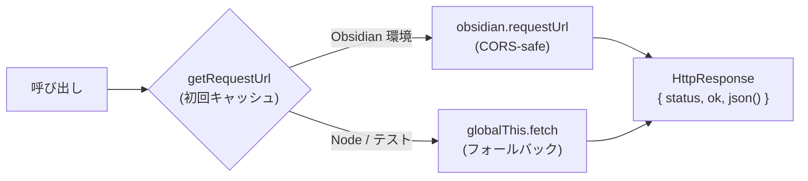
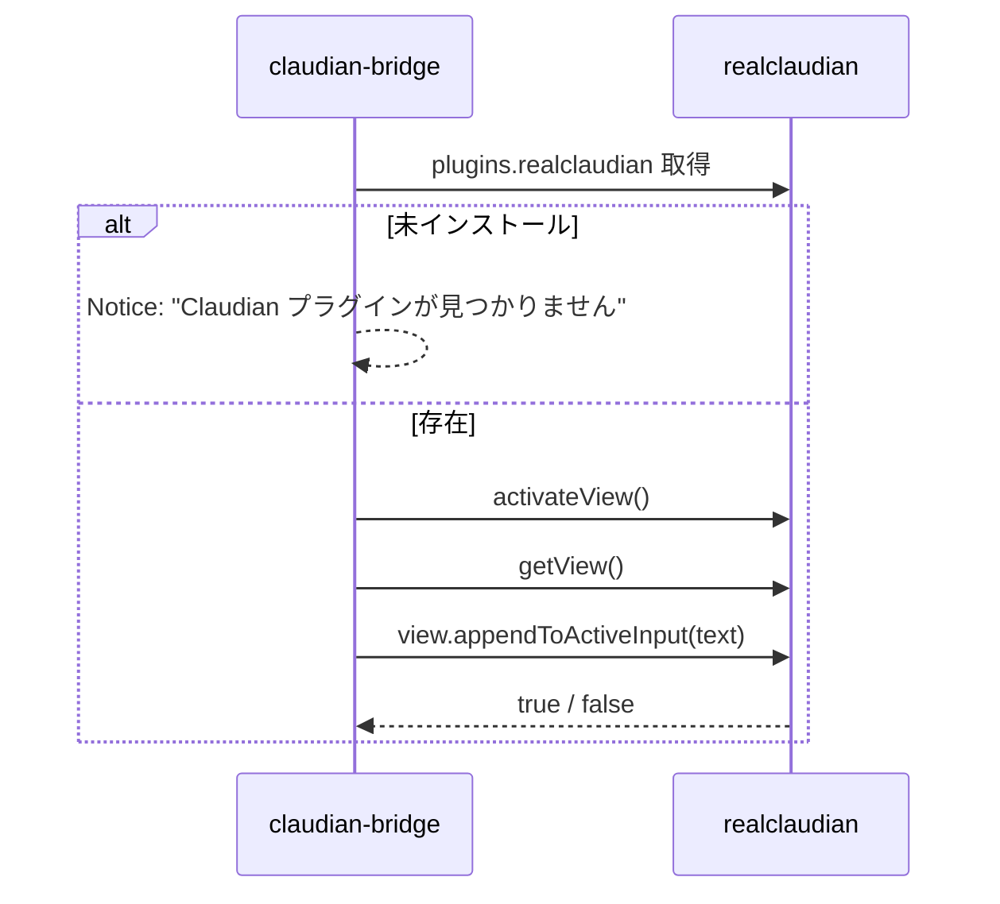
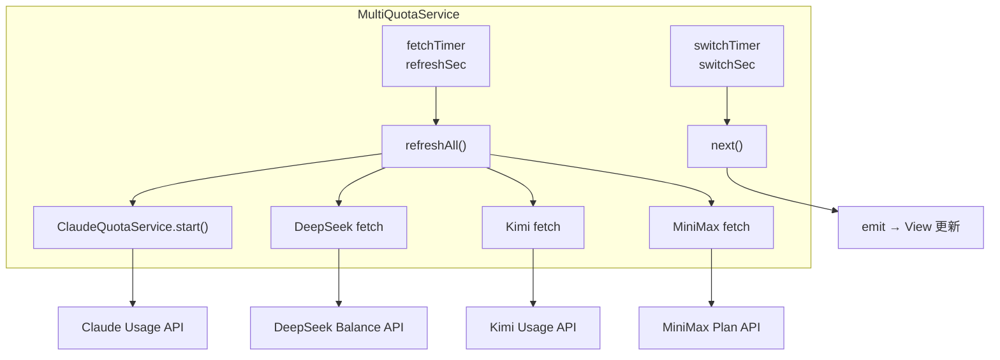

> 📂 **パス**: `80_POC_Projects/POC_017_ClaudianBridge/02_設計文書/05_API設計.md`
> 📍 **ソース**: `D:\AI-Agent\ClaudianBridge\src` (manifest version 0.8.0)
> 🎯 **用途**: claudian-bridge プラグインが外部システム / Python CLI / 内部プラグイン API と連携する全 API 境界の SSOT

# 🔌 API 設計

> **関連プロジェクト**: [[../README|フェーズインデックス]] | [[01_クラス設計|クラス設計]] | [[08_セキュリティ設計|セキュリティ設計]]

---

### 📖 API って何？

**API（Application Programming Interface）** は「プログラム同士が会話するための窓口」です。レストランで例えると：
- **あなた** = 利用する側のプログラム
- **メニュー** = API の使い方（ドキュメント）
- **注文** = API 呼び出し（リクエスト）
- **料理** = 応答（レスポンス）

本プラグインは「外部サービス」「Python プログラム」「別の Obsidian プラグイン」の 3 種類と会話します。それぞれの会話ルールを本書で定義します。

---

## 📋 概要

本書は Obsidian プラグイン **claudian-bridge**（manifest v0.8.0）が外部サービス / Python CLI / 内部プラグインとやり取りする **全 API 境界** を SSOT（唯一の情報源）として記述する。旧版（v3.5.0）は Web バックエンド API のテンプレ流用だったが、本プラグインはクライアント側プラグインであり、本書では以下 3 カテゴリを定義する。

| カテゴリ | 接続先 | 例 |
|----------|--------|----|
| **外部 HTTP API** | SaaS / プロバイダ | Claude OAuth Usage / DeepSeek / Kimi / MiniMax / Plachta Cloud VITS |
| **Python CLI プロトコル** | ローカル Python プロセス | markitdown / splitter / chroma-runner |
| **内部プラグイン API** | 同一 Obsidian 内の realclaudian | activateView / getView / appendToActiveInput |

---

## 🎯 API 設計原則

| # | 原則 | 適用例 |
|---|------|--------|
| 1 | **HTTP-first** | 外部 API は HTTPS のみ・トークン認証 |
| 2 | **CORS-safe** | Obsidian レンダラでは `requestUrl`（メインプロセス経由）→ フォールバックは `fetch` |
| 3 | **shell:false** | 全 spawn 呼び出しで `shell:false` + 引数配列渡し（コマンドインジェクション排除） |
| 4 | **JSON envelope** | Python CLI とは `{ exitCode, stdout, stderr }` または `{ ok, data, error }` で通信 |
| 5 | **型安全** | TypeScript 境界で `normalize*` 関数により型を防御的に復元 |
| 6 | **Fail-soft** | トークン未設定 / 404 / timeout は UI で `expired` または `error` ステータスに降格（クラッシュ禁止） |

> 💡 **高校生向け補足**: 原則 6 の「Fail-soft」は「失敗してもソフトに落ちる」という意味。エラーが起きてもプラグイン全体を止めず、その部分だけ「使えない」状態にする安全策です。

---

## 🌐 カテゴリ 1: 外部 HTTP API

### 1.1 Claude OAuth Usage API

**ソース**: `src/features/quota/core.ts:ClaudeQuotaService.fetchQuota`

| 項目 | 値 |
|------|-----|
| メソッド | `GET` |
| URL | `https://api.anthropic.com/api/oauth/usage` |
| 認証 | `Authorization: Bearer <token>` |
| 必須ヘッダ | `anthropic-beta: oauth-2025-04-20` / `User-Agent: claudian-bridge/1.0` |
| トークン取得 | macOS Keychain `Claude Code-credentials` → フォールバック `~/.claude/.credentials.json` |

**レスポンス（200）の構造**:

```json
{
  "five_hour": { "utilization": 12.4, "resets_at": "2026-08-13T22:00:00Z" },
  "seven_day": { "utilization": 47.8, "resets_at": "2026-08-17T00:00:00Z" },
  "seven_day_opus":   { "utilization": 5.1, "resets_at": "..." },
  "seven_day_sonnet": { "utilization": 9.3, "resets_at": "..." },
  "extra_usage": { "is_enabled": false, "utilization": null, "resets_at": null }
}
```

**ステータス処理**:

| HTTP | 内部 status |
|:----:|-------------|
| 200 | `success` |
| 401 / 403 | `expired` |
| 429 | 前回値保持 + `success`（rate limit は error にしない） |
| その他 | `error` |

### 1.2 DeepSeek Balance API

**ソース**: `src/features/quota/providers/deepseek.ts:createDeepSeekProvider`

| 項目 | 値 |
|------|-----|
| メソッド | `GET` |
| URL | `https://api.deepseek.com/user/balance` |
| 認証 | `Authorization: Bearer <DEEPSEEK_API_KEY>` |
| env fallback | `process.env.DEEPSEEK_API_KEY` → settings `quota.deepseekApiKey` 優先 |

**レスポンス（200）**:

```json
{
  "balance_infos": [{ "currency": "CNY", "total_balance": "110.00" }],
  "is_available": true
}
```

`balance === 0` の場合は `zeroBalance: true` を返し UI でスキップ表示。

### 1.3 Kimi for Coding Usage API

**ソース**: `src/features/quota/providers/kimi.ts:createKimiProvider`

| 項目 | 値 |
|------|-----|
| メソッド | `GET` |
| URL | `https://api.kimi.com/coding/v1/usages` |
| 認証 | `Authorization: Bearer <KIMI_CODING_API_KEY>` （fallback: `KIMI_API_KEY`） |

**レスポンス（200）**:

```json
{
  "limits": [
    {
      "window": { "duration": 300, "timeUnit": "minute" },
      "detail": { "limit": "1000", "remaining": "750", "resetTime": "..." }
    }
  ],
  "usage": { "limit": "...", "used": "...", "remaining": "..." }
}
```

**抽出ロジック**: 5 時間窓（`duration === 300` 分）の `detail` を優先、なければ `usage` を使用。`used` 不在時は `limit - remaining` で算出。

### 1.4 MiniMax Token Plan API

**ソース**: `src/features/quota/providers/minimax.ts:createMiniMaxProvider`

| 項目 | 値 |
|------|-----|
| メソッド | `GET` |
| URL | `https://api.minimaxi.com/v1/token_plan/remains` |
| 認証 | `Authorization: Bearer <MINIMAX_CN_API_KEY>` （fallback: `MINIMAX_API_KEY`） |

**レスポンス（200）**:

```json
{
  "model_remains": [
    {
      "model_name": "general",
      "current_interval_usage_count": 120,
      "current_interval_total_count": 1000,
      "current_interval_remaining_percent": 88
    }
  ],
  "base_resp": { "status_code": 0 }
}
```

チャットモデル（`model_name === "general"` または `minimax-m` で始まるもの）を選択。`base_resp.status_code !== 0` は `error` に降格。

### 1.5 Plachta Cloud VITS (HuggingFace Space)

**ソース**: `src/features/tts/plachta-tts.ts:plachtaTtsSpeak`

ベース URL: `https://plachta-vits-umamusume-voice-synthesizer.hf.space`

| 項目 | 値 |
|------|-----|
| ベース URL | `https://plachta-vits-umamusume-voice-synthesizer.hf.space` |
| プロトコル | 3 ステップ（POST → poll → fetch wav） |
| 認証 | 不要（HuggingFace Space のパブリックエンドポイント） |

#### Step 1: POST `/call/tts_fn`

```json
POST /call/tts_fn
Content-Type: application/json
{
  "data": ["text", "speaker", "language", speed, false]
}
```

戻り値:

```json
{ "event_id": "..." }
```

#### Step 2: Poll `/call/tts_fn/<event_id>/results`

```json
GET /call/tts_fn/<event_id>/results

// レスポンス（pending）
{ "data": [null, null] }

// レスポンス（ok）
{ "data": ["ok", "https://...wav"] }

// レスポンス（error）
{ "data": ["error", null] }
```

ポーリング間隔: **1000 ms** / 最大回数: **60 回**（合計 60 秒タイムアウト）。

#### Step 3: WAV 取得 → 再生

`fetch(wavUrl) → Blob({type:'audio/wav'}) → URL.createObjectURL → new Audio().play() → onended` でメモリ解放。

**設定の境界値**:

| フィールド | min | max | default |
|-----------|-----|-----|---------|
| `text.length` | 1 | 1000 | — |
| `speed` | 0.5 | 2.0 | 1.0 |
| `speaker` | non-empty | — | `特别周 Special Week (Umamusume Pretty Derby)` |
| `language` | — | — | `日本語` （有効値: `日本語` / `简体中文` / `English` / `Mix`） |

### 1.6 requestUrl vs fetch の使い分け

**ソース**: `src/features/quota/http.ts`



| 環境 | 関数 | 理由 |
|------|------|------|
| Obsidian メインプロセス | `obsidian.requestUrl` | レンダラの `fetch` は CORS 強制により api.kimi.com のプリフライトで失敗するため |
| Node / Vitest | `global fetch` | テストで `obsidian` をモックしないため |

---

## 🐍 カテゴリ 2: Python CLI プロトコル

全 Python CLI 呼び出しは `spawn(pythonPath, [scriptPath, ...args], { shell:false, windowsHide:true })` で実行され、stdin/stdout/stderr を直接扱う（シェル解釈を経由しない）。

### 2.1 markitdown（Office → Markdown）

**ソース**: `src/features/office/markitdown.ts:MarkItDownRunner.run`

| 項目 | 値 |
|------|-----|
| Python スクリプト | `<vault>/00_Vault管理/_設定ファイル/_scripts/_run_markitdown.py` |
| 起動方法 | `spawn(pythonPath, [scriptAbs, srcAbs], { cwd: scriptDir })` |
| 環境変数 | `PYTHONIOENCODING=utf-8` / `PYTHONUTF8=1` を `process.env` にマージ |

**JSON envelope 出力フォーマット**:

```json
{
  "exitCode": 0,
  "stdout": "<markdown本文>",
  "stderr": ""
}
```

TypeScript 側 `proc.on('exit')` で stdout をパースし、`{exitCode, stdout, stderr}` を持つ場合は envelope とみなして復元。JSON パース失敗時はそのままの文字列を返却。

**Python 解決戦略**（`resolvePython`）:

1. 絶対パス指定 → `probePython(path)` で存在確認
2. 名前指定（Windows: `py` / `python` / `python3` / 設定値）→ `-V` で exit code 確認
3. Windows のみ: `%LOCALAPPDATA%\Programs\Python\Python3*\python.exe` をソートして走査
4. 最終的に見つからなければ `exitCode: 127` で stderr メッセージ返却

### 2.2 splitter（ファイル分割）

**ソース**: `src/features/office/splitter.ts:SplitterRunner.split`

| 拡張子 | スクリプト | 役割 |
|--------|-----------|------|
| `docx` | `split_docx.py` | Word 文書を章/セクション単位に分割 |
| `xlsx` | `split_xlsx.py` | Excel をシート単位に分割 |
| `pptx` | `split_pptx.py` | PowerPoint をスライド単位に分割 |
| `pdf`  | `split_pdf.py`  | PDF をページ単位に分割 |
| `html` / `htm` | `split_html.py` | HTML をセクション単位に分割 |
| `csv`  | `split_csv.py`  | CSV を N 行単位に分割 |

**引数仕様**:

```bash
python split_<ext>.py <mdAbs> <srcAbs> <outDir>
```

- `mdAbs`: markitdown 後の main MD 絶対パス
- `srcAbs`: 元 Office ファイルの絶対パス
- `outDir`: 分割ファイル出力ディレクトリ絶対パス

**stdout**: 出力ファイル絶対パスが改行区切りで返却される（空行は無視）。

### 2.3 chroma-runner（ChromaDB 検索）

**ソース**: `src/features/chroma/chroma/chroma-runner.ts:runPython`

| 項目 | 値 |
|------|-----|
| Python スクリプト | `<vault>/_chroma_inspect.py`（`scriptPath` 設定でオーバーライド可） |
| 起動方法 | `spawn(pythonPath, ['-u', scriptPath, ...args], { shell:false, windowsHide:true })` |
| タイムアウト | デフォルト 60,000 ms / semantic query は 120,000 ms |
| 環境変数 | `PYTHONIOENCODING=utf-8` をマージ |

#### 5 つのコマンド体系

| コマンド | 用途 | 主な CLI 引数 | 戻り値の型 |
|----------|------|---------------|------------|
| `list` | コレクション一覧 | `--json --path <chromaPath> list` | `ListResult { collections }` |
| `get` | ID メタデータ取得 | `--json --path <chromaPath> get --collection <c> --limit <n> --offset <o> [--ids ...] [--where <json>]` | `GetResult { records, total }` |
| `where` | メタデータフィルタのみ | `--json --path <chromaPath> where --collection <c> --limit <n> [--where <json>] [--key <doc>]` | `GetResult { records, total }` |
| `query` | セマンティック検索 | `--json --path <chromaPath> query --collection <c> --text <q> -n <n> --include metadatas,documents,distances [--where <json>]` | `QueryResult { records, total, queryText }` |
| `version` | バージョン取得（接続テスト） | `--json version` | `{ version, hasPeek }` |

#### 共通出力フォーマット

```json
{
  "ok": true,
  "data": { "...": "..." },
  "error": null
}
```

`runPython` は `{ exitCode, stdout, stderr }` を返し、`ChromaService.ensureOk` が `parsePythonError` で stderr / envelope を解釈。`detectDimensionError` が `dimension of X got Y` パターンを検出した場合、`EmbeddingDimensionError` を throw。

---

## 🔌 カテゴリ 3: 内部プラグイン API

### 3.1 realclaudian 連携（Insert Text）

**ソース**: `src/features/selection/core.ts:addTextToClaudian`

realclaudian プラグインの内部 API を参照する:

| API | 戻り値 | 用途 |
|-----|--------|------|
| `app.plugins.plugins['realclaudian']` | `RealClaudianPlugin \| undefined` | プラグイン存在チェック |
| `plugin.activateView(): Promise<unknown>` | `Promise<unknown>` | Claude チャットビューをアクティブ化 |
| `plugin.getView(): { appendToActiveInput(text) } \| null` | `View \| null` | 現在のビュー取得 |
| `view.appendToActiveInput(text): boolean` | `boolean` | 入力欄にテキスト挿入（成功時 true） |

**呼び出しシーケンス**:



### 3.2 claude-tts HTTP ブリッジ

**ソース**: `src/features/tts/core.ts:claudettsHttpSpeak`

| 項目 | 値 |
|------|-----|
| Python スクリプト | `~/.claude/skills/claude-tts/scripts/commands.py` |
| 起動方法 | `spawn('python', [cmd, 'speak'], { windowsHide:true })` |
| stdin | 発話対象テキスト |
| 終了判定 | exit code 0 + stderr/stdout に `使い方` / `usage` を含まないこと |

**注意**: `claude-tts` が未配置でも false 返却で NoOp（claudian-bridge は依存しない）。

---

## 📊 機能別 API 対応表

| 機能 | 種別 | エンドポイント / 起動 | 認証 | 頻度制御 |
|------|------|---------------------|------|----------|
| Claude OAuth Usage | 外部 HTTP | `api.anthropic.com/api/oauth/usage` | OAuth Bearer | 10〜600 秒 |
| DeepSeek Balance | 外部 HTTP | `api.deepseek.com/user/balance` | API Key Bearer | refreshSec 同上 |
| Kimi Usage | 外部 HTTP | `api.kimi.com/coding/v1/usages` | API Key Bearer | refreshSec 同上 |
| MiniMax Plan | 外部 HTTP | `api.minimaxi.com/v1/token_plan/remains` | API Key Bearer | refreshSec 同上 |
| Plachta VITS | 外部 HTTP | `plachta-vits-umamusume-voice-synthesizer.hf.space` | なし | オンデマンド |
| realclaudian | 内部プラグイン API | `app.plugins.plugins.realclaudian.*` | — | オンデマンド |
| claude-tts | Python CLI spawn | `~/.claude/skills/claude-tts/scripts/commands.py` | — | オンデマンド |
| markitdown | Python CLI spawn | `<vault>/00_Vault管理/_設定ファイル/_scripts/_run_markitdown.py` | — | 変換時 |
| splitter | Python CLI spawn | `00_Vault管理/_設定ファイル/_scripts/split_*.py` | — | 分割時 |
| chroma-runner | Python CLI spawn | `<vault>/_chroma_inspect.py` | — | クエリ時 |
| Raw SQL | ローカル SQLite (better-sqlite3 readonly) | `chroma.sqlite3` | 設定 `enableRawSql=true` | クエリ時 |

---

## ⏱️ ライフサイクル / ポーリング



| タイマー | 既定値 | 範囲 | 役割 |
|----------|--------|------|------|
| `refreshSec` | 60 秒 | 10〜600 秒（0 で停止） | 全プロバイダ再フェッチ |
| `switchSec` | 5 秒 | 5〜600 秒（0 で停止） | 表示プロバイダ循環 |

---

## 🔗 関連ドキュメント

- [[01_クラス設計|クラス設計]]
- [[08_セキュリティ設計|セキュリティ設計]]
- [[../README|フェーズインデックス]]

---

## 📝 更新履歴

| バージョン | 日付 | 修正内容 | 修正者 |
|------|------|---------|--------|
| v2.0.0 | 2026-06-13 | 初版（15 API + エラーコード + OpenAPI） | MiuMiu 🐾 |
| v3.5.0 | 2026-07-26 | Web テンプレ流用版 | MiuMiu 🐾 |
| v4.0.0 | 2026-08-13 | claudian-bridge 実コード（manifest 0.8.0）に全面書き換え：外部 HTTP 4 件 + Plachta VITS 3 ステップ + Python CLI 3 系統 + 内部プラグイン API 1 件を SSOT 化 | MiuMiu 🐾 |

---

*🔌 API 設計 v4.0.0 · claudian-bridge 0.8.0 実コード準拠 · MiuMiu 🐾*