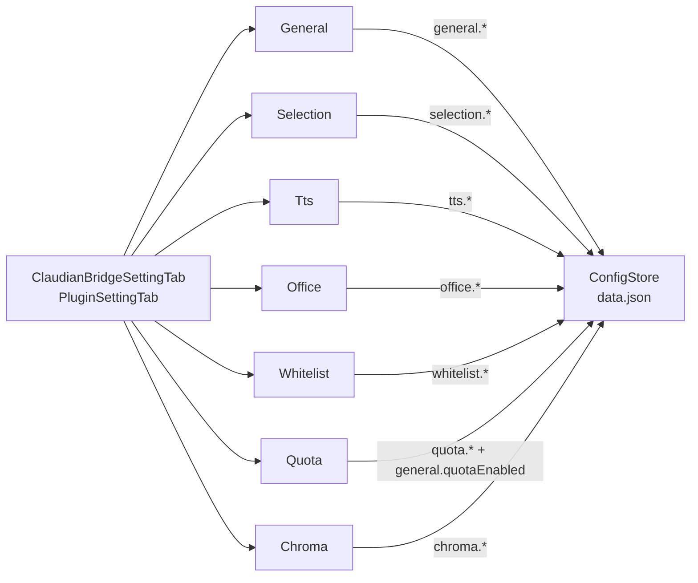

> 📂 パス: `80_POC_Projects/POC_017_ClaudianBridge/02_設計文書/05_設定画面設計.md`
> 📍 SSOT: `D:\AI-Agent\ClaudianBridge`（実コード version 0.8.0）

# 🖥️ 設定画面設計

### 📖 設定画面って何？

**設定画面** は「プラグインの好みを調整するコントロールパネル」です。スマホの設定アプリをイメージしてください。本プラグインでは **7 つのタブ**（見出し付きのページ）に分かれていて、機能ごとに設定を変更できます。

| タブ名 | 何を設定するか |
|--------|--------------|
| General | プラグイン全体の ON/OFF |
| Selection | テキスト選択時の動作 |
| TTS | 読み上げの声とエンジン |
| Office | ファイル変換の設定 |
| Whitelist | 表示するファイル種類 |
| Quota | AI 使用量の確認設定 |
| Chroma | データベースブラウザ |

---

## 📑 概要

Claudian Bridge プラグイン（manifest version `0.8.0`）の設定画面は、`PluginSettingTab` を継承した `ClaudianBridgeSettingTab` を中心に、**7 つのサブタブ**で構成される。各サブタブは `src/settings/` 配下の関数（または `src/features/chroma/settings/`）として実装され、`display()` 内で必要に応じて `containerEl.empty()` → 再描画されるリアクティブ UI パターンである。

実装エントリ:

```typescript
// src/settings/ClaudianBridgeSettingTab.ts
const TABS: TabDef[] = [
  { id: 'general',    labelKey: 'tabGeneral',    render: renderGeneralTab    },
  { id: 'selection',  labelKey: 'tabSelection',  render: renderSelectionTab  },
  { id: 'tts',        labelKey: 'tabTts',        render: renderTtsTab        },
  { id: 'office',     labelKey: 'tabOffice',     render: renderOfficeTab     },
  { id: 'whitelist',  labelKey: 'tabWhitelist',  render: renderWhitelistTab  },
  { id: 'quota',      labelKey: 'tabQuota',      render: renderQuotaTab      },
  { id: 'chroma',     labelKey: 'tabChroma',     render: renderChromaTab     },
];
```

各 `renderXxxTab` は描画クロージャ `draw` を内部に持ち、`store.save()` 後またはエラー時に必ず `draw()` を呼んで UI を再描画する。これによりマルチフィールドの整合性が常に保証される。

---

## 🗂️ タブ一覧

| # | ID | ラベルキー | 実装ファイル | 主要 UI コンポーネント |
|---|----|------------|--------------|------------------------|
| 1 | general | `tabGeneral` | `src/settings/SettingTabGeneral.ts` | トグル + 移行状態リスト + リセットボタン |
| 2 | selection | `tabSelection` | `src/settings/SettingTabSelection.ts` | 機能トグル + フォルダ右クリック + delay + オブジェクトメニューセクション |
| 3 | tts | `tabTts` | `src/settings/SettingTabTts.ts` | エンジン切替 + 言語別 voice dropdown / Plachta プリセット |
| 4 | office | `tabOffice` | `src/settings/SettingTabOffice.ts` | Python 設定 + 拡張子 CSV + 衝突ポリシー + frontmatter |
| 5 | whitelist | `tabWhitelist` | `src/settings/SettingTabWhitelist.ts` | 拡張子タグエディタ + プリセットグリッド + リセット |
| 6 | quota | `tabQuota` | `src/settings/SettingTabQuota.ts` | API キー + 接続テスト + Claude 設定パス |
| 7 | chroma | `tabChroma` | `src/features/chroma/settings/ChromaSettingsTab.ts` | master toggle + Python/script/embedding + 接続テスト |



---

## 🛠️ General タブ

📍 実装: `src/settings/SettingTabGeneral.ts`

| コントロール | 種類 | 対象 settings フィールド | 説明 |
|--------------|------|---------------------------|------|
| バージョン行 | 表示専用 | `manifest.version` | `Claudian Bridge v0.8.0` を表示。`PLUGIN_VERSION` (= `src/manifest.json` の `version`) を使用 |
| プラグイン有効化 | トグル | `general.enabled` | OFF 時は **プラグイン全体を `app.plugins.disablePlugin(pluginId)` で停止**。ON 時は `enablePlugin(...)` で起動。即時反映 |
| 移行状態（h3） | 表示専用 | `general.migratedFrom.{claudianSelectionBridge, vaultOfficeBridge, extensionWhitelist, chromaInspector}` | 各レガシープラグインの移行済み/未移行をリスト表示 |
| 移行リセット | ボタン（warning） | `general.migratedAvailable` 条件下のみ | `resetMigration()` を呼び出して再取り込み可能にする |

### 主要コード抜粋

```typescript
new Setting(containerEl)
  .setName(s.generalEnabled)
  .addToggle((t) => t.setValue(cfg.general.enabled).onChange(async (v) => {
    const plugins = (app as any).plugins;
    if (v) await plugins?.enablePlugin?.(pluginId);
    else    await plugins?.disablePlugin?.(pluginId);
  }));
```

---

## 🖱️ Selection タブ

📍 実装: `src/settings/SettingTabSelection.ts`

| コントロール | 種類 | 対象 settings フィールド |
|--------------|------|---------------------------|
| 機能有効化 | トグル | `selection.enabled` |
| フォルダ右クリック | トグル | `selection.folderEnabled` |
| delayMs | テキスト（数値 0 以上） | `selection.delayMs` |
| オブジェクトメニュー有効化 | トグル | `selection.objectMenuEnabled` |
| **部品種別 (h4)** | — | — |
| type: button トグル | トグル | `selection.objectMenuTypeFlags.button` |
| type: input トグル | トグル | `selection.objectMenuTypeFlags.input` |
| type: link トグル | トグル | `selection.objectMenuTypeFlags.link` |
| type: element トグル | トグル | `selection.objectMenuTypeFlags.element` |
| **配置場所 (h4)** | — | — |
| context: ribbon | トグル | `selection.objectMenuContextFlags.ribbon` |
| context: sidebar | トグル | `selection.objectMenuContextFlags.sidebar` |
| context: modal | トグル | `selection.objectMenuContextFlags.modal` |
| context: settings | トグル | `selection.objectMenuContextFlags.settings` |
| context: menu | トグル | `selection.objectMenuContextFlags.menu` |
| context: workspace | トグル | `selection.objectMenuContextFlags.workspace` |
| exclude selector | テキスト + 追加ボタン | `selection.objectMenuExcludeSelectors: string[]` |
| exclude tag editor | タグ表示 + ✕ 削除 | 同上（既存エントリ） |

### 除外セレクタのデフォルト

```typescript
DEFAULT_OBJECT_EXCLUDE_SELECTORS = [
  '.cb-popup', '.claudian-popup', '.menu', '.suggestion-container'
]
```

### type/context フラグの意味

| 軸 | 値 | 効果 |
|----|----|------|
| type | `{ button, input, link, element }` | クリックされた DOM 要素の種類に対するメニュー表示可否 |
| context | `{ ribbon, sidebar, modal, settings, menu, workspace }` | どのコンテキストでメニューを起動するか |

---

## 🔊 TTS タブ

📍 実装: `src/settings/SettingTabTts.ts`

| コントロール | 種類 | 対象 settings フィールド | エンジン依存 |
|--------------|------|---------------------------|--------------|
| TTS 有効化 | トグル | `tts.enabled` | 共通 |
| エンジン選択 | ドロップダウン | `tts.engine` (`edge` / `webspeech` / `plachta`) | 共通 |
| zh 音声 | ドロップダウン | `tts.voices[engine].zh` | `edge` / `webspeech` |
| ja 音声 | ドロップダウン | `tts.voices[engine].ja` | `edge` / `webspeech` |
| en 音声 | ドロップダウン | `tts.voices[engine].en` | `edge` / `webspeech` |
| テストボタン ×3 | ボタン | — | `edge` / `webspeech` |
| Plachta プリセット | ドロップダウン（9 種） | `tts.plachta.{speaker, language}` | `plachta` |
| Plachta speaker | テキスト | `tts.plachta.speaker` | `plachta` |
| Plachta language | ドロップダウン（4 種） | `tts.plachta.language` | `plachta` |
| Plachta speed | スライダー（0.5–2.0） | `tts.plachta.speed` | `plachta` |
| Plachta テスト | ボタン ▶ | — | `plachta` |
| 削除注意文 | 表示専用 | — | 共通（旧 `minimax` 削除案内） |
| AI読み上げボタン | トグル | `tts.inputAi.enabled`（既定 true） | 共通（v0.16.0）。OFF で ClaudianChat 入力ツールバーの ✨ ボタンを非表示化 |

### Edge 音声プリセット

| 言語 | 候補 |
|------|------|
| zh | `xiaoxiao`, `yunxi`, `yunyang`, `yunjian`, `xiaoyi`, `yunxia` |
| ja | `nanami`, `keita` |
| en | `aria`, `guy`, `jenny` |

### v0.8.0 変更点（旧 minimax → Plachta）

旧 spawn ベース ローカル VITS は完全削除され、**Plachta Cloud TTS** に置換。`engine === 'plachta'` の時のみプリセット UI が表示される。プリセット・speaker・language のいずれを変更しても即時 `store.save()` され、`draw()` で UI が再描画される。

---

## 📄 Office タブ

📍 実装: `src/settings/SettingTabOffice.ts`

| コントロール | 種類 | 対象 settings フィールド |
|--------------|------|---------------------------|
| Office 有効化 | トグル | `office.enabled` |
| Python パス | テキスト | `office.pythonPath` |
| 有効拡張子 | テキスト（CSV） | `office.enabledExtensions: string[]` |
| 衝突ポリシー | ドロップダウン | `office.conflictPolicy` (`overwrite` / `skip` / `timestamp`) |
| Frontmatter template | テキストエリア | `office.frontmatterTemplate` |
| 出力ディレクトリ上書き | テキスト | `office.outputDirOverride` |
| プログレスモーダル表示 | トグル | `office.showProgressModal` |

### デフォルト値（`DEFAULT_OFFICE_SETTINGS`）

```typescript
enabled: true,
pythonPath: process.platform === 'win32' ? 'py' : 'python3',
enabledExtensions: ['docx', 'xlsx', 'pptx', 'pdf', 'html', 'htm', 'csv'],
conflictPolicy: 'overwrite',
showProgressModal: true,
markitdownArgs: '',
outputDirOverride: '',
```

### Frontmatter テンプレート挿入変数

| 変数 | 意味 |
|------|------|
| `{{title}}` | 元のファイル名 |
| `{{date}}` | 実行日時 |
| `{{ext}}` | 元拡張子 |
| `{{sourcePath}}` | 元ファイルの絶対パス |

---

## 📂 Whitelist タブ

📍 実装: `src/settings/SettingTabWhitelist.ts`

| コントロール | 種類 | 対象 settings フィールド |
|--------------|------|---------------------------|
| Whitelist 有効化 | トグル | `whitelist.enabled` |
| 拡張子追加 (h3) | テキスト + 追加ボタン | — |
| 拡張子タグエディタ | タグ（`.ext`）+ ✕ | `whitelist.extensions: string[]` |
| プリセット (h3) | グリッドボタン ×5 | —（適用先: `whitelist.extensions`） |
| フォルダ常時表示 | トグル | `whitelist.alwaysShowFolders` |
| リセット | ボタン（warning） | `whitelist.*` → `DEFAULT_WHITELIST_SETTINGS` |

### プリセット一覧（`WHITELIST_PRESETS`）

| プリセット名 | 拡張子集合 |
|--------------|------------|
| 📄 Obsidian標準 | `['md', 'canvas']` |
| 📊 Office | `['doc', 'docx', 'xls', 'xlsx', 'ppt', 'pptx']` |
| 🖼️ 画像 | `['png', 'jpg', 'jpeg', 'gif', 'svg', 'webp', 'bmp']` |
| 💻 コード | `['js', 'ts', 'py', 'json', 'yaml', 'xml', 'css', 'html', 'sh']` |
| 📦 ALL | `['*']`（フィルター解除） |

プリセット `*` の場合は既存リストを空配列に、それ以外は和集合（重複排除 + ソート）で追加される。

### デフォルト値

```typescript
DEFAULT_WHITELIST_SETTINGS = {
  enabled: true,
  extensions: ['md','canvas','pdf','png','doc','docx','xls','xlsx','ppt','pptx'],
  alwaysShowFolders: true,
}
```

---

## 📊 Quota タブ

📍 実装: `src/settings/SettingTabQuota.ts`

| コントロール | 種類 | 対象 settings フィールド |
|--------------|------|---------------------------|
| Quota 有効化 | トグル | `general.quotaEnabled` |
| 表示モデル (h3): Claude | トグル | `quota.displayModels.claude` |
| 表示モデル: DeepSeek | トグル | `quota.displayModels.deepseek` |
| 表示モデル: Kimi | トグル | `quota.displayModels.kimi` |
| 表示モデル: MiniMax | トグル | `quota.displayModels.minimax` |
| データ収集周期 | テキスト（数値、clamp 10–600） | `general.quotaRefreshSec` |
| 表示切替周期 | テキスト（数値、clamp 5–600） | `general.quotaSwitchSec` |
| Claude settings path | テキスト | `quota.claudeSettingsPath` |
| 現在の LLM (h3) | 表示専用 | `readLlmInfoFromSettings(path)` の結果 |
| DeepSeek API キー | テキスト（password） | `quota.deepseekApiKey` |
| Kimi API キー | テキスト（password） | `quota.kimiApiKey` |
| MiniMax API キー | テキスト（password） | `quota.minimaxApiKey` |
| 接続テストボタン ×3 | ボタン | — |

### 接続テスト動作

1. 該当 API キーを読み出し → プロバイダ生成（`createDeepSeekProvider / createKimiProvider / createMiniMaxProvider`）
2. `testProviderConnection(provider)` を呼び出す（使用率 / 残金を取得）
3. 結果に応じて `safe(緑) / caution(黄) / danger(赤) / unknown(灰)` のクラスとラベルを適用
4. `DeepSeek` は残金ベース（100=安全、50 以下=危険）、それ以外は使用率 %（90+=danger、70+=caution）

### `quotaEnabled` トグル時の副作用

| 状態 | 副作用 |
|------|--------|
| OFF | `handle.service.stop()` + `handle.view.unmount()` |
| ON | `registerClaudeQuota(app, store)` を呼び出して開始 |

---

## 🧠 Chroma タブ

📍 実装: `src/features/chroma/settings/ChromaSettingsTab.ts`

**master toggle OFF の場合、サブ UI はすべて disable される**（注意文のみ表示）。

| コントロール | 種類 | 対象 settings フィールド |
|--------------|------|---------------------------|
| Chroma 有効化（master） | トグル | `chroma.enabled` |
| chromaPath | テキスト | `chroma.chromaPath` |
| pythonPath | テキスト | `chroma.pythonPath` |
| scriptPath 上書き | テキスト（空なら vault root から `_chroma_inspect.py`） | `chroma.scriptPath` |
| embeddingModel | テキスト | `chroma.embeddingModel` |
| defaultNResults | テキスト（数値、clamp） | `chroma.defaultNResults` |
| recordPreviewLength | テキスト（数値、clamp） | `chroma.recordPreviewLength` |
| showProgressModal | トグル | `chroma.showProgressModal` |
| enableRawSql | トグル | `chroma.enableRawSql` |
| 解決パス表示 | 表示専用 | `resolveChromaPath / resolveScriptPath` の結果 |
| Test Connection | ボタン | — |

### テスト接続の動作

```typescript
const result = await ChromaService.listCollections({ settings: latest.chroma, vaultRoot });
new Notice(s.chromaTestOk.replace('{n}', String(result.collections.length)));
```

失敗時は `[chroma-inspector] <message>` を 8 秒 Notice で表示する。

### clamp の値域（`src/features/chroma/defaults.ts`）

| フィールド | min | max | 既定 |
|-----------|-----|-----|------|
| `defaultNResults` | `MIN_QUERY_RESULTS` | `MAX_QUERY_RESULTS` | 5 |
| `recordPreviewLength` | `MIN_PREVIEW_LENGTH` | `MAX_PREVIEW_LENGTH` | 240 |

---

## 🔄 保存・再描画の共通パターン

すべてのタブ実装は以下のパターンを共有している:

```typescript
const draw = (): void => {
  containerEl.empty();
  const cfg = store.load();
  // ... Setting を追加 ...
};
draw();
```

| 操作 | 挙動 |
|------|------|
| 値変更 | `store.save({ ...latest, [section]: ... })` → `new Notice(s.noticeSaved)` |
| エラー | `new Notice(s.noticeSaveFailed.replace('{msg}', msg))` → `draw()` で再描画 |
| 依存値変更（engine, enableRawSql 等） | `draw()` を呼んで後続 UI を再構築 |
| general.enabled | 保存後 `enablePlugin` / `disablePlugin` を起動 |

i18n は `getLocaleStrings(getUILanguage())` で三言語（ja / zh / en）のラベルを取得する。

---

## 📝 更新履歴

| バージョン | 日付 | 修正内容 | 修正人 |
|------|------|---------|--------|
| v1.0.0 | 2026-08-10 | 初版（5 タブ） | MiuMiu 🐾 |
| v2.0.0 | 2026-08-13 | 全面書き直し: 7 タブ構成（General / Selection / TTS / Office / Whitelist / Quota / Chroma）に再編し、`core/settings.ts` と `src/settings/*` の実コードに対応 | MiuMiu 🐾 |
| v2.1.0 | 2026-08-16 | v0.16.0 同期（TTS タブに「AI読み上げボタン」トグル追記） | MiuMiu 🐾 |

---

*🖥️ 設定画面設計 v2.1.0 · Claudian Bridge 0.16.0 · MiuMiu 🐾*
