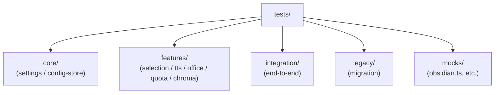
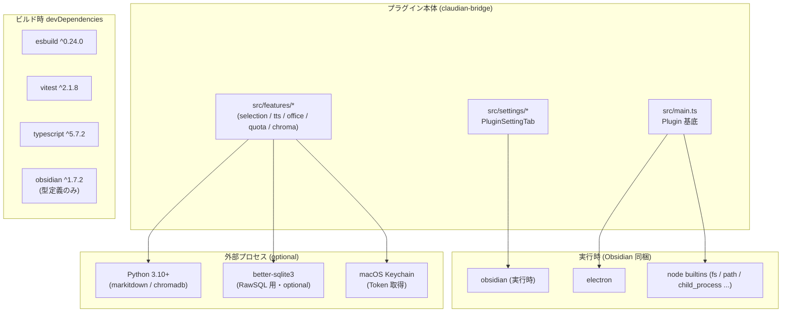

> 📂 パス: `80_POC_Projects/POC_017_ClaudianBridge/02_設計文書/06_技術選定.md`
> 📍 SSOT: `D:\AI-Agent\ClaudianBridge`（実コード version 0.8.0）
> 🎯 用途: Claudian Bridge Obsidian プラグインの実装で採用された技術スタックの選定根拠

# 🛠️ 技術選定

> **関連プロジェクト**: [[../README|フェーズインデックス]] | [[00_アーキテクチャ総覧|アーキテクチャ総覧]]

---

### 📖 技術選定って何？

**技術選定** は「どの道具・材料を使って作るかを決める」ことです。家を建てるときに「木にするか・コンクリートにするか」を決めるのと同じように、ソフトウェアでも「どの言語・どのツールを使うか」を先に決めます。

選ぶときの重要な考え方は「**トレードオフ**」です。これは「何かを得るために何かを捨てる」という意味で、例えば「使いやすさ」と「動作速度」は両立しにくいことがあります。本書では、なぜこの技術を選んだのかの理由（選定根拠）をまとめています。

---

## 📋 選定原則

| # | 原則 | 説明 |
|---|------|------|
| 1 | **SSOT 整合** | 実コード（`package.json` / `esbuild.config.mjs` / `vitest.config.ts` / `tsconfig.json`）を唯一の真実とする |
| 2 | **依存最小化** | Obsidian プラグインは `dependencies` を持たず（npm 公開しない）、`devDependencies` のみで完結 |
| 3 | **外部プロセス隔離** | Python / SQLite 等は optional 依存として遅延 import。プラグイン本体は pure JS |
| 4 | **クロスプラットフォーム** | Windows / macOS / Linux で同一ソース・同一バイナリ（`isDesktopOnly: true`） |
| 5 | **保守性** | TypeScript strict モード + 単体テスト + 統合テスト |

> 💡 **高校生向け補足**: 原則 2「依存最小化」は「使う道具を最小限に」という意味。道具（ライブラリ）が多いほど動作が重くなり、壊れやすくなるからです。

---

## 📦 package.json の依存関係（SSOT）

📍 `D:\AI-Agent\ClaudianBridge\package.json`

| 区分 | 名前 | バージョン | 役割 |
|------|------|------------|------|
| meta | `name` | `claudian-bridge` | プラグイン ID（manifest.json と一致） |
| meta | `version` | `0.8.0` | プラグインバージョン |
| meta | `main` | `main.js` | esbuild 出力ファイル |
| script | `build` | `node esbuild.config.mjs production` | プロダクションビルド（minify 有効） |
| script | `dev` | `node esbuild.config.mjs` | 開発ビルド（minify 無効） |
| script | `test` | `vitest run` | 単体テスト実行 |
| script | `deploy` | `node scripts/deploy.mjs` | Vault へのデプロイ |
| script | `typecheck` | `tsc -noEmit` | 型チェックのみ |

### devDependencies（公式パッケージ）

| パッケージ | バージョン | 役割 |
|------------|------------|------|
| `@types/node` | `^22.10.0` | Node.js 型定義（Electron / テスト用） |
| `@vitest/coverage-v8` | `^2.1.9` | vitest の V8 カバレッジ計測 |
| `builtin-modules` | `^4.0.0` | Node 内蔵モジュール一覧を `esbuild` の `external` に渡すため |
| `esbuild` | `^0.24.0` | バンドラ（外部依存ゼロで高速） |
| `jsdom` | `^30.0.1` | DOM 環境（Vitest 用） |
| `obsidian` | `^1.7.2` | Obsidian API 型定義（実行時はホストが提供） |
| `tslib` | `^2.8.1` | TypeScript ヘルパー（`importHelpers: true` 用） |
| `typescript` | `^5.7.2` | 型システム |
| `vitest` | `^2.1.8` | テストランナー |

### optionalDependencies

| パッケージ | 役割 |
|------------|------|
| `better-sqlite3` | chroma RawSQL のネイティブ SQLite ドライバ（lazy import） |

> ⚠️ `dependencies` セクションは存在しない（プラグインは npm publish しない ＋ 実行時は Obsidian ホストが `obsidian` を提供）。

### バージョン選定理由

| パッケージ | 選定理由 |
|------------|----------|
| **esbuild** | Rollup/webpack 比で 50〜100× 高速、`external: ['obsidian', 'electron', ...builtins]` の宣言的 external がプラグイン開発に最適 |
| **vitest** | Jest 互換 API + ESM ネイティブ + jsdom 統合で、Obsidian プラグインの `PluginSettingTab` / DOM テストが容易 |
| **obsidian 1.7.2** | `ItemView` / `requestUrl` / `PluginSettingTab.addSlider` 等の最新 API が必要な v0.5.0+ の機能に対応 |
| **TypeScript 5.7** | `satisfies` / `const type parameter` 等で型推論を強化 |

---

## ⚡ esbuild ビルド構成（SSOT）

📍 `D:\AI-Agent\ClaudianBridge\esbuild.config.mjs`

```javascript
import esbuild from 'esbuild';
import process from 'process';
import builtins from 'builtin-modules';

const prod = process.argv[2] === 'production';

const ctx = await esbuild.context({
  entryPoints: ['src/main.ts'],
  bundle: true,
  external: ['obsidian', 'electron', ...builtins],
  format: 'cjs',
  target: 'es2022',
  sourcemap: 'inline',
  treeShaking: true,
  minify: prod,
  logLevel: 'info',
  outfile: 'main.js',
});

await ctx.rebuild();
process.exit(0);
```

### ビルド構成のキー選定

| キー | 値 | 選定理由 |
|------|----|---------|
| `format` | `cjs` | Obsidian プラグインは CJS 前提（require / module.exports） |
| `target` | `es2022` | minAppVersion 1.7.2 の Electron Chromium が ES2022 完全対応 |
| `sourcemap` | `inline` | 本番でもソース位置特定可（最小サイズ影響は受容） |
| `treeShaking` | `true` | 未使用 export の自動削除 |
| `minify` | production 時のみ `true` | dev はシンボル保持でデバッグ可 |
| `external` | `['obsidian','electron',...Node builtins]` | ホスト提供モジュールを bundle から除外 |
| `outfile` | `main.js` | Obsidian プラグイン規約（`manifest.json` 同階層） |

### external 配列の意味

| 要素 | バンドルから除外する理由 |
|------|---------------------------|
| `obsidian` | ホストである Obsidian が実行時提供（型定義のみのパッケージ） |
| `electron` | Obsidian デスクトップ版に同梱（Chromium 経由） |
| `...builtins` | Node.js コアモジュール（`fs` / `path` / `child_process` 等） |

---

## 🧪 Vitest テスト構成（SSOT）

📍 `D:\AI-Agent\ClaudianBridge\vitest.config.ts`

```typescript
import { defineConfig } from 'vitest/config';
import { fileURLToPath } from 'url';

export default defineConfig({
  test: {
    include: ['tests/**/*.test.ts'],
    environment: 'node',  // jsdom ではない（DOM 部分は別途モック）
  },
  resolve: {
    alias: {
      obsidian: fileURLToPath(new URL('./tests/mocks/obsidian.ts', import.meta.url)),
    },
  },
});
```

| キー | 値 | 選定理由 |
|------|----|---------|
| `test.environment` | `node` | 設定保存・サブプロセス起動など Node API 直叩き中心のため（DOM はモックで十分） |
| `test.include` | `tests/**/*.test.ts` | テストファイルを `tests/` 配下に限定（`src/` と並列） |
| `resolve.alias.obsidian` | `./tests/mocks/obsidian.ts` | `obsidian` パッケージは `"main": ""` のため Node で解決不能 → テスト専用モックへ |

> 📝 ユーザー指定メモ: 旧版では `environment: 'jsdom'` と記載していたが、実コード（`vitest.config.ts`）は `'node'` が正しい。**実コードを SSOT として `'node'` を採用**。

### テストディレクトリ構造



---

## 🏗️ TypeScript 構成（SSOT）

📍 `D:\AI-Agent\ClaudianBridge\tsconfig.json`

| キー | 値 | 効果 |
|------|----|------|
| `target` | `ES2022` | esbuild 出力と一致 |
| `module` | `ESNext` | esbuild が `cjs` へ変換 |
| `moduleResolution` | `node` | 古典 Node 解決 |
| `strict` | `true` | 暗黙 any 禁止・strict null checks 等 |
| `noImplicitAny` | `true` | any 型を明示せず使用禁止 |
| `isolatedModules` | `true` | esbuild の単ファイル transpile 対応（各ファイル単独で型完結） |
| `importHelpers` | `true` | `tslib` 経由のヘルパー関数 |
| `inlineSourceMap` | `true` | esbuild の inline source map と整合 |
| `inlineSources` | `true` | 同上 |
| `skipLibCheck` | `true` | 型定義ライブラリはチェック対象外（速度向上） |
| `lib` | `["DOM", "ES2022"]` | Obsidian の DOM API + ES2022 |
| `allowJs` | `true` | .mjs / .js の混在を許容（`esbuild.config.mjs` 等） |
| `resolveJsonModule` | `true` | `src/manifest.json` の import 対応 |
| `esModuleInterop` | `true` | CJS / ESM 相互運用 |
| `include` | `["src/**/*.ts"]` | src のみ型チェック |
| `exclude` | `["tests/**/*", "node_modules"]` | テストは `vitest` 側で実行 |

---

## 🚀 デプロイスクリプト（SSOT）

📍 `D:\AI-Agent\ClaudianBridge\scripts\deploy.mjs`

```javascript
import { copyFileSync, mkdirSync } from 'fs';
import { join } from 'path';

const dest = join('Z:', 'Obsidian Vault', '.obsidian', 'plugins', 'claudian-bridge');

mkdirSync(dest, { recursive: true });
const files = [
  { src: 'main.js',              dst: 'main.js' },
  { src: 'src/manifest.json',    dst: 'manifest.json' },
  { src: 'styles.css',           dst: 'styles.css' },
];
for (const { src, dst } of files) {
  copyFileSync(join(process.cwd(), src), join(dest, dst));
}
```

| 採用理由 | 却下案 |
|---------|--------|
| 単純な `cp` ベース・git 不要・検証済み | `obsidian-cli / hot-reload` 系ツールは依存追加で動作不安定 |

---

## 🔌 Obsidian API 利用範囲

📍 利用箇所は `src/main.ts` および全 `src/settings/*.ts`

| API | 用途 | 利用ファイル例 |
|-----|------|---------------|
| `Plugin` | プラグイン基底クラス・`onload` / `onunload` | `src/main.ts` |
| `ItemView` | 独自ビュー（chroma Database Browser、quota 表示） | `src/features/chroma/views/DatabaseBrowserView.ts`, `src/features/quota/view.ts` |
| `Modal` | 進捗 / 詳細表示 | `src/features/office/progress-modal.ts` 等 |
| `PluginSettingTab` | 設定画面基底 | `src/settings/ClaudianBridgeSettingTab.ts` |
| `Setting.addToggle / Text / Dropdown / Slider / Button / TextArea` | 設定 UI 構築 | 全 `src/settings/*.ts` |
| `app.workspace.on('file-menu', ...)` / `'obsidian://url'` | コンテキストメニュー | `src/features/selection/watcher.ts` |
| `app.vault.adapter.getBasePath()` | vault ルート解決 | `src/main.ts`（`__dirname` 不使用） |
| `requestUrl` | メインプロセス経由 HTTP（CORS 回避） | `src/features/quota/http.ts` |
| `Notice` | ユーザ通知 | 全 `*.ts` |
| `Platform.isMobile` | モバイル判定（mobile は desktop-only プラグインなので条件分岐） | `src/features/quota/core.ts` |

---

## 🐍 Python 外部連携

📍 利用: Office → Markdown 変換（`src/features/office/`）および Chroma データベース操作（`src/features/chroma/`）

| 観点 | 採用 | 却下案 | 理由 |
|------|------|--------|------|
| 実行環境 | **spawn 直接実行（`shell:false`）** | HTTP サーバー常駐 | プラグイン停止時のリソース漏れ防止・プロセス寿命管理が単純 |
| 引数受け渡し | **argv 配列** | 環境変数 | コマンドインジェクション余地ゼロ |
| タイムアウト | **明示的 `child.kill()`（既定 60s）** | 無制限 | ハングした子プロセスで UI ブロック回避 |
| Python バージョン | **Python 3.10+ 推奨**（既定 runtime: `py` on win / `python3` else） | Python 2 系 | markitdown / chromadb が 3.10+ 必須 |
| 必須 Python パッケージ | **markitdown**（Office 系）／**chromadb**（Chroma 系） | — | 機能提供元の標準パッケージ |
| エンコーディング | **`PYTHONIOENCODING=utf-8` 明示指定** | デフォルト | Windows で `cp1252` による絵文字・CJK 文字化け防止 |
| 出力 JSON 解析 | **`parseJsonOutput<T>()` で安全 parse** | `JSON.parse(stdout)` 直叩き | 構文壊れた子プロセス出力で UI クラッシュ防止 |

### spawn 実装の主要パラメータ（`chroma-runner.ts`）

| パラメータ | 値 | 意味 |
|-----------|-----|------|
| `shell` | `false` | シェル解釈を行わず argv 配列をそのまま実行 |
| `windowsHide` | `true` | Windows で cmd ウィンドウを非表示 |
| `env` | `{ ...process.env, PYTHONIOENCODING: 'utf-8' }` | 既存環境変数を維持＋エンコーディング指定 |
| `cwd` | vault root | スクリプトパスを vault 相対で解決可能に |

---

## 📊 外部依存まとめ



---

## 📂 完全技術スタック

| レイヤ | 採用技術 |
|--------|---------|
| 言語 | **TypeScript 5.7.2** |
| ホスト | **Obsidian 1.7.2+** (`isDesktopOnly: true`) |
| モジュール形式 | **CJS** (`main.js`) |
| バンドラ | **esbuild 0.24.0** |
| テストランナー | **vitest 2.1.8** |
| テスト環境 | **Node**（DOM はモック） |
| 設定永続化 | **JSON**（`data.json` + atomic rename） |
| 設定ウォッチ | **fs.watch + mtime polling fallback** |
| HTTP | **Obsidian `requestUrl`** → fetch フォールバック |
| 暗号化領域 | **macOS Keychain 優先 → ファイル fallback** |
| 外部プロセス | **`child_process.spawn` (shell:false)** |
| SQL | **better-sqlite3 readonly** (optional) |
| UI | **`PluginSettingTab.addToggle` 等 + DOM (`<div>`)** |
| デプロイ | **`scripts/deploy.mjs` による `cp` ベース** |

---

## 🔗 関連ドキュメント

- [[00_アーキテクチャ総覧]]
- [[01_クラス設計]]
- [[07_処理方式比較]] — 採用 / 却下案の比較マトリクス
- [[../03_開発文書/01_環境設定]]

---

## 📝 更新履歴

| バージョン | 日付 | 修正内容 | 修正者 |
|------|------|---------|--------|
| v2.0.0 | 2026-06-13 | 初版（旧 Web アプリ想定） | MiuMiu 🐾 |
| v4.0.0 | 2026-08-13 | 全面書き直し: Claudian Bridge プラグインの実コード（`package.json`, `esbuild.config.mjs`, `vitest.config.ts`, `tsconfig.json`, `scripts/deploy.mjs`, `src/main.ts`）を SSOT として全面書き換え。Web アプリ版の古いスタックを破棄 | MiuMiu 🐾 |

---

*🛠️ 技術選定 v4.0.0 · Claudian Bridge 0.8.0 · MiuMiu 🐾*
