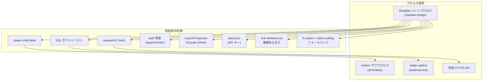
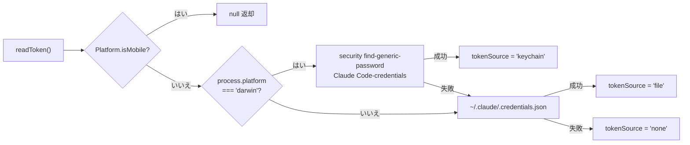
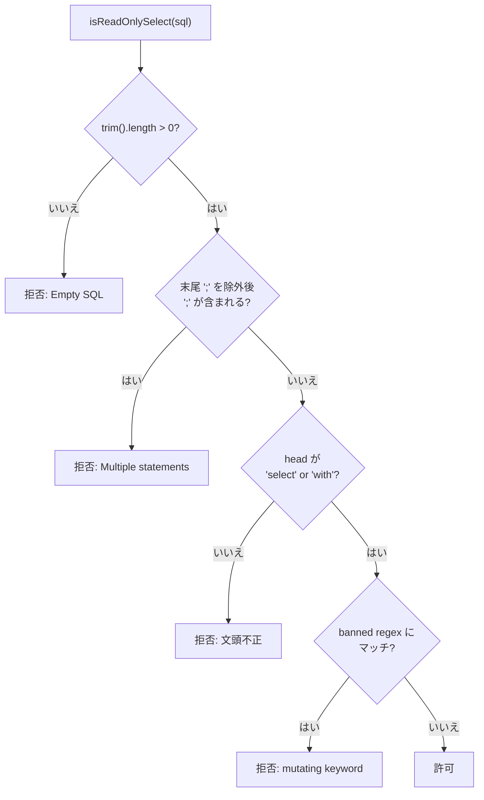
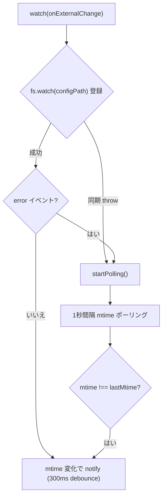

> 📂 **パス**: `80_POC_Projects/POC_017_ClaudianBridge/02_設計文書/08_セキュリティ設計.md`
> 📍 **ソース**: `D:\AI-Agent\ClaudianBridge\src` (manifest version 0.8.0)
> 🎯 **目的**: claudian-bridge プラグインの実装に基づく脅威モデルと防御策の SSOT

---

## 📐 概要

claudian-bridge は Obsidian クライアントプラグインであり、外部 HTTP API / Python CLI / ローカル SQLite と連携する。本書では実コード（manifest v0.8.0）に基づき、各境界で実装済みの防御策を SSOT 化する。旧版（v3.5.0）はモバイルアプリ想定の OWASP MASVS 流用だったが、本書では Obsidian プラグインの実脅威（spawn インジェクション、パストラバーサル、Raw SQL、外部 API キー管理）に最適化する。

> 📖 **セキュリティ設計って何？**
> **セキュリティ設計** は「悪者からデータを守るための鍵とカギの設計」です。家の鍵を「玄関・窓・裏口」すべてに付けるように、ソフトウェアでも「外部と接続する場所ごと」に防御策を用意します。
> 本書では特に 4 つの脅威を守っています：
> - **コマンドインジェクション**: 悪意のある命令を実行されないようにする
> - **パストラバーサル**: 勝手に別フォルダのファイルを読み書きされないようにする
> - **Raw SQL**: データベースを勝手に改ざんされないようにする
> - **API キー管理**: 秘密の鍵（パスワード）を安全に保管する

---

## 🛡️ セキュリティアーキテクチャ図



---

## 🔐 1. 認証情報（API キー / OAuth トークン）の保管

### 1.1 保存場所と優先順位

| 認証情報種別 | 保存場所 | 優先順位 |
|-------------|----------|----------|
| **Claude OAuth Access Token** | macOS Keychain → `~/.claude/.credentials.json` → null | Keychain > File > none |
| **DeepSeek / Kimi / MiniMax API キー** | `data.json`（`~/.obsidian/plugins/claudian-bridge/data.json`）→ 環境変数 | settings > env |
| **汎用フォールバック** | `process.env.KIMI_API_KEY` 等 | 環境変数 |

**実装ソース**: `src/features/quota/core.ts:ClaudeQuotaService.readToken`, `src/features/quota/service.ts:resolveApiKey`



### 1.2 設定 > 環境変数のフォールバック

`MultiQuotaService` 構築時に settings のキーを優先し、未設定なら環境変数へ:

```typescript
createDeepSeekProvider(() => resolveApiKey(cfg.quota?.deepseekApiKey, getEnv, ['DEEPSEEK_API_KEY']))
createKimiProvider(() => resolveApiKey(cfg.quota?.kimiApiKey, getEnv, ['KIMI_CODING_API_KEY', 'KIMI_API_KEY']))
createMiniMaxProvider(() => resolveApiKey(cfg.quota?.minimaxApiKey, getEnv, ['MINIMAX_CN_API_KEY', 'MINIMAX_API_KEY']))
```

API キー未設定時は `isConfigured() === false` でコンストラクタ時に除外（フェッチしない）。

---

## 🚫 2. spawn の安全化（コマンドインジェクション対策）

### 2.1 全 spawn 呼び出しで `shell:false` + 引数配列渡し

| ファイル | 関数 | 用途 |
|---------|------|------|
| `src/features/chroma/chroma/chroma-runner.ts` | `runPython` | chroma 検索 Python 起動 |
| `src/features/office/markitdown.ts` | `MarkItDownRunner.run` / `spawnPython` | markitdown 起動 |
| `src/features/office/splitter.ts` | `SplitterRunner.split` | splitter 起動 |
| `src/features/tts/core.ts` | `claudettsHttpSpeak` | claude-tts 起動 |
| `src/features/quota/core.ts` | `ClaudeQuotaService.readFromKeychain` | macOS `security` コマンド |

**実装パターン**:

```typescript
// chroma-runner.ts より
spawn(opts.pythonPath, ["-u", opts.scriptPath, ...opts.args], {
  cwd: opts.cwd,
  env: { ...process.env, ...(opts.env ?? {}), PYTHONIOENCODING: "utf-8" },
  shell: false,        // ★ シェル解釈を経由しない
  windowsHide: true,
});
```

### 2.2 追加のハードニング

| 対策 | ソース | 効果 |
|------|--------|------|
| `windowsHide: true` | chroma-runner.ts, splitter.ts, markitdown.ts | Windows コンソールポップアップ抑止 |
| `PYTHONIOENCODING=utf-8` 注入 | spawn env | Python 出力のエンコーディング不一致防止 |
| `child.kill()` タイムアウト | chroma-runner.ts | 60 秒 / semantic query は 120 秒で打ち切り |
| `ENOENT` 判定 | markitdown.ts, splitter.ts | Python 未配置を `exitCode:127` で明示 |
| `cmdLine` 経由のみ useShell | markitdown.ts:spawnPython | `shell:true` を使う場合も必ず `"${arg}"` でクォート |
| `windowsPythonCandidates` | markitdown.ts | Windows の `Python3*` ディレクトリを降順走査し安全に解決 |

---

## 🛡️ 3. Raw SQL ガード（SQL インジェクション対策）

**ソース**: `src/features/chroma/chroma/RawSqlService.ts:isReadOnlySelect`

### 3.1 多層ガード



### 3.2 拒否条件

| 条件 | 拒否理由 |
|------|----------|
| 空文字列 | `Empty SQL` |
| `;` を末尾以外に含む | `Multiple statements are not allowed` |
| 文頭が `SELECT` / `WITH` 以外 | `Only SELECT (or WITH ... SELECT) is allowed. Got: "..."` |
| いずれかの位置で `\b(insert\|update\|delete\|drop\|alter\|attach\|create\|replace\|vacuum\|pragma)\b` にマッチ | `Statement contains a mutating keyword` |

### 3.3 better-sqlite3 の readonly モード

```typescript
const Database = (await import("better-sqlite3")).default;
const db = new Database(dbFile, { readonly: true, fileMustExist: true });
```

- `readonly: true` — URI モード相当で read-only 接続
- `fileMustExist: true` — 不正なパスを早期に拒否
- `MAX_ROWS = 1000` — UI 応答性を担保するため 1001 行取得で打ち切り
- `better-sqlite3` 未インストール時は明示的エラーメッセージ（ENABLE ガイダンス）

### 3.4 マスタースイッチ

`ChromaSettings.enableRawSql` が **デフォルト false**。UI 側は設定が false のとき Raw SQL 入力欄を描画しない（v0.5.0 で実装）。

---

## 🛣️ 4. パストラバーサル対策

### 4.1 パス修復ヘルパー

**ソース**: `src/features/chroma/util/path.ts`

| 関数 | 役割 |
|------|------|
| `repairImeYen(p)` | 全角円記号 U+00A5 → ASCII バックスラッシュ U+005C（IME 貼付対策） |
| `normalizePath(p)` | `repairImeYen` + `path.normalize` |
| `resolveChromaPath(chromaPath, vaultRoot)` | 空→"" / 絶対→そのまま / 相対→vaultRoot 連結 |
| `resolveScriptPath(scriptPath, vaultRoot)` | scriptPath 未設定時は `<vault>/_chroma_inspect.py` |
| `VaultPath.sanitizeStem(stem)` | 不正文字 `\ / : * ? " < > \|` → `_`、120 文字切り詰め |

**実装**:

```typescript
const IME_YEN = "¥";
export function repairImeYen(p: string): string {
  if (!p) return p;
  return p.split(IME_YEN).join("\\");
}
```

### 4.2 Office 変換のパス処理

**ソース**: `src/features/office/path.ts:VaultPath`

```typescript
static sanitizeStem(stem: string): string {
  const cleaned = stem.replace(/[\\/:*?"<>|]/g, '_');
  if (cleaned.length <= 120) return cleaned;
  return cleaned.slice(0, 120);
}

static outputPath(original: string, suffix = '', ext = 'md'): string {
  const { dir, stem } = VaultPath.splitName(original);
  return path.join(dir, `${stem}${suffix}.${ext}`).replace(/\\/g, '/');
}
```

- 元ファイルと同じディレクトリに `<stem>.md` または `<stem>_split/` を生成
- Obsidian 規約（`/` 区切り）に正規化
- conflict policy は `overwrite` / `skip` / `timestamp` の 3 種

### 4.3 脅威モデル

| 脅威 | 防御 |
|------|------|
| `chromaPath: "../../etc/passwd"` | `path.join(vaultRoot, "../...")` → vault 外参照は許可するが `better-sqlite3` の `fileMustExist` でファイル不在拒否 |
| IME 貼付の全角 `¥` | `repairImeYen` で ASCII 化 |
| 出力ファイル名に `..` | `sanitizeStem` で不正文字を `_` に置換 |
| 100 文字超の stem | 120 文字で切り詰め |

---

## 🌐 5. ネットワーク境界（HTTP）

### 5.1 requestUrl vs fetch の使い分け

**ソース**: `src/features/quota/http.ts`

| 環境 | 採用関数 | 理由 |
|------|----------|------|
| Obsidian メインプロセス | `obsidian.requestUrl` | レンダラの `fetch` は CORS 強制により `api.kimi.com` の OPTIONS プリフライトが 404 を返し失敗する |
| Node / Vitest テスト | `globalThis.fetch` | テスト環境で `obsidian` をモックしないため |
| Plachta TTS | `fetch` | ブラウザ API で wav 取得・Audio 再生（renderer 実行） |

### 5.2 HTTPS 強制

すべての外部 API は HTTPS。クリアテキストフォールバックなし。

### 5.3 認証ヘッダ

| サービス | ヘッダ |
|----------|--------|
| Claude Usage | `Authorization: Bearer <token>` + `anthropic-beta: oauth-2025-04-20` |
| DeepSeek / Kimi / MiniMax | `Authorization: Bearer <api_key>` + `Accept: application/json` |
| Plachta | なし（パブリック HF Space） |

### 5.4 エラー時のフェイルセーフ

| HTTP ステータス | 動作 |
|:----:|------|
| 401 / 403 | `status = 'expired'`（UI で再認証促す） |
| 429 (Claude のみ) | 前回値保持 + `status = 'success'`（rate limit を error にしない） |
| その他 4xx / 5xx | `status = 'error'` + `error: "HTTP {status}"` |
| ネットワーク例外 | `status = 'error'` + exception.message |

---

## 🎨 6. CSS 注入の同一性保証

**ソース**: `src/features/whitelist/injector.ts`

```typescript
const STYLE_ID = 'cb-whitelist-css';

export function installWhitelistCss(css: string): void {
  removeWhitelistCss();       // ★ 既存ノードを削除してから追加
  const el = document.createElement('style');
  el.id = STYLE_ID;
  el.textContent = css;
  document.head.appendChild(el);
}

export function removeWhitelistCss(): void {
  const existing = document.getElementById(STYLE_ID);
  if (existing) existing.remove();
}
```

| 脅威 | 防御 |
|------|------|
| 同一 `<style id="cb-whitelist-css">` が累積し CSS が重複適用 | `removeWhitelistCss()` で先に削除 → 1 ノードに保つ |
| 設定変更時に古い CSS が残る | 設定変更フックで `remove → install` をシーケンシャルに実行 |

---

## 📁 7. ファイル監視（fs.watch の堅牢化）

**ソース**: `src/core/config-store.ts:ConfigStore.watch`



### 7.1 多層防御

| 脅威 | 防御 |
|------|------|
| 自前の書き込みが watcher に再通知され無限ループ | `lastSelfWrite < 500ms` の通知をスキップ |
| 連続した書き込みイベントで過剰発火 | `debounceTimer` で 300ms デバウンス |
| ネットワークドライブ（SMB）で `fs.watch` がエラー | `error` ハンドラで `startPolling` にフォールバック |
| `fs.watch` が同期 throw | `try/catch` で例外を捕まえ `startPolling` にフォールバック |
| `lastSelfWrite` 判定後 500ms 以内の mtime 変化 | ポーリング初回は基準値記録のみで通知しない |

---

## 🔎 8. allowlist パース（誤パース対策）

**ソース**: `src/features/chroma/chroma/FilterBuilder.ts`

| 関数 | 役割 | 安全性 |
|------|------|--------|
| `buildWhere(filter: FilterSpec)` | `metadataEqual` / `metadataIn` / `documentContains` を Chroma の `where` JSON に変換 | `undefined` / `null` / `""` を除外してから clauses に追加 |
| `parseCsv(input)` | カンマ区切り文字列をトリム + 空文字除外で配列化 | 入力が `undefined` でも空配列 |
| `buildWhereJson(filter)` | `--where` CLI 引数用 JSON 文字列。空フィルタは `null` 返却 | `where` が null のとき `--where` 引数を**省略**（`{}` を送って chroma に拒否されないため） |

**重要なガード**: `get` / `where` でフィルタに実体がない場合は `--where {}` を送らず `--where` 引数自体を省略する（chroma は空の `{}` を拒否する仕様への対処）。

---

## 🔢 9. Embedding 次元ミスマッチの早期検出

**ソース**: `src/features/chroma/chroma/chroma-runner.ts:detectDimensionError`, `EmbeddingDimensionError`

```typescript
const m = message.match(/dimension\s+of\s+(\d+).*?got\s+(\d+)/i);
if (m) {
  return new EmbeddingDimensionError(
    `埋め込みモデルの次元数が一致しません（期待: ${m[1]}, 実際: ${m[2]}）`,
    Number(m[2]),
    Number(m[1])
  );
}
```

- コレクションが期待する次元（例: 1024）とクエリ時の次元（例: 384）が不一致の場合に専用エラーを投げる
- `gotDim` / `expectedDim` をプロパティで公開し UI 側でリアクティブな対処を可能に

---

## 🚦 10. その他実装済み防御

| 項目 | ソース | 防御内容 |
|------|--------|---------|
| in-flight ガード | `ClaudeQuotaService.refreshOnce` | ポーリング中の重複フェッチ抑止 |
| listener 例外隔離 | `ClaudeQuotaService.emit` | 購読者コールバックの例外で親ループを止めない |
| workspace.trigger 例外隔離 | `ClaudeQuotaService.emit` | `try/catch` でクラッシュ防止 |
| テキスト長チェック | `plachtaTtsSpeak` | 1000 文字超は拒否 |
| speed 値域チェック | `resolveSettings` | 0.5〜2.0 外は 1.0 にクランプ |
| text 必須チェック | `webSpeechSpeak` | `window.speechSynthesis` 存在チェック |
| spawn エラー早期判定 | `claudettsHttpSpeak` | `spawn('python', ...)` の同期 throw を `try/catch` で捕捉 |
| `ObjectMenuStore.load` 型安全 | `object/context-menu.ts` | `excludeSelectors` の `Array.isArray` チェック |

---

## ✅ セキュリティチェックリスト

### リリース前必須確認

- [x] 全 spawn 呼び出しが `shell:false`
- [x] Python CLI との通信は JSON envelope 経由
- [x] Raw SQL はホワイトリスト + readonly SQLite
- [x] API キーは `data.json` または Keychain / credentials.json
- [x] パスは `repairImeYen` + `path.normalize` で修復
- [x] 外部 API は HTTPS のみ
- [x] Obsidian 環境では `requestUrl` で CORS 回避
- [x] CSS 注入は同一性保証（id ベース重複防止）
- [x] fs.watch 失敗時に mtime ポーリングへフォールバック
- [x] Embedding 次元ミスマッチを専用エラーで通知

### 残存リスク（認識済み）

- [ ] `allowlist` の CSV パースは大文字小文字を区別しない（`normalizeWhitelistSettings` で小文字化されているか要確認）
- [ ] `claude-tts` Python スクリプトへのテキスト入力は stdin 経由（引数ではない）→ インジェクションリスク低

---

## 🔗 関連リンク

- [[05_API設計|API 設計]]
- [[01_クラス設計|クラス設計]]
- [[../README|フェーズインデックス]]

---

## 📝 更新履歴

| バージョン | 日付 | 修正内容 | 修正者 |
|------|------|---------|--------|
| v1.0.0 | 2026-06-21 | 初版：OWASP MASVS 流用 | MiuMiu 🐾 |
| v3.5.0 | 2026-07-26 | モバイルアプリ想定のテンプレ流用 | MiuMiu 🐾 |
| v4.0.0 | 2026-08-13 | claudian-bridge 実コード（manifest 0.8.0）に全面書き換え：spawn shell:false / Raw SQL ガード / パス修復 / requestUrl vs fetch / better-sqlite3 readonly / CSS 重複防止 / fs.watch フォールバック / Embedding 次元ガード / allowlist パース を実装済み防御として SSOT 化 | MiuMiu 🐾 |

---

*🔒 セキュリティ設計 v4.0.0 · claudian-bridge 0.8.0 実コード準拠 · MiuMiu 🐾*