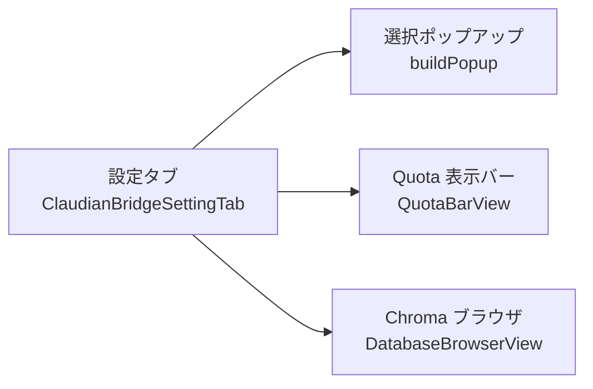

> 📂 **パス**: `02_設計文書/09_画面設計/README.md`
> 📍 **ソース**: `対応ソースパス`
> 🎯 **目的**: 画面詳細設計インデックス、すべての画面設計ドキュメントを管理

---

# 📱 画面設計 · インデックス

> 📖 **画面設計って何？**
> **画面設計** は「アプリの画面がどう見えるか、どう動くかを決める設計書」です。ゲームの攻略本に「この画面では何ができるか」をまとめたものだと考えると分かりやすいでしょう。
> 本書はすべての画面設計ドキュメントの「目次（インデックス）」として機能します。画面ごとの詳細は別ファイルに分かれています。

> ⚠️ **注意**: 本書はテンプレートのプレースホルダーです。Claudian Bridge は Obsidian の設定タブ UI を中心に設計されており、独立した Web 画面（ルーティング付き）は持たないため、実際の画面構成は [[../05_設定画面設計|設定画面設計]] を参照してください。

## 📊 画面総覧

Claudian Bridge は Obsidian プラグインのため、独立した Web 画面（ルーティング付き）ではなく **Obsidian 内の UI コンポーネント** として実装されています。

| # | 画面 ID | 画面名称 | 実装箇所 | 状態 |
|---|---------|----------|---------|:----:|
| 1 | Screen_01 | 設定タブ | [[../05_設定画面設計\|05_設定画面設計]] | ✅ |
| 2 | Screen_02 | 選択ポップアップ | `src/features/selection/popup.ts` | ✅ |
| 3 | Screen_03 | Quota 表示バー | `src/features/quota/view.ts` | ✅ |
| 4 | Screen_04 | Chroma ブラウザ | `src/features/chroma/views/DatabaseBrowserView.ts` | ✅ |

---

## 🗺️ 画面遷移図

> 各画面は Obsidian の設定画面・ステータスバー・ワークスペース内に配置され、独立した「画面遷移」ではなく **プラグイン機能の一部** として動作します。

---

## 📁 画面ファイル一覧

| ファイル | 説明 |
|------|------|
| [[../05_設定画面設計\|05_設定画面設計.md]] | 設定タブ UI の詳細設計 |
| [[../05_API設計\|05_API設計.md]] | API 境界の詳細設計 |

---

## 🔗 関連リンク

- [[../00_アーキテクチャ総覧]] — アーキテクチャ総覧
- [[../01_クラス設計]] — クラス設計
- [[../05_設定画面設計]] — 設定画面設計（実画面の構成はこちら）

---

*📱 画面設計インデックス v1.0.0 · MiuMiu 🐾*
