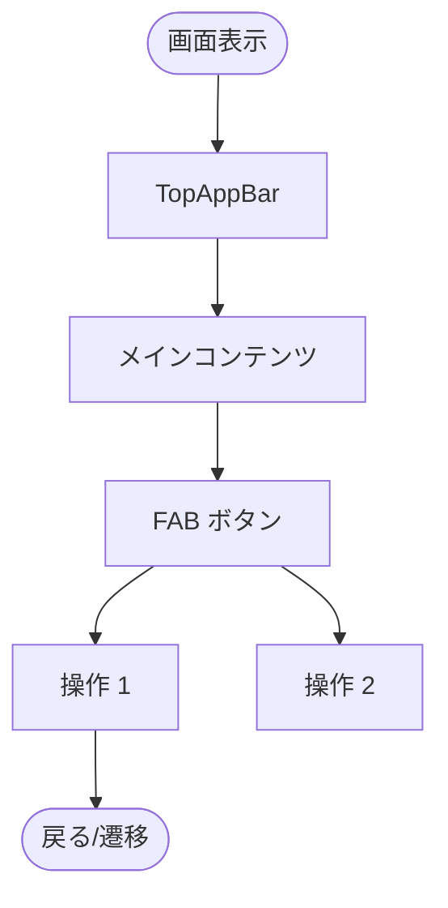
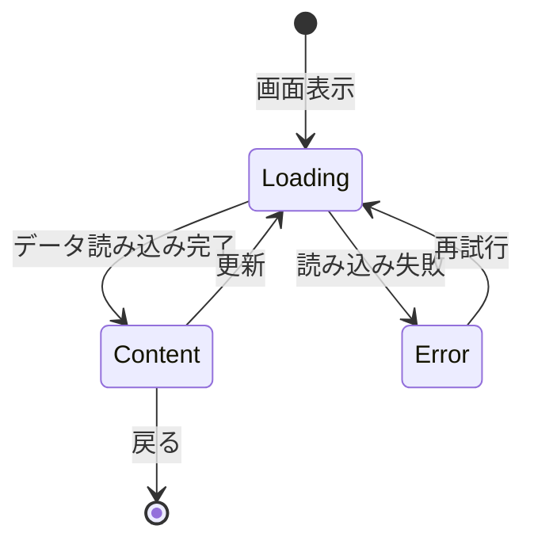

> 📂 **パス**: `02_設計文書/09_画面設計/画面_XX_画面名.md`
> 📍 **ソース**: `対応ソースパス`
> 🎯 **目的**: 単一画面の詳細設計テンプレート

---

## 📐 概要

| 属性 | 値 |
|------|-----|
| **画面 ID** | Screen_XX |
| **画面名称** | [画面日本語名] |
| **ルーティング** | `/xxx` |
| **ViewModel** | `XxxViewModel` |
| **遷移先画面** | Screen_XX → [遷移先] |
| **遷移元画面** | [遷移元画面] → Screen_XX |

---

## 📊 画面フローチャート

---

## 🎨 フィールド定義

| フィールド名 | タイプ | 説明 | 必須 |
|--------|------|------|:----:|
| [field_name] | String | [説明] | ✅ |
| [field_name] | Int | [説明] | ❌ |

---

## 🔄 状態定義

---

## 📱 UI コンポーネント

### TopAppBar

| 属性 | 値 |
|------|-----|
| **タイトル** | [画面タイトル] |
| **左側アイコン** | [戻る/メニュー] |
| **右側アイコン** | [その他の操作] |

### Body

| コンポーネント | 用途 |
|------|------|
| [コンポーネント1] | [説明] |
| [コンポーネント2] | [説明] |

### FAB

| アイコン | 操作 | 権限 |
|------|------|------|
| [アイコン] | [操作名] | [権限] |

---

## 🔗 関連リンク

- [[README]] — 画面設計インデックス
- [[../03_状態マシン]] — 関連状態マシン

---

## 📝 更新履歴

| バージョン | 日付 | 修正内容 | 修正者 |
|------|------|---------|--------|
| v1.0.0 | YYYY-MM-DD | 初版:画面設計 | MiuMiu 🐾 |

---

*📱 画面_XX_画面名 v1.0.0 · MiuMiu 🐾*
