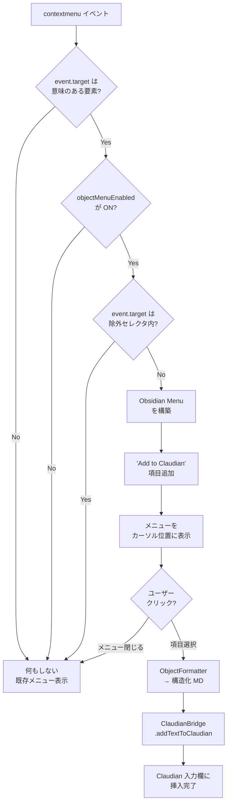

> 📂 路径：`80_POC_Projects/POC_017_ClaudianBridge/02_設計文書/10_オブジェクトコンテキストメニュー設計.md`
> 📍 目標プラグイン：`.obsidian/plugins/claudian-bridge/`
> 📍 関連プラグイン：`.obsidian/plugins/realclaudian/`（Claudian v2.1.2）

---

# 🎯 Claudian Bridge オブジェクトコンテキストメニュー設計

> 📖 **この機能って何？**
> **オブジェクトコンテキストメニュー** は、画面の要素（ボタン・入力欄・リンクなど）を **右クリック** したときに表示されるメニューのことです。
> 例えるなら「物を右クリックすると『コピー』『削除』などの選択肢が出る」あの動作です。本機能では、右クリックした要素の情報を AI（Claudian）に送る「**Add to Claudian**」メニューを追加します。

## 📑 目次

1. [背景と目標](#背景と目標)
2. [プラグイン影響範囲](#プラグイン影響範囲)
3. [コンポーネント設計](#コンポーネント設計)
4. [データ契約](#データ契約)
5. [設定設計](#設定設計)
6. [エラーハンドリング](#エラーハンドリング)
7. [テスト方針](#テスト方針)
8. [既知の制限](#既知の制限)
9. [ファイル変更一覧](#ファイル変更一覧)

---

## 背景と目標

### ユーザーニーズ

Obsidian 標準 UI（リボンアイコン、サイドバータブ、設定項目、コマンドパレット項目など）上のオブジェクト/パーツを **右クリック** した際に、ネイティブ context menu に「Add to Claudian」項目を追加する。クリックすると、オブジェクト指定情報（名前、種類、場所、セレクタ）を **構造化マークダウン** として Claudian チャット入力欄にコピーする。

### 現状分析

| 既存資産 | 位置 | 説明 |
|---------|------|------|
| テキスト選択 popup「Add to Claudian」 | `.obsidian/plugins/claudian-bridge/main.js` `Ct()` | テキスト選択時に 2 ボタン（Claudian / TTS）表示 |
| ファイル menu「Add to Claudian」 | `.obsidian/plugins/realclaudian/main.js` `bSe()` | `workspace.on('file-menu')` で `@path ` 挿入 |
| 挿入 API `appendToActiveInput(text)` | `.obsidian/plugins/realclaudian` ビュー | 既存と同じ呼び出し経路を再利用 |
| Obsidian `Menu` クラス | `obsidian` モジュール | ネイティブ風メニュー構築用 |

### 目標成果

- ✅ Obsidian 標準 UI 上のオブジェクト右クリック → ネイティブ context menu に「Add to Claudian」が追加される
- ✅ クリック時 → `{name, type, selector, path, context}` を含む構造化マークダウンを Claudian 入力欄に挿入
- ✅ 設定画面 (テキスト挿入タブ) で有効/無効を切替可能

---

## プラグイン影響範囲

| 項目 | 内容 |
|------|------|
| 対象プラグイン | `.obsidian/plugins/claudian-bridge/` |
| 変更ファイル | `main.js`、`data.json` (設定追加)、`styles.css` (軽微調整)、`manifest.json` (バージョン) |
| 不変更 | `.obsidian/plugins/realclaudian/main.js`、Obsidian コア |
| minAppVersion | `1.7.2`（不変） |
| プラグインバージョン | `0.1.0` → `0.2.0`（マイナー機能追加） |

---

## コンポーネント設計

| コンポーネント | 責務 | キー実装 |
|---------------|------|---------|
| `ObjectInspector` | 要素が「意味のあるオブジェクト」か判定 | `getMeaningfulInfo(el)` 関数 |
| `ObjectContextMenu` | グローバル `contextmenu` 監視 + Obsidian `Menu` 構築 | `registerDomEvent(document, 'contextmenu', handler)` |
| `ObjectFormatter` | 要素情報 → 構造化マークダウン変換 | `formatObject(info)` 関数 |
| `ObjectSettings` | 設定タブへの UI 統合 | 既存 `Pe` クラスにサブセクション追加 |

### 判定フロー



### 意味のあるオブジェクトの判定

`ObjectInspector.getMeaningfulInfo(el)` は以下の優先順位で情報を抽出:

| 優先度 | 情報源 | 例 |
|--------|--------|-----|
| 1 | `aria-label` 存在 | `.ribbon-item[aria-label="Open Claudian"]` |
| 2 | `data-tooltip-position` 存在 (Obsidian 独自) | リボン / ステータスバー要素 |
| 3 | `title` 属性存在 | `<button title="...">` |
| 4 | `role` が button / menuitem / tab / switch / slider 等 | `<div role="tab">` |
| 5 | `id` 属性存在（且つ一意） | `#vault-settings` |
| 6 | `placeholder` 属性存在 | 入力欄 |

6 つとも無ければ「意味なし」と判定 → 何もしない。

### context 推論（祖先遡行）

祖先を遡って最も近い意味的コンテナを `context` として記録:

| 祖先セレクタ | context |
|--------------|---------|
| `.workspace-ribbon` | `ribbon` |
| `.workspace-sidedock` | `sidebar` |
| `.modal` | `modal` |
| `.setting-item` | `settings` |
| `.menu` | `menu` |
| `.workspace` | `workspace` |

---

## データ契約

### ObjectInfo 型

```typescript
type ObjectInfo = {
  name: string;          // 人間可読名（aria-label / title / textContent）
  type: string;          // 'button' | 'input' | 'menuitem' | 'tab' | 'icon' | 'element'
  selector: string;      // 一意セレクタ（getUniqueSelector で生成）
  path: string;          // 祖先を > で連結したパス
  context: string;       // ribbon / sidebar / modal / settings / menu / workspace
  attributes?: Record<string, string>;  // その他の意味的属性
};
```

### 出力フォーマット（シンプル形式 / v1 採用）

```markdown
@object[button]
name: Open Claudian
type: button
context: ribbon
selector: .ribbon-item[aria-label='Open Claudian']
path: .workspace-ribbon > div > .ribbon-item-group > .ribbon-item
```

> 💡 **将来拡張**: 会話形式 `[UI要素] Open Claudian (ボタン / ribbon)` は v2 で検討。

### getUniqueSelector 規則

1. 要素に `id` があれば `#id` で確定
2. なければ `tag.class[aria-label="..."]` のように生成
3. 祖先で重複しない最小パスを採用（最大 5 階層）

---

## 設定設計

### 設定スキーマ追加

`data.json` の `selection` 配下に追加:

```json
{
  "selection": {
    "enabled": true,
    "folderEnabled": true,
    "delayMs": 300,
    "objectMenuEnabled": true,
    "objectMenuExcludeSelectors": [
      ".cb-popup",
      ".claudian-popup",
      ".menu",
      ".suggestion-container"
    ]
  }
}
```

### 設定 UI 配置

テキスト挿入タブ (`tabSelection`) の「Selection popup」セクション **末尾** に新サブセクション「Object context menu」を追加:

| 控件 | デフォルト | 説明 |
|------|----------|------|
| Toggle: `objectMenuEnabled` | `true` | 右クリックメニュー機能の ON/OFF |
| Text + Add button: `objectMenuExcludeSelectors` | 4 個初期値 | 除外する CSS セレクタのリスト |

設定は即時反映（再起動不要）。

---

## エラーハンドリング

| シナリオ | アクション |
|----------|-----------|
| realclaudian 未インストール | Notice「⚠️ Claudian プラグインが見つかりません」(既存 Notice 文言と統一) |
| Claudian チャット未起動 | `activateView()` で自動起動 (既存パターン踏襲) |
| `appendToActiveInput` 失敗 | Notice「⚠️ Claudian チャットが準備できていません」 |
| `contextmenu` ハンドラ中例外 | 静かに握り潰し、既存メニューは表示継続（UX 優先） |

---

## テスト方針

### 手動 UAT (Obsidian 実機)

- [ ] リボンアイコン「Open Claudian」を右クリック → 「Add to Claudian」表示
- [ ] 同アイコンをクリック → Claudian 入力欄に `@object[button] ...` 挿入
- [ ] 設定 OFF → 項目表示されない
- [ ] 設定 ON で除外セレクタ追加 → 該当要素では項目表示されない
- [ ] テキスト選択 popup との同時利用で干渉なし
- [ ] ファイル menu「Add to Claudian」と重複しない

### 構文チェック

- `node --check .obsidian/plugins/claudian-bridge/main.js` を毎回編集後に実行
- DevTools Console で `registerDomEvent` リスナー登録エラーが出ていないか確認

---

## 既知の制限 (v1 接受)

- ⚠️ 動的に生成された同一セレクタの要素（リスト項目など）はパス生成が不正確になる可能性
- ⚠️ Shadow DOM 内の要素は対象外 (Obsidian 標準 UI に Shadow DOM はほぼ使われない)
- ⚠️ iframe (web viewer 等) 内は対象外

---

## ファイル変更一覧

| ファイル | 変更 | サイズ見積 |
|---------|------|-----------|
| `.obsidian/plugins/claudian-bridge/main.js` | 4 関数追加 + 設定 UI 1 セクション追加 | +200 行 (minify 後) |
| `.obsidian/plugins/claudian-bridge/styles.css` | 必要に応じて Menu スタイル微調整 | ±20 行 |
| `.obsidian/plugins/claudian-bridge/manifest.json` | バージョン `0.1.0` → `0.2.0` | +1 数字変更 |
| `.obsidian/plugins/claudian-bridge/data.json` | デフォルト値追加 | +10 行 |

---

## 📚 関連ドキュメント

| # | 種別 | リンク |
|:--:|:----:|------|
| 1 | 📄 仕様書 (Superpower) | [[2026-08-11-claudian-bridge-object-context-menu-design]] |
| 2 | 🏗️ アーキテクチャ総覧 | [[02_設計文書/00_アーキテクチャ総覧]] |
| 3 | 🖥️ 設定画面設計 | [[02_設計文書/05_設定画面設計]] |
| 4 | 📄 テキスト選択 popup 設計 (前身) | [[2026-08-04-claudian-selection-popup-design]] |

---

*📅 2026-08-11 · Claudian Bridge v0.2.0 機能追加設計 · MiuMiu 🐾*