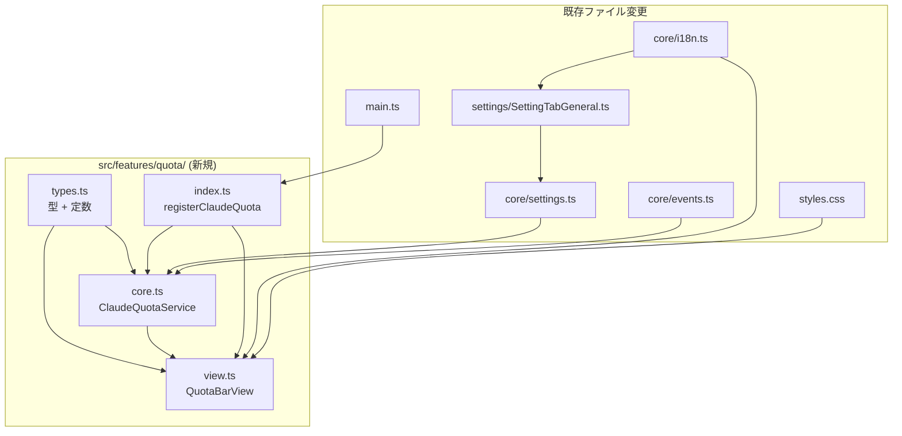
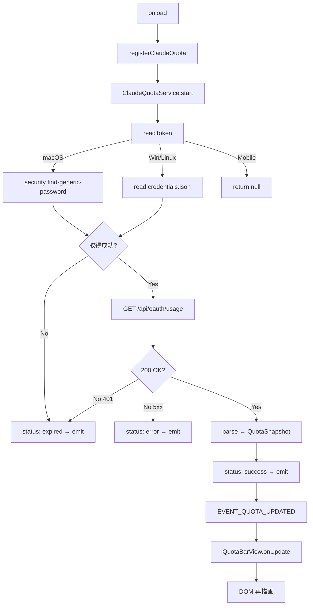
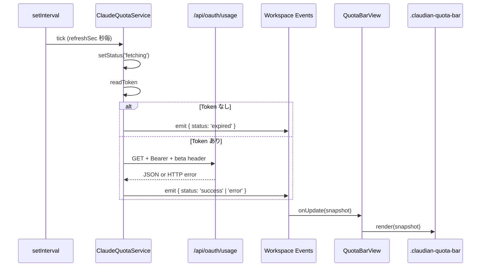
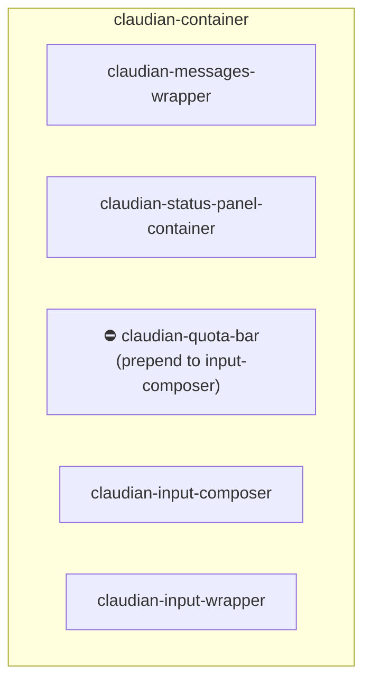
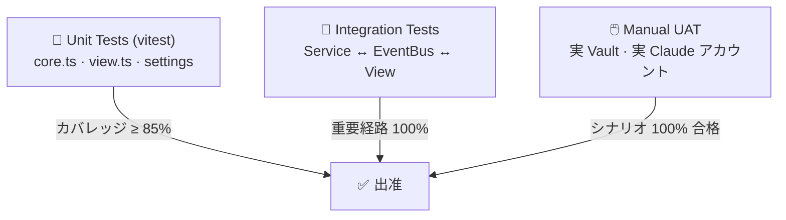

> 📂 パス：`80_POC_Projects/POC_017_ClaudianBridge/02_設計文書/11_LLM残量検知設計.md`
> 📍 目標プラグイン：`.obsidian/plugins/claudian-bridge/`
> 📍 関連プラグイン：`.obsidian/plugins/realclaudian/`（Claudian v2.1.2）
> 🔗 参考実装：CC Switch v3.16.0（farion1231/cc-switch）

---

# 🎯 Claudian Bridge LLM 残量検知 設計

> 📖 **この機能って何？**
> **LLM 残量検知** は「AI を使える残り回数・残り時間」を表示する機能です。スマホの「データ通信量の残り」や「ゲームのスタミナ」を表示するようなものです。
> AI（Claude など）には使用制限があり、使いすぎると一時的に使えなくなります。この機能は「あとどのくらい使えるか」を常に表示して、いきなり使えなくなるのを防ぎます。

## 📑 目次

1. [背景と目標](#背景と目標)
2. [用語定義](#用語定義)
3. [アーキテクチャ & データフロー](#アーキテクチャ--データフロー)
4. [コンポーネント & データ構造](#コンポーネント--データ構造)
5. [API インターフェース](#api-インターフェース)
6. [設定スキーマ & i18n](#設定スキーマ--i18n)
7. [UI レンダリング](#ui-レンダリング)
8. [エラー状態](#エラー状態)
9. [エッジケース & 互換性](#エッジケース--互換性)
10. [セキュリティ設計](#セキュリティ設計)
11. [テスト戦略](#テスト戦略)
12. [受入チェックリスト](#受入チェックリスト)
13. [ファイル変更一覧](#ファイル変更一覧)
14. [既知の制限](#既知の制限)

---

## 背景と目標

### ユーザーニーズ

Claudian Chat 利用中に **自分の Claude サブスクリプション残量**（5 時間ウィンドウ・7 日ウィンドウ）を即座に確認したい。CC Switch 同様、入力欄の直上にステータスバーを表示し、利用率が閾値を超えると色分けで警告する。

### 現状分析

| 既存資産 | 位置 | 説明 |
|---------|------|------|
| 設定画面 一般タブ | `src/settings/SettingTabGeneral.ts` | `renderGeneralTab` が toggle UI を提供 |
| ConfigStore | `src/core/settings.ts` | `normalizeClaudianBridgeSettings` で永続化 |
| realclaudian ビュー API | `.obsidian/plugins/realclaudian/main.js` | `getInputWrapper()` / `getStatusPanel()` を提供 |
| CC Switch OAuth 実装 | `cc-switch/src-tauri/src/services/subscription.rs` | `/api/oauth/usage` 呼び出しの参考実装 |

### 目標成果

- ✅ Claudian Bridge 設定「一般」タブに「Claude 残量検出」トグルが追加される
- ✅ トグル ON 時、Claudian Chat 入力欄直上にステータスバー（5h / 7d 残量 + 残時間）が表示される
- ✅ 利用率に応じて <70% 緑 / 70–89% 橙 / ≥90% 赤 で色分け表示される
- ✅ 60 秒間隔で自動更新される（ローカルカウントダウンは 60 秒ごとに再描画）
- ✅ Mobile（iOS / Android）では自動的に無効化される（デスクトップ専用機能）

### 非目標

- ❌ 複数 Claude アカウント対応（単一 OAuth セッションのみ）
- ❌ 7-day Opus / 7-day Sonnet 個別ウィンドウの常時表示（API レスポンスに含まれれば追加可能）
- ❌ アラート通知（閾値超過時にシステム通知を送らない — ステータスバー内色変化のみ）
- ❌ 過去履歴のグラフ表示

---

## 用語定義

| 用語 | 定義 |
|------|------|
| **Quota Window** | Claude の利用制限期間。`five_hour` / `seven_day` / `seven_day_opus` / `seven_day_sonnet` の 4 種類 |
| **Utilization** | ウィンドウ内利用率（0–100 整数）。`null` は API 未返却 |
| **Resets At** | ウィンドウリセット時刻（ISO 8601） |
| **OAuth Access Token** | Claude Code の `~/.claude/.credentials.json` または macOS Keychain に保存されたアクセストークン |
| **Snapshot** | 1 回の API レスポンスを構造化した不変データ |
| **Status** | Snapshot の状態（`idle` / `fetching` / `success` / `expired` / `error` / `unsupported`） |

---

## アーキテクチャ & データフロー

### モジュール構成



### データフロー（全体像）



### イベントフロー（シーケンス図）



---

## コンポーネント & データ構造

### ファイル詳細

| ファイル | 役割 | 行数目安 |
|---------|------|----------|
| `src/features/quota/types.ts` | 全型定義 + 定数 + イベント名 | ~60 |
| `src/features/quota/core.ts` | `ClaudeQuotaService` クラス（IO 処理 + キャッシュ + タイマー） | ~220 |
| `src/features/quota/view.ts` | `QuotaBarView` クラス（DOM レンダリング） | ~150 |
| `src/features/quota/index.ts` | `registerClaudeQuota` / `unregisterClaudeQuota` 公開 API | ~50 |

### 型定義（`types.ts`）

```typescript
/** 単一ウィンドウの残量 */
export interface QuotaWindow {
  utilization: number | null;  // 0–100 整数, null = 不明
  resetsAt: string | null;    // ISO 8601, null = 不明
}

/** 追加計費使用量（API 従量課金部分） */
export interface ExtraUsage {
  isEnabled: boolean;
  utilization: number | null;
  resetsAt: string | null;
}

/** 完全な残量スナップショット */
export interface QuotaSnapshot {
  status: QuotaStatus;
  windows: {
    fiveHour: QuotaWindow;
    sevenDay: QuotaWindow;
    sevenDayOpus?: QuotaWindow;
    sevenDaySonnet?: QuotaWindow;
  };
  extraUsage: ExtraUsage | null;
  fetchedAt: number;          // ms epoch
  error?: string;
  tokenSource: 'keychain' | 'file' | 'none';
}

export type QuotaStatus =
  | 'idle'         // 起動前
  | 'fetching'     // 取得中
  | 'success'      // 直近成功
  | 'expired'      // トークン期限切れ / 未ログイン
  | 'error'        // ネットワーク・解析エラー
  | 'unsupported'; // モバイル等サポート外

/** ワークスペースイベント名 */
export const EVENT_QUOTA_UPDATED = 'claudian-quota-updated';

/** 既定の更新間隔（秒） */
export const DEFAULT_QUOTA_REFRESH_SEC = 60;

/** 更新間隔の境界 */
export const QUOTA_REFRESH_MIN_SEC = 10;
export const QUOTA_REFRESH_MAX_SEC = 600;
```

### `ClaudeQuotaService` クラス（`core.ts`）

```typescript
export interface ClaudeQuotaServiceOptions {
  app: App;
  store: ConfigStore;
  refreshSec: number;          // <= 0 でポーリング無効
}

export class ClaudeQuotaService {
  constructor(opts: ClaudeQuotaServiceOptions);

  /** 起動：初回フェッチ + setInterval 開始 */
  start(): Promise<void>;

  /** 停止：タイマー解除 + 購読解除 */
  stop(): Promise<void>;

  /** 手動即時更新（スロットル無視） */
  forceRefresh(): Promise<QuotaSnapshot>;

  /** 最新スナップショット取得 */
  getSnapshot(): QuotaSnapshot;

  /** 更新イベント購読（戻り値で解除） */
  onUpdate(cb: (snap: QuotaSnapshot) => void): () => void;
}

/** モジュールシングルトン */
let _instance: ClaudeQuotaService | null = null;
export function getClaudeQuotaService(): ClaudeQuotaService | null;
```

#### 内部メソッド

| メソッド | 可視性 | 役割 |
|---------|--------|------|
| `refreshOnce()` | private | 1 回フェッチ → snapshot 構築 → emit |
| `readToken()` | private | macOS Keychain → file fallback → null |
| `fetchQuota(token)` | private | `GET /api/oauth/usage` + JSON parse |
| `setStatus(status, error?)` | private | 内部状態更新 + emit |

### `QuotaBarView` クラス（`view.ts`）

```typescript
export class QuotaBarView {
  /** .claudian-input-wrapper の上方に挿入（冪等） */
  mount(anchor: HTMLElement): void;

  /** DOM 除去 + イベント解除 */
  unmount(): void;

  /** snapshot 反映 */
  render(snap: QuotaSnapshot): void;
}

/** カラー判定 */
export function colorFor(util: number | null): 'green' | 'orange' | 'red' | 'gray';

/** カウントダウン文字列 ("2h45m" / "3d 4h" / "47m") */
export function formatCountdown(resetsAt: string | null): string;
```

---

## API インターフェース

### 公開 API（`index.ts`）

```typescript
export interface ClaudeQuotaHandle {
  service: ClaudeQuotaService;
  view: QuotaBarView;
  dispose(): Promise<void>;  // 完全クリーンアップ
}

/** main.ts onload から呼び出し */
export async function registerClaudeQuota(
  app: App,
  store: ConfigStore,
): Promise<ClaudeQuotaHandle | null>;
// null = Mobile 等のため登録スキップ

/** main.ts onunload から呼び出し */
export async function unregisterClaudeQuota(): Promise<void>;
```

### Claude OAuth Usage API（外部）

| 項目 | 値 |
|------|---|
| URL | `https://api.anthropic.com/api/oauth/usage` |
| メソッド | `GET` |
| ヘッダー | `Authorization: Bearer <accessToken>`<br/>`anthropic-beta: oauth-2025-04-20`<br/>`User-Agent: claudian-bridge/1.0` |
| レスポンス形式 | JSON |

#### レスポンス例

```json
{
  "five_hour": {
    "utilization": 62.0,
    "resets_at": "2026-08-11T19:30:00Z"
  },
  "seven_day": {
    "utilization": 23.0,
    "resets_at": "2026-08-14T11:00:00Z"
  },
  "seven_day_opus": {
    "utilization": 5.0,
    "resets_at": "2026-08-14T11:00:00Z"
  },
  "seven_day_sonnet": null,
  "extra_usage": {
    "is_enabled": false,
    "utilization": null,
    "resets_at": null
  }
}
```

### エラーレスポンス対応表

| HTTP ステータス | 内部 status | UI 挙動 |
|:---------------:|:-----------:|---------|
| 200 | `success` | 正常表示 |
| 401 | `expired` | 「未ログイン」表示 |
| 403 | `expired` | 同上（権限なし） |
| 429 | `success`（前回値保持） | 変更なし |
| 5xx | `error` | 「取得失敗」表示 |
| タイムアウト | `error` | 同上 |
| JSON 解析失敗 | `error` | 同上 |

---

## 設定スキーマ & i18n

### 設定スキーマ追加（`src/core/settings.ts`）

```typescript
export interface ClaudianBridgeGeneralSettings {
  enabled: boolean;
  migratedFrom: MigrationSource | null;
  migrationResetAvailable: boolean;
  // ↓ 以下を追加
  quotaEnabled: boolean;
  quotaRefreshSec: number;
}

export const DEFAULT_CLAUDIAN_BRIDGE_SETTINGS = {
  general: {
    enabled: true,
    migratedFrom: null,
    migrationResetAvailable: true,
    quotaEnabled: false,        // デフォルト OFF（ユーザー能動的に有効化）
    quotaRefreshSec: 60,
  },
  // ... 既存
};

export function normalizeClaudianBridgeSettings(raw: unknown): ClaudianBridgeSettings {
  // ...
  return {
    general: {
      enabled: r.general?.enabled ?? true,
      migratedFrom: /* ... */,
      migrationResetAvailable: r.general?.migrationResetAvailable ?? true,
      quotaEnabled: r.general?.quotaEnabled ?? false,
      quotaRefreshSec: clampRefreshSec(r.general?.quotaRefreshSec ?? 60),
    },
    // ...
  };
}

function clampRefreshSec(v: number): number {
  if (typeof v !== 'number' || isNaN(v)) return 60;
  return Math.max(10, Math.min(600, Math.floor(v)));
}
```

### i18n 文案追加（`src/core/i18n.ts`）

| key | 🇯🇵 ja | 🇺🇸 en | 🇨🇳 zh |
|-----|--------|--------|--------|
| `quotaEnabled` | Claude 残量検出 | Claude quota detection | Claude 残量检测 |
| `quotaEnabledDesc` | Claude Code の OAuth 利用状況を表示します（デスクトップのみ） | Show Claude Code OAuth usage (desktop only) | 显示 Claude Code OAuth 使用情况（仅桌面端） |
| `quotaRefreshSec` | 更新間隔（秒） | Refresh interval (sec) | 刷新间隔（秒） |
| `quotaRefreshSecDesc` | 10〜600 の範囲で指定。0 で無効化 | 10–600 seconds. 0 disables. | 10–600 秒范围，0 表示禁用 |
| `quotaFetching` | 読み込み中… | Fetching… | 加载中… |
| `quotaNotLoggedIn` | Claude Code に未ログインです | Not logged in to Claude Code | 未登录 Claude Code |
| `quotaError` | 残量取得に失敗しました | Failed to fetch quota | 获取额度失败 |
| `quotaUnsupportedMobile` | 残量検出はデスクトップでのみ利用可能です | Quota detection is desktop-only | 残量检测仅在桌面端可用 |
| `quotaRefresh`（aria-label） | 残量を更新 | Refresh quota | 刷新额度 |
| `quotaWindow5h` | 5時間 | 5h | 5小时 |
| `quotaWindow7d` | 7日間 | 7d | 7天 |

---

## UI レンダリング

### 配置



### DOM 構造（success 状態）

```html
<div class="claudian-quota-bar" data-status="success">
  <span class="claudian-quota-bar__main">
    <span class="claudian-quota-bar__dot" data-color="green"></span>
    <span class="claudian-quota-bar__label">5時間</span>
    <span class="claudian-quota-bar__value">62%</span>
    <span class="claudian-quota-bar__countdown">🕘 2h45m</span>
  </span>
  <span class="claudian-quota-bar__sub">
    <span class="claudian-quota-bar__sub-label">7日間</span>
    <span class="claudian-quota-bar__value">23%</span>
  </span>
  <button class="claudian-quota-bar__refresh clickable-icon"
          aria-label="残量を更新">
    <svg>...</svg>
  </button>
</div>
```

### カラー閾値

```typescript
type QuotaColor = 'green' | 'orange' | 'red' | 'gray';

function colorFor(util: number | null): QuotaColor {
  if (util === null) return 'gray';
  if (util >= 90)    return 'red';
  if (util >= 70)    return 'orange';
  return 'green';
}
```

| 範囲 | カラー | 意味 |
|------|--------|------|
| `< 70%` | 緑 (`#4caf50`) | 健康 |
| `70–89%` | 橙 (`#ff9800`) | 警告 |
| `≥ 90%` | 赤 (`#f44336`) | 危険 |
| `null` | 灰 (`#9e9e9e`) | 不明 |

### カウントダウン書式

| 残り時間 | 表示 |
|----------|------|
| `>= 1 日` | `3d 4h` |
| `>= 1 時間` | `2h45m` |
| `< 1 時間` | `47m` |
| `負数` | `0m` |

### CSS 追加（`styles.css`）

```css
.claudian-quota-bar {
  display: flex;
  align-items: center;
  gap: 12px;
  padding: 4px 12px;
  font-size: 12px;
  border-bottom: 1px solid var(--background-modifier-border);
  background: var(--background-secondary);
}
.claudian-quota-bar__dot {
  width: 8px; height: 8px; border-radius: 50%;
  display: inline-block; margin-right: 6px;
}
.claudian-quota-bar__dot[data-color="green"]  { background: #4caf50; }
.claudian-quota-bar__dot[data-color="orange"] { background: #ff9800; }
.claudian-quota-bar__dot[data-color="red"]    { background: #f44336; }
.claudian-quota-bar__dot[data-color="gray"]   { background: #9e9e9e; }
.claudian-quota-bar__countdown {
  margin-left: 4px;
  opacity: 0.7;
  font-variant-numeric: tabular-nums;
}
.claudian-quota-bar__refresh {
  margin-left: auto;
  opacity: 0.5;
  transition: opacity 0.15s;
}
.claudian-quota-bar:hover .claudian-quota-bar__refresh { opacity: 1; }
.claudian-quota-bar[data-status="fetching"] .claudian-quota-bar__dot {
  animation: claudian-quota-pulse 1.2s ease-in-out infinite;
}
@keyframes claudian-quota-pulse {
  0%, 100% { opacity: 0.4; }
  50%      { opacity: 1.0; }
}
```

---

## エラー状態

| status | トリガー条件 | DOM 反映 | i18n key |
|--------|-------------|----------|----------|
| `idle` | 起動直後フェッチ未完了 | DOM 未マウント | — |
| `fetching` | HTTP リクエスト送信中 | 円グレー + パルスアニメ | `quotaFetching` |
| `success` | 直近成功 | 円カラーカラー + 数値 + カウントダウン | — |
| `expired` | `readToken()` null / HTTP 401 / 403 | 円グレー + ⚠ + 「未ログイン」 | `quotaNotLoggedIn` |
| `error` | 5xx / タイムアウト / JSON 解析失敗 | 円赤 + ❌ + 「取得失敗」 | `quotaError` |
| `unsupported` | `Platform.isMobile === true` | DOM 未マウント | `quotaUnsupportedMobile` |

### expired 状態の DOM 例

```html
<div class="claudian-quota-bar" data-status="expired">
  <span class="claudian-quota-bar__dot" data-color="gray"></span>
  <span>⚠️ 5時間: <span class="claudian-quota-bar__value">--</span></span>
  <span class="claudian-quota-bar__hint">Claude Code に未ログインです</span>
  <button class="claudian-quota-bar__refresh">↻</button>
</div>
```

---

## エッジケース & 互換性

| シナリオ | 処理方式 |
|----------|----------|
| プラグインロード時 realclaudian 未有効 | Service は起動するが `mount()` で `getView()` null → 静かにスキップ。realclaudian が後から開かれたら自動マウント |
| ユーザー Chat タブ切替 | `QuotaBarView` が active tab 変更を検知 → 新規 input wrapper へ DOM 移動 |
| Obsidian Mobile | `Platform.isMobile === true` で Service・DOM 共に起動せず。Settings にグレーアウト + `quotaUnsupportedMobile` 表示 |
| `quotaEnabled` トグル OFF | `stop()` Service + `unmount()` View。DOM 即座に消滅 |
| 複数 Chat タブ | 各 Chat View が独立した `QuotaBarView` を保持（Service はシングルトンで全 View が購読） |
| カウントダウン 0 到達 | `success` 状態維持、表示は `0m` のまま次回フェッチを待つ |
| テスト環境（Token なし） | `readToken()` が null → `expired` 状態 + 例外スロー無し |
| realclaudian バージョンアップで DOM クラス名変更 | `getInputWrapper()` API → CSS クラス `.claudian-input-wrapper` の二段フォールバック |
| 同時多発フェッチ（重複防止） | `forceRefresh()` 以外の自動フェッチは進行中フラグで抑止 |
| `fetch` グローバル未定義（古いブラウザ） | Service 内 `typeof fetch === 'function'` チェック → `error` 状態 |

### realclaudian 互換性戦略

| アクセス方法 | 優先度 | 説明 |
|-------------|--------|------|
| 公式 API（`view.getInputWrapper()` 等） | 1 | realclaudian が提供する安定アクセス経路 |
| CSS クラス fallback（`.claudian-input-wrapper`） | 2 | API 未提供時のフォールバック |
| 直接 `querySelectorAll` | 非推奨 | 性能劣化・将来変更に弱い |

---

## セキュリティ設計

| # | 検証項目 | 合格条件 |
|:--:|----------|----------|
| 1 | Token は data.json に書き込まない | `data.json` を grep し `accessToken` フィールド無し |
| 2 | Token は DOM / React に渡さない | DevTools Elements パネルで "Bearer" を検索 → ヒットなし |
| 3 | HTTPS のみ | Network パネルで `http://` リクエストが `api.anthropic.com` へ向かうもの無し |
| 4 | Token はメモリ内のみ存在 | `getSnapshot()` の戻り値に token フィールド無し |
| 5 | 非同期境界は全て try/catch | DevTools Console に unhandled promise rejection 無し |

### 脅威モデル

| 脅威 | 緩和策 |
|------|--------|
| Token のログ漏洩 | `console.log` / `console.error` で token を出力しない。開発時の `JSON.stringify(snapshot, redactToken)` ヘルパー使用 |
| data.json への平文保存 | Service は ConfigStore に token を渡さない（読み取り専用） |
| DOM 経由の XSS | DOM 構築は `createEl` / `createDiv` 経由のみ。`innerHTML` 使用禁止 |
| CSRF / Origin 偽装 | Anthropic API は OAuth トークン単独で認証。Cookie ベースのセッションではないため影響なし |

---

## テスト戦略

### テストピラミッド



### Unit テスト（`tests/features/quota/`）

| ファイル | 対象 | ケース数（目安） |
|----------|------|:----------------:|
| `core.test.ts` | `ClaudeQuotaService` 全分岐 | ~12 |
| `view.test.ts` | `QuotaBarView.render` + 色 + カウントダウン | ~8 |
| `types.test.ts` | 型ガード関数 | ~3 |
| `index.test.ts` | `registerClaudeQuota` 起動 / 解除 | ~4 |

### `core.test.ts` 主要ケース

| # | ケース名 | 検証点 |
|:--:|----------|--------|
| 1 | `start()` が初回フェッチ + タイマー起動 | 初回 `refreshOnce` を同期実行 |
| 2 | `stop()` がタイマー解除 + リクエスト停止 | fake timer 2 周後 fetch 回数 = 1 |
| 3 | macOS で Keychain 読み取り | mock `spawn` → tokenSource = 'keychain' |
| 4 | Keychain 失敗 → ファイル fallback | spawn ENOENT → fs mock → tokenSource = 'file' |
| 5 | ファイル不存在 → expired 状態 | snapshot.status === 'expired', error に 'credentials' 含む |
| 6 | fetch 200 → 成功スナップショット | status='success', fiveHour.utilization 正しい |
| 7 | fetch 401 → expired 状態 | status='expired' |
| 8 | fetch 500 → error 状態 + 詳細 | status='error', error に '500' 含む |
| 9 | JSON 解析失敗 → error 状態 | mock '<html>' → status='error' |
| 10 | `forceRefresh` 即座発火 | スロットル無視で fetch +1 |
| 11 | `Platform.isMobile=true` → start 無効 | Service.start 後 fetch 回数 = 0 |
| 12 | 状態変化 5 回 → EVENT_QUOTA_UPDATED 5 回 | emit 回数 = 5 |

### `view.test.ts` 主要ケース

| # | ケース名 | 検証点 |
|:--:|----------|--------|
| 1 | success 描画 → 緑円 + 数値 + カウントダウン | DOM に `data-color="green"` と `62%` 存在 |
| 2 | util=90 → 赤円 | data-color="red" |
| 3 | util=75 → 橙円 | data-color="orange" |
| 4 | util=null → 灰円 | data-color="gray" |
| 5 | `formatCountdown(2h後)` → `"2h0m"` | |
| 6 | `formatCountdown(3d後)` → `"3d 0h"` | |
| 7 | `formatCountdown(null)` → `""` | |
| 8 | `mount` 二重呼び出しが冪等 | DOM 二重生成されない |

### Integration テスト（`tests/integration/quota.test.ts`）

| # | シナリオ | 検証点 |
|:--:|----------|--------|
| 1 | フルライフサイクル | onload → start → emit → render → onunload → stop。fake timer 後に未解放 handle なし |
| 2 | Settings 変更伝播 | `quotaEnabled` false → true で Service 自動 start |
| 3 | 複数 View 購読 | 同一 Service に 2 View 订阅 → 両 View DOM 更新 |
| 4 | Settings バリデーション | `quotaRefreshSec` 欠損 → デフォルト 60 注入 |

### Mock 拡張（`tests/mocks/obsidian.ts`）

| 既存 Mock | 拡張要否 | 用途 |
|-----------|:--------:|------|
| `app.workspace.on` spy | ✅ 既存 | イベント購読検証 |
| `app.plugins.plugins['realclaudian']` stub | ✅ 既存 | mock view 返却 |
| `fetch` | 🆕 追加 | HTTP レスポンスモック |
| `Platform.isMobile` | 🆕 追加 | デスクトップ / Mobile 切替 |
| `child_process.spawn` | 🆕 追加 | macOS Keychain モック |
| `fs/promises.readFile` | 🆕 追加 | credentials.json モック |

### カバレッジ目標

| ファイル | 行カバレッジ | 分岐カバレッジ |
|---------|:------------:|:--------------:|
| `core.ts` | ≥ 90% | ≥ 85% |
| `view.ts` | ≥ 80% | ≥ 75% |
| `types.ts` | 100% | 100% |
| `index.ts` | ≥ 85% | ≥ 80% |
| Settings 変更箇所 | ≥ 90% | ≥ 85% |

---

## 受入チェックリスト

### インストール & 設定

| # | 検証項目 | 合格条件 |
|:--:|----------|----------|
| 1 | Plugin ロード時エラーなし | DevTools Console に error 無し |
| 2 | Settings → 一般タブに「Claude 残量検出」表示 | トグル可視・操作可 |
| 3 | トグル初期値 = OFF | 初回インストール後 false |
| 4 | トグル ON で「更新間隔（秒）」入力欄表示 | 数字入力欄可視、デフォルト 60 |
| 5 | 間隔範囲 10–600 | 境界値でクランプ動作 |

### 表示

| # | 検証項目 | 合格条件 |
|:--:|----------|----------|
| 6 | ON 後 realclaudian ChatView 顶部にステータスバー | DOM に `.claudian-quota-bar` 存在 |
| 7 | 利用率 <70% → 緑、70–89% → 橙、≥90% → 赤 | 目視確認 |
| 8 | カウントダウンが 60 秒毎に再描画 | 60s 経過で "2h45m" → "2h44m" |
| 9 | 7日間指標 hover 展開 | ホバーで表示、非ホバーで畳まれる |
| 10 | リフレッシュボタン押下で即時フェッチ | fetch 1 回発火 |
| 11 | 複数 Chat タブが独立表示 | 各タブに 1 個ずつバー |

### エラー状態

| # | 検証項目 | 合格条件 |
|:--:|----------|----------|
| 12 | 未ログイン → 灰円 + 「未ログイン」 | credentials.json 削除後 expired 表示 |
| 13 | ネットワーク断 → 赤円 + 「取得失敗」 | 60s 以内に error 表示 |
| 14 | Token 期限切れ → 401 後 expired | accessToken 改竄で再現 |
| 15 | Mobile で DOM 非マウント | iOS / Android 模擬で `.claudian-quota-bar` 無し |

### i18n

| # | 検証項目 | 合格条件 |
|:--:|----------|----------|
| 16 | Obsidian 言語切替（ja / en / zh）で文言変化 | 3 言語切替検証 |
| 17 | カウントダウン数字はロケール非依存 | 全言語で "2h45m" 形式 |

### 互換性

| # | 検証項目 | 合格条件 |
|:--:|----------|----------|
| 18 | realclaudian DOM クラス変更後でもマウント可 | mock で getInputWrapper null → CSS fallback 動作 |
| 19 | 既存 feature（selection / tts / office）と同時有効で競合なし | Console error 無し |
| 20 | Plugin アンロードで全リソース解放 | onunload 後 60s で fetch / console 出力なし |

### 性能ベンチマーク（非機能）

| 指標 | 目標値 | 測定方法 |
|------|--------|----------|
| Service 起動から初回 emit | < 2s | `performance.now()` |
| Bundle 増加量 | < 15KB (gzipped) | esbuild metafile |
| アイドル時メモリ | < 2MB | DevTools Memory snapshot |
| 60s ポーリング CPU ピーク | < 1%（アイドル時） | DevTools Performance |

### セキュリティ検証

| # | 検証項目 | 合格条件 |
|:--:|----------|----------|
| 1 | Token が data.json に書き込まれない | grep `data.json` で `accessToken` フィールド無し |
| 2 | Token が DOM に渡らない | DevTools Elements で "Bearer" 検索 → ヒット無し |
| 3 | HTTPS のみ使用 | Network に `http://` → api.anthropic.com 無し |
| 4 | Token はメモリ内のみ | `getSnapshot()` 戻り値に token 無し |
| 5 | 非同期境界が全て try/catch | unhandled promise rejection 無し |

---

## ファイル変更一覧

| 種別 | パス | 変更概要 |
|------|------|----------|
| 🆕 新規 | `src/features/quota/types.ts` | 全型 + 定数 |
| 🆕 新規 | `src/features/quota/core.ts` | `ClaudeQuotaService` |
| 🆕 新規 | `src/features/quota/view.ts` | `QuotaBarView` |
| 🆕 新規 | `src/features/quota/index.ts` | 公開 API |
| ✏️ 修正 | `src/settings/SettingTabGeneral.ts` | 一般タブに quota トグル + 間隔入力追加 |
| ✏️ 修正 | `src/core/settings.ts` | `general.quotaEnabled` + `quotaRefreshSec` 追加 |
| ✏️ 修正 | `src/core/i18n.ts` | 11 キー追加（ja / en / zh） |
| ✏️ 修正 | `src/core/events.ts` | `EVENT_QUOTA_UPDATED` 定数追加（既存なら流用） |
| ✏️ 修正 | `src/main.ts` | `onload` で `registerClaudeQuota`、`onunload` で解除 |
| ✏️ 修正 | `styles.css` | `.claudian-quota-bar` 関連スタイル追加 |
| 🆕 新規 | `tests/features/quota/core.test.ts` | 12 ケース |
| 🆕 新規 | `tests/features/quota/view.test.ts` | 8 ケース |
| 🆕 新規 | `tests/features/quota/types.test.ts` | 3 ケース |
| 🆕 新規 | `tests/features/quota/index.test.ts` | 4 ケース |
| ✏️ 修正 | `tests/mocks/obsidian.ts` | fetch / spawn / fs / Platform mock 追加 |

**合計**：新規 8 ファイル + 修正 7 ファイル = 15 ファイル

---

## Definition of Done（出准標準）

```text
✅ Section 1–4 設計全部 主人 review 通過
✅ コード変更 ≤ 8 ファイル + テスト ≤ 4 ファイル + mock 1 ファイル
✅ Unit + Integration テスト全緑（カバレッジ ≥ 目標）
✅ UAT 20 項目全合格
✅ 性能ベンチマーク達成
✅ セキュリティ検証 5 項目全合格
✅ 3 言語 i18n 文案同期更新
✅ CHANGELOG.md / docs/superpowers/specs/ ドキュメント更新
✅ main を POC_017 メインブランチへマージ
```

---

## 既知の制限

| 制限 | 理由 | 将来の対応案 |
|------|------|--------------|
| 単一 Claude アカウントのみ | OAuth トークン保存先が単一 | v2 でマルチアカウント対応検討 |
| Mobile プラットフォーム非対応 | Keychain / ファイルアクセス不可 | ブラウザ OAuth + Web API 等の代替手段検討 |
| 7d_opus / 7d_sonnet 個別表示は将来拡張 | API レスポンスに含まれるが UI 枠が未確定 | 利用統計取ってから判断 |
| カウントダウンは 60 秒粒度 | サーバー再フェッチ間隔と同じ | tick 間隔を 30 秒に下げることも可能だが CPU 負荷増 |
| アラート通知機能なし | ステータスバー色変化のみ | デスクトップ通知プラグインとの統合は別タスク |

---

## 📚 参考文献

| # | 種別 | 参照元 |
|:--:|:----:|------|
| 1 | GitHub | [farion1231/cc-switch - Usage Query 機能](https://github.com/farion1231/cc-switch/blob/main/docs/user-manual/en/2-providers/2.5-usage-query.md) |
| 2 | GitHub | [cc-switch/src-tauri/src/services/subscription.rs](https://github.com/farion1231/cc-switch/blob/main/src-tauri/src/services/subscription.rs) |
| 3 | Vault MD | [[10_オブジェクトコンテキストメニュー設計\|10_オブジェクトコンテキストメニュー設計.md]]（関連 feature 実装パターン） |
| 4 | Vault MD | [[04_データモデル\|04_データモデル.md]]（settings スキーマ拡張パターン） |

---

*🎯 Claudian Bridge LLM 残量検知 設計 v1.0.0 · MiuMiu 🐾 · 2026-08-11*