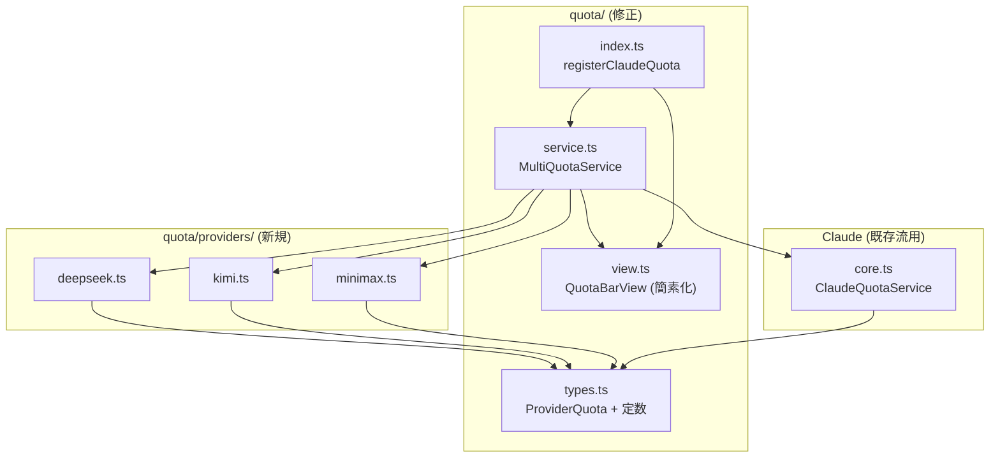
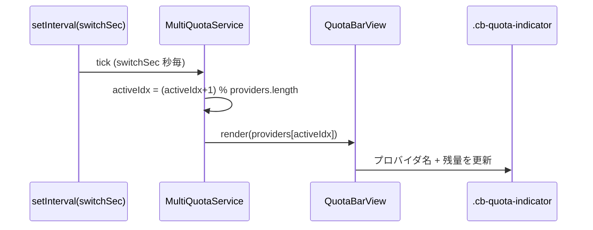
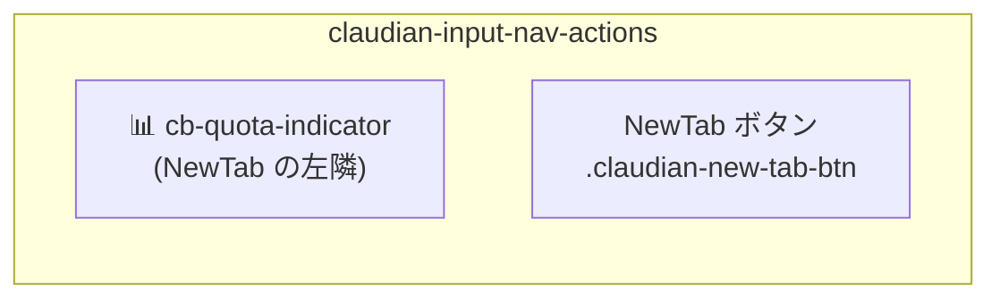

> 📂 パス：`80_POC_Projects/POC_017_ClaudianBridge/02_設計文書/12_マルチプロバイダ残量検知設計.md`
> 📍 目標プラグイン：`.obsidian/plugins/claudian-bridge/`
> 📍 関連プラグイン：`.obsidian/plugins/realclaudian/`（Claudian v2.1.2）
> 🔗 前設計：[[11_LLM残量検知設計]]（Claude 単一の残量検知 v1）

---

# 🎯 Claudian Bridge マルチプロバイダ残量検知 設計

> 📖 **この機能って何？**
> 前の設計（[[11_LLM残量検知設計]]）では **Claude 1 社**の残量だけを表示していました。この設計では **複数の AI サービス**（Claude / DeepSeek / Kimi / MiniMax）の残量をまとめて表示できるように拡張します。
> 例えるなら「1 つのガソリンスタンドの残量メーター」を「複数のガソリンスタンドの残量をまとめて見られるダッシュボード」に広げるイメージです。各サービスは残量の取得方法（API）が異なるため、**プロバイダ（提供事業者）** ごとに「変換アダプタ」を用意します。

## 📑 目次

1. [背景と目標](#背景と目標)
2. [用語定義](#用語定義)
3. [[#アーキテクチャ & データフロー|アーキテクチャ & データフロー]]
4. [[#コンポーネント & データ構造|コンポーネント & データ構造]]
5. [API インターフェース](#api-インターフェース)
6. [[#設定スキーマ & i18n|設定スキーマ & i18n]]
7. [UI レンダリング](#ui-レンダリング)
8. [エラー状態](#エラー状態)
9. [[#エッジケース & 互換性|エッジケース & 互換性]]
10. [セキュリティ設計](#セキュリティ設計)
11. [テスト戦略](#テスト戦略)
12. [受入チェックリスト](#受入チェックリスト)
13. [ファイル変更一覧](#ファイル変更一覧)
14. [既知の制限](#既知の制限)

---

## 背景と目標

### ユーザーニーズ

Claudian Chat 利用中に、**Claude に加えて DeepSeek・Kimi for Coding・MiniMax中国** の使用可能残量も確認したい。1 つのコンパクトなインジケータに、**プロバイダを一定間隔で自動切替**して表示する。

### 現状分析

| 既存資産 | 位置 | 説明 |
|---------|------|------|
| Claude 残量検知（v1） | `src/features/quota/` | `ClaudeQuotaService` / `QuotaBarView` / `registerClaudeQuota` |
| マウント位置（v1） | `view.tabManager.getActiveTab().dom.inputWrapper` の直前 | 入力欄の上にバー表示 |
| 設定 | `general.quotaEnabled` / `general.quotaRefreshSec` | マスター ON/OFF + 更新間隔 |
| realclaudian NewTab | `.claudian-new-tab-btn`（`aria-label="New tab"`） | `claudian-input-nav-actions` 内 |

### 目標成果

- ✅ Claude / DeepSeek / Kimi for Coding / MiniMax中国 の残量を取得
- ✅ **チャット欄上・NewTab ボタンの左隣**にコンパクト表示
- ✅ **設定で指定した間隔（デフォルト 30 秒）でプロバイダを自動切替**
- ✅ **API キー未設定のプロバイダは表示しない**（自動検出）
- ✅ 表示は簡素化（1 プロバイダ = 1 行、ドット + 名前 + 残量）

### 非目標

- ❌ プロバイダ別の詳細ウィンドウ表示（5h/7d 等の複数ウィンドウ）
- ❌ クリック手動切替（自動切替のみ）
- ❌ API キーのプラグイン設定保存（**環境変数のみ**）
- ❌ アラート通知

---

## 用語定義

| 用語 | 定義 |
|------|------|
| **QuotaProvider** | 残量を取得するプロバイダ抽象（claude / deepseek / kimi / minimax） |
| **ProviderQuota** | 汎用表示モデル（status / label / value / pct / detail / error） |
| **環境変数** | `DEEPSEEK_API_KEY` / `KIMI_CODING_API_KEY` / `MINIMAX_CN_API_KEY` 等 |
| **自動切替** | 設定間隔ごとに表示プロバイダを次のプロバイダへ進める |

---

## アーキテクチャ & データフロー

### モジュール構成



### データフロー

```mermaid
flowchart TD
    A[onload] --> B[registerClaudeQuota]
    B --> C[MultiQuotaService.start]
    C --> D[各プロバイダを並列フェッチ]
    D --> E[ProviderQuota 配列を保持]
    E --> F[表示プロバイダを自動切替<br/>quotaSwitchSec 毎]
    F --> G[QuotaBarView.render(active)]
    G --> H[NewTab 左隣にコンパクト表示]
```

### 切替シーケンス



---

## コンポーネント & データ構造

### ファイル詳細

| ファイル | 役割 |
|---------|------|
| `src/features/quota/types.ts` | `ProviderQuota` 型 + 定数（既存を拡張） |
| `src/features/quota/service.ts` | `MultiQuotaService`（複数プロバイダ管理 + 自動切替） |
| `src/features/quota/providers/deepseek.ts` | DeepSeek 残高取得 |
| `src/features/quota/providers/kimi.ts` | Kimi for Coding usage 取得 |
| `src/features/quota/providers/minimax.ts` | MiniMax中国 token_plan 残量取得 |
| `src/features/quota/view.ts` | コンパクト表示（既存を簡素化） |
| `src/features/quota/index.ts` | マウント位置変更（NewTab の左へ） |

### 型定義（`types.ts` 拡張）

```typescript
/** 汎用プロバイダ残量（表示用） */
export interface ProviderQuota {
  status: 'fetching' | 'success' | 'expired' | 'error';
  providerId: ProviderId;
  label: string;        // "DeepSeek" / "Kimi" / "MiniMax" / "Claude"
  value: string;        // "¥110.00" / "42%" / "¥1024" / "12%"
  pct?: number | null;  // 色分け用（% がある場合のみ）
  detail?: string;      // 補足（省略可）
  error?: string;
}

export type ProviderId = 'claude' | 'deepseek' | 'kimi' | 'minimax';

export interface QuotaProvider {
  id: ProviderId;
  label: string;
  /** 環境変数キー（未設定なら undefined → 非表示） */
  envKeys: string[];
  fetch(): Promise<ProviderQuota>;
}
```

### `MultiQuotaService` クラス（`service.ts`）

```typescript
export class MultiQuotaService {
  constructor(opts: { app: App; refreshSec: number; switchSec: number });

  /** 設定済み（= キー有効）プロバイダのみを収集し、フェッチ開始 */
  start(): Promise<void>;

  /** 停止 */
  stop(): Promise<void>;

  /** 全プロバイダを即時フェッチ */
  refreshAll(): Promise<void>;

  /** 現在表示中の ProviderQuota */
  getActive(): ProviderQuota;

  /** 表示プロバイダを切り替えて通知 */
  next(): void;

  /** 更新購読 */
  onUpdate(cb: (quota: ProviderQuota) => void): () => void;
}
```

### プロバイダ実装（例: DeepSeek）

```typescript
export const deepseekProvider: QuotaProvider = {
  id: 'deepseek',
  label: 'DeepSeek',
  envKeys: ['DEEPSEEK_API_KEY'],
  async fetch() {
    const key = process.env['DEEPSEEK_API_KEY'];
    if (!key) return { status: 'error', providerId: 'deepseek', label: 'DeepSeek', value: '', error: 'no key' };
    const res = await fetch('https://api.deepseek.com/user/balance', {
      headers: { 'Authorization': `Bearer ${key}`, 'Accept': 'application/json' },
    });
    if (res.status === 401) return { ...{ status: 'expired', providerId: 'deepseek', label: 'DeepSeek', value: '' } };
    if (!res.ok) return { ...{ status: 'error', providerId: 'deepseek', label: 'DeepSeek', value: '', error: `HTTP ${res.status}` } };
    const json = await res.json();
    const infos = json.balance_infos ?? [];
    const total = infos[0]?.total_balance;
    return { status: 'success', providerId: 'deepseek', label: 'DeepSeek', value: `¥${total ?? '--'}` };
  },
};
```

---

## API インターフェース

### 外部 API 一覧

| プロバイダ | エンドポイント | 認証 | 残量情報 |
|-----------|---------------|------|---------|
| Claude（既存） | `GET api.anthropic.com/api/oauth/usage` | OAuth token | `five_hour.utilization` 等 |
| DeepSeek | `GET api.deepseek.com/user/balance` | `Bearer DEEPSEEK_API_KEY` | `balance_infos[].total_balance`（文字列） |
| Kimi for Coding | `GET api.kimi.com/coding/v1/usages` | `Bearer KIMI_CODING_API_KEY` | `remaining` / `limit` |
| MiniMax中国 | `GET api.minimaxi.com/v1/token_plan/remains` | `Bearer MINIMAX_CN_API_KEY` | `model_remains[]`（chat モデルを選択） |

### DeepSeek レスポンス例

```json
{ "is_available": true, "balance_infos": [ { "currency": "CNY", "total_balance": "110.00" } ] }
```

### Kimi for Coding レスポンス例

```json
{ "limit": 2048, "used": 860, "remaining": 1188, "resetTime": "..." }
```

### MiniMax レスポンス例

```json
{
  "model_remains": [
    { "model_name": "MiniMax-M2", "current_interval_usage_count": 570, "current_interval_total_count": 1500 }
  ],
  "base_resp": { "status_code": 0 }
}
```

> ⚠️ MiniMax の `current_interval_usage_count` は endpoint により used / remaining の解釈が異なる（既知の不具合）。`current_interval_remaining_percent` があればそれを優先、無ければ total/usage から算出し、公式ダッシュボードと照合して補正する。

---

## 設定スキーマ & i18n

### 設定スキーマ追加（`src/core/settings.ts`）

```typescript
export interface ClaudianBridgeGeneralSettings {
  // ... 既存
  quotaEnabled: boolean;
  quotaRefreshSec: number;
  quotaSwitchSec: number;   // ← 追加（デフォルト 30）
}

export const DEFAULT_CLAUDIAN_BRIDGE_SETTINGS = {
  general: {
    // ...
    quotaEnabled: false,
    quotaRefreshSec: 60,
    quotaSwitchSec: 30,     // ← 追加
  },
};
```

### i18n 追加キー

| key | 🇯🇵 ja | 🇺🇸 en | 🇨🇳 zh |
|-----|--------|--------|--------|
| `quotaSwitchSec` | プロバイダ切替間隔（秒） | Provider switch interval (sec) | 提供商切换间隔（秒） |
| `quotaSwitchSecDesc` | 5〜600 の範囲。各プロバイダの表示時間 | 5–600 seconds per provider | 5–600 秒每个提供商 |
| `quotaNoProvider` | 残量対象なし | No provider configured | 无可用提供商 |

### 環境変数

| プロバイダ | 環境変数（優先順） |
|-----------|-------------------|
| DeepSeek | `DEEPSEEK_API_KEY` |
| Kimi for Coding | `KIMI_CODING_API_KEY` → `KIMI_API_KEY` |
| MiniMax中国 | `MINIMAX_CN_API_KEY` → `MINIMAX_API_KEY` |

> API キーは **data.json に保存しない**。環境変数のみ。

---

## UI レンダリング

### 配置



### DOM 構造

```html
<div class="cb-quota-indicator" data-status="success" title="DeepSeek">
  <span class="cb-quota-indicator__dot" data-color="green"></span>
  <span class="cb-quota-indicator__label">DeepSeek</span>
  <span class="cb-quota-indicator__value">¥110.00</span>
</div>
```

### 表示例（自動切替）

```
[◉] Claude 12%    → 30秒後
[◉] DeepSeek ¥110 → 30秒後
[◉] Kimi 42%      → 30秒後
[◉] MiniMax 38%   → 30秒後
[◉] Claude 12%    ...
```

- ドット色は既存 `colorFor` を流用（`pct` がある場合のみ）
- 残高型（DeepSeek）は `pct` 無し → グレードット or 緑固定
- 未設定プロバイダは `providers` 配列に含めない（自動切替対象外）

### CSS 追加

```css
.cb-quota-indicator {
  display: inline-flex;
  align-items: center;
  gap: 4px;
  padding: 0 8px;
  font-size: 11px;
  color: var(--text-muted);
  border-radius: 4px;
  cursor: default;
  white-space: nowrap;
}
.cb-quota-indicator__dot {
  width: 7px; height: 7px; border-radius: 50%;
}
.cb-quota-indicator__dot[data-color="green"]  { background: #4caf50; }
.cb-quota-indicator__dot[data-color="orange"] { background: #ff9800; }
.cb-quota-indicator__dot[data-color="red"]    { background: #f44336; }
.cb-quota-indicator__dot[data-color="gray"]   { background: #9e9e9e; }
.cb-quota-indicator__label { font-weight: 500; }
.cb-quota-indicator__value { font-variant-numeric: tabular-nums; }
```

---

## エラー状態

| status | トリガー | 表示 |
|--------|---------|------|
| `fetching` | 取得中 | グレードット + パルス |
| `success` | 直近成功 | 通常表示 |
| `expired` | 401 / キー無効 | ⚠ マーク |
| `error` | 5xx / ネットワーク / キー無し | ❌ + 短いエラー |

**キー未設定プロバイダ**: `providers` 配列に含めない → 表示されない（要件）。

---

## エッジケース & 互換性

| シナリオ | 処理 |
|----------|------|
| 全プロバイダ未設定 | `quotaNoProvider` 表示 or 非表示（`quotaEnabled` に関わらず何も出さない） |
| 環境変数が実行時に追加された | 次回 `refreshAll()` で再検出 |
| MiniMax の used/remaining 解釈不整合 | `current_interval_remaining_percent` 優先 + 実機検証で補正 |
| NewTab ボタンが無い旧 realclaudian | DOM fallback（`.claudian-new-tab-btn` 見つからなければ input-wrapper の左に配置） |
| プラグインロード時ビュー未オープン | `layout-change` で再マウント（既存ロジック流用） |

---

## セキュリティ設計

| # | 検証項目 | 合格条件 |
|:--:|----------|----------|
| 1 | API キーを data.json に書き込まない | 設定保存経路に env 参照のみ |
| 2 | API キーを DOM / ログに出さない | fetch ヘッダ以外で参照なし |
| 3 | HTTPS のみ | `http://` リクエスト無し |
| 4 | 環境変数のみから取得 | `process.env` 参照のみ |

---

## テスト戦略

### Unit テスト

| ファイル | 対象 |
|----------|------|
| `tests/features/quota/providers/deepseek.test.ts` | fetch モック → 残高 parse / 401 / エラー |
| `tests/features/quota/providers/kimi.test.ts` | usage parse / remaining % 算出 |
| `tests/features/quota/providers/minimax.test.ts` | model_remains 選択 / % 算出 |
| `tests/features/quota/service.test.ts` | 自動切替 / キー無し除外 / refreshAll |
| `tests/features/quota/view.test.ts` | コンパクト表示 / 切替描画 |

### 主要ケース

| # | ケース | 検証点 |
|:--:|--------|--------|
| 1 | キー無しプロバイダは `providers` に含まれない | env モックで除外確認 |
| 2 | `next()` で表示が循環 | active が順に進む |
| 3 | switchSec 経過で自動 next | fake timer |
| 4 | DeepSeek 200 → `¥110.00` | parse 確認 |
| 5 | Kimi remaining/limit → `42%` | 計算確認 |
| 6 | MiniMax chat モデル選択 | `minimax-m` プレフィックス抽出 |
| 7 | 401 → expired 表示 | status 確認 |

### Manual UAT

- [ ] NewTab の左隣にインジケータ表示
- [ ] 30 秒（設定変更可）でプロバイダ自動切替
- [ ] キー未設定プロバイダは出ない
- [ ] Claude ログイン時は従来どおり使用率表示

---

## 受入チェックリスト

| # | 検証項目 | 合格条件 |
|:--:|----------|----------|
| 1 | 3 プロバイダの環境変数を設定 → 自動検出表示 | NewTab 左隣に表示 |
| 2 | 30 秒ごとに自動切替 | fake ではなく実機で目視 |
| 3 | 設定で切替間隔変更（例 10 秒） | 反映される |
| 4 | キー未設定プロバイダ非表示 | 環境変数外して確認 |
| 5 | Claude 既存表示と両立 | Claude のみ設定時は従来動作 |
| 6 | エラー時もクラッシュしない | 無効キーで確認 |

---

## ファイル変更一覧

| 種別 | パス | 変更概要 |
|------|------|----------|
| 🆕 新規 | `src/features/quota/providers/deepseek.ts` | DeepSeek 残高取得 |
| 🆕 新規 | `src/features/quota/providers/kimi.ts` | Kimi usage 取得 |
| 🆕 新規 | `src/features/quota/providers/minimax.ts` | MiniMax 残量取得 |
| 🆕 新規 | `src/features/quota/service.ts` | `MultiQuotaService` |
| ✏️ 修正 | `src/features/quota/types.ts` | `ProviderQuota` + `QuotaProvider` 追加 |
| ✏️ 修正 | `src/features/quota/view.ts` | コンパクト表示 + 切替 |
| ✏️ 修正 | `src/features/quota/index.ts` | マウント位置を NewTab の左へ |
| ✏️ 修正 | `src/core/settings.ts` | `quotaSwitchSec` 追加 |
| ✏️ 修正 | `src/core/i18n.ts` | 3 キー追加（ja/en/zh） |
| ✏️ 修正 | `src/settings/SettingTabGeneral.ts` | 切替間隔入力 UI |
| ✏️ 修正 | `styles.css` | `.cb-quota-indicator` 追加 |
| 🆕 新規 | `tests/features/quota/providers/*.test.ts` | 3 ファイル |
| 🆕 新規 | `tests/features/quota/service.test.ts` | 1 ファイル |
| ✏️ 修正 | `tests/features/quota/view.test.ts` | 表示形式更新 |

---

## 既知の制限

| 制限 | 理由 | 将来案 |
|------|------|--------|
| API キーは環境変数のみ | 設定保存はセキュリティ上避ける | キーを Obsidian 側で暗号化保存する案 |
| MiniMax の used/remaining 解釈 | API 仕様が endpoint で異なる | 実機で補正テーブルを調整 |
| Kimi for Coding は専用キー必須 | `sk-kimi-` 形式 | なし |

---

## 📚 参考文献

| # | 種別 | 参照元 |
|:--:|:----:|------|
| 1 | Web | [DeepSeek API - Get User Balance](https://api-docs.deepseek.com/api/get-user-balance/) |
| 2 | Web | [Kimi Balance & usage](https://www.kimi.com/help/kimi-api/api-balance-and-usage) |
| 3 | Web | [MiniMax 开放平台 - 计费与配额](https://platform.minimaxi.com/docs/guides/pricing-paygo.md) |
| 4 | GitHub | [steipete/CodexBar - providers docs](https://github.com/steipete/CodexBar/tree/main/docs) |
| 5 | Vault MD | [[11_LLM残量検知設計]]（Claude 単一版の前設計） |

---

*🎯 Claudian Bridge マルチプロバイダ残量検知 設計 v1.0.0 · MiuMiu 🐾 · 2026-08-11*
