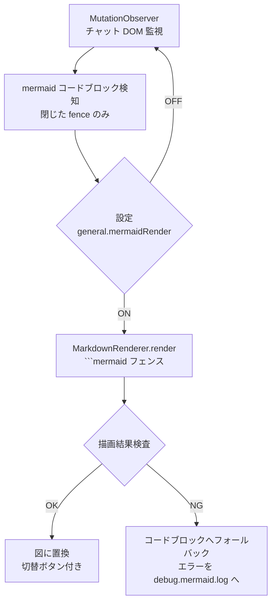

---
tags:
  - design
  - poc
  - poc-017
status: 🟢 安定
version: 1.1.0
created: 2026-09-12 09:06
modified: 2026-09-15
---
# Mermaid チャット内自動描画 設計仕様書（承認待ち）

> 📂 パス：10_Input/Check/2026-09-04_Mermaidチャット内自動描画-design.md
> 📍 原本：`D:\AI-Agent\ClaudianBridge\docs\superpowers\specs\2026-09-04-mermaid-render-design.md`
> 🏷️ バージョン：v1.0（2026-09-04）

> ⚠️ 本ファイルは承認フロー用の写しです。承認後に原本リポジトリ（specs）へ統合・本フォルダから移動します。

---

## 1. 背景・目的

Claudian チャット画面には Mermaid レンダラがなく、mermaid コードブロックがコードのまま表示される。本機能は、閉じた mermaid ブロックを自動的に図へ置換し、チャット画面だけで図の確認を完結させる。

## 2. 要件（決定済み）

| # | 要件 | 決定 |
|:--:|------|------|
| R1 | 描画方式 | 自動描画＋「`</>`」切替ボタン |
| R2 | 描画タイミング | フェンスが閉じた（textContent が 2 回連続同一）ブロックから順次描画 |
| R3 | 描画エンジン | Obsidian 標準 `MarkdownRenderer.render()`（mermaid 非同梱） |
| R4 | エラー時 | 元コードブロックへフォールバック＋「描画失敗」バッジ＋ログ記録 |
| R5 | ログ | プラグイン dir 直下 `debug.mermaid.log` へ追記（diag.ts パターン） |
| R6 | 設定 | `general.mermaidRender`（既定 ON）・SettingTab・i18n（ja/zh/en） |

## 3. アーキテクチャ

code-copy-fence と同一パターンの DOM post-process feature（`src/features/mermaid-render/` 新設、`main.ts` から `setupMermaidRender(app, plugin, store)` で起動）。

## 4. コンポーネント

| コンポーネント | 責務 |
|:--:|------|
| `index.ts` | `setupMermaidRender()`： MutationObserver 管理・処理済みブロックの Set で重複防止・teardown 返却 |
| `render.ts` | ブロック 1 個の描画： フェンス組み立て → `MarkdownRenderer.render()` → 結果検査 → 置換 or フォールバック |
| `logger.ts` | `diag.ts` と同型の追記ログ（`debug.mermaid.log`） |

## 5. 動作仕様

- **検知**： `.claudian-code-wrapper` 内 `pre code` の言語が `mermaid` / `mmd`。処理済み wrapper は再処理しない
- **切替**： 図の右上「`</>`」ボタン ⇔ コード表示、「図として表示」で再描画
- **コピー連携**： 既存 code-copy-fence（言語ラベルクリックコピー）は元コードを非表示保持するため図表示中も機能
- **設定 OFF**： 素通し（code-copy-fence 同様）
- **エラー時**： 元コードブロック表示＋バッジ。エラー内容（メッセージ・スタック先頭 6 行）を `debug.mermaid.log` へ追記

## 6. テスト（TDD・vitest + jsdom）

1. 検知： 言語判定（mermaid/mmd/他言語除外）
2. 検知： 閉じ判定（未確定ブロックを描画しない）
3. 置換： 描画成功時の DOM 置換と切替ボタン生成
4. トグル： 図 ⇔ コード の往復
5. 設定 OFF： 描画しない
6. エラー： フォールバック＋バッジ＋ログ追記

## 📝 更新記録

| バージョン | 日付 | 変更内容 | 変更者 |
|-----------|:----:|---------|:------:|
| v1.0.0 | 2026-09-12 | 初版作成 | MiuMiu 🐾 |
