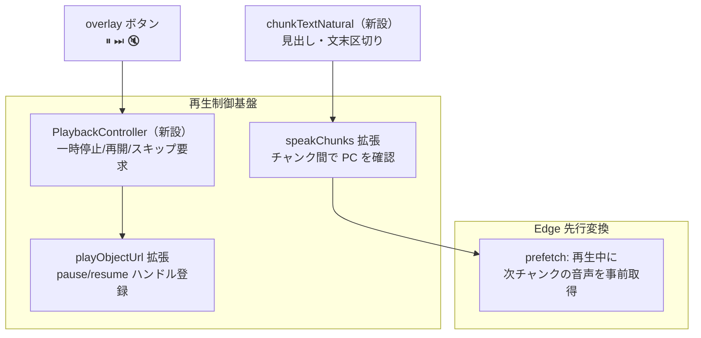

---
tags:
  - design
  - poc
  - poc-017
status: 🟢 安定
version: 1.0.0
created: 2026-09-12 09:06
modified: 2026-09-12 09:06
---
# MD 読み上げ再生制御強化 設計仕様書（承認待ち）

> 📂 パス：10_Input/Check/2026-09-04_MD読み上げ再生制御強化-design.md
> 📍 原本：`D:\AI-Agent\ClaudianBridge\docs\superpowers\specs\2026-09-04-md-read-playback-design.md`
> 🏷️ バージョン：v1.0（2026-09-04）

> ⚠️ 本ファイルは承認フロー用の写しです。承認後、設計書テンプレ命名（`NN_<機能名>設計.md`）に改名して対象 POC_Project へ移動します（行動ルール v2.28）。

---

## 1. 背景・目的

MD 読み上げ（Add to TTS）の overlay ボタンのうち ⏸（再生・停止）と ⏭（早送り）は音声本体を制御しておらず実質無反応。チャンク分割は文字数のみで文の途中で切れる。Edge 経路はチャンク間に合成待ちギャップがある。本設計で以下を実現する：

| # | 項目 |
|:-:|------|
| A | ⏸/⏭ ボタンの実働化（音声本体の一時停止・スキップ） |
| B | チャンク分割の自然化（見出し・文末優先） |
| C | Edge 経路の先行音声変換（チャンク間ギャップ解消） |
| D | ハイライト色のプルダウン選択 |
| E | 自動スクロール位置の設定化（既定 画面上から 40%） |

## 2. 要件（決定済み）

| # | 要件 | 決定 |
|:-:|:----:|------|
| R1 | スコープ | 統合設計（A〜E を 1 設計書） |
| R2 | ⏭ 早送り | 次チャンクへスキップ（現音声中断 → 次チャンク再生・ハイライト追従） |
| R3 | チャンク区切り | 見出しで必ず新チャンク → 文末（`。` `！` `？` 改行）優先で上限内パック → 超過時は途中分割。上限は現状維持（140/500 字） |
| R4 | 色選択 UI | プルダウン（プリセット 8 色）＋自由入力欄の併存 |
| R5 | 先行変換 | Edge 経路のみ新設（Plachta は既存パイプライン・WebSpeech は対象外） |
| R6 | スクロール位置 | 設定 `mdReadHighlight.scrollPositionPct`（0〜100・既定 40）・スライダー UI・範囲外は 40 フォールバック |

## 3. アーキテクチャ

## 4. コンポーネント

| コンポーネント | 責務 |
|:--:|------|
| `playback-controller.ts`（新設） | 再生中 Audio ハンドル管理・`togglePause()` / `skipNext()` / `stop()` |
| `chunking.ts` 拡張 | `chunkTextNatural(text, limit)` 新設。`core.ts` と `md-file-read-flow.ts` の両方で使用しチャンク完全一致を維持 |
| `core.ts` Edge 経路 | 先行取得： チャンク i 再生中に i+1 を fetch → Blob URL 保持 → 即再生 |
| `plachta-tts.ts` | `playObjectUrl` 拡張（pause/resume ハンドル登録） |
| `md-read-highlight/setup.ts` | overlay ハンドラを PlaybackController 経由へ変更 |
| `preview-renderer.ts` | スクロールを「viewport 上から scrollPositionPct%」の scrollTo 計算へ変更 |
| `SettingTabTts.ts` | 色プルダウン（8 色）＋スライダー追加 |

## 5. 動作仕様

### 5.1 ボタン

| ボタン | 動作 |
|:--:|------|
| ⏸/▶ | `audio.pause()` / `play()`・アイコン切替・phase は paused/playing |
| ⏭ | 現チャンク中断 → 次チャンク再生・ハイライト即追従・最終チャンクでは終了処理 |
| 🔇 | 変更なし（全停止＋state クリア） |

### 5.2 チャンク分割（chunkTextNatural）

1. 見出し行（`^\s{0,3}#{1,6}\s`）で強制新チャンク
2. 文末（`。` `！` `？` 改行）で文に切り、上限内で順にパック
3. 1 文が上限超過 → 従来 `chunkText` の途中分割にフォールバック

### 5.3 先行変換（Edge）

チャンク i 再生開始時に i+1 の fetch を開始。fetch 失敗時は当該チャンク再生時に通常 fetch へフォールバック。

### 5.4 スクロール位置

`mdReadHighlight.scrollPositionPct`（既定 40・clamp）。チャンク先頭要素の絶対 Y − コンテナ高さ × pct/100 を scrollTo（smooth）。

### 5.5 色プルダウン

プリセット: 黄 `#ffd54f` / 緑 `#a5d6a7` / 水 `#81d4fa` / 桃 `#f48fb1` / 橙 `#ffab91` / 紫 `#ce93d8` / グレー `#cfd8dc` / 既定 `#ffb300`。自由入力欄は残存。i18n ja/zh/en。

## 6. テスト（TDD）

1. PlaybackController: 一時停止/再開/スキップ/最終チャンク終了（モック Audio）
2. chunkTextNatural: 見出し分割・文末パック・上限超過フォールバック・core と flow の同一結果
3. Edge prefetch: 先行取得の呼び出し順（モック fetch）
4. 色プルダウン: 選択 → 設定反映
5. スクロール: pct 計算・clamp フォールバック

## 📝 更新記録

| バージョン | 日付 | 変更内容 | 変更者 |
|-----------|:----:|---------|:------:|
| v1.0.0 | 2026-09-12 | 初版作成 | MiuMiu 🐾 |
