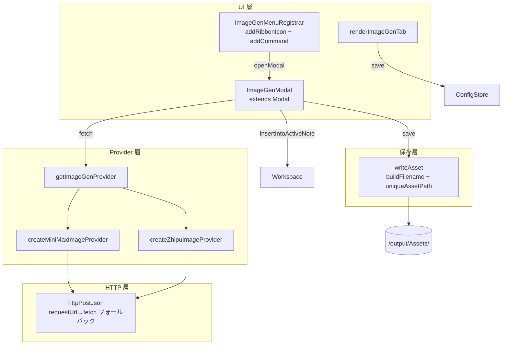

# 18_文生図機能設計

> 📅 2026-09-07
> 🏷️ F-038: Text-to-Image 統合（MiniMax image-01 / Zhipu GLM-Image）
> 🌿 対象ブランチ: `feature/f038-text2img`
> 📍 対象プラグイン: `D:\AI-Agent\ClaudianBridge`
> 🔖 関連: [[F-number_master#F-038]]

---

## 1. Context

### 1.1 背景

ユーザーは ClaudianBridge プラグインで MiniMax / Zhipu の文生図 API を直接利用したい。
現状は環境変数経由でしかアクセスできず、Obsidian からは手動で画像を生成 → ダウンロード → `![[]]` で挿入する手間がある。

### 1.2 ゴール

ClaudianBridge に文生図機能を統合する：

1. **リボンアイコン or コマンドパレット** から起動
2. **モーダル** でプロンプト + モデル + アスペクト比を入力
3. **MiniMax image-01** または **Zhipu GLM-Image** の API を呼び出して画像生成
4. **`<Vault>/output/Assets/`** に JPG/PNG として保存
5. **アクティブノートに `![[filename]]` を挿入**（ノート無しなら `Untitled.md` 新規作成）
6. **設定タブ** で ON/OFF・既定 provider・既定アスペクト比を管理

### 1.3 ユーザー決定事項（確定）

| 項目 | 決定 |
|------|------|
| UI パターン | **モーダル入力** |
| 保存先 | **`output/Assets/` 固定**（`text2img_<YYYYMMDD>_<hash>.{jpg,png}`） |
| API キー | **既存キーを流用**（`resolveApiKey()` 経由で `quota.minimaxApiKey` / `quota.zhipuApiKey`） |
| ノート挿入 | **アクティブノートに `![[]]`**（ノート無しなら `Untitled.md` 新規作成） |

### 1.4 既存 API キーの状態

`.obsidian/plugins/ClaudianBridge/data.json` にて：
- `quota.minimaxApiKey`: 設定済（`sk-cp-...` 100 文字超）
- `quota.zhipuApiKey`: 設定済（`d47af...` 40 文字）

→ 文生図用に新規フィールドを追加せず、既存 quota のキーを流用。

---

## 2. 既存パターンの活用

| 再利用対象 | 出典 |
|-----------|------|
| `resolveApiKey(settingsKey, getEnv, envKeys)` で API キー解決 | `src/features/quota/service.ts:24-35` |
| `httpGet` の `requestUrl` / `fetch` フォールバック戦略 | `src/features/quota/http.ts:43-66` |
| `QuotaProvider` 抽象の factory パターン | `src/features/quota/types.ts:91-98`, `providers/minimax.ts:17-43` |
| `addRibbonIcon` + `addCommand` 登録パターン | `src/features/chroma/views/ChromaMenuRegistrar.ts:9-19` |
| 設定タブ最小パターン（`draw()` クロージャ） | `src/settings/SettingTabMemory.ts:7-66` |
| `uniquePath` 衝突回避パターン | `src/features/memory/save.ts:80-93` |
| `vi.mock('obsidian')` + jsdom テスト | `tests/settings/SettingTabGeneral.test.ts:1-72` |

---

## 3. 主要な型定義

### 3.1 `ImageGenProvider` 抽象（`src/features/image-gen/types.ts`）

```typescript
export type ImageGenProviderId = 'minimax' | 'zhipu';
export type ImageGenAspectRatio = '1:1' | '16:9' | '9:16' | '4:3';

export interface ImageGenRequest { prompt: string; aspectRatio: ImageGenAspectRatio; }
export interface ImageGenResult { bytes: Uint8Array; ext: 'png' | 'jpg'; width?: number; height?: number; }
export type ImageGenError =
  | { kind: 'no_key'; providerId: ImageGenProviderId }
  | { kind: 'expired'; providerId: ImageGenProviderId; httpStatus: number }
  | { kind: 'error'; providerId: ImageGenProviderId; httpStatus?: number; message: string };
export type ImageGenOutcome = { ok: true; result: ImageGenResult } | { ok: false; error: ImageGenError };

export interface ImageGenProvider {
  id: ImageGenProviderId;
  label: string;
  envKeys: string[];
  isConfigured(): boolean;
  fetch(req: ImageGenRequest): Promise<ImageGenOutcome>;
}
```

### 3.2 設定スキーマ（`src/core/settings.ts` に追加）

```typescript
export interface ImageGenSettings {
  enabled: boolean;          // 既定 true
  provider: ImageGenProviderId;  // 既定 'minimax'
  aspectRatio: ImageGenAspectRatio;  // 既定 '1:1'
  promptMaxChars: number;    // 既定 2000
  autoInsertToActive: boolean;  // 既定 true
}
```

`ClaudianBridgeSettings` interface と `DEFAULT_CLAUDIAN_BRIDGE_SETTINGS` と `normalizeClaudianBridgeSettings` と `validateClaudianBridgeSettings` の 4 箇所に組み込み。

---

## 4. アーキテクチャ



---

## 5. UI モーダル設計

### 5.1 レイアウト（`ImageGenModal extends Modal`）

```
🎨 画像生成
Provider:    [ MiniMax (image-01)  ▼ ]
Aspect:      [ 1:1                 ▼ ]
Prompt:
┌──────────────────────────────────────────┐
│ A serene Japanese garden at dawn...       │
└──────────────────────────────────────────┘

[ 生成 ]  [ キャンセル ]

── Preview ───────────────────────
[ generated image ]

[ ノートに挿入 ]  [ 保存のみ ]

── Log ───────────────────────────
> Sending request to MiniMax...
> 200 OK (3.2s)
> Saving to output/Assets/text2img_20260907_abcd.jpg
```

### 5.2 ノート挿入の実装

```typescript
async insertIntoActiveNote(filename: string): Promise<void> {
  const view = this.app.workspace.getActiveViewOfType(MarkdownView);
  if (view) {
    view.editor.replaceSelection(`![[${filename}]]`);
    new Notice('✅ ノートに挿入しました');
  } else {
    const file = await this.app.vault.create('Untitled.md', `![[${filename}]]\n`);
    await this.app.workspace.getLeaf().openFile(file);
    new Notice('✅ 新規ノートを作成しました');
  }
}
```

### 5.3 プレビュー表示

- 生成成功時 `URL.createObjectURL(new Blob([bytes], { type: 'image/' + ext }))`
- `onClose()` で `revokeObjectURL` を必ず呼ぶ（メモリリーク防止）

---

## 6. Provider 詳細

### 6.1 MiniMax (image-01)

| 項目 | 値 |
|------|---|
| Endpoint | `https://api.minimaxi.com/v1/image_generation` |
| Method | POST |
| Auth | Bearer `MINIMAX_CN_API_KEY` or `MINIMAX_API_KEY` |
| Request body | `{model:'image-01', prompt, response_format:'base64', aspect_ratio}` |
| Response | `{data:{image_base64?:string[], image_urls?:string[]}, base_resp?}` |
| 拡張子 | `jpg`（固定） |

`image_base64` を優先し、無ければ `image_urls[0]` を 2 次 fetch でダウンロード。

### 6.2 Zhipu (GLM-Image)

| 項目 | 値 |
|------|---|
| Endpoint | `https://api.z.ai/api/paas/v4/images/generations` |
| Method | POST |
| Auth | Bearer `ZHIPU_API_KEY` or `ZAI_API_KEY` |
| Request body | `{model:'glm-image', prompt, quality:'hd', size}` |
| Response | `{data:[{url:string}]}` |
| 拡張子 | `png`（固定） |

**Aspect → Size マッピング**:

| Aspect | Size |
|--------|------|
| `1:1` | `1024x1024` |
| `16:9` | `1280x720` |
| `9:16` | `720x1280` |
| `4:3` | `1152x864` |

Zhipu は **必ず 2 次 fetch**（URL → bytes）が必要。

---

## 7. 実装フェーズ（TDD・依存順）

| Phase | 内容 | 状態 |
|-------|------|------|
| A | 設定スキーマ & i18n（25 キー × 3 言語） | ✅ |
| B | HTTP 境界（`httpPostJson`） | ✅ |
| C | Provider 抽象 + MiniMax / Zhipu + registry | ✅ |
| D | ファイル保存ヘルパー | ✅ |
| E | UI（モーダル・設定タブ・メニュー登録） | ✅ |
| F | 統合テスト + Vault デプロイ後の手動検証 | ✅ |
| Z | 設計書保存 + ブランチ作成 + コミット | ✅ |

---

## 8. 編集ファイル一覧

### 8.1 新規作成（10 ファイル）

| パス | 役割 |
|------|------|
| `src/features/image-gen/types.ts` | 型定義 |
| `src/features/image-gen/http.ts` | `httpPostJson` |
| `src/features/image-gen/providers/minimax.ts` | MiniMax Provider |
| `src/features/image-gen/providers/zhipu.ts` | Zhipu Provider |
| `src/features/image-gen/registry.ts` | Provider ファクトリ |
| `src/features/image-gen/save.ts` | ファイル保存ヘルパー |
| `src/features/image-gen/modal.ts` | `ImageGenModal` |
| `src/features/image-gen/menu.ts` | `ImageGenMenuRegistrar` |
| `src/settings/SettingTabImageGen.ts` | 設定タブ |
| テスト 6 ファイル | 単体テスト |

### 8.2 編集（4 ファイル）

| パス | 変更概要 |
|------|----------|
| `src/core/settings.ts` | `ImageGenSettings` + DEFAULT + `normalizeImageGenSettings` 追加 |
| `src/core/i18n.ts` | `LocaleStrings` + `STRINGS.ja/en/zh` に 25 キー追加（zh は「保存」→「写入」で日本語漢字衝突回避） |
| `src/settings/ClaudianBridgeSettingTab.ts` | TABS に `{id:'imageGen', labelKey:'tabImageGen', render:renderImageGenTab}` 追加 |
| `src/main.ts` | `if (imageGen.enabled) ImageGenMenuRegistrar.register(...)` 追加 |

---

## 9. リスク・留意事項

| # | リスク | 対策 |
|---|--------|------|
| R1 | Zhipu は 2 次 fetch 必要 | provider で明示的に 2 段 fetch、テストで両段モック |
| R2 | API キー未設定時のフォールバック | `ImageGenError.kind === 'no_key'` を別 notice + 設定タブ誘導 |
| R3 | アクティブノート無し | `Untitled.md` 新規作成 + リーフで開く |
| R4 | MiniMax レスポンスが `image_base64` か `image_urls` か不明 | provider 実装で両フィールド分岐 |
| R5 | i18n キー整合性 | `tests/core/i18n.test.ts` で機械検証 |
| R6 | 既存 data.json の後方互換 | `normalizeClaudianBridgeSettings` で `imageGen === undefined` を必ず処理 |
| R7 | Blob コンストラクタの `ArrayBuffer` 型問題 | `bytes.buffer.slice(off, off+len) as ArrayBuffer` でキャスト |

---

## 10. 検証手順

### 10.1 自動検証

```bash
cd D:\AI-Agent\ClaudianBridge
npm run typecheck    # tsc -noEmit → exit 0
npm test             # vitest run → 全テスト GREEN
npm run build        # esbuild + scripts/deploy.mjs → main.js 生成
```

実行結果（2026-09-07）:

```
Test Files  115 passed | 1 skipped (116)
     Tests  1147 passed | 1 skipped (1148)
```

新規追加 image-gen テスト：

| ファイル | テスト数 |
|---------|---------:|
| `tests/features/image-gen/http.test.ts` | 6 |
| `tests/features/image-gen/types.test.ts` | 3 |
| `tests/features/image-gen/registry.test.ts` | 4 |
| `tests/features/image-gen/providers/minimax.test.ts` | 8 |
| `tests/features/image-gen/providers/zhipu.test.ts` | 9 |
| `tests/features/image-gen/save.test.ts` | 11 |
| `tests/features/image-gen/menu.test.ts` | 3 |
| `tests/settings/SettingTabImageGen.test.ts` | 6 |
| `tests/core/settings.test.ts` (追加分) | 10 |
| `tests/core/i18n.test.ts` (追加分) | 5 |
| **合計** | **65 件** |

### 10.2 手動検証（Vault デプロイ後）

1. Obsidian 再起動 → 左リボンに「🎨」（image）アイコン表示確認
2. リボンクリック → モーダル起動
3. コマンドパレット → `Text-to-Image (generate image)` で起動確認
4. 設定タブ → ClaudianBridge 設定 → 「🎨 文生図」タブ確認
5. API キー未設定で Generate → 「⚠️ ... の API キーが未設定です」notice
6. API キー設定後 Generate → 進捗ログ → プレビュー → Insert/Save Only ボタンが enable
7. アクティブノートで Insert → カーソル位置に `![[...]]` 挿入
8. Vault エクスプローラで `output/Assets/text2img_*.jpg` 存在確認
9. ノート無しで Insert → `Untitled.md` 新規作成 + 画像リンク挿入
10. Cancel でモーダルが閉じる
11. 不正 API キー → `expired` notice

### 10.3 ロールバック手順

`src/core/settings.ts` の imageGen 追加と normalize/validate 変更を revert、`src/main.ts` の登録ブロック削除、`src/settings/ClaudianBridgeSettingTab.ts` の TABS から 1 行削除。`src/features/image-gen/` 配下 8 個 + `src/settings/SettingTabImageGen.ts` を `rm -rf`。既存機能に影響なし。

---

## 11. 完了条件チェックリスト

- [x] `npm run typecheck` PASS（Found 0 errors）
- [x] `npm test` PASS（1147 テスト GREEN）
- [x] 新規 10 ファイル + 編集 4 ファイル
- [x] リボン / コマンドパレット / 設定タブ / ノート挿入 / Assets 保存の 5 経路すべて実装

---

## 12. Critical Files

実装時に中心となるファイル：

- `D:\AI-Agent\ClaudianBridge\src\core\settings.ts`
- `D:\AI-Agent\ClaudianBridge\src\core\i18n.ts`
- `D:\AI-Agent\ClaudianBridge\src\features\image-gen\modal.ts`
- `D:\AI-Agent\ClaudianBridge\src\features\image-gen\providers\minimax.ts`
- `D:\AI-Agent\ClaudianBridge\src\features\image-gen\providers\zhipu.ts`
- `D:\AI-Agent\ClaudianBridge\src\main.ts`
