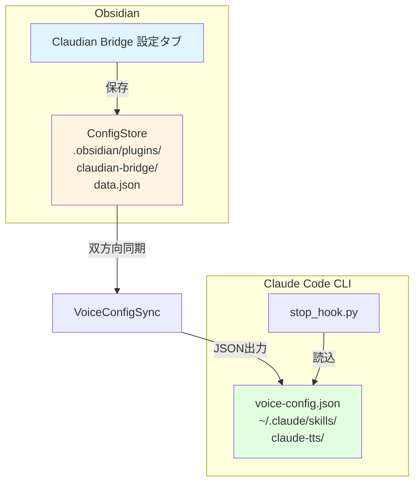

# ClaudeTTS設定融合設計書

> 📂 路径：`80_POC_Projects/POC_017_ClaudianBridge/02_設計文書/2026-08-14-claude-tts-settings-merger-design.md`
> 📍 対象：`Claudian Bridge v0.9.0` + `claude-tts-settings v0.1.1`
> 📅 作成日：2026-08-14
> 🐕 担当：MiuMiu 🐾
> 🔗 関連：`00_Vault管理/_設計仕様書/2026-08-12-task-completion-report-design.md`

---

## 一、背景与目标

### 1.1 背景

現在、TTS設定は2つのプラグインに分散しています：

| プラグイン | 設定ファイル | 対象 | 現状 |
|:----|------|------|------|
| **Claudian Bridge** | `.obsidian/plugins/claudian-bridge/data.json` | Obsidianユーザー | ✅ メンテナンス中 |
| **claude-tts-settings** | `~/.claude/skills/claude-tts/voice-config.json` | Claude Code CLI | ⚠️ 重複機能 |

### 1.2 問題

| 問題 | 影響 |
|:----|------|
| **設定重複** | ユーザーが2箇所で設定する必要がある |
| **優先順位不明** | Claude Code CLI + Obsidian同時利用時の挙動未定義 |
| **メンテナンス負荷** | 2つの設定UIを保守する必要がある |
| **ユーザー体験** | 設定変更が反映されない誤解 |

### 1.3 目標

- **SSOT化**: 1つの設定UI（Claudian Bridge）に統合
- **下位互換性**: Claude Code CLI（POC_015）が動作し続ける
- **安全な融合**: 既存設定を損なわない
- **設定独立性**: 融合後も `voice-config.json` は維持（CLI用）

---

## 二、設計原則

| # | 原則 | 説明 |
|:--:|------|------|
| **P1** | **Claudian Bridge優先** | Claudian Bridgeがマスター設定、CLIはスレーブ |
| **P2** | **双方向同期** | Claudian Bridge保存 → `voice-config.json` に自動出力 |
| **P3** | **既存設定尊重** | 移行時に既存値を上書きしない |
| **P4** | **段階的廃止** | claude-tts-settingsは非推奨化 → 後で削除 |
| **P5** | **設定独立性** | CLIがClaudian Bridgeなしで動作可能 |

---

## 三、アーキテクチャ設計

### 3.1 設定フロー



### 3.2 設定マッピング

| Claudian Bridge (SSOT) | voice-config.json (CLI) | 説明 |
|:-----------------------|:------------------------|------|
| `tts.enabled` | `enabled` | 読み上げON/OFF |
| `tts.engine` | `engine_priority[0]` | エンジン選択 |
| `tts.voices.edge.zh` | `voice_overrides["zh-CN"]` | 中国語音色 |
| `tts.voices.edge.ja` | `voice_overrides["ja-JP"]` | 日本語音色 |
| `tts.voices.edge.en` | `voice_overrides["en-US"]` | 英語音色 |
| **新設** | `full_text` | 全文読み上げ（CLI用） |
| **新設** | `max_chars` | 最大文字数（CLI用） |
| **新設** | `debounce_ms` | 防抖窓（CLI用） |
| **新設** | `speech_filter` | 朗读文案优化（CLI用） |

### 3.3 エンジンマッピング

| Claudian Bridge | voice-config.json | 優先順位 |
|:----------------|:------------------|:--------:|
| `edge` | `["edge-tts", "pyttsx3", "system"]` | edge-tts優先 |
| `webspeech` | `["pyttsx3", "system"]` | ローカル優先 |
| `plachta` | `["edge-tts", "pyttsx3", "system"]` | edge-tts優先（フォールバック） |

---

## 四、実装設計

### 4.1 VoiceConfigSync クラス

**ファイル**: `src/features/tts/voice-config-sync.ts`

```typescript
/**
 * voice-config.json 双方向同期レイヤー
 *
 * 職責:
 * 1. Claudian Bridge保存 → voice-config.json 出力
 * 2. 起動時、既存voice-config.jsonから値を読み取り（初期値として使用）
 * 3. エラー時は静かにfallback（Claudian Bridge動作継続）
 */
export class VoiceConfigSync {
  private readonly voiceConfigPath: string;
  private readonly store: ConfigStore;

  constructor(store: ConfigStore) {
    this.voiceConfigPath = path.join(
      os.homedir(),
      '.claude',
      'skills',
      'claude-tts',
      'voice-config.json'
    );
    this.store = store;
  }

  /** Claudian Bridge設定 → voice-config.json に変換して出力 */
  async exportToVoiceConfig(cfg: ClaudianBridgeSettings): Promise<void> {
    const voiceConfig = this.toVoiceConfigFormat(cfg);
    await fs.writeFile(this.voiceConfigPath, JSON.stringify(voiceConfig, null, 2), 'utf-8');
  }

  /** voice-config.json → Claudian Bridge設定に変換（移行用） */
  async importFromVoiceConfig(): Promise<Partial<ClaudianBridgeSettings> | null> {
    if (!fs.existsSync(this.voiceConfigPath)) return null;

    const raw = await fs.readFile(this.voiceConfigPath, 'utf-8');
    const voiceConfig = JSON.parse(raw);

    return this.fromVoiceConfigFormat(voiceConfig);
  }

  /** Claudian Bridgeスキーマ → voice-config.json スキーマ 変換 */
  private toVoiceConfigFormat(cfg: ClaudianBridgeSettings): VoiceConfig {
    const tts = cfg.tts;

    // エンジンマッピング
    let enginePriority: string[] = [];
    if (tts.engine === 'edge') {
      enginePriority = ['edge-tts', 'pyttsx3', 'system'];
    } else if (tts.engine === 'webspeech') {
      enginePriority = ['pyttsx3', 'system'];
    } else if (tts.engine === 'plachta') {
      enginePriority = ['edge-tts', 'pyttsx3', 'system'];
    }

    return {
      enabled: tts.enabled,
      voice: tts.voices.edge.zh, // デフォルトは中国語音色
      max_chars: tts.cli?.max_chars ?? 300,
      debounce_ms: tts.cli?.debounce_ms ?? 2000,
      full_text: tts.cli?.full_text ?? false,
      lang_strategy: 'auto',
      engine_priority: enginePriority,
      voice_overrides: {
        'zh-CN': tts.voices.edge.zh,
        'ja-JP': tts.voices.edge.ja,
        'en-US': tts.voices.edge.en,
      },
      speech_filter: tts.cli?.speech_filter ?? {
        emoji: true,
        kaomoji: true,
        ascii_emoticon: true,
        emoji_shortcode: true,
      },
    };
  }

  /** voice-config.json → Claudian Bridgeスキーマ 変換 */
  private fromVoiceConfigFormat(vc: VoiceConfig): Partial<ClaudianBridgeSettings> {
    return {
      tts: {
        enabled: vc.enabled ?? true,
        engine: vc.engine_priority?.[0] === 'edge-tts' ? 'edge' : 'webspeech',
        voices: {
          edge: {
            zh: vc.voice_overrides?.['zh-CN'] ?? vc.voice ?? 'xiaoxiao',
            ja: vc.voice_overrides?.['ja-JP'] ?? 'nanami',
            en: vc.voice_overrides?.['en-US'] ?? 'aria',
          },
          webspeech: {
            zh: vc.voice_overrides?.['zh-CN'] ?? vc.voice ?? 'xiaoxiao',
            ja: vc.voice_overrides?.['ja-JP'] ?? 'nanami',
            en: vc.voice_overrides?.['en-US'] ?? 'aria',
          },
        },
        cli: {
          full_text: vc.full_text ?? false,
          max_chars: vc.max_chars ?? 300,
          debounce_ms: vc.debounce_ms ?? 2000,
          speech_filter: vc.speech_filter ?? {
            emoji: true,
            kaomoji: true,
            ascii_emoticon: true,
            emoji_shortcode: true,
          },
        },
      },
    };
  }
}
```

### 4.2 設定スキーマ拡張

**ファイル**: `src/core/settings.ts`

```typescript
export interface ClaudianBridgeSettings {
  // ... 既存フィールド ...

  tts: {
    enabled: boolean;
    engine: TtsEngine;
    voices: {
      edge: { zh: string; ja: string; en: string };
      webspeech: { zh: string; ja: string; en: string };
    };
    plachta?: PlachtaSettings;

    // ★ 新設: Claude Code CLI用設定
    cli?: {
      full_text: boolean;      // 全文読み上げ
      max_chars: number;       // 最大文字数
      debounce_ms: number;    // 防抖窓
      speech_filter: {        // 朗读文案优化
        emoji: boolean;
        kaomoji: boolean;
        ascii_emoticon: boolean;
        emoji_shortcode: boolean;
      };
    };
  };
}
```

### 4.3 設定タブ拡張

**ファイル**: `src/settings/SettingTabTts.ts`

既存のTTS設定タブに以下を追加：

```typescript
// 6. Claude Code CLI用設定（CLI用詳細設定セクション）
if (cfg.tts.engine === 'edge' || cfg.tts.engine === 'webspeech') {
  const cliBox = containerEl.createDiv({ cls: 'cb-tts-cli' });
  cliBox.createEl('h3', { text: '🖥️ Claude Code CLI 用設定' });

  // 6a. 全文読み上げ
  new Setting(cliBox)
    .setName('📖 全文読み上げ')
    .setDesc('ONにすると最大文字数制限なしで全文を読み上げ（Claude Code CLI専用）')
    .addToggle((t) => t.setValue(cfg.tts.cli?.full_text ?? false).onChange((v) => {
      const latest = store.load();
      store.save({
        ...latest,
        tts: {
          ...latest.tts,
          cli: { ...latest.tts.cli, full_text: v },
        },
      });
    }));

  // 6b. 最大文字数
  new Setting(cliBox)
    .setName('📏 最大文字数')
    .setDesc('これを超えるテキストは読み上げない（全文読み上げON時は無効）')
    .addText((t) => t
      .setValue(String(cfg.tts.cli?.max_chars ?? 300))
      .onChange((v) => {
        const num = Number(v);
        if (isNaN(num) || num < 1) return;
        const latest = store.load();
        store.save({
          ...latest,
          tts: {
            ...latest.tts,
            cli: { ...latest.tts.cli, max_chars: num },
          },
        });
      })
    );

  // 6c. 防抖窓
  new Setting(cliBox)
    .setName('⏱️ 防抖窓 (ms)')
    .setDesc('連続応答時の読み上げ抑制時間')
    .addText((t) => t
      .setValue(String(cfg.tts.cli?.debounce_ms ?? 2000))
      .onChange((v) => {
        const num = Number(v);
        if (isNaN(num) || num < 0) return;
        const latest = store.load();
        store.save({
          ...latest,
          tts: {
            ...latest.tts,
            cli: { ...latest.tts.cli, debounce_ms: num },
          },
        });
      })
    );

  // 6d. 朗读文案优化
  const filterBox = cliBox.createDiv({ cls: 'cb-tts-filter' });
  filterBox.createEl('h4', { text: '🔇 朗读文案优化' });
  const filterDefaults = cfg.tts.cli?.speech_filter ?? {
    emoji: true, kaomoji: true, ascii_emoticon: true, emoji_shortcode: true,
  };
  const filterItems: Array<[keyof typeof filterDefaults, string, string]> = [
    ['emoji', 'Emoji絵文字', '🎉📋✅ などを除去'],
    ['kaomoji', '颜文字', '(^_^) (T_T) などを除去'],
    ['ascii_emoticon', 'ASCII表情', ':) :D <3 などを除去'],
    ['emoji_shortcode', 'Emoji短碼', ':tada: :white_check_mark: などを除去'],
  ];
  for (const [key, name, desc] of filterItems) {
    new Setting(filterBox)
      .setName(`🔇 ${name}`)
      .setDesc(desc)
      .addToggle((t) => t.setValue(filterDefaults[key] ?? true).onChange((v) => {
        const latest = store.load();
        store.save({
          ...latest,
          tts: {
            ...latest.tts,
            cli: {
              ...latest.tts.cli,
              speech_filter: { ...filterDefaults, [key]: v },
            },
          },
        });
      }));
  }
}
```

### 4.4 main.ts統合

**ファイル**: `src/main.ts`

```typescript
// onload() 内に追加
import { VoiceConfigSync } from './features/tts/voice-config-sync';

async onload(): Promise<void> {
  // ... 既存コード ...

  // ★ VoiceConfigSync初期化
  const voiceSync = new VoiceConfigSync(this.store);

  // ★ 既存voice-config.jsonから値をインポート（初回のみ）
  const imported = await voiceSync.importFromVoiceConfig();
  if (imported && !this.store.load().general.migratedFrom?.claudeTtsSettings) {
    const current = this.store.load();
    const merged = deepMerge(current, imported); // 既存値を優先
    this.store.save({
      ...merged,
      general: {
        ...merged.general,
        migratedFrom: {
          ...merged.general.migratedFrom,
          claudeTtsSettings: true,
        },
      },
    });
  }

  // ★ store.watchに双方向同期を登録
  this.store.watch(async () => {
    const cfg = this.store.load();
    await voiceSync.exportToVoiceConfig(cfg);
  });

  // ... 既存コード ...
}
```

---

## 五、移行計画

### 5.1 フェーズ

| フェーズ | 期間 | 内容 |
|:-------|-----|------|
| **F1 実装** | 1日 | VoiceConfigSync + 設定タブ拡張 |
| **F2 テスト** | 0.5日 | 単体テスト + 統合テスト |
| **F3 リリース** | 即時 | v0.10.0としてリリース |
| **F4 非推奨化** | 1週間後 | claude-tts-settingsに「非推奨」Notice表示 |
| **F5 廃止** | 1ヶ月後 | claude-tts-settings削除 |

### 5.2 検証手順

| # | ステップ | 検証内容 |
|:--:|------|----------|
| 1 | voice-config.json存在しない状態 | Claudian Bridgeのみで動作 |
| 2 | voice-config.json既存状態 | 値が正しくインポートされる |
| 3 | Claudian Bridge設定変更 | voice-config.jsonに反映される |
| 4 | Claude Code CLI動作確認 | voice-config.json読み取りで正常動作 |
| 5 | claude-tts-settings無効化 | Claudian Bridgeで完結 |

---

## 六、リスク評価

| リスク | 影響 | 緩和策 |
|------|------|--------|
| **設定上書き** | 高 | 既存値を優先するmerge戦略 |
| **voice-config.json破損** | 中 | JSONバリデーション + try-catch |
| **同期不整合** | 中 | store.watchで即時同期 |
| **Claudian Bridge未導入環境** | 低 | voice-config.json直接編集可 |

---

## 七、ユーザーへの通知

### 7.1 リリースノート（v0.10.0）

```markdown
## 🎙️ ClaudeTTS設定統合

**変更内容**:
- ClaudeTTS（claude-tts-settings）の設定機能をClaudian Bridgeに統合しました
- 設定は1箇所（Claudian Bridge）で管理可能になりました
- Claude Code CLI（POC_015）は引き続き動作します

**移行方法**:
- 既存のvoice-config.jsonは自動的にインポートされます
- 今後はClaudian Bridgeの設定タブから設定してください

**廃止予定**:
- claude-tts-settingsプラグインは1ヶ月後に廃止予定です
- 事前にObsidianのプラグイン設定で無効化してください
```

### 7.2 非推奨Notice（F4）

```typescript
// claude-tts-settingsプラグイン内
new Notice(
  '⚠️ ClaudeTTS設定はClaudian Bridgeに統合されました。\n' +
  '今後はClaudian Bridgeの設定タブから設定してください。\n' +
  '本プラグインは1ヶ月後に削除されます。'
);
```

---

## 八、受け入れ基準

| # | 基準 | 検証方法 |
|:--:|------|----------|
| AC-1 | 既存voice-config.jsonがインポートされる | 既存設定が保持される |
| AC-2 | Claudian Bridge設定変更がvoice-config.jsonに反映 | JSONファイルが更新される |
| AC-3 | Claude Code CLIが動作し続ける | CLIで読み上げが動作 |
| AC-4 | claude-tts-settingsなしで完結 | Claudian Bridge単体で動作 |
| AC-5 | 設定独立性が維持される | CLIがClaudian Bridgeなしで動作 |

---

## 九、関連ドキュメント更新

| ドキュメント | 更新内容 |
|:------------|----------|
| README.md | TTS設定統合の記載追加 |
| 00_アーキテクチャ総覧.md | VoiceConfigSync追加 |
| CHANGELOG.md | v0.10.0変更点 |
| 08_説明書/03_リリースノート/リリースノート.md | v0.10.0リリース内容 |

---

*🎙️ ClaudeTTS設定融合設計書 v1.0 · MiuMiu 🐾 · 2026-08-14*
