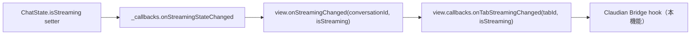
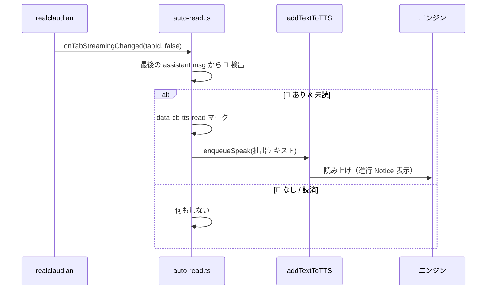

# タスク終了時自動TTS読み上げ設計書

> 📂 路径：`80_POC_Projects/POC_017_ClaudianBridge/02_設計文書/2026-08-14-task-completion-auto-tts-design.md`
> 📍 対象：`Claudian Bridge v0.10.0` TTS機能
> 📅 作成日：2026-08-14
> 🐕 担当：MiuMiu 🐾
> 🔗 関連：`src/features/tts/core.ts`, `src/main.ts`, [[00_Vault管理/MiuMiu行動ルール]]（✅ タスク終了報告ルール v2.13）

---

## 一、背景与目标

### 1.1 問題報告

**現象**: Claudian チャットでタスク終了報告（📢 ヘッダー）が表示されても、音声読み上げが自動で行われない。

**背景**:

- 行動ルール v2.13 の「📢 口頭報告ヘッダー」は敬体4原則により**読み上げ専用に設計**されている（拡張子非読・記号非読）
- 現状は手動でテキスト選択 →「Add to TTS」が必要
- Claude Code CLI 側の `stop_hook` は存在するが、Claudian チャット（realclaudian プラグイン）には自動読み上げ経路がない

### 1.2 目標

- ✅ Claudian チャットでアシスタントの応答ストリーミングが完了し、📢 報告ブロックを含む場合、自動で TTS 読み上げ
- ✅ 読み上げ範囲（📢 ヘッダーのみ / メッセージ全文）を設定画面で選択可能
- ✅ デフォルト ON（TTS 有効時）
- ✅ 読み上げ中に新しい報告が来たら「中断して最新を読む」（latest-wins）

### 1.3 ユーザー決定事項（2026-08-14 確認済み）

| # | 項目 | 決定 |
|:-:|------|------|
| 1 | 読み上げ範囲 | **設定画面で選択可能**（`header` / `full`、デフォルト `header`） |
| 2 | デフォルト状態 | **ON**（`tts.enabled` が前提） |
| 3 | 連続報告時 | **中断して最新を読む**（latest-wins） |

---

## 二、検出方式の比較と選定

### 2.1 realclaudian 内部構造（main.js 調査結果）

| 要素 | 識別子 | 用途 |
|------|--------|------|
| チャット領域 | `.claudian-messages` | メッセージコンテナ（選定 watcher で既利用） |
| アシスタントメッセージ | `.claudian-message-assistant` | 個別メッセージ要素 |
| メッセージ本文 | `.claudian-message-content` | レンダリング済み内容 |
| ストリーミング状態 | `view.callbacks.onTabStreamingChanged(tabId, isStreaming)` | 完了検出フックポイント |
| view 取得 | `plugin.getView()` / `plugin.getAllViews()` | 既存連携で利用中（`appendToActiveInput`） |

コールバックチェーン（bundle 実測）:



### 2.2 アプローチ比較

| | A. 内部コールバック hook + DOM 抽出 👑 | B. MutationObserver + デバウンス | C. 内部 state.messages 直読み |
|:--|:--|:--|:--|
| 完了検出 | `onTabStreamingChanged`（true→false）。**正確・誤発火なし** | 変異停止 ~1.5 秒で判定。**思考ポーズで誤発火しうる** | A と同じ |
| テキスト抽出 | 完了 view の DOM から blockquote 抽出 | 同左 | state から生 markdown。**最も正確** |
| 内部依存 | 浅い（公開済み `getView` + コールバック1点） | なし | 深い（state 構造まで踏込） |
| アップグレード耐性 | 中（プロパティ名は minify 後も維持） | 高い | 低 |

### 2.3 選定: アプローチ A（ユーザー承認済み）

**理由**:

1. 完了検出が「思考中の長いポーズ」に引っかからない（B の最大の欠陥を回避）
2. 依存は `appendToActiveInput` 等の既存連携と同レベル（学習記録「升级后须 grep 复核」運用を踏襲）
3. hook ポイント消失時は Notice 警告 + 機能 OFF に graceful 退化（黙って壊れない）

---

## 三、アーキテクチャ

### 3.1 新規モジュール `src/features/tts/auto-read.ts`

責務: realclaudian view のストリーミング完了を検出し、報告テキストを抽出して `addTextToTTS` に渡す。

```typescript
export interface AutoReadDeps {
  app: App;
  store: ConfigStore;
  speak: (text: string) => Promise<boolean>;  // addTextToTTS への薄いラッパ（テスト容易性）
}

export function setupAutoReadTTS(deps: AutoReadDeps): () => void;
```

**内部構成**:

| 関数 | 責務 |
|------|------|
| `setupAutoReadTTS` | 全 view の hook 装着・`layout-change` での再 hook・cleanup 返却 |
| `hookView(view)` | `view.callbacks.onTabStreamingChanged` をチェーン（元コールバック保存→呼出し後に自前処理） |
| `onStreamEnd(view)` | true→false 遷移時に発火。抽出→重複チェック→読み上げ |
| `extractReportText(containerEl, scope)` | DOM 抽出（§四）。**純粋関数的に分離してテスト可能に** |

**hook の多重装着防止**: view ごとに `WeakSet`（または view オブジェクトへの目印プロパティ）で管理。`layout-change` イベントで走査し、未 hook の view のみ装着。

**hook ポイント検証**: `view.callbacks` が存在し `onTabStreamingChanged` が書き換え可能かを確認。失敗時は `view.onStreamingChanged` メソッドのラップにフォールバック。それも不可なら:

```typescript
new Notice('⚠️ 自動読み上げ: Claudian 側の構造が変更されたため無効です（realclaudian アップグレード後は grep 复核が必要です）');
console.warn('[claudian-bridge] auto-read: hook point not found');
```

### 3.2 latest-wins コーディネータ

「中断して最新を読む」のエンジン別実現方式:

| エンジン | 中断方式 |
|---------|---------|
| WebSpeech | **真の中断**: `webSpeechSpeak` が冒頭で `synth.cancel()` する既存実装により自然に実現 |
| edge / Plachta | **最新のみ保留**: プロセス/Audio を外部から kill する手段がないため、読み上げ中に来た新報告は「最新1件のみ保留スロット」に格納。現在の読み上げ完了後に保留分を読む（古い保留は破棄） |

```typescript
// auto-read.ts 内部状態
let speaking = false;
let pendingLatest: string | null = null;

async function enqueueSpeak(text: string): Promise<void> {
  if (speaking) { pendingLatest = text; return; }  // 最新で上書き（古いのは破棄）
  speaking = true;
  try {
    await deps.speak(text);
  } finally {
    speaking = false;
    if (pendingLatest) { const t = pendingLatest; pendingLatest = null; void enqueueSpeak(t); }
  }
}
```

> 📍 将来拡張（本スコープ外）: エンジンへの cancel ハンドル公開（edge は child process kill、Plachta は Audio.pause）

### 3.3 main.ts への配線

`setupSelectionWatcher` 登録の直後に追加:

```typescript
// ★ v0.11.0: タスク終了時の自動読み上げ
const cleanupAutoRead = setupAutoReadTTS({
  app: this.app,
  store: this.store,
  speak: async (text) => {
    const cfg = this.store.load();
    if (!cfg.tts.enabled || !cfg.tts.autoRead.enabled) return false;
    return addTextToTTS(this.app, text, cfg.tts);
  },
});
this.register(cleanupAutoRead);
```

---

## 四、報告テキスト抽出仕様

### 4.1 📢 報告フォーマット（行動ルール v2.13）

```markdown
> 📢 [タスク名] を [動詞] しました。[結論]。
> 検証は [検証内容] 通過しました。成果物は [成果物概要]。
> 次は **[推奨案]** をお勧めします（他の選択肢・理由・リスクは末尾へ）。
```

レンダリング後 DOM では `<blockquote>` 要素となり、先頭行が `📢` で始まる。

### 4.2 抽出アルゴリズム `extractReportText(containerEl, scope)`

1. `containerEl`（完了した view の `.claudian-messages`）内の**最後の** `.claudian-message-assistant` を取得
2. その中の `blockquote` を走査し、`textContent.trim()` が `📢` で始まるものを探す
3. **発火条件**: 📢 blockquote が存在すること（scope に関わらず共通）
4. 抽出テキスト:
   - `scope === 'header'`: 該当 blockquote の `innerText`（3〜4行）
   - `scope === 'full'`: メッセージ全体（`.claudian-message-content`）の `innerText`
5. 空文字なら読み上げない

### 4.3 重複読み上げ防止

- 読み上げた blockquote（header）または message 要素（full）に `data-cb-tts-read="1"` 属性を付与
- 発火時に属性があればスキップ（同一メッセージの再評価・再レンダリング対策）
- **履歴会話を開いた場合**: ストリーミング完了遷移が発生しないため自然に読み上げられない（追加対策不要）

### 4.4 読み上げないケース

| ケース | 理由 |
|--------|------|
| 📢 blockquote を含まない通常応答 | 発火条件を満たさない |
| 履歴会話の表示 | ストリーミング遷移なし |
| ユーザーがキャンセル | 部分的な 📢 が残る可能性は許容（レアケース・実害小） |
| `tts.enabled=false` / `autoRead.enabled=false` | speak ラッパで拒否 |

---

## 五、設定スキーマ

### 5.1 `src/core/settings.ts` 追加

```typescript
export interface TtsAutoReadSettings {
  /** タスク終了時の自動読み上げ（デフォルト true） */
  enabled: boolean;
  /** 読み上げ範囲: header = 📢 blockquote のみ / full = メッセージ全文 */
  scope: 'header' | 'full';
}

export const DEFAULT_TTS_AUTO_READ: TtsAutoReadSettings = {
  enabled: true,
  scope: 'header',
};

// TtsSettings に追加
tts: {
  // ...既存フィールド
  autoRead: TtsAutoReadSettings;
}
```

- `normalizeTtsSettings` で既存 data.json（autoRead 欠落）にデフォルト補完 → **マイグレーション不要**
- validate: `scope` は `'header' | 'full'` 以外を拒否

### 5.2 設定タブ（`SettingTabTts.ts`）

TTS タブ末尾に「🔊 タスク終了時の自動読み上げ」セクション追加:

| 項目 | コントロール | 値 |
|------|------------|-----|
| 有効化 | トグル | `autoRead.enabled`（デフォルト ON） |
| 読み上げ範囲 | ドロップダウン | `📢 ヘッダーのみ` / `メッセージ全文` |

i18n キー（ja/zh/en 各2キー）: `ttsAutoReadEnabled`, `ttsAutoReadScope`

---

## 六、データフロー



---

## 七、エラーハンドリング

| ケース | 挙動 |
|--------|------|
| realclaudian 未インストール/無効 | hook 対象 view なし → 何もしない（Notice なし、通常状態） |
| hook ポイント消失（アップグレード後） | 初回のみ Notice 警告 + console.warn、機能 OFF |
| 抽出で例外 | try/catch で握りつぶし console.error（TTS 失敗でチャット動作を壊さない） |
| speak 失敗 | 既存のエラー Notice（addTextToTTS 内）に委譲 |
| view 破棄 | WeakSet 管理のため GC に追随、cleanup で参照クリア |

---

## 八、テスト計画

| # | テスト | 対象 |
|:-:|--------|------|
| 1 | `extractReportText`: 📢 blockquote 抽出（header scope） | 最小フェイク DOM 要素 |
| 2 | `extractReportText`: full scope でメッセージ全文 | 同上 |
| 3 | `extractReportText`: 📢 なし → null | 同上 |
| 4 | `extractReportText`: `data-cb-tts-read` 付き → null | 同上 |
| 5 | hook チェーン: 元コールバック呼出し + true→false で発火 | モック view |
| 6 | hook: true→true / false→false では発火しない | モック view |
| 7 | latest-wins: speaking 中の新報告は最新1件のみ保留 | コーディネータ単体 |
| 8 | settings: `normalizeTtsSettings` が autoRead 欠落を補完 | 既存パターン踏襲 |
| 9 | settings: `scope` 不正値を拒否 | 同上 |

> 📍 jsdom 非依存を維持（既存テストの手作りモック方針に合わせる）

---

## 九、リスクと対策

| リスク | 影響 | 対策 |
|--------|------|------|
| realclaudian アップグレードで hook ポイント消失 | 自動読み上げが停止 | Notice 警告で検知可能。学習記録の「升级后须 grep 复核」運用（`onTabStreamingChanged` / `onStreamingChanged` / `getAllViews` を grep） |
| キャンセル時に部分 📢 が読まれる | 不完全な読み上げ（レア） | 許容（実害小・検出コスト大） |
| edge/Plachta の同時再生 | 旧読み上げ完了まで新報告が遅延 | latest-wins コーディネータで最新のみ保留 |

---

## 十、スコープ外（将来候補）

- エンジンへの cancel ハンドル公開（edge kill / Plachta Audio.stop による真の中断）
- CLI `stop_hook` の `full_text` 対応（→ **v0.12.1 で対応済み**、下記「実装反映」参照）
- 読み上げ対象パターンのカスタマイズ（📢 以外のマーカー）

---

## 十一、実装反映（v0.11.0 〜 v0.12.2）

> 📅 2026-08-15 追記。設計当初の実装と、その後の実機フィードバックによる修正をまとめる。

### リリース履歴

| バージョン | 日付 | 内容 |
|-----------|------|------|
| v0.11.0 | 2026-08-15 | 設計通り実装（hook / 抽出 / latest-wins / 設定 / 配線 / UI） |
| v0.11.1 | 2026-08-15 | **hook 先を修正**: view 直下の `callbacks`/`onStreamingChanged` は実在せず、実測で `view.getTabManager().callbacks` にあったため切替（§2.1 の検出方式 A の実装詳細を更新） |
| v0.12.1 | 2026-08-15 | **誤報修正**: 📢 報告の無い通常応答でも「⚠️ 📢 検出不可」通知が毎回表示される問題を修正（📢 なしは静かにスキップ）<br>**複数タブ対応**: `.claudian-messages` の取得をアクティブタブ優先に変更<br>**抽出リトライ**: stream-end 直後のレンダリング遅延に備え 400ms × 最大5回リトライ |
| v0.12.2 | 2026-08-15 | **speech_filter 全経路適用**: 読み上げ文最適化（emoji/顔文字/ASCII表情/短コード除去）をチャット・手動・CLI の全経路に適用 |
| v0.12.3 | 2026-08-15 | **ミュートボタン点滅・停止修正**: edge の音声再生を子プロセス生存中に完結させ（`subprocess.run`）、停止はプロセスツリーごと kill（`taskkill /T`）に変更。ボタンラベル最小化 |

### 実装からの変更点（設計書との差分）

| 項目 | 設計当初 | 実装反映後 |
|------|---------|-----------|
| hook ポイント | `view.callbacks.onTabStreamingChanged`（§2.1） | `view.getTabManager().callbacks.onTabStreamingChanged`（実測構造） |
| 抽出対象メッセージ領域 | `view.containerEl.querySelector('.claudian-messages')` | アクティブタブ優先（`.claudian-tab-content:not(.claudian-hidden) .claudian-messages`） |
| 抽出失敗時の通知 | 「⚠️ 検出不可」を表示（§七 エラーハンドリング） | 📢 なしは**静かにスキップ**（通知なし・console.debug のみ） |
| レンダリング遅延 | 抽出は1回のみ | 400ms × 最大5回リトライ |
| 読み上げ文最適化 | スコープ外 | speech_filter を全経路で適用（v0.12.2） |

### CLI 側（別経路）の対応

- **v0.11.0 既知課題**だった「CLI stop_hook の full_text 対応」は v0.12.1 で対応: `~/.claude/hooks/tts-speak.py` を復元し、claude-tts スキルの `stop_hook.py` が `voice-config.json` の `full_text: true` を尊重（`max_chars` 制限を無効化）
- **v0.12.2**: CLI 側 `extractor.py` にも speech_filter 実装を復元（POC_015 由来）

---

*📅 2026-08-14 · MiuMiu 🐾 · アプローチ A ユーザー承認済み（v0.12.2 時点で追記）*
