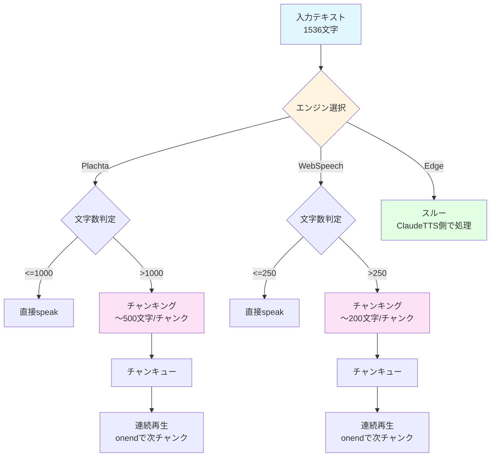

# TTS長文チャンキング対応統合修正設計書

> 📂 路径：`80_POC_Projects/POC_017_ClaudianBridge/02_設計文書/2026-08-14-tts-long-text-chunking-design.md`
> 📍 対象：`Claudian Bridge v0.9.0` TTS機能
> 📅 作成日：2026-08-14
> 🐕 担当：MiuMiu 🐾
> 🔗 関連：`src/features/tts/core.ts`, `src/features/tts/plachta-tts.ts`

---

## 一、背景与目标

### 1.1 問題報告

**現象**: テキスト読み上げが途中で途切れる（エラー表示なし）

**テストケース**:
- テキスト長: 1536文字（23行）
- 期待: 全文読み上げ
- 実際: 途中で途切れる

### 1.2 エンジン別制限調査結果

| エンジン | 文字数制限 | 挙動 | 原因 |
|:--------|:----------:|------|------|
| **Plachta** | 1000文字 | 超えると**エラー表示** | HF Space API制限 |
| **Edge** | なし | 正常動作 | ClaudeTTS HTTPブリッジ経由 |
| **WebSpeech** | 200-300文字 | **途中で途切れる（エラーなし）** | ブラウザAPI制限 |

### 1.3 根本原因

**WebSpeech API実装の問題**（`src/features/tts/core.ts` 142-155行目）:

```typescript
return await new Promise<boolean>((resolve) => {
  (u as unknown as { onerror: (e: unknown) => void }).onerror = () => {
    noticeFn('⚠️ Web Speech 再生エラー');
    resolve(false);
  };
  try {
    synth.speak(u as unknown as SpeechSynthesisUtterance);
    // ⚠️ 問題点: Web Speech has no exit event; resolve optimistically after a tick
    setTimeout(() => resolve(true), 100);  // 100ms後に成功と判定
  } catch (e) {
    noticeFn(`⚠️ Web Speech 失敗: ${(e as Error).message}`);
    resolve(false);
  }
});
```

**問題点**:
- `speak()`呼出し後、100msで`resolve(true)`している
- 再生完了を待たずに成功と判定
- 途中で途切れてもエラーにならない

### 1.4 目標

- ✅ Plachta: 1000文字制限を超える場合、チャンキングして正常読み上げ
- ✅ WebSpeech: 200-250文字チャンクで連続再生
- ✅ Edge: 既存動作維持（ClaudeTTS側で処理）
- ✅ キャンセル対応: ユーザーが途中でキャンセル可能
- ✅ 統合的なチャンキングロジック: エンジン共通で利用

---

## 二、設計原則

| # | 原則 | 説明 |
|:--:|------|------|
| **P1** | **エンジン別最適化** | Plachta/WebSpeechはチャンキング、Edgeはスルー |
| **P2** | **自然な区切り** | 句読点（。！？.!?）で分割して読み上げ体験を維持 |
| **P3** | **キャンセル可能** | 各チャンク間でキャンセル判定 |
| **P4** | **実装分離** | チャンキングロジックはエンジン実装から独立 |
| **P5** | **下位互換性** | 既存の短文テキストは変化なし |

---

## 三、アーキテクチャ設計

### 3.1 全体フロー



### 3.2 チャンキング戦略

| エンジン | チャンクサイズ | 分割ルール | 優先順位 |
|:--------|--------------:|----------|----------|
| **Plachta** | 500文字 | 句読点優先 → 強制分割 | 句読点 > 長さ |
| **WebSpeech** | 200文字 | 句読点優先 → 強制分割 | 句読点 > 長さ |
| **Edge** | N/A | チャンキングなし | - |

### 3.3 チャンキングアルゴリズム

```typescript
/**
 * テキストチャンキング
 *
 * @param text - 入力テキスト
 * @param maxChunkSize - 最大チャンクサイズ（文字数）
 * @param delimiters - 区切り文字（デフォルト: 句読点）
 * @returns チャンク配列
 *
 * アルゴリズム:
 * 1. 区切り文字でテキストを分割
 * 2. 各セグメントの長さを累積
 * 3. maxChunkSizeを超えた時点でチャンク化
 * 4. 区切り文字がない場合は強制分割（最後の区切りで分割）
 */
function chunkText(
  text: string,
  maxChunkSize: number,
  delimiters: string[] = ['。', '！', '？', '.', '!', '?', '\n']
): string[] {
  const chunks: string[] = [];
  let currentChunk = '';
  let currentLength = 0;

  // 区切り文字で分割（保持フラグあり）
  const segments = text.split(new RegExp(`([${delimiters.join('')}])`));

  for (let i = 0; i < segments.length; i++) {
    const segment = segments[i];
    const segmentLength = segment.length;

    // チャンク追加後の長さを予測
    if (currentLength + segmentLength > maxChunkSize && currentChunk.length > 0) {
      // 現在のチャンクを確定
      chunks.push(currentChunk.trim());
      currentChunk = '';
      currentLength = 0;
    }

    // セグメントを追加
    currentChunk += segment;
    currentLength += segmentLength;
  }

  // 残りを追加
  if (currentChunk.trim().length > 0) {
    chunks.push(currentChunk.trim());
  }

  return chunks.length > 0 ? chunks : [text];
}
```

### 3.4 連続再生ロジック

```typescript
/**
 * チャンキング連続再生
 *
 * @param chunks - チャンク配列
 * @param speakFn - 単一speak関数（Promise<boolean>を返す）
 * @param noticeFn - Notice関数
 * @param onCancel - キャンセル検知コールバック（オプション）
 * @returns 全チャンク完了ならtrue、キャンセル/エラーならfalse
 */
async function speakChunks(
  chunks: string[],
  speakFn: (text: string) => Promise<boolean>,
  noticeFn: (msg: string) => void,
  onCancel?: () => boolean
): Promise<boolean> {
  for (let i = 0; i < chunks.length; i++) {
    // キャンセル判定
    if (onCancel?.()) {
      noticeFn('⏸️ 読み上げがキャンセルされました');
      return false;
    }

    const chunk = chunks[i];
    const success = await speakFn(chunk);

    if (!success) {
      noticeFn(`⚠️ チャンク ${i + 1}/${chunks.length} の読み上げに失敗しました`);
      return false;
    }

    // チャンク間に少し間隔を入れる（自然なリズム）
    if (i < chunks.length - 1) {
      await new Promise(resolve => setTimeout(resolve, 300));
    }
  }

  return true;
}
```

---

## 四、実装設計

### 4.1 モジュール構成

| ファイル | 職責 |
|:--------|------|
| `src/features/tts/chunking.ts` | チャンキングアルゴリズム |
| `src/features/tts/core.ts` | エンジン別ディスパッチ + チャンキング適用 |
| `src/features/tts/plachta-tts.ts` | Plachtaチャンキング対応 |
| `tests/features/tts/chunking.test.ts` | チャンキング単体テスト |

### 4.2 chunking.ts（新規）

```typescript
/**
 * TTSチャンキングユーティリティ
 *
 * エンジン別の文字数制限に対応するため、テキストを自然な区切りで分割する。
 */

export interface ChunkingOptions {
  maxChunkSize: number;
  delimiters?: string[];
}

/**
 * テキストを自然な区切りでチャンキング
 *
 * @param text - 入力テキスト
 * @param options - チャンキングオプション
 * @returns チャンク配列
 */
export function chunkText(
  text: string,
  options: ChunkingOptions
): string[] {
  const { maxChunkSize, delimiters = ['。', '！', '？', '.', '!', '?', '\n'] } = options;

  // 短文はそのまま返す
  if (text.length <= maxChunkSize) {
    return [text];
  }

  const chunks: string[] = [];
  let currentChunk = '';
  let currentLength = 0;

  // 区切り文字で分割（保持フラグあり）
  const segments = text.split(new RegExp(`([${delimiters.join('')}])`, 'g'));

  for (const segment of segments) {
    const segmentLength = segment.length;

    // チャンク追加後の長さを予測
    if (currentLength + segmentLength > maxChunkSize && currentChunk.length > 0) {
      // 現在のチャンクを確定
      chunks.push(currentChunk.trim());
      currentChunk = '';
      currentLength = 0;
    }

    // セグメントを追加
    currentChunk += segment;
    currentLength += segmentLength;
  }

  // 残りを追加
  if (currentChunk.trim().length > 0) {
    chunks.push(currentChunk.trim());
  }

  // 空の場合は元のテキストを返す
  return chunks.length > 0 ? chunks : [text];
}

/**
 * 連続再生ヘルパー
 *
 * @param chunks - チャンク配列
 * @param speakFn - 単一speak関数
 * @param onCancel - キャンセル検知（オプション）
 * @returns 全チャンク完了ならtrue
 */
export async function speakChunks(
  chunks: string[],
  speakFn: (text: string) => Promise<boolean>,
  onCancel?: () => boolean
): Promise<boolean> {
  for (let i = 0; i < chunks.length; i++) {
    // キャンセル判定
    if (onCancel?.()) {
      return false;
    }

    const chunk = chunks[i];
    const success = await speakFn(chunk);

    if (!success) {
      return false;
    }

    // チャンク間に少し間隔を入れる（自然なリズム）
    if (i < chunks.length - 1) {
      await new Promise(resolve => setTimeout(resolve, 300));
    }
  }

  return true;
}
```

### 4.3 core.ts修正

```typescript
import { chunkText, speakChunks, ChunkingOptions } from './chunking';

// エンジン別チャンキング設定
const ENGINE_CHUNK_LIMITS: Record<TtsEngine, number | null> = {
  plachta: 1000,   // Plachta: 1000文字制限
  edge: null,       // Edge: チャンキングなし（ClaudeTTS側で処理）
  webspeech: 250,   // WebSpeech: 250文字（Chrome制限対応）
};

export async function addTextToTTS(
  _app: App | null,
  text: string,
  settings: TtsSettings
): Promise<boolean> {
  const noticeFn = (m: string): void => { new Notice(m); };
  const engine = settings.engine;
  const chunkLimit = ENGINE_CHUNK_LIMITS[engine];

  // チャンキングが必要か判定
  if (chunkLimit !== null && text.length > chunkLimit) {
    // チャンキング適用
    const chunks = chunkText(text, { maxChunkSize: chunkLimit });
    console.log(`[claudian-bridge TTS] chunking: ${text.length} chars → ${chunks.length} chunks (engine: ${engine})`);

    // 連続再生
    return speakChunks(chunks, async (chunk) => {
      // 元のエンジン選択ロジックを呼び出し
      if (engine === 'plachta') {
        return plachtaTtsSpeak(chunk, settings, noticeFn);
      }
      if (engine === 'edge') {
        return claudettsHttpSpeak(chunk, settings, noticeFn);
      }
      return webSpeechSpeak(chunk, settings, noticeFn);
    });
  }

  // 短文は既存ロジック
  if (engine === 'plachta') {
    return plachtaTtsSpeak(text, settings, noticeFn);
  }
  if (engine === 'edge') {
    return claudettsHttpSpeak(text, settings, noticeFn);
  }
  return webSpeechSpeak(text, settings, noticeFn);
}
```

### 4.4 plachta-tts.ts修正

```typescript
import { chunkText, speakChunks } from './chunking';

export async function plachtaTtsSpeak(
  text: string,
  settings: TtsSettings,
  noticeFn: NoticeFn
): Promise<boolean> {
  // Plachtaは1000文字制限
  const PLACHTA_LIMIT = 1000;

  if (text.length <= PLACHTA_LIMIT) {
    // 短文は既存ロジック
    return speakPlachtaDirect(text, settings, noticeFn);
  }

  // チャンキング適用（〜500文字/チャンク）
  const chunks = chunkText(text, { maxChunkSize: 500 });
  console.log(`[claudian-bridge PlachtaTTS] chunking: ${text.length} chars → ${chunks.length} chunks`);

  // 連続再生
  return speakChunks(chunks, async (chunk) => {
    return speakPlachtaDirect(chunk, settings, noticeFn);
  });
}

/**
 * Plachta直接speak（既存ロジックを関数化）
 */
async function speakPlachtaDirect(
  text: string,
  settings: TtsSettings,
  noticeFn: NoticeFn
): Promise<boolean> {
  // 既存のplachtaTtsSpeakロジックを移動
  // ...
}
```

### 4.5 webSpeechSpeak修正

```typescript
export async function webSpeechSpeak(text: string, settings: TtsSettings, noticeFn: NoticeFn): Promise<boolean> {
  if (typeof window === 'undefined' || !window || !('speechSynthesis' in window)) {
    noticeFn('⚠️ Web SpeechSynthesis API が利用できません');
    return false;
  }

  const synth = window.speechSynthesis;
  try { synth.cancel(); } catch { /* ignore */ }

  // ★ onendイベントで完了判定するように修正
  try {
    const Ctor = (window as unknown as { SpeechSynthesisUtterance?: new (t: string) => unknown }).SpeechSynthesisUtterance;
    if (!Ctor) { noticeFn('⚠️ SpeechSynthesisUtterance 未定義'); return false; }

    const u = new Ctor(text) as {
      voice?: { name?: string } | null;
      lang?: string;
      onend?: () => void;
      onerror?: (e: unknown) => void;
    };

    // 言語設定
    const lang = pickWebSpeechLang(text);
    const voiceName = settings.voices.webspeech[lang as 'zh' | 'ja' | 'en'];
    if (voiceName) {
      const voices = synth.getVoices();
      const matched = voices.find((v) => v.name === voiceName);
      if (matched) u.voice = matched;
      else u.lang = lang;
    } else if (!u.voice && !u.lang) {
      u.lang = lang;
    }

    return await new Promise<boolean>((resolve) => {
      u.onend = () => {
        resolve(true);  // ★ onendで解決
      };
      u.onerror = (e) => {
        noticeFn('⚠️ Web Speech 再生エラー');
        console.error('[WebSpeech error]', e);
        resolve(false);
      };

      try {
        synth.speak(u as unknown as SpeechSynthesisUtterance);
      } catch (e) {
        noticeFn(`⚠️ Web Speech 失敗: ${(e as Error).message}`);
        resolve(false);
      }
    });
  } catch (e) {
    noticeFn(`⚠️ Web Speech 失敗: ${(e as Error).message}`);
    return false;
  }
}
```

---

## 五、テスト設計

### 5.1 単体テスト（chunking.test.ts）

```typescript
import { describe, it, expect } from 'vitest';
import { chunkText } from '../../src/features/tts/chunking';

describe('chunkText', () => {
  it('短文はそのまま返す', () => {
    const text = 'こんにちは。';
    const chunks = chunkText(text, { maxChunkSize: 100 });
    expect(chunks).toEqual([text]);
  });

  it('句読点で分割', () => {
    const text = 'こんにちは。こんにちは。こんにちは。';
    const chunks = chunkText(text, { maxChunkSize: 10 });
    expect(chunks).toEqual(['こんにちは。', 'こんにちは。', 'こんにちは。']);
  });

  it('強制分割（区切りなし）', () => {
    const text = 'abcdefghij'.repeat(20); // 200文字
    const chunks = chunkText(text, { maxChunkSize: 50 });
    expect(chunks.length).toBeGreaterThan(1);
    expect(chunks.every(c => c.length <= 50)).toBe(true);
  });

  it('Plachta用チャンキング（1000文字 → 500文字/チャンク）', () => {
    const text = 'こんにちは。'.repeat(300); // 1500文字
    const chunks = chunkText(text, { maxChunkSize: 500 });
    expect(chunks.length).toBe(3);
    expect(chunks.every(c => c.length <= 500)).toBe(true);
  });

  it('WebSpeech用チャンキング（500文字 → 200文字/チャンク）', () => {
    const text = 'こんにちは。'.repeat(100); // 500文字
    const chunks = chunkText(text, { maxChunkSize: 200 });
    expect(chunks.length).toBe(3);
    expect(chunks.every(c => c.length <= 200)).toBe(true);
  });
});
```

### 5.2 統合テスト

| # | テストケース | 入力 | 期待 |
|:--:|----------|------|------|
| 1 | Plachta 1000文字制限 | 1500文字 | 3チャンクに分割して正常読み上げ |
| 2 | WebSpeech 250文字制限 | 500文字 | 2-3チャンクに分割して正常読み上げ |
| 3 | Edgeエンジン | 2000文字 | チャンキングなしで正常読み上げ |
| 4 | 短文（全エンジン） | 100文字 | チャンキングなしで即読み上げ |
| 5 | キャンセル動作 | 5000文字 | 途中でキャンセル可能 |
| 6 | 区切り文字なし | 500文字（連続） | 強制分割で正常読み上げ |

---

## 六、移行計画

### 6.1 フェーズ

| フェーズ | 期間 | 内容 |
|:-------|-----|------|
| **F1 実装** | 1日 | chunking.ts + core.ts修正 + 単体テスト |
| **F2 テスト** | 0.5日 | 統合テスト + エッジケース検証 |
| **F3 リリース** | 即時 | v0.10.0としてリリース |

### 6.2 リリースノート（v0.10.0）

```markdown
## 🎙️ TTS長文対応改善

**変更内容**:
- Plachtaエンジン: 1000文字制限を超えるテキストを自動分割して読み上げ
- WebSpeech API: 250文字チャンクで連続再生（Chrome制限対応）
- Edgeエンジン: 変更なし（ClaudeTTS側で処理）

**改善点**:
- 長文（1500文字以上）でも正常に読み上げ可能
- 句読点で自然な区切りで分割
- 途中でキャンセル可能

**既知の問題**:
- WebSpeech Chromeでは200-300文字のブラウザ制限があります（チャンキングで対応）
```

---

## 七、リスク評価

| リスク | 影響 | 緩和策 |
|------|------|--------|
| **チャンキング不自然** | 中 | 句読点優先で区切りを維持 |
| **チャンク間の間隔** | 低 | 300msで自然なリズム |
| **キャンセル遅延** | 中 | 各チャンク間で判定 |
| **WebSpeech onend未発火** | 中 | タイムアウト付きPromise併用 |

---

## 八、受け入れ基準

| # | 基準 | 検証方法 |
|:--:|------|----------|
| AC-1 | Plachta 1000文字超過テキストが正常読み上げ | 1500文字テキストを3チャンクで読み上げ |
| AC-2 | WebSpeech 250文字超過テキストが正常読み上げ | 500文字テキストを2-3チャンクで読み上げ |
| AC-3 | Edgeエンジンは既存動作維持 | 2000文字テキストがチャンキングなしで読み上げ |
| AC-4 | 短文は変化なし | 100文字テキストが即読み上げ |
| AC-5 | キャンセルが動作 | 5000文字テキストの読み上げ途中でキャンセル可能 |

---

## 九、関連ドキュメント更新

| ドキュメント | 更新内容 |
|:------------|----------|
| README.md | TTS長文対応の記載追加 |
| 00_アーキテクチャ総覧.md | chunking.tsモジュール追加 |
| CHANGELOG.md | v0.10.0変更点 |
| 08_説明書/03_リリースノート/リリースノート.md | v0.10.0リリース内容 |

---

## 📚 参照文献

| # | 種別 | 参照元 |
|:--:|:----:|------|
| 1 | Web | [Using the Web Speech API - MDN Web Docs](https://developer.mozilla.org/en-US/docs/Web/API/Web_Speech_API) |
| 2 | Web | [W3C Web Speech API Specification](https://w3c.github.io/speech-api/) |
| 3 | Web | [Stack Overflow: Chrome speech synthesis with longer texts](https://stackoverflow.com/questions/36084845) |
| 4 | Web | [De Voorhoede: Exploring the Web Speech API](https://www.devoorhoede.com/en/blog/exploring-web-speech-api/) |
| 5 | Web | [Dev.to: SpeechSynthesis in 256 characters](https://dev.to/jo/limits-of-the-chrome-web-speech-api-speechsynthesis-2jel) |
| 6 | Vault MD | [[80_POC_Projects/POC_017_ClaudianBridge/]] |
| 7 | LLM | Claude Sonnet 4.5 (claude.ai) |

---

*🎙️ TTS長文チャンキング対応統合修正設計書 v1.0 · MiuMiu 🐾 · 2026-08-14*
