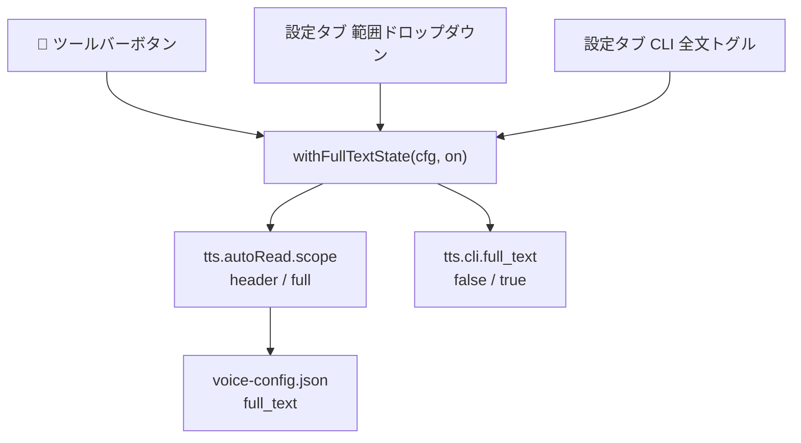
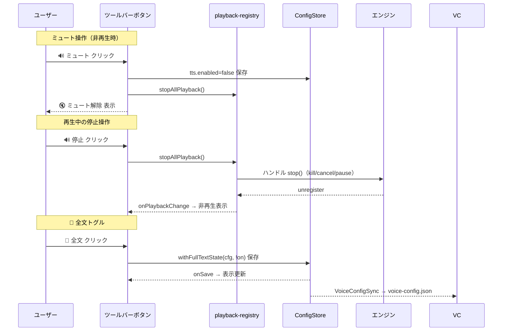

# Claudian チャットツールバー ボタン統合設計書（ミュート復活 + 操作性同期）

> 📂 路径：`80_POC_Projects/POC_017_ClaudianBridge/02_設計文書/2026-08-15-claudian-chat-toolbar-buttons-design.md`
> 📍 対象：`Claudian Bridge v0.12.0` TTS 機能
> 📅 作成日：2026-08-15
> 🐕 担当：MiuMiu 🐾
> 🔗 関連：`src/features/tts/core.ts`, `src/features/tts/toolbar-fulltext-button.ts`, `src/features/tts/auto-read.ts`, [[2026-08-14-task-completion-auto-tts-design.md|タスク終了時自動TTS設計]], [[2026-08-14-claude-tts-settings-merger-design.md|ClaudeTTS設定融合設計]]

---

## 一、背景与目标

### 1.1 問題報告

| # | 現象 | 詳細 |
|:-:|------|------|
| 1 | **操作性同期がされていない** | ClaudianChat ツールバーの「📖 全文読み上げ」ボタン（v0.11.1 追加）が、外部変更（設定タブ・CLI 等）を反映しない。旧 claude-tts-settings にあった 3 秒ポーリング同期が新実装では欠落している |
| 2 | **範囲設定との不統一** | 設定タブの「タスク終了時自動読み上げ範囲」（📢ヘッダー/全文 = `tts.autoRead.scope`）と、ツールバー「📖 全文読み上げ」ボタン（`tts.cli.full_text`）が**別々の設定**として独立しており、相互に反映されない |
| 3 | **ミュートボタン消失** | 旧 claude-tts-settings にあった ClaudianChat ツールバーの 🔊/🔇 ミュートボタン（3状態 + 再生停止連動）が Claudian Bridge には未移植 |

### 1.2 目標

- ✅ ツールバー「📖 全文読み上げ」と「自動読み上げ範囲」設定を**統一**（ON=全文 / OFF=📢ヘッダーのみ、どこから変更しても相互反映）
- ✅ ミュートボタンを**旧同等の 3 状態**で復活（非再生🔊 / 再生中🔊点滅(クリック=停止) / ミュート🔇）
- ✅ ボタン表示を**アイコン＋テキスト**に変更（状態が一目で分かる）
- ✅ ツールバーボタンの状態を**即時同期**（`store.onSave` によるイベント駆動・旧の3秒ポーリングを置換）

### 1.3 ユーザー決定事項（2026-08-15 確認済み）

| # | 項目 | 決定 |
|:-:|------|------|
| 1 | 範囲設定と📖ボタンの関係 | **統一する**（📖 ボタン = 自動読み上げ範囲と同期、設定タブと相互反映） |
| 2 | ミュートボタン機能 | **旧同等の 3 状態**（再生中検知 + クリックで停止 + `tts.enabled` トグル） |
| 3 | ボタン表示形式 | **アイコン＋テキスト** |

---

## 二、現状分析

### 2.1 関連する設定フィールド

| フィールド | 現在の使われ方 | 問題 |
|:-----------|:--------------|:-----|
| `tts.autoRead.scope` (`'header' \| 'full'`) | タスク終了時自動読み上げの範囲（v0.11.0） | ツールバー📖ボタンと未連携 |
| `tts.cli.full_text` (`boolean`) | Claude Code CLI 用全文読み上げ（v0.10.0）+ ツールバー📖ボタン | 自動読み上げ範囲と未連携 |
| `tts.enabled` (`boolean`) | TTS マスタースイッチ | ミュートボタン（旧 `enabled`）に相当 |

### 2.2 旧 claude-tts-settings の実装（参照元）

- `D:\AI-Agent\claude-tts-obsidian\src\ui\claudianMuteButton.ts` … 3 状態モデル + `killExternalPlayback()` + 3 秒ポーリング
- `D:\AI-Agent\claude-tts-obsidian\src\ui\claudianFullTextButton.ts` … 📖/📄 トグル + 3 秒ポーリング

旧実装の 3 秒ポーリングは「外部の `voice-config.json` 変更を監視」するためのものだった。Claudian Bridge では `data.json` が SSOT で、アプリ内変更はすべて `store.onSave()` で捕捉できるため、**イベント駆動の即時同期に置き換え可能**（より高応答）。

### 2.3 エンジン別の「停止」手段の現状

| エンジン | 再生の実体 | 停止手段 | 現状の停止ハンドル |
|---------|-----------|---------|:------------------:|
| edge | `python claude-tts` child process | `child.kill()` | ❌ なし（close 後に通知のみ） |
| webspeech | `window.speechSynthesis` | `synth.cancel()` | ❌ なし（冒頭の先行 cancel のみ） |
| plachta | `new Audio()` + object URL | `audio.pause()` + resolve | ❌ なし（onended 待ちのみ） |

---

## 三、アーキテクチャ

### 3.1 モジュール構成

| ファイル | 種別 | 責務 |
|:---------|:----:|:-----|
| `src/features/tts/playback-registry.ts` | 🆕 新規 | 再生中ハンドルの一元管理（`isTtsPlaying` / `stopAllPlayback` / `onPlaybackChange`） |
| `src/features/tts/toolbar-buttons.ts` | 🆕 新規 | ミュート＋📖全文ボタンを `.claudian-input-toolbar` へ注入・状態同期 |
| `src/features/tts/toolbar-fulltext-button.ts` | 🗑️ 削除 | 統合モジュールへ吸収 |
| `src/features/tts/core.ts` | ✏️ 改修 | `claudettsHttpSpeak` / `webSpeechSpeak` に再生ハンドル登録 |
| `src/features/tts/plachta-tts.ts` | ✏️ 改修 | `playObjectUrl` に再生ハンドル登録（stop で pause + resolve） |
| `src/core/settings.ts` | ✏️ 改修 | `withFullTextState` / `isFullTextState` ヘルパー追加 |
| `src/settings/SettingTabTts.ts` | ✏️ 改修 | 範囲ドロップダウン・CLI全文トグルをヘルパー経由に変更 |
| `src/main.ts` | ✏️ 改修 | `setupToolbarFullTextButton` → `setupToolbarButtons` に差し替え |
| `styles.css` | ✏️ 改修 | `.is-playing` 点滅アニメーション等 |
| `src/core/i18n.ts` | ✏️ 改修 | ボタン title/aria 用キー追加 |

### 3.2 統一「全文読み上げ」状態（同期ヘルパー）



**不変条件**: `tts.autoRead.scope === 'full'` ⟺ `tts.cli.full_text === true`

```typescript
// src/core/settings.ts に追加
export function withFullTextState(cfg: ClaudianBridgeSettings, fullText: boolean): ClaudianBridgeSettings {
  return {
    ...cfg,
    tts: {
      ...cfg.tts,
      autoRead: { ...(cfg.tts.autoRead ?? DEFAULT_TTS_AUTO_READ_SETTINGS), scope: fullText ? 'full' : 'header' },
      cli: { ...(cfg.tts.cli ?? DEFAULT_TTS_CLI_SETTINGS), full_text: fullText },
    },
  };
}

export function isFullTextState(cfg: ClaudianBridgeSettings): boolean {
  return (cfg.tts.autoRead?.scope ?? DEFAULT_TTS_AUTO_READ_SETTINGS.scope) === 'full';
}
```

### 3.3 再生レジストリ（`playback-registry.ts`）

```typescript
export interface TtsPlaybackHandle {
  engine: TtsEngine;
  stop: () => void;            // 再生を即時停止
}

export function registerPlayback(handle: TtsPlaybackHandle): () => void;  // unregister 関数を返す
export function isTtsPlaying(): boolean;
export function stopAllPlayback(): number;   // 停止した数
export function onPlaybackChange(fn: () => void): () => void;  // 購読解除関数を返す
```

- 実装はモジュールスコープの `Set<TtsPlaybackHandle>`
- 登録/解除時に購読者（ミュートボタン）へ即時通知
- テスト用に `resetPlaybackRegistry()` を export（既存テストの独立性維持）

### 3.4 エンジン別の停止ハンドル組み込み

| エンジン | 登録箇所 | stop() 実装 | 意図的停止の扱い |
|---------|---------|-------------|------------------|
| **edge** | `claudettsHttpSpeak` spawn 直後 | `child.kill()` | `intentionalStop` フラグで close 時のエラー Notice を抑制し `resolve(false)` |
| **webspeech** | `synth.speak(u)` 直前 | `synth.cancel()` | `intentionalStop` フラグで onend/onerror の Notice を抑制し `settle(false)` |
| **plachta** | `playObjectUrl` 内 | `audio.pause()` + `resolve(false)` | onended/onerror と二重 settle しない `finish(ok)` ガード |

> いずれも**意図的停止は `false` を返す**（`speakChunks` / パイプラインを中断させる）。`false` 返却でもエラー Notice は出さない。

### 3.5 ツールバーボタン（`toolbar-buttons.ts`）

`setupToolbarButtons(store: ConfigStore): () => void` を新設。

- 注入対象: `.claudian-input-toolbar`（既存 `MutationObserver` + 重複防止パターンを踏襲）
- ボタン順: **ミュート → 📖全文**
- 重複防止属性: ミュート=`data-cb-mute` / 全文=`data-cb-fulltext`

**ミュートボタン（3状態・アイコン＋テキスト）**:

| 状態 | 判定 | 表示 | title | クリック動作 |
|------|------|------|-------|-------------|
| `enabled-idle` | `tts.enabled && !isTtsPlaying()` | 🔊 ミュート | クリックでミュート | `tts.enabled=false` + `stopAllPlayback()` |
| `enabled-playing` | `tts.enabled && isTtsPlaying()` | 🔊 停止（点滅） | クリックで再生停止 | `stopAllPlayback()` のみ |
| `disabled` | `!tts.enabled` | 🔇 ミュート解除 | クリックでミュート解除 | `tts.enabled=true` |

**📖 全文ボタン（アイコン＋テキスト）**:

| 状態 | 表示 | title | クリック動作 |
|------|------|-------|-------------|
| 全文 ON | 📖 全文 | 全文読み上げ ON | `withFullTextState(cfg, false)` |
| 全文 OFF | 📄 ヘッダー | ヘッダーのみ読み上げ | `withFullTextState(cfg, true)` |

**状態同期（旧3秒ポーリングの置換）**:
- `store.onSave()` … 設定タブ・CLI 同期等のアプリ内変更を即時反映
- `onPlaybackChange()` … 再生開始/終了を即時反映（点滅⇄固定切替）
- 外部 `data.json` 直編集は対象外（SSOT は本プラグインの `store` であり、CLI は `voice-config.json` を書くのみ）

### 3.6 main.ts 配線

```typescript
// 旧: this.register(setupToolbarFullTextButton(this.store));
import { setupToolbarButtons } from './features/tts/toolbar-buttons';
this.register(setupToolbarButtons(this.store));
```

---

## 四、設定スキーマ変更

- **既存フィールドは不変**（`tts.autoRead.scope` / `tts.cli.full_text` を引き続き使用）
- 同期はヘルパー関数による**書き込み点の統一**で実現（スキーマ追加・マイグレーション不要）
- `validateClaudianBridgeSettings` への変更なし

---

## 五、データフロー



---

## 六、エラーハンドリング

| ケース | 挙動 |
|--------|------|
| `stop()` 中に例外 | `stopAllPlayback` 内 try/catch で握りつぶし（再生停止はベストエフォート） |
| 意図的停止のエラー Notice | 抑制（「⚠️ 失敗」を出さない） |
| `store.save` 失敗 | ボタンは保存前の状態へ復元 + Notice（既存パターン踏襲） |
| 再生レジストリの未登録 | `isTtsPlaying()=false` として動作（ミュートはトグルのみ） |
| ツールバー未出現 | MutationObserver が監視継続、出現後に自動注入 |

---

## 七、テスト計画

| # | テスト | 対象 |
|:-:|--------|------|
| 1 | `withFullTextState` が scope/full_text を同期・`isFullTextState` が正しい | `settings.test.ts` |
| 2 | `registerPlayback` / unregister / `isTtsPlaying` / `stopAllPlayback` / `onPlaybackChange` | `playback-registry.test.ts`（新規） |
| 3 | edge: 意図的 stop でエラー Notice なし + `false` を返す | `core.test.ts` |
| 4 | webspeech: 意図的 stop（cancel）でエラー Notice なし + `false` | `core.test.ts` |
| 5 | plachta: `playObjectUrl` stop で pause + resolve(false) + 二重 settle なし | `plachta-tts.test.ts` |
| 6 | ミュートボタン: 注入 / enabled トグル / 再生中クリック=停止のみ | `toolbar-buttons.test.ts`（新規・jsdom） |
| 7 | 📖ボタン: scope と full_text が同時トグル保存される | 同上 |
| 8 | onSave で外部変更がボタンへ即時反映される | 同上 |
| 9 | 二重注入しない / cleanup で削除 | 同上 |

> jsdom 環境は既存 `toolbar-fulltext-button.test.ts` で実績あり（`// @vitest-environment jsdom`）。

---

## 八、リスクと対策

| リスク | 影響 | 対策 |
|--------|------|------|
| realclaudian の `.claudian-input-toolbar` 構造変更 | ボタン非注入 | MutationObserver が追従。構造変更時は既存の「升级后 grep 复核」運用で検知 |
| `synth.cancel()` のブラウザ差異（onend/onerror どちらが発火） | 意図的停止の誤判定 | 両ハンドラで `intentionalStop` を判定 |
| plachta 合成中（再生前）の stop | 即時停止できない（合成完了後に再生開始→停止） | 許容（レア・実害小）。将来 `plachtaSynthesize` のキャンセル対応をスコープ外として明記 |
| `tts.enabled=false` でも実行中パイプラインが継続 | ミュート後も短時間再生が続く | `stopAllPlayback()` で現在チャンクを停止。パイプラインは次チャンク合成を破棄して終了 |

---

## 九、スコープ外（将来候補）

- Plachta 合成フェーズ（`plachtaSynthesize`）のキャンセル（SSE 中断）
- エンジン別ボリューム調整ボタン
- ツールバーへの「Add to TTS」等、他の操作ボタンの統合

---

*📅 2026-08-15 · MiuMiu 🐾 · ユーザー承認済み（3項目の決定事項）*
