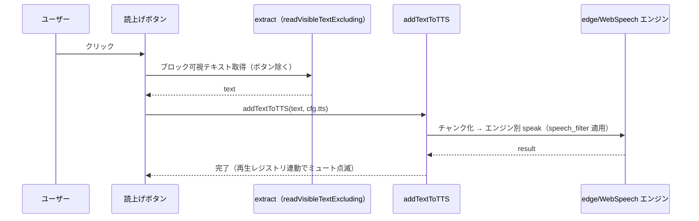

# メッセージ読上げボタン設計（ClaudianChat 結果欄）

> 📂 パス：`02_設計文書/2026-08-15-message-read-button-design.md`
> 📍 ソース：`D:/AI-Agent/ClaudianBridge/src/features/tts/`

---

## 1. 背景・目的

ClaudianChat の各 assistant メッセージ（`.claudian-text-block`）右下には**コピーボタン**（`.claudian-text-copy-btn`）が表示される。その**左隣に読上げボタン**を追加し、クリックで該当テキストを読み上げる。

- 読み上げ範囲は**コピーボタンと同じ**（該当テキストブロックの内容）
- 読み上げは `addTextToTTS` を経由し、**Add to TTS と同様**（`speech_filter`（Emoji/Kaomoji 除去）・再生レジストリ・ミュートボタン連動を自動適用）
- エンジン・音声は既存設定（edge / 言語自動検出）をそのまま使用

## 2. 対象 DOM（realclaudian 実測）

```
.claudian-text-block            ← position: relative（メッセージのテキストブロック）
  └── .claudian-text-copy-btn   ← position:absolute; bottom:0; inset-inline-end:0（右下・hover 表示）
```

- `.claudian-text-block` はメッセージ内のテキスト1ブロックごとに生成（複数ブロックあり得る）
- コピーボタンは各ブロックに 1 つ（`addTextCopyButton` で追加）

## 3. 設計（方式 A：絶対配置の隣接ボタン）

### 3.1 ボタン注入

- 各 `.claudian-text-block` 内の `.claudian-text-copy-btn` の**直前**に `<span>` を挿入
- クラス: `claudian-text-tts-btn` + マーカー属性 `data-cb-msg-read`（重複注入防止）
- スタイル: コピーボタンに揃える
  - `position:absolute; bottom:0; inset-inline-end:22px`（コピーボタン `inset-inline-end:0` の左隣）
  - `opacity:0 → .claudian-text-block:hover` で `1`（hover 表示）
  - アイコン: Obsidian `setIcon(el, 'volume-2')`（16px・コピーボタンと同じ見た目）

### 3.2 クリック動作

1. `cfg = store.load()`
2. `cfg.tts.enabled` が false → `🔇 ミュート中` を Notice して終了
3. ボタン自身（`.claudian-text-tts-btn`）を除外したブロックの**可視テキスト**を取得
   - `readVisibleText(block)` 相当（innerText → textContent フォールバック）
   - コピーボタン・読上げボタン自身は exclude セレクタで除外（`readVisibleTextExcluding` を再利用）
4. `addTextToTTS(app, text, cfg.tts)` を呼ぶ（`speech_filter`・再生登録・ミュート連動は内部で適用）
5. 空テキストなら何もしない

### 3.3 動的注入（MutationObserver）

- `document.body` を `MutationObserver` で監視
- `.claudian-text-block` が追加されたら、`.claudian-text-copy-btn` を持つブロックへ読上げボタンを注入
- 既存の `setupToolbarButtons` と同じスキャンパターンを踏襲

### 3.4 後片付け

- `cleanup()` で observer disconnect + 注入済みボタン全削除（`[data-cb-msg-read]`）

## 4. データフロー



## 5. テスト

- **注入・重複防止**: 同一ブロックに 2 回 inject してもボタンは 1 つのみ
- **クリック**: `addTextToTTS` がブロックのテキストで呼ばれる（mock）
- **speech_filter**: Emoji/Kaomoji が除去されてから読み上げに渡る
- **ミュート時**: `tts.enabled=false` でクリック → 読み上げない + 通知
- **空テキスト**: 読上げない

## 6. 変更ファイル

| ファイル | 内容 |
|----------|------|
| `src/features/tts/message-read-button.ts`（新規） | ボタン注入・クリック処理・observer |
| `src/main.ts` | `setupMessageReadButtons(app, store)` を登録 |
| `styles.css` | `.claudian-text-tts-btn` のスタイル |
| `tests/features/tts/message-read-button.test.ts`（新規） | 上記テスト |

## 7. 非目標（YAGNI）

- 全メッセージ一括読み上げボタンは作らない（既存の 📖 full 自動読み上げが担う）
- ボタンのトグル状態（再生中表示など）は作らない（再生は既存のミュートボタンが表示）
- 言語・音声の切り替えは本件の対象外（既存設定に従う）
