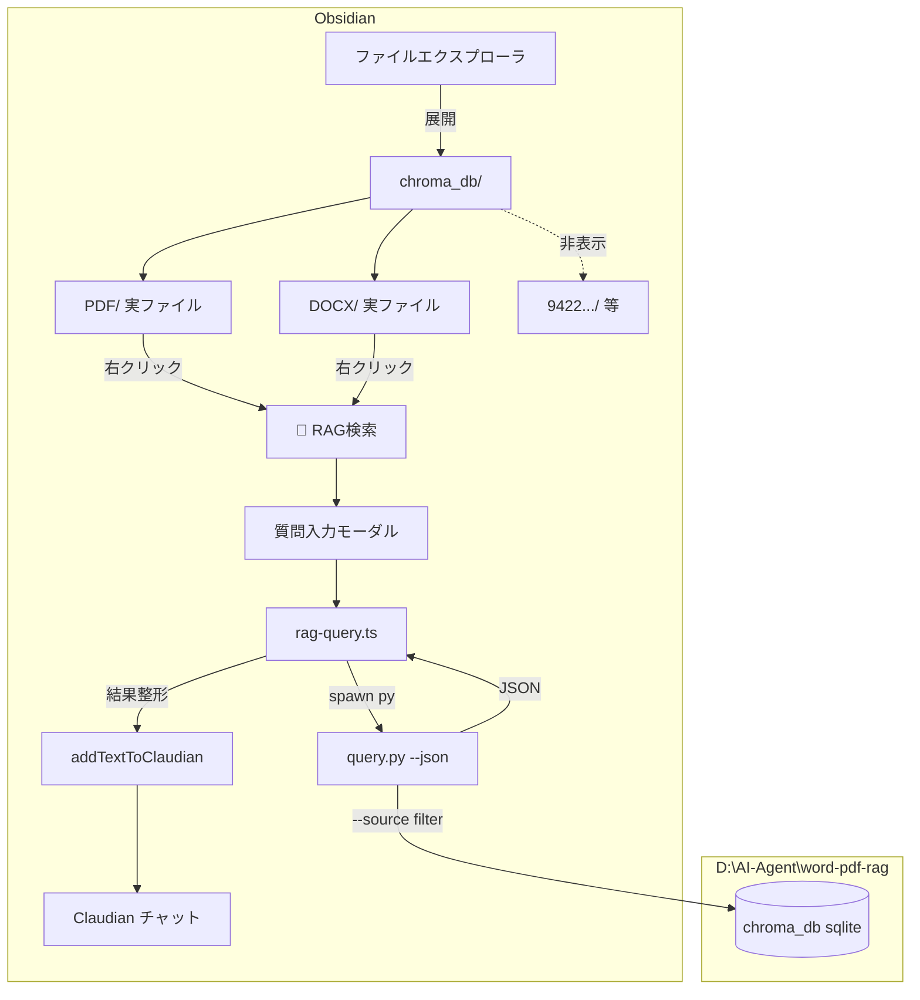

> 📂 **パス**: `80_POC_Projects/POC_017_ClaudianBridge/02_設計文書/2026-08-16-chroma-fs-virtual-folder-design.md`
> 📌 **フェーズ**: 設計
> 🎯 **用途**: claudian-bridge に `chroma_db` 仮想フォルダ表示 + RAG 検索機能を追加する設計仕様

---

# 📐 chroma-fs 仮想フォルダ表示 設計書

> **関連プロジェクト**: [[../../POC_018_PaddleOCRBridge/README|POC_018]]（別件・関連なし） / [[README|POC_017 README]]

---

## 1. 背景と目的

### 1.1 現状の問題

| 観点 | 現状 |
|------|------|
| **DB 二重管理** | RAG 実体は `D:\AI-Agent\word-pdf-rag\data\chroma_db`。Vault の `chroma_db/` は同一内容の**コピー** |
| **ファイルエクスプローラの見え方** | `chroma_db/` を展開すると `9422e6f0-.../`（ハッシュフォルダ）・`chroma.sqlite3`・`未命名.base` が表示され、**DB 内部実装が露出** |
| **ソース文書への導線がない** | DB 内に何の PDF/DOCX が入っているか、ファイルエクスプローラからは分からない |

### 1.2 目的

1. `chroma_db/` を **RAG の実体**として一本化（Vault 内に DB を統合）
2. `chroma_db/PDF/`・`chroma_db/DOCX/` に**ソース文書の実ファイル**を配置 → クリックでネイティブに開く
3. DB 内部実装（ハッシュフォルダ・sqlite・base）は **ファイルエクスプローラで非表示**
4. ソース文書を右クリック → **「RAG検索」** → 質問 → 結果を **Claudian チャットに挿入**

### 1.3 スコープ

**対象**:
- `claudian-bridge`（v0.18.0 → v0.19.0）に新フィーチャー `features/chroma-fs/` を追加
- `word-pdf-rag` に `--json` 出力モードを追加（小改造）
- 移行作業（DB 実体化 + 文書移動 + 再ビルド）

**非対象**:
- 既存 `features/chroma/`（Database Browser）の改修
- RAG の検索精度・チャンク方式の変更

---

## 2. アーキテクチャ

### 2.1 フィーチャー構成

```
src/features/chroma-fs/
├── hide-internal.ts     # chroma_db 内部をファイルエクスプローラ上で非表示（CSS 注入）
├── rag-menu.ts          # 右クリック「🔎 RAG検索」登録
├── rag-query.ts         # query.py --json 起動 + 結果整形
├── question-modal.ts    # 質問入力モーダル
└── types.ts             # ChromaFs 関連型定義
```

### 2.2 データフロー



### 2.3 設定項目

`ChromaSettings` に 4 フィールド追加:

| フィールド | 型 | 既定 | 説明 |
|-----------|-----|------|------|
| `hideInternal` | `boolean` | `true` | chroma_db 内部の非表示 CSS を注入するか |
| `ragEnabled` | `boolean` | `false` | 右クリック「RAG検索」を有効化するか |
| `ragScriptPath` | `string` | `""` | `query.py` の絶対パス |
| `ragConfigPath` | `string` | `""` | `config.yaml` の絶対パス |

### 2.4 main.ts 配線

`chroma.enabled === true` のとき:

```typescript
if (cfg.chroma.hideInternal) {
  installChromaFsHideCss();   // onunload で removeChromaFsHideCss()
}
if (cfg.chroma.ragEnabled) {
  this.registerEvent(ragMenu.register(this.app, this.store));
}
```

---

## 3. 非表示メカニズム（hide-internal.ts）

### 3.1 実装方針

既存 `features/whitelist/injector.ts` の `<style>` 注入パターンを流用。専用 `STYLE_ID = 'cb-chroma-fs-hide'` を使用し、onload/onunload で注入・除去する。

### 3.2 CSS セレクタ

```css
/* chroma_db 直下のサブフォルダのうち PDF/DOCX 以外を非表示（ハッシュフォルダ対策） */
.nav-folder[data-path="chroma_db"] > .nav-folder-children > .nav-folder:not(
  [data-path="chroma_db/PDF"], [data-path="chroma_db/DOCX"]
) { display: none !important; }

/* chroma_db 直下の実ファイル（chroma.sqlite3 / 未命名.base）を非表示 */
.nav-folder[data-path="chroma_db"] > .nav-folder-children > .nav-file {
  display: none !important;
}
```

### 3.3 設計判断

| 判断 | 理由 |
|------|------|
| ハッシュフォルダを名前でなく「PDF/DOCX 以外」で判定 | 再構築で UUID が変わっても追従 |
| 直下ファイルを全て非表示 | sqlite / base を確実に隠す。`PDF/`・`DOCX/` 内のファイルは階層が異なるため対象外 |
| CSS 方式を採用（Excluded files は不使用） | Obsidian の「Excluded files」は検索インデックスからも除外され、RAG 運用に支障が出るため |

### 3.4 テスト観点

- セレクタが `chroma_db/PDF`・`chroma_db/DOCX` を誤って非表示にしないこと
- ハッシュフォルダ名が変わっても動作すること

---

## 4. RAG 検索フロー（rag-menu / question-modal / rag-query）

### 4.1 右クリックメニュー（rag-menu.ts）

`workspace.on('file-menu')` を登録（`OfficeMenuRegistrar` パターン踏襲）。

**表示条件**:
- `file instanceof TFile`
- `settings.chroma.enabled && settings.chroma.ragEnabled`
- パスが `chroma_db/PDF/` または `chroma_db/DOCX/` 配下
- 拡張子が `pdf` / `docx`

**メニュー項目**: 「🔎 RAG検索（Claudian）」

### 4.2 質問入力モーダル（question-modal.ts）

`Modal` を継承。テキストエリア + 実行ボタン（`RawSqlModal` / `ProgressModal` のスタイルパターン踏襲）。

- キャンセル / 実行（Enter or ボタン）
- 実行時: `onSubmit(question: string)` コールバック

### 4.3 クエリ実行（rag-query.ts）

既存 `runPython`（`features/chroma/chroma/chroma-runner.ts`）を流用。

```bash
py "D:\AI-Agent\word-pdf-rag\query.py" "D:\AI-Agent\word-pdf-rag\config.yaml" \
   --source "REGZA 42J8.pdf" --ask "この機種のHDMI設定は?"
```

| パラメータ | 値 |
|-----------|-----|
| `pythonPath` | 既存 `chroma.pythonPath` |
| `scriptPath` | `ragScriptPath`（空なら設定エラー通知） |
| `cwd` | `word-pdf-rag` ルート（相対パス `./Model`・`./documents` 解決のため） |
| `--source` | 右クリックしたファイルの basename |
| `--ask` | モーダルで入力した質問 |
| タイムアウト | 120 秒（BGE-m3 埋め込み + LLM 応答） |

### 4.4 結果の整形と Claudian 挿入

`query.py` の現在の出力は ANSI カラー + 装飾付きのため、**`--json` フラグを追加**して `{ ok, answer, sources }` を出力させる。

整形した結果を `addTextToClaudian()`（`features/selection/core.ts`）で挿入。

### 4.5 エラーハンドリング

| ケース | 対応 |
|--------|------|
| `query.py` 不在 / 設定空 | Notice で案内 |
| exit code ≠ 0 | stderr を Claudian へ |
| タイムアウト | 「処理が長すぎます」通知 |

### 4.6 テスト観点

- `--source` が basename になること（スペース含む `REGZA 42J8.pdf` も spawn 配列で安全）
- `--json` 出力がパースできること
- `ragEnabled=false` ならメニューに出ないこと

---

## 5. word-pdf-rag 側の変更

### 5.1 `--json` 出力モード追加

```python
# main() に --json 分岐を追加
if "--json" in argv:
    result = querier.ask(question, source=source)
    print(json.dumps({
        "ok": True,
        "answer": result["answer"],
        "sources": result.get("sources", []),
    }, ensure_ascii=False))
    return
```

> ⚠️ `ask()` は現在 `print()` で画面出力するため、`--json` 時は**表示を抑制**する分岐が必要（`ask(..., quiet=True)` 相当、または stdout 分離）。

### 5.2 テスト追加

`tests/` に `--json` フラグの pytest を追加。

---

## 6. 移行手順（DB 実体化 + 文書移動）

### 6.1 config.yaml 変更

```yaml
vector_store:
  persist_dir: "C:/Users/superlambkin/OneDrive/Edge/Obsidian Vault/chroma_db"
  collection_name: "word_pdf_rag_kb"

documents:
  base_dir: "C:/Users/superlambkin/OneDrive/Edge/Obsidian Vault/chroma_db"
```

> `documents.base_dir` を `chroma_db` 直下にしても、`build.py` の `rglob("*.pdf")` / `rglob("*.docx")` は `PDF/`・`DOCX/` 配下のみを再帰スキャンするため、ハッシュフォルダ内の `.bin` 等は対象外（無害）。

### 6.2 文書ファイルの移動

```
documents/pdf/Marantz_SR6015F.pdf  →  chroma_db/PDF/Marantz_SR6015F.pdf
documents/pdf/REGZA 42J8.pdf       →  chroma_db/PDF/REGZA 42J8.pdf
documents/word/英语教师.docx        →  chroma_db/DOCX/英語教師.docx
```

> ⚠️ **source 名の一致**: DB 内 `source` メタデータは `英語教師.docx`（日本語漢字）だが、実ファイルは `英语教师.docx`（中国簡体字）。`--source` フィルタで一致させるため **実ファイル名を DB の source 値にリネーム**する。

### 6.3 Backup-first 手順

```bash
# 1. 退避
mv "D:/AI-Agent/word-pdf-rag/data/chroma_db" "D:/AI-Agent/word-pdf-rag/data/.bak_chroma_db_2026-08-16"

# 2. 文書移動 + リネーム
mkdir -p "Vault/chroma_db/PDF" "Vault/chroma_db/DOCX"
mv "documents/pdf/Marantz_SR6015F.pdf" "Vault/chroma_db/PDF/"
mv "documents/pdf/REGZA 42J8.pdf" "Vault/chroma_db/PDF/"
mv "documents/word/英语教师.docx" "Vault/chroma_db/DOCX/英語教師.docx"

# 3. ビルド
cd "D:/AI-Agent/word-pdf-rag"
python build.py config.yaml --build

# 4. 検証
python query.py config.yaml --list-sources
```

### 6.4 検証基準（合格条件）

- [ ] `chroma_db/chroma.sqlite3` が Vault に存在（実体化）
- [ ] `chroma_db/PDF/`・`chroma_db/DOCX/` に実ファイルが配置済み
- [ ] `query.py --list-sources` が 3 件表示し、ファイル名と一致
- [ ] Obsidian 再起動後、`chroma_db` 展開時に PDF/DOCX のみ表示
- [ ] 右クリック → RAG検索 → 結果が Claudian に挿入される

---

## 7. テスト計画

| 対象 | 内容 |
|------|------|
| `hide-internal` (unit) | CSS セレクタ生成（PDF/DOCX 除外・直下ファイル対象） |
| `rag-query` (unit) | spawn 引数組立 / `--json` パース / エラー |
| `rag-menu` (unit) | 対象パス・拡張子・`ragEnabled=false` |
| `word-pdf-rag` (pytest) | `--json` フラグ |
| E2E (manual) | 右クリック → 質問 → Claudian 挿入 |

既存の vitest 環境（`vitest.config.ts`）を使用。

---

## 8. バージョン・リリース

| プロジェクト | 変更 |
|-------------|------|
| `claudian-bridge` | v0.18.0 → **v0.19.0** |
| `word-pdf-rag` | `--json` 対応（VERSION 更新任意） |

**リリース手順**:
1. `word-pdf-rag` の `--json` 対応 + テスト
2. Section 6 の移行（Backup-first）
3. `claudian-bridge` に `chroma-fs` 実装
4. `npm run build`（deploy 統合済み）→ Obsidian に自動デプロイ
5. UAT: 非表示・RAG 検索・実ファイルオープン

---

## 🔗 関連ドキュメント

- [[../README|POC_017 README]]
- [[04_データモデル|データモデル]]（既存 chroma 設定）
- [[05_API設計|API 設計]]

---

## 📝 更新履歴

| バージョン | 日付 | 修正内容 | 修正者 |
|------|------|---------|--------|
| v1.0.0 | 2026-08-16 | 初版（brainstorming 完了・承認済み） | MiuMiu 🐾 |

---

*📐 chroma-fs 仮想フォルダ表示 設計書 v1.0.0 · MiuMiu 🐾 · 2026-08-16 approved*
