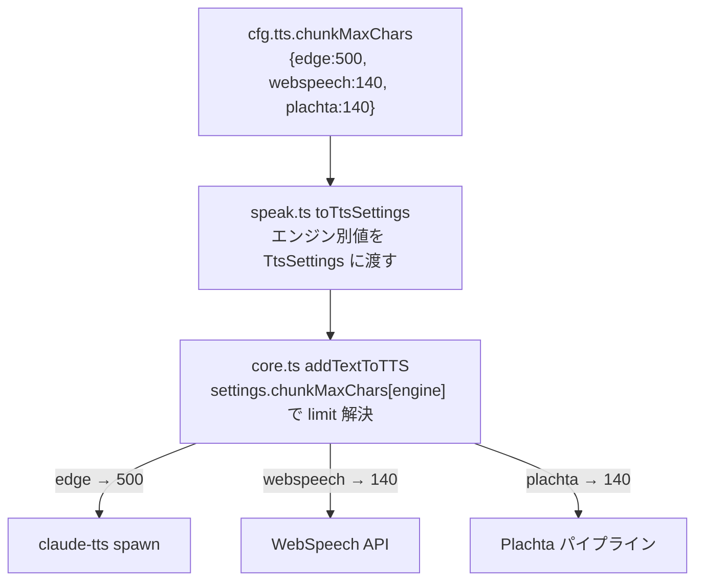

# EdgeTTS チャンク上限単独設定 設計書（v0.18.0）

> 📂 パス：`80_POC_Projects/POC_017_ClaudianBridge/02_設計文書/2026-08-16-edge-chunkmax-settings-design.md`
> 📍 ソース：`D:/AI-Agent/ClaudianBridge/src/features/tts/`, `src/core/settings.ts`
> 📅 作成日：2026-08-16
> 🐕 担当：MiuMiu 🐾
> 🔗 関連：[[2026-08-16-tts-read-spec-enhancement-design|TTS 読み上げ仕様改良設計]]（v0.17 で全エンジン共通 chunkMaxChars を導入）

---

## 一、背景と目的

v0.17.0 で導入した `tts.chunkMaxChars`（50〜140・既定 140）は**全エンジン共通**のチャンク上限だった。しかし、EdgeTTS（edge エンジン）は claude-tts スキル側に文字数制限がなく、140 は Plachta（HF Space 上限 150 字）に合わせた保守的な値である。edge はより長文を 1 リクエストで扱える。

本件では、**EdgeTTS のチャンク上限を単独設定**できるようにし、デフォルト **500** とする。

## 二、ユーザー決定事項（2026-08-16 確認済み）

| # | 項目 | 決定 |
|:-:|------|------|
| 1 | 設定の持ち方 | **エンジン別マップ** `tts.chunkMaxChars: { edge, webspeech, plachta }` に変更（v0.17 の number から変更） |
| 2 | 既存値のマイグレーション | 既存 `chunkMaxChars`（number）は **webspeech / plachta に引き継ぎ**、**edge は 500 に初期化** |
| 3 | edge の設定範囲 | **100〜2000**（既定 500） |
| 4 | 設定 UI | **3 つ独立スライダー**（edge / webspeech / plachta） |

## 三、アーキテクチャ

### 3.1 設定スキーマ変更

```typescript
// src/core/settings.ts
export const CHUNK_MAX_CHARS_MIN = 50;          // webspeech / plachta 共通
export const CHUNK_MAX_CHARS_MAX = 140;
export const DEFAULT_CHUNK_MAX_CHARS = 140;
export const EDGE_CHUNK_MAX_CHARS_MIN = 100;    // edge 専用
export const EDGE_CHUNK_MAX_CHARS_MAX = 2000;
export const DEFAULT_EDGE_CHUNK_MAX_CHARS = 500;

/** v0.18.0: エンジン別チャンク上限 */
export interface TtsChunkMaxChars {
  edge: number;       // 100〜2000・既定 500
  webspeech: number;  // 50〜140・既定 140
  plachta: number;    // 50〜140・既定 140
}
```

`tts` インターフェースの `chunkMaxChars` を `number` から `TtsChunkMaxChars` に変更（required・正規化後は必ず存在）。

### 3.2 マイグレーション（後方互換）

既存ユーザー設定（v0.17 の number）からの変換:

| 既存 `chunkMaxChars` | 新 `chunkMaxChars` |
|---------------------|--------------------|
| `140`（number） | `{ edge: 500, webspeech: 140, plachta: 140 }` |
| 未設定 | `{ edge: 500, webspeech: 140, plachta: 140 }` |

- 既存 number は **webspeech / plachta** に引き継ぎ（`legacy ?? DEFAULT`）、**edge は常に 500 に初期化**（legacy を edge に適用しない）
- 新オブジェクト指定時は各値をクランプ（edge: 100-2000・webspeech/plachta: 50-140）

```typescript
function normalizeTtsChunkMaxChars(raw: unknown): TtsChunkMaxChars {
  const legacy = typeof raw === 'number' ? raw : undefined;
  const obj = (typeof raw === 'object' && raw !== null) ? raw as Partial<TtsChunkMaxChars> : {};
  return {
    edge: clamp(EDGE_CHUNK_MAX_CHARS_MIN, EDGE_CHUNK_MAX_CHARS_MAX,
      obj.edge ?? DEFAULT_EDGE_CHUNK_MAX_CHARS),
    webspeech: clamp(CHUNK_MAX_CHARS_MIN, CHUNK_MAX_CHARS_MAX,
      obj.webspeech ?? legacy ?? DEFAULT_CHUNK_MAX_CHARS),
    plachta: clamp(CHUNK_MAX_CHARS_MIN, CHUNK_MAX_CHARS_MAX,
      obj.plachta ?? legacy ?? DEFAULT_CHUNK_MAX_CHARS),
  };
}
```

### 3.3 データフロー（core.ts / speak.ts）



- `TtsSettings.chunkMaxChars` を `Partial<TtsChunkMaxChars>` に型変更
- `core.ts` のチャンク分割:

```typescript
// v0.18.0: エンジン別のチャンク上限（edge は既定 500・他は 140）
const engineDefault = settings.engine === 'edge' ? DEFAULT_EDGE_CHUNK_MAX_CHARS : DEFAULT_CHUNK_MAX_CHARS;
const limit = settings.chunkMaxChars?.[settings.engine] ?? engineDefault;
const chunks = limit > 0 && trimmed.length > limit ? chunkText(trimmed, limit) : [trimmed];
```

- `speak.ts toTtsSettings`: `chunkMaxChars: cfg.tts.chunkMaxChars`（そのまま渡す）

### 3.4 設定 UI（3 つ独立スライダー）

| スライダー | 範囲 | 既定 | 対象フィールド |
|-----------|:---:|:---:|---------------|
| EdgeTTS | 100〜2000 | 500 | `chunkMaxChars.edge` |
| WebSpeech | 50〜140 | 140 | `chunkMaxChars.webspeech` |
| Plachta | 50〜140 | 140 | `chunkMaxChars.plachta` |

- 既存の「チャンク上限（全エンジン共通）」スライダー（`SettingTabTts.ts` 5.6）を 3 つに分割
- i18n ラベルをエンジン別に更新（ja/en/zh）
- 各スライダーの `onChange` は該当エンジンの値のみ更新（他は維持）

```typescript
// 保存例（edge）:
store.save({ ...latest, tts: { ...latest.tts, chunkMaxChars: { ...latest.tts.chunkMaxChars, edge: v } } });
```

## 四、エラー処理

| ケース | 挙動 |
|--------|------|
| 既存 number 設定 | normalize でエンジン別マップに変換（edge=500 初期化） |
| 不正値（範囲外・非数値） | clamp / デフォルトへフォールバック |
| validate 違反 | エンジン別の値域を検証（`tts.chunkMaxChars.edge は 100〜2000` 等） |

## 五、テスト計画（vitest）

| # | テスト | 対象 |
|:-:|--------|------|
| 1 | normalize: 既存 number（140）→ `{ edge: 500, webspeech: 140, plachta: 140 }` | `settings.test.ts` |
| 2 | normalize: 未設定 → 全デフォルト | 同上 |
| 3 | normalize: オブジェクト指定時のクランプ（edge 100-2000・他 50-140） | 同上 |
| 4 | validate: エンジン別値域チェック | 同上 |
| 5 | core: engine 別 limit 解決（edge 500 / webspeech 140 / plachta 140） | `core.test.ts` |
| 6 | speak: toTtsSettings がエンジン別値を渡す | `speak.test.ts` |
| 7 | 既存テストの回帰なし | 全テスト |

## 六、リスクと対策

| リスク | 影響 | 対策 |
|--------|------|------|
| v0.17 の `chunkMaxChars`（number）参照箇所の型エラー | ビルド失敗 | normalize で型変換 + 参照箇所（core/speak/SettingTab/tests）を一括更新 |
| edge 500 字で claude-tts スキル側の不具合 | 読み上げ失敗 | 500 は安全側（スキルに制限なし）。100-2000 で調整可 |
| 既存ユーザーの意図（edge も 140 だった）との乖離 | 挙動変更 | 決定事項 2 どおり edge は 500 に初期化。リリースノートで明記 |

## 七、スコープ外（YAGNI）

- voice-config（`cli.max_chars` = 300）との同期変更（CLI 側は既存のまま）
- エンジン別の分割方式変更（edge 先行 spawn パイプラインは claude-tts スキル改修前提で別途）
- 読み上げタイプ（①〜⑤）ごとのチャンク上限（エンジン単位のみ）

---

*📅 2026-08-16 · MiuMiu 🐾 · ユーザー承認済み（4 項目の決定事項）*
