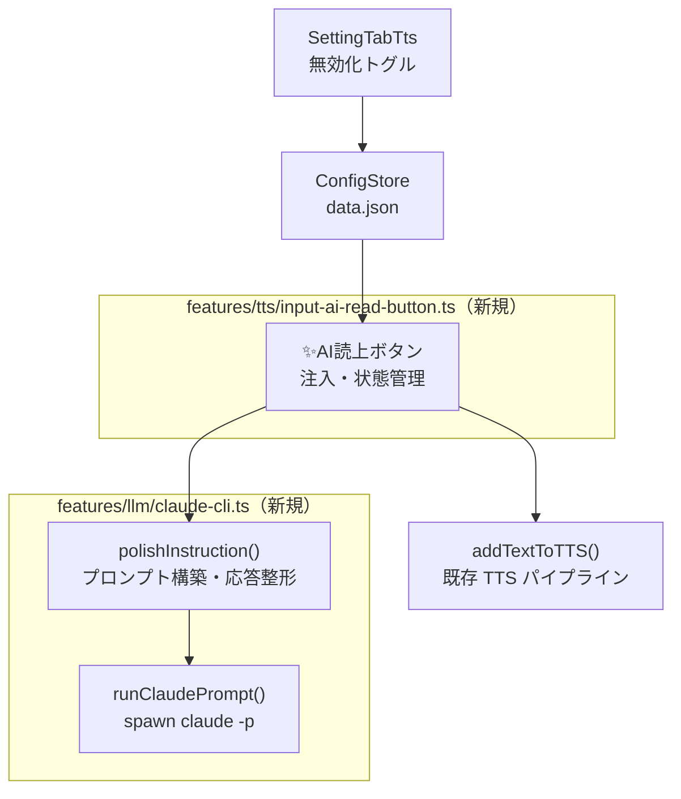
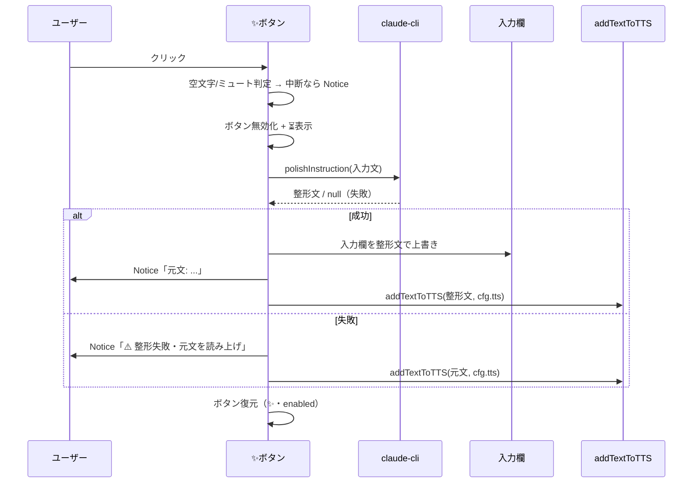

# AI読み上げボタン設計（ClaudianChat 入力欄・意図解釈整形）

> 📂 パス：`80_POC_Projects/POC_017_ClaudianBridge/02_設計文書/2026-08-16-input-ai-read-button-design.md`
> 📍 ソース：`D:/AI-Agent/ClaudianBridge/src/features/llm/`, `src/features/tts/`
> 📅 作成日：2026-08-16
> 🐕 担当：MiuMiu 🐾
> 🔗 関連：[[2026-08-15-claudian-chat-toolbar-buttons-design|チャットツールバーボタン統合設計]], [[2026-08-15-message-read-button-design|メッセージ読上げボタン設計]]

---

## 一、背景と目的

Claudian チャット入力欄のツールバー（`.claudian-input-toolbar`）右下に **✨AI読み上げボタン** を追加する。

ユーザーが入力欄に書いた内容（口語・断片的な文章）を AI で意図解釈し、**分かりやすい指令文に整形**して:

1. 入力欄を整形文で**上書き**する
2. 整形文を **TTS で読み上げる**（読み上げ設定の TTS エンジン設定に従う）

ボタンは ClaudianBridge の**読み上げ設定で無効化**できる。

## 二、ユーザー決定事項（2026-08-16 確認済み）

| # | 項目 | 決定 |
|:-:|------|------|
| 1 | 意図解釈 LLM | **Claude Code CLI（`claude -p`）** — Claudian チャットと同じバックエンドで API キー追加設定不要 |
| 2 | ボタン配置 | **ツールバー右端**（既存ミュート🔊・📖全文ボタンと同じ `.claudian-input-toolbar` へ `margin-left: auto` で右端配置） |
| 3 | LLM 失敗時挙動 | **元文を保持して、元文をそのまま TTS で読み上げる** |
| 4 | 元文の復元 | **Notice で元文を表示**（コピペで復元可能） |
| 5 | 整形後の言語 | **入力と同じ言語を維持**（プロンプトで指定） |
| 6 | モジュール構成 | **案 A：モジュール分離**（`features/llm/` + `features/tts/` に新規ファイル） |

## 三、アーキテクチャ

### 3.1 モジュール構成



| ファイル | 種別 | 責務 |
|:---------|:----:|:-----|
| `src/features/llm/claude-cli.ts` | 🆕 新規 | `claude -p` 実行（spawn・タイムアウト・Windows 対策）+ `polishInstruction()` プロンプト構築。UI 非依存の純粋モジュール |
| `src/features/tts/input-ai-read-button.ts` | 🆕 新規 | ✨ボタンを `.claudian-input-toolbar` 右端へ注入・クリックフロー・ビジー状態管理 |
| `src/core/settings.ts` | ✏️ 改修 | `tts.inputAi: { enabled: boolean }`（デフォルト `true`）追加 + normalize + validate |
| `src/settings/SettingTabTts.ts` | ✏️ 改修 | 「AI読み上げボタン」トグル追加（読み上げセクション） |
| `src/main.ts` | ✏️ 改修 | `setupInputAiReadButton(app, store)` を登録 |
| `src/core/i18n.ts` | ✏️ 改修 | ボタン title・Notice 文言キー追加（ja/zh/en） |
| `styles.css` | ✏️ 改修 | 右端寄せ（`margin-inline-start: auto`）・ビジー表示 |

> 既存 `toolbar-buttons.ts`（ミュート・📖全文）には**修正しない**（surgical 原則）。MutationObserver は `message-read-button` と同じく独立 observer を持つことを許容する。

### 3.2 CLI 呼び出し仕様（`claude-cli.ts`）

```typescript
export interface ClaudeCliOptions {
  timeoutMs?: number;   // デフォルト 30000
  cwd?: string;
}

/** claude -p を実行し、stdout を返す。失敗・タイムアウト・空応答は null */
export async function runClaudePrompt(prompt: string, opts?: ClaudeCliOptions): Promise<string | null>;

/** 入力文を指令文に整形するプロンプトを構築し runClaudePrompt へ。整形文 or null */
export async function polishInstruction(text: string, opts?: ClaudeCliOptions): Promise<string | null>;
```

- 実行形式: `claude -p "<整形プロンプト>"`
- **整形プロンプト（固定テンプレート）**: 「以下の入力文の意図を解釈し、明確で分かりやすい指示文に整形せよ。入力と同じ言語を維持すること。応答は整形文のみ（説明・引用符・前後の空白を含めない）」+ ユーザー入力文
- タイムアウト **30 秒**（超過でプロセス kill → `null`）
- **Windows 対策**（学習済み教訓を適用）:
  - `spawn ENOENT` は「cwd 不存在」の誤報が多い → `cwd` 存在チェック
  - `shell: true` に args 配列を渡さない（DEP0190）→ 単一文字列コマンド or `claude.cmd` 解決
- 応答は trim し、空文字なら `null`

### 3.3 ボタン仕様（`input-ai-read-button.ts`）

| 項目 | 仕様 |
|------|------|
| 注入先 | `.claudian-input-toolbar`（MutationObserver + 重複防止 `data-cb-input-ai` マーカー） |
| 配置 | 右端（`margin-inline-start: auto`） |
| 表示 | ✨ アイコン（title=「AI読み上げ：入力文を整形して読み上げます」） |
| ビジー中 | ボタン disabled + ⏳ アイコン（CLI 実行中） |
| 非表示条件 | `tts.inputAi.enabled === false`（`store.onSave` で即時反映・注入/削除） |

### 3.4 クリックフロー（データフロー）



## 四、設定スキーマ変更

```typescript
// src/core/settings.ts に追加
tts: {
  // ...既存フィールド...
  inputAi: {
    enabled: boolean;   // デフォルト true
  };
}
```

- `normalizeClaudianBridgeSettings`: `tts.inputAi` 欠落時はデフォルト `{ enabled: true }` を補完
- `validateClaudianBridgeSettings`: `enabled` が boolean であることを検証
- 既存フィールドは不変・マイグレーション不要

## 五、エラーハンドリング

| ケース | 挙動 |
|--------|------|
| 入力欄が空 | Notice「入力がありません」で中断（読み上げしない） |
| `tts.enabled=false`（ミュート中） | Notice「🔇 ミュート中」で中断（既存ボタンと同じ挙動） |
| CLI 失敗（起動不可・タイムアウト・空応答） | **元文を保持**（上書きしない）し、元文をそのまま `addTextToTTS` で読み上げ + ⚠️ Notice |
| 上書き成功 | 元文を Notice に表示（コピペで復元可能） |
| 二重クリック | ボタン disabled + `busy` フラグでガード |
| ツールバー未出現 | MutationObserver が監視継続、出現後に自動注入 |

## 六、テスト計画（vitest）

| # | テスト | 対象 |
|:-:|--------|------|
| 1 | `polishInstruction` が `claude -p` を正しい引数で呼ぶ・タイムアウトで kill + null・空応答で null | `tests/features/llm/claude-cli.test.ts`（新規・child_process を mock） |
| 2 | ボタン注入・重複防止・`enabled=false` で非注入・onSave で即時反映 | `tests/features/tts/input-ai-read-button.test.ts`（新規・jsdom） |
| 3 | 成功時: 入力欄上書き + `addTextToTTS` が整形文で呼ばれる | 同上（polishInstruction / addTextToTTS を mock） |
| 4 | 失敗時: 上書きせず元文で読み上げ | 同上 |
| 5 | 空入力・ミュート時は読み上げない + Notice | 同上 |
| 6 | `tts.inputAi` の normalize/validate | `tests/core/settings.test.ts` に追加 |

> jsdom 環境は既存 `toolbar-buttons.test.ts`・`message-read-button.test.ts` で実績あり。

## 七、リスクと対策

| リスク | 影響 | 対策 |
|--------|------|------|
| realclaudian の入力欄 DOM 構造が不明・変更される | 入力文の取得・上書きが失敗 | 実装時に実測確認。構造変更時は既存「アップグレード後 grep 再確認」運用で検知 |
| 入力欄上書きが realclaudian 内部状態に反映されない | 送信時に旧テキストが送られる | 値設定後に input/change イベントを dispatch し状態同期（実装時検証） |
| `claude` CLI が PATH にない・起動が遅い | 整形失敗・体感待ち時間 | 失敗時は元文読み上げフォールバックで機能継続。ビジー表示で待ちを明示 |
| Windows の spawn 系問題（ENOENT 誤報・DEP0190） | CLI 起動失敗 | 学習済み対策（3.2 節）を適用 |
| 整形文が入力と異なる言語で返る | 読み上げ言語の混乱 | プロンプトで同一言語維持を明示。TTS 側は既存の言語自動検出に従う |

## 八、スコープ外（YAGNI）

- 整形プロンプトのユーザーカスタマイズ設定
- 再クリックでの元文復元トグル（Notice 表示で十分と判断）
- `features/llm/` の他 LLM 機能への拡張（本件では `polishInstruction` のみ）
- 意図解釈結果のプレビュー確認ダイアログ（ワンクリックで完結させる）

---

*📅 2026-08-16 · MiuMiu 🐾 · ユーザー承認済み（6 項目の決定事項）*
