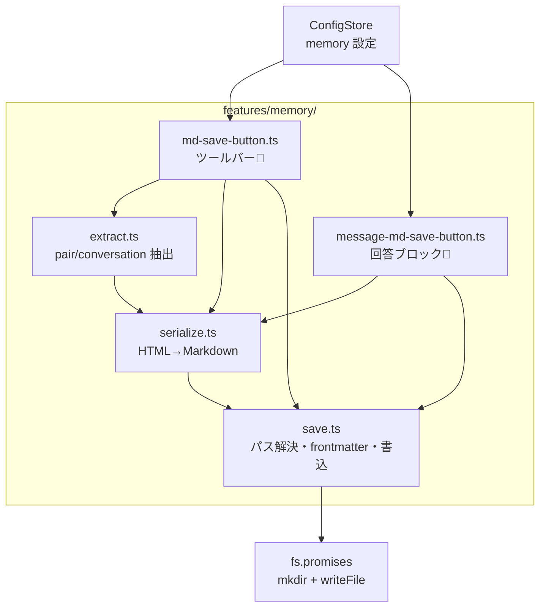
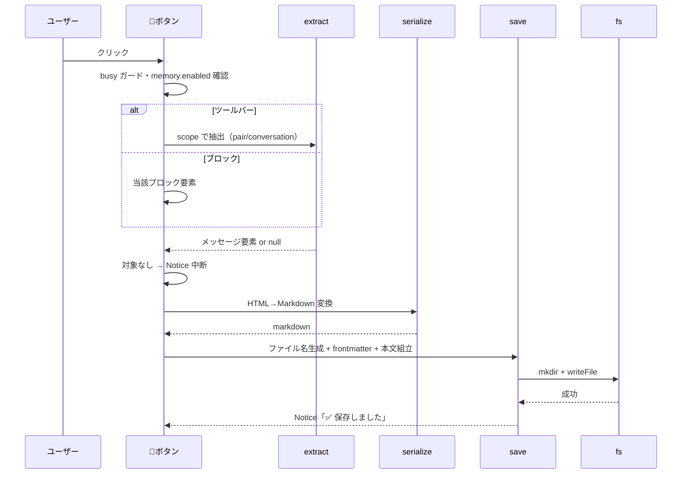

# MD保存ボタン設計（ClaudianChat 結果のメモリフォルダ保存）

> 📂 パス：`80_POC_Projects/POC_017_ClaudianBridge/02_設計文書/2026-08-16-md-save-button-design.md`
> 📍 ソース：`D:/AI-Agent/ClaudianBridge/src/features/memory/`
> 📅 作成日：2026-08-16
> 🐕 担当：MiuMiu 🐾
> 🔗 関連：[[2026-08-15-claudian-chat-toolbar-buttons-design|チャットツールバーボタン統合設計]], [[2026-08-15-message-read-button-design|メッセージ読上げボタン設計]], [[2026-08-16-input-ai-read-button-design|AI読み上げボタン設計]]

---

## 一、背景と目的

ClaudianChat の結果（アシスタント応答）を **Markdown ノートとしてメモリフォルダに保存** する機能を追加する。

- **ツールバー** の 📝 ボタン → 設定スコープ（既定：質問＋応答 / 変更可：チャット全体）を保存
- **回答ブロック右下** の 📝 ボタン → そのブロックのみを保存

保存先メモリフォルダは ClaudianBridge の設定画面で指定できる（相対 = Vault 内 / 絶対 = ファイルシステム、既定 `Memory/`）。

## 二、ユーザー決定事項（2026-08-16 確認済み）

| # | 項目 | 決定 |
|:-:|------|------|
| 1 | 保存範囲（ツールバー） | **既定：質問＋応答の1往復（pair）**。設定でチャット全体（conversation）に変更可 |
| 2 | ボタン配置 | **入力ツールバー**（ミュート🔊・📖・✨ の並び）+ **回答ブロック右下**（コピー/読上げの並び） |
| 3 | ブロックボタンの保存対象 | **そのブロックのみ**（scope 設定の影響を受けない） |
| 4 | 保存先フォルダ | テキスト欄で設定。**相対パス → Vault 内**、**絶対パス → そのまま**。既定 `Memory/` |
| 5 | ファイル名 | **`YYYY-MM-DD-HHMM_<先頭見出し>.md`**（サニタイズ・見出し無しは `claudian-chat`） |
| 6 | Markdown 抽出方式 | **案 A：内製 HTML→Markdown 変換器**（依存追加なし・Obsidian 特有要素対応） |
| 7 | 設定 UI | 新規「Memory」タブ（既存タブ構造に追従） |
| 8 | 保存形式 | frontmatter 付き。pair は `## 質問`／`## 回答` の2セクション構成 |

## 三、対象 DOM（realclaudian 実測）

```
.claudian-messages
  ├── .claudian-message-user
  │     └── .claudian-message-content
  └── .claudian-message-assistant
        └── .claudian-message-content
              └── .claudian-text-block       ← position:relative（テキスト1ブロックごと）
                    ├── 描画済み HTML（h1〜h6 / table / pre / .callout 等）
                    ├── .claudian-text-copy-btn   ← absolute; bottom:0; inset-inline-end:0
                    └── .claudian-text-tts-btn    ← 読上げボタン（既存）inset-inline-end:22px
```

- コードブロック：`.claudian-code-wrapper > pre > code.language-*`
- コールアウト：`.callout[data-callout="note"]`（Obsidian 描画）
- 生 Markdown は DOM に残らない（コピーボタンの closure 内のみ）→ **HTML→Markdown 変換**で再現

## 四、アーキテクチャ

### 4.1 モジュール構成



| ファイル | 種別 | 責務 |
|:---------|:----:|:-----|
| `src/features/memory/md-save-button.ts` | 🆕 新規 | ツールバー📝 注入・クリックフロー・MutationObserver |
| `src/features/memory/message-md-save-button.ts` | 🆕 新規 | 回答ブロック📝 注入・クリックフロー（ブロックのみ保存） |
| `src/features/memory/extract.ts` | 🆕 新規 | チャット DOM からスコープ別にメッセージ抽出（純関数） |
| `src/features/memory/serialize.ts` | 🆕 新規 | HTML→Markdown 変換器（純関数・DOM 非依存ロジック） |
| `src/features/memory/save.ts` | 🆕 新規 | パス解決・ファイル名生成・frontmatter 組立・書込 |
| `src/core/settings.ts` | ✏️ 改修 | `memory` セクション追加（defaults / normalize / validate） |
| `src/settings/SettingTabMemory.ts` | 🆕 新規 | 設定タブ（有効 / 範囲 / フォルダ） |
| `src/settings/ClaudianBridgeSettingTab.ts` | ✏️ 改修 | TABS に Memory タブ追加 |
| `src/core/i18n.ts` | ✏️ 改修 | ボタン title・設定文言キー追加（ja/zh/en） |
| `src/main.ts` | ✏️ 改修 | `setupMdSaveButton(app, store)` / `setupMessageMdSaveButtons(app, store)` を登録 |
| `styles.css` | ✏️ 改修 | ボタンスタイル（ツールバー / ブロック右下） |

> 既存 `toolbar-buttons.ts`（ミュート・📖）・`message-read-button.ts` には**修正しない**（surgical 原則）。独立 observer を持つ。

## 五、設定スキーマ

```typescript
export type MemoryScope = 'pair' | 'conversation';

export interface MemorySettings {
  /** MD保存ボタン全体の有効/無効（既定 true） */
  enabled: boolean;
  /** ツールバーボタンの保存範囲。ブロックボタンは常に block（影響なし） */
  scope: MemoryScope;
  /** メモリフォルダ。相対= Vault 内 / 絶対= ファイルシステム。既定 'Memory/' */
  folder: string;
}
```

- `DEFAULT_MEMORY_SETTINGS = { enabled: true, scope: 'pair', folder: 'Memory/' }`
- `normalizeMemorySettings(raw)`：型不正は default にフォールバック
- `normalizeClaudianBridgeSettings` / `validateClaudianBridgeSettings` に組み込み

### 設定タブ（SettingTabMemory.ts）

| 設定 | 種別 | 内容 |
|------|------|------|
| 有効化 | Toggle | 両ボタンの表示/非表示を即時反映（onSave で注入/削除） |
| 保存範囲 | Dropdown | pair / conversation（ツールバーボタンのみ） |
| メモリフォルダ | Text | placeholder `Memory/`・desc「相対パスは Vault 内、絶対パスはそのまま」 |

## 六、抽出仕様（extract.ts）

| スコープ | 抽出対象 |
|----------|----------|
| `pair` | 最後の `.claudian-message-assistant` ＋ 直前の `.claudian-message-user`（存在時のみ）。各 `.claudian-message-content` を返す |
| `conversation` | `.claudian-messages` 内の全 `.claudian-message-user` / `.claudian-message-assistant` を時系列で。各メッセージの `role` + 内容を返す |
| `block`（ブロックボタン） | `.claudian-text-block` 要素を直接 serialize に渡す（extract 不使用） |

- 出力型（例）：`{ role: 'user' | 'assistant'; elements: Element[] }[]`
- 対象が無い場合は `null`（呼び出し側で Notice）

## 七、HTML→Markdown 変換仕様（serialize.ts）

入力：`.claudian-message-content` または `.claudian-text-block` 内の Element。出力：Markdown 文字列。

| HTML 要素 | Markdown 出力 |
|-----------|---------------|
| `h1`〜`h6` | `#`×n ＋ テキスト |
| `p` | テキスト（ブロックは空行で区切り） |
| `ul > li` | `- ` ＋ テキスト（入れ子はインデント 2 スペース） |
| `ol > li` | `1. ` ＋ テキスト（連番） |
| `table` | MD テーブル（`\|------\|------\|` 区切り・ヘッダー行＋データ行） |
| `.claudian-code-wrapper > pre > code` | ` ```lang` ＋ コード ＋ ` ``` `（lang は `language-*` から） |
| `pre > code`（素の pre） | 同上（言語無し） |
| `.callout[data-callout]` | `> [!type]` ＋ 内容（タイトルがあれば `> [!type] title`） |
| `blockquote` | `> ` ＋ テキスト |
| `strong` | `**テキスト**` |
| `em` | `*テキスト*` |
| `del` | `~~テキスト~~` |
| `code`（インライン） | `` `テキスト` `` |
| `a` | `[テキスト](href)` |
| `hr` | `---` |
| `br` | 改行 |
| `img` | `` |

- 空白調整：ブロック末尾の余分な空行は除去し、最終的に 1 連続空行に正規化
- ボタン類（`.claudian-text-copy-btn`・`.claudian-text-tts-btn`・保存ボタン自身）は除外

## 八、保存仕様（save.ts）

### 8.1 パス解決

```text
folder が絶対パス（^[A-Za-z]:\\ または ^/）→ そのまま
folder が相対パス → vaultRoot と join（例: Memory/ → <vaultRoot>/Memory）
```

- vaultRoot は `app.vault.adapter.getBasePath()` で解決（`__dirname` / `process.cwd()` を信用しない）

### 8.2 ファイル名

```text
YYYY-MM-DD-HHMM_<先頭見出し>.md
```

- 先頭見出し：アシスタント応答（pair / conversation は最後の応答、block は当該ブロック）の最初の `h1-h6` テキスト
- サニタイズ：`VaultPath.sanitizeStem` 相当（`\ / : * ? " < > |` → `_`、120 字上限）
- 見出し無し：`claudian-chat` を使用
- 同一分に複数保存で同名衝突：秒を付与（`YYYY-MM-DD-HHMMSS`）または連番

### 8.3 frontmatter と本文

```yaml
---
title: <先頭見出し or claudian-chat>
type: claudian-chat
scope: pair | conversation | block
created: YYYY-MM-DD HH:mm
source: Claudian Chat
---
```

| scope | 本文構成 |
|-------|----------|
| `pair` | `## 質問` ＋ ユーザー内容／`## 回答` ＋ アシスタント内容 |
| `conversation` | メッセージごとに `### 👤 ユーザー`／`### 🤖 Claude` ＋ 内容 |
| `block` | ブロックの変換結果のみ（セクション見出し無し） |

> frontmatter の `scope` は `'pair' | 'conversation' | 'block'`（保存ファイル用の拡張ユニオン）。
> 設定側の `MemoryScope`（`'pair' | 'conversation'`）とは別物で、設定には `block` を含めない。

### 8.4 書き込み

```typescript
await fs.promises.mkdir(path.dirname(absPath), { recursive: true });
await fs.promises.writeFile(absPath, fullMd, 'utf8');
```

- office 変換と同一方式（Vault 内外どちらでも動作・既存実績あり）
- 成功時：`Notice('✅ Memory/ファイル名.md に保存しました')`

## 九、ボタン仕様

### 9.1 ツールバーボタン（md-save-button.ts）

| 項目 | 仕様 |
|------|------|
| 注入先 | `.claudian-input-toolbar`（MutationObserver + `data-cb-md-save-toolbar` マーカー） |
| 表示 | 📝 アイコン（title「MD保存：メモリフォルダに保存」） |
| 有効時 | `memory.enabled === false` で非注入・onSave で即時反映 |

### 9.2 回答ブロックボタン（message-md-save-button.ts）

| 項目 | 仕様 |
|------|------|
| 注入先 | `.claudian-text-block` 内 `.claudian-text-copy-btn` の並び（`data-cb-md-save` マーカー・重複防止） |
| 配置 | `inset-inline-end:44px`（コピー0px / 読上げ22px の左隣） |
| 表示 | 📝 アイコン・hover 表示（既存ボタンと同じ） |

## 十、クリックフロー



## 十一、エラーハンドリング

| ケース | 挙動 |
|--------|------|
| ツールバー/ブロック未出現 | MutationObserver が監視継続、出現後に自動注入 |
| 対象メッセージ無し | Notice「保存するメッセージがありません」で中断 |
| メモリフォルダ空 | 既定 `Memory/` を使用 |
| フォルダ/書込失敗 | ⚠️ Notice（エラー内容）+ console.warn |
| 二重クリック | busy フラグでガード（disabled + ⏳表示） |
| 同名ファイル衝突 | 秒/連番でファイル名を一意化 |

## 十二、テスト計画（vitest）

| # | テスト | 対象 |
|:-:|--------|------|
| 1 | serialize：見出し / テーブル / コードフェンス / callout / リスト（入れ子）/ インライン装飾 | `tests/features/memory/serialize.test.ts`（新規） |
| 2 | extract：pair が最後の assistant ＋直前 user を返す・conversation が全件時系列・対象なし null | `tests/features/memory/extract.test.ts`（新規・jsdom） |
| 3 | save：ファイル名生成（先頭見出し・サニタイズ・見出し無し・衝突）/ パス解決（相対→Vault・絶対そのまま）/ frontmatter 組立 | `tests/features/memory/save.test.ts`（新規・fs mock） |
| 4 | ツールバーボタン：注入・重複防止・`enabled=false` 非注入・onSave 即時反映 | `tests/features/memory/md-save-button.test.ts`（新規・jsdom） |
| 5 | ブロックボタン：注入・重複防止・ブロック内容のみ保存 | `tests/features/memory/message-md-save-button.test.ts`（新規・jsdom） |
| 6 | `memory` 設定の normalize / validate | `tests/core/settings.test.ts` に追加 |

> jsdom 環境は既存 `message-read-button.test.ts`・`toolbar-buttons.test.ts` で実績あり。

## 十三、リスクと対策

| リスク | 影響 | 対策 |
|--------|------|------|
| HTML→MD 変換の精度（複雑なネスト・画像・数式） | 保存ノートの品質劣化 | 変換器を純関数化し serialize 単体テストで主要パターンを固定。実測 DOM に合わせてルールを段階的に拡充 |
| realclaudian の DOM 構造変更 | 抽出・注入が失敗 | 実装時に実測確認。「アップグレード後 grep 再確認」運用で検知 |
| OneDrive 同期中のファイル書き込み | 書込競合・同期ラグ | office 変換と同方式（既存実績）。失敗時は ⚠️ Notice |
| 大量メッセージの conversation 保存 | 巨大ファイル・性能 | 現状は全件保存（YAGNI）。必要になれば件数上限を追加 |

## 十四、スコープ外（YAGNI）

- 保存ノートのテンプレート（frontmatter 項目）のユーザーカスタマイズ
- ファイル名パターンの設定（固定規則のみ）
- 保存後の Vault 内リンク自動挿入・タグ自動付与
- conversation 保存のメッセージ数上限・ページ分割
- ブロックボタンの独立した有効/無効トグル（共通 `enabled` のみ）

---

*📅 2026-08-16 · MiuMiu 🐾 · ユーザー承認済み（8 項目の決定事項）*
