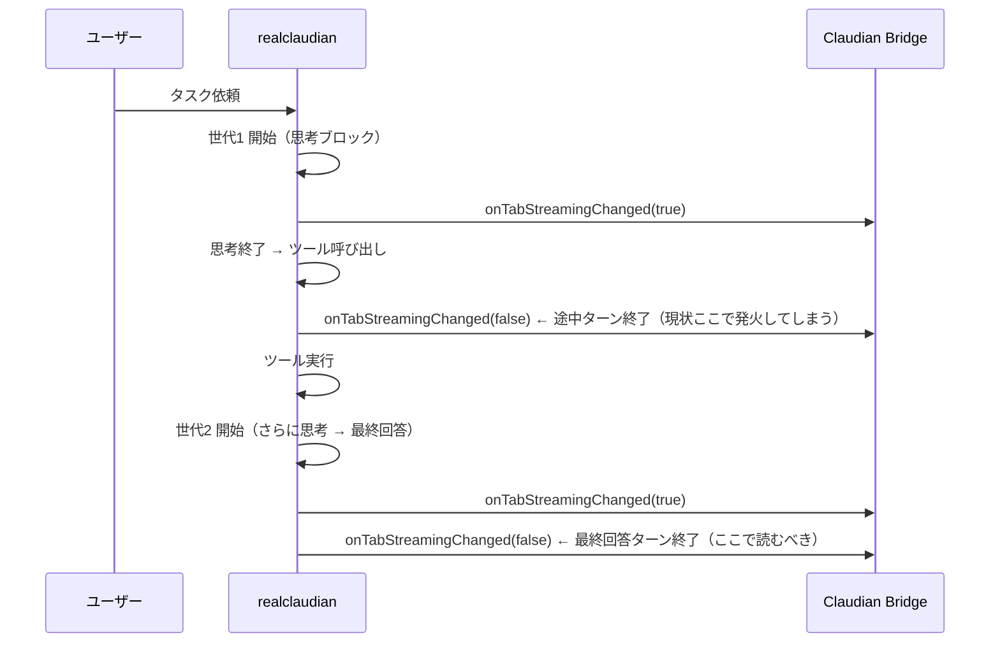

# 自動読み上げ「最終回答のみ」改善設計書（v0.19.0）

> 📂 パス：`80_POC_Projects/POC_017_ClaudianBridge/02_設計文書/2026-08-16-tts-auto-read-final-answer-design.md`
> 📍 ソース：`D:/AI-Agent/ClaudianBridge/src/features/tts/`
> 📅 作成日：2026-08-16
> 🐕 担当：MiuMiu 🐾
> 🔗 関連：[[2026-08-14-task-completion-auto-tts-design|タスク終了時自動TTS読み上げ設計]], [[2026-08-16-tts-read-spec-enhancement-design|TTS読み上げ仕様改良設計]]

---

## 一、背景と目的

タスク終了時自動読み上げ（v0.11.0〜）は `realclaudian` の `onTabStreamingChanged(tabId, isStreaming)` の **true→false 遷移**をタスク完了とみなして発火する。

しかし実機では、**ツールを使う複数ターンタスク**（思考ブロック → ツール実行 → さらに思考 → 最終回答）の**各アシスタント世代の終了時**にも `false` が発火する。このため以下の問題が発生する。

| # | 症状 | 内容 |
|:-:|------|------|
| 1 | 思考中に発火して読む | 途中ターン終了時に発火し、思考ブロックや途中内容を読む |
| 2 | 思考内容が混ざる | 読み上げ内容に `Thought for Xs` や思考本文が混入する |
| 3 | 最終回答が読まれない | 途中ターンで dedup マークが付き、最終回答がスキップされる |

**目的**: 自動読み上げは「途中の思考ブロック」と「完了タスクの回答」を区別し、**最後の回答文のみ**読み上げる。

## 二、根因分析（realclaudian v2.1.3 実測）

### 2.1 ストリーミング発火の実態

`onTabStreamingChanged(false)` はアシスタント世代（= 1 ターン）の終了ごとに発火する。複数ターンタスクでは以下が起きる。



### 2.2 実 DOM 構造（メッセージ内容）

`.claudian-message-content` の**直接子**として、内容ブロックが時系列で並ぶ。

| ブロック | クラス | 意味 |
|---------|--------|------|
| テキスト回答 | `.claudian-text-block` | レンダリング済み本文（マークダウン見出し・📢 blockquote 含む） |
| 思考 | `.claudian-thinking-block` | 思考ヘッダー＋`.claudian-thinking-content`（既定は展開表示・max-height 400px） |
| ツール呼び出し | `.claudian-tool-call` | ツール実行表示（Bash/Read/Write 等） |

**重要な性質**:
- 途中ターン（ツール実行ラウンド）は **`.claudian-tool-call`（または思考のみ）で終わる**
- 最終回答ターンは必ず **非空の `.claudian-text-block` で終わる**
- 各ブロックは `.claudian-message-content` の直接子（`createDiv` で追加される）

この性質を利用すれば「最終回答ターン」を DOM 構造から確実に判定できる。

### 2.3 現状コードの欠陥

| 箇所 | 欠陥 |
|------|------|
| `auto-read.ts` の `onStreamState` | `true→false` のたびに抽出を試みる。途中ターンでも発火する |
| `extract-report.ts` の dedup マーク | 途中ターンの blockquote / メッセージに `AUTO_READ_MARK` が付き、最終回答がスキップされる |
| `extract-report.ts` の full 抽出 | `innerText`＋`display:none` 方式の除外に依存。実ブラウザで思考内容が混入しうる |

## 三、設計方針（案 A: 最終回答ゲート + 構造的ブロック抽出）

### 3.1 全体方針

1. **最終回答ゲート**: `onTabStreamingChanged(false)` 時に「最後の assistant メッセージが最終回答ターンか」を DOM 構造から判定する。途中ターンなら即スキップ（dedup マークを付けない）。
2. **構造的ブロック抽出**: 読み上げテキストは `.claudian-text-block` のみを連結して組み立てる。思考・ツールは構造的に読み飛ばす（innerText の表示依存を排除）。

### 3.2 状態判定 `detectFinalAnswerState()`

`extract-report.ts` に新規関数を追加する。

```
messagesEl → 最後の .claudian-message-assistant → .claudian-message-content
  ↓ 直接子ブロック（text-block / tool-call / thinking-block）を時系列で走査
  ├─ 最後が .claudian-tool-call       → 'intermediate'（途中ターン → 即スキップ・リトライなし）
  ├─ 最後が .claudian-thinking-block  → 'intermediate'（思考のみ → 即スキップ）
  ├─ 最後が .claudian-text-block:
  │    ├─ 可視テキスト空              → 'pending'（描画遅延 → リトライ）
  │    ├─ .claudian-interrupted 含有  → 'intermediate'（中断 → スキップ）
  │    └─ 可視テキスト非空            → 'ready'（最終回答 → 読み上げ）
  └─ ブロッククラス無し（旧DOM・テストDOM）→ 可視テキスト有無で 'ready' / 'pending'
```

| 状態 | 意味 | auto-read の挙動 |
|------|------|------------------|
| `ready` | 最終回答テキストが存在 | `extractReportText` → 読み上げ |
| `intermediate` | 途中ターン（ツール・思考終端 / 中断） | 即スキップ・リトライなし・dedup マークなし |
| `pending` | 描画遅延等で判定不能 | 400ms × 最大5回リトライ |

**判定ロジック（実装イメージ）**:

```typescript
export type FinalAnswerState = 'ready' | 'intermediate' | 'pending';

export function detectFinalAnswerState(messagesEl: Element): FinalAnswerState {
  const assistants = messagesEl.querySelectorAll('.claudian-message-assistant');
  const last = assistants[assistants.length - 1];
  if (!last) return 'pending';

  const source = last.querySelector('.claudian-message-content') ?? last;
  const blocks = Array.from(source.children).filter((c) =>
    c.classList.contains('claudian-text-block') ||
    c.classList.contains('claudian-tool-call') ||
    c.classList.contains('claudian-thinking-block')
  );

  // ブロッククラス無し（旧DOM・レンダリング前）: 可視テキスト有無で判定
  if (blocks.length === 0) {
    return readVisibleText(source) === '' ? 'pending' : 'ready';
  }

  const lastBlock = blocks[blocks.length - 1];
  if (lastBlock.classList.contains('claudian-tool-call')) return 'intermediate';
  if (lastBlock.classList.contains('claudian-thinking-block')) return 'intermediate';

  // text-block
  if (lastBlock.querySelector('.claudian-interrupted')) return 'intermediate';
  return readVisibleText(lastBlock) === '' ? 'pending' : 'ready';
}
```

### 3.3 構造的抽出 `extractTextBlocks()`

`full` スコープの抽出を「メッセージ全体を読む」から「`.claudian-text-block` のみを読む」へ変更する。

```typescript
function extractTextBlocks(source: Element, excludeSel: string): string {
  const blocks = Array.from(source.children)
    .filter((c) => c.classList.contains('claudian-text-block'));
  // クラス無し（旧DOM・テスト）: 従来どおり全体を読む
  if (blocks.length === 0) {
    return excludeSel === '' ? readVisibleText(source) : readVisibleTextExcluding(source, excludeSel);
  }
  return blocks
    .map((b) => (excludeSel === '' ? readVisibleText(b) : readVisibleTextExcluding(b, excludeSel)))
    .filter((t) => t !== '')
    .join('\n');
}
```

- 思考ブロック・ツール呼び出しは**構造的に読み飛ばす**（`innerText` の `display:none` 依存を排除）
- `header` スコープの 📢 blockquote 抽出は**現状維持**（📢 はテキストブロック内にあり思考は含まれない）
- `header` の導入文フォールバック（`readIntroText`）は、思考・ツールブロックを**非表示リストへ構造的に追加**して二重防護

**`readIntroText` 強化（実装イメージ）**:

```typescript
function readIntroText(el: Element, excludeSel: string): string {
  const firstHeading = el.querySelector(HEADING_SELECTOR);
  if (!firstHeading) return '';
  const hide: Element[] = [];
  // 構造的に除外: 思考・ツールブロックは常に隠す（innerText の display 依存を排除）
  hide.push(...Array.from(el.querySelectorAll(`${THINKING_BLOCK_SELECTOR}, ${TOOL_CALL_SELECTOR}`)));
  let sib: Element | null = firstHeading;
  while (sib) { hide.push(sib); sib = sib.nextElementSibling; }
  return readTextWithHidden(el, hide, excludeSel);
}
```

`readSectionText`（一項目のみ）も同様に思考・ツールブロックを非表示リストへ追加する。

### 3.4 `auto-read.ts` のゲート統合

`tryExtract` の先頭で `detectFinalAnswerState` を判定する。

```typescript
const tryExtract = (attempt: number): void => {
  const state = detectFinalAnswerState(messages);
  if (state === 'intermediate') {
    console.debug('[cb-auto-read] 途中ターン終了（ツール/思考終端）— スキップ');
    return; // リトライしない。次回の streaming false で再評価
  }
  if (state === 'pending') {
    if (attempt < 4) {
      const timer = setTimeout(() => tryExtract(attempt + 1), 400);
      pendingTimers.add(timer);
    } else {
      console.debug('[cb-auto-read] give up: 最終回答テキストを抽出できませんでした');
    }
    return;
  }
  // state === 'ready': 従来どおり抽出 → 読み上げ
  const text = extractReportText(messages, scope, {
    excludeCallouts: cfg.tts.excludeCallouts ?? true,
    filter: resolveSpeechFilter(cfg, 'autoRead'),
  });
  if (text) {
    notice(`🔊 自動読み上げ: ${text.length} 文字を読み上げます`);
    enqueue(text);
    return;
  }
  if (attempt < 4) {
    const timer = setTimeout(() => tryExtract(attempt + 1), 400);
    pendingTimers.add(timer);
  }
};
```

### 3.5 変更ファイル

| ファイル | 変更内容 |
|---------|---------|
| `src/features/tts/extract-report.ts` | `detectFinalAnswerState` 追加 / `extractTextBlocks` 導入 / `readIntroText` 強化 |
| `src/features/tts/auto-read.ts` | `tryExtract` にゲート統合 |
| `tests/features/tts/extract-report.test.ts` | ゲート＋構造抽出テスト追加 |
| `tests/features/tts/auto-read.test.ts` | 複数ターン統合テスト追加 |

## 四、テスト計画

### 4.1 `extract-report.test.ts`

| ケース | 期待値 |
|--------|--------|
| text-block 終端・非空 | `ready` |
| tool-call 終端 | `intermediate` |
| thinking-block 終端 | `intermediate` |
| text-block 空 | `pending` |
| `.claudian-interrupted` 含有 | `intermediate` |
| ブロッククラス無し・可視テキスト有り | `ready` |
| ブロッククラス無し・テキスト無し | `pending` |
| assistant 無し | `pending` |
| full 抽出: 思考＋ツール＋テキスト混在 | テキストのみ（思考・ツール含まず） |
| full 抽出: テキストブロック無し | 従来どおり全体を読む（後方互換） |

### 4.2 `auto-read.test.ts`

| ケース | 期待値 |
|--------|--------|
| **複数ターン統合**: tool終端ターン false → 後続 text終端ターン false | 途中ターンでは speak されず、最終回答のみ 1 回 speak |
| 既存 19 件 | 全パス維持 |

## 五、リスクと対策

| リスク | 影響 | 対策 |
|--------|------|------|
| realclaudian のクラス名変更 | ゲートが効かなくなる | クラス不明 DOM は従来挙動にフォールバック。既存の「升级后须 grep 复核」運用を継続 |
| 最終回答が 📢 のみ（見出し・導入文なし） | header スコープで読み上げ対象なし | 従来どおり 📢 有無で判定（仕様維持） |
| サブエージェントの中間 📢 報告 | 途中でも読まれる可能性 | 既知の制約。📢 はタスク報告の慣習なので許容。ゲートは思考・ツール除外を保証 |
| 既存テスト DOM（クラス無し） | ゲートが `pending` 連発 | ブロッククラス無しは可視テキストで `ready` 判定にフォールバック |

## 六、検証コマンド

- `npm run typecheck`（D:/AI-Agent/ClaudianBridge）
- `npm test`（全件 PASS・既存 403 件 + 追加分）
- `npm run build`（ビルド + 自動デプロイ）

---

*📚 設計書 v1.0 · MiuMiu 🐾 · 2026-08-16*
