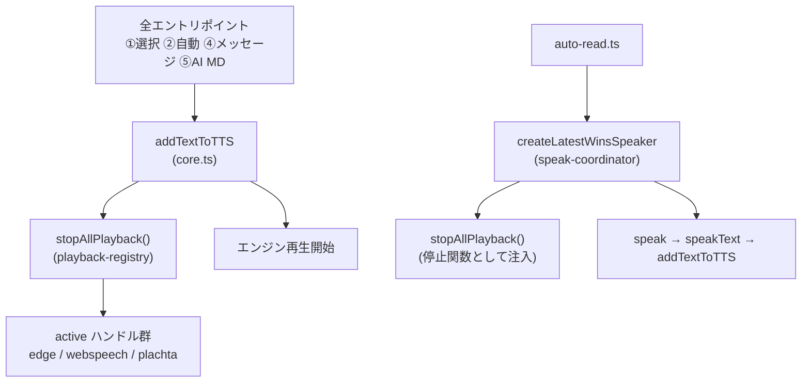
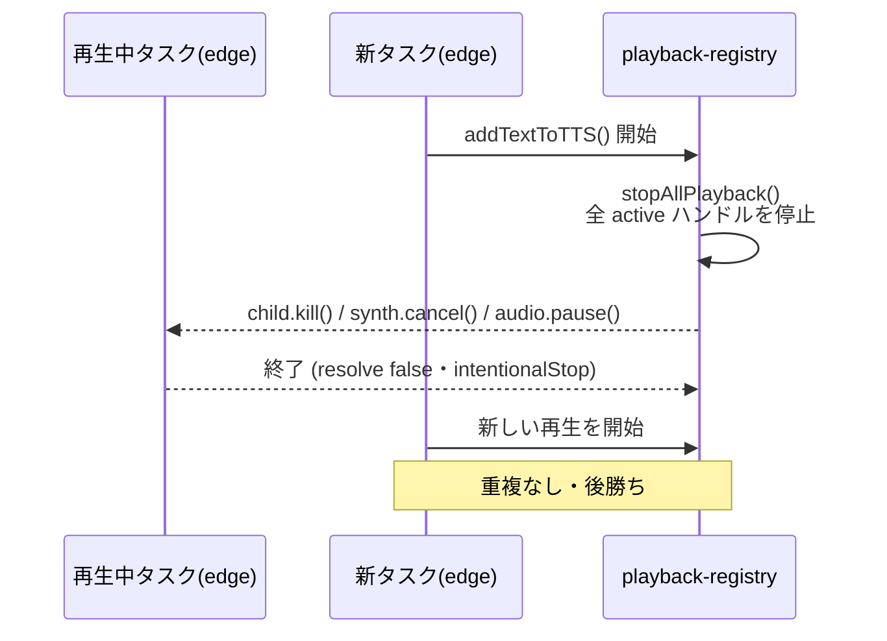
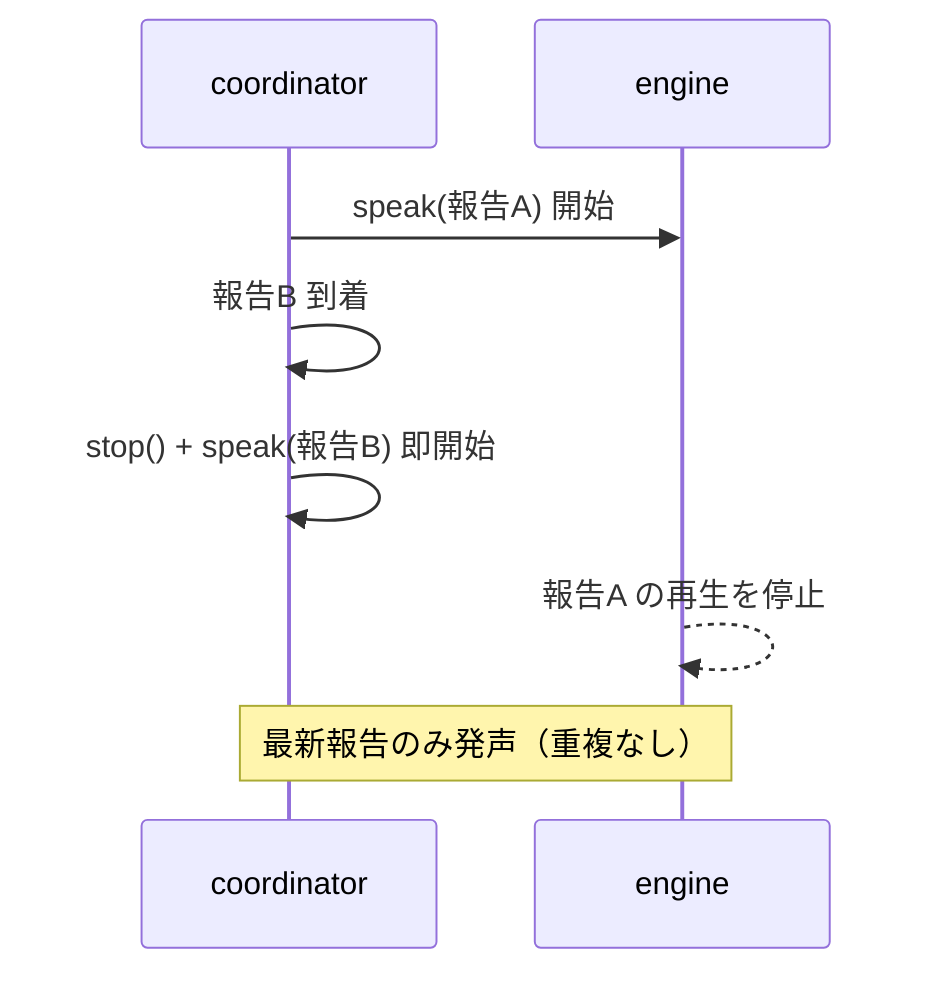

# TTS 重複読み防止設計書（即割り込み方式）

> 📂 パス：`80_POC_Projects/POC_017_ClaudianBridge/02_設計文書/2026-08-16-tts-interrupt-playback-design.md`
> 📍 ソース：`D:/AI-Agent/ClaudianBridge/src/features/tts/`
> 📅 作成日：2026-08-16
> 🐕 担当：MiuMiu 🐾
> 🔗 関連：[[2026-08-16-tts-read-spec-enhancement-design|TTS 読み上げ仕様改良設計]]

---

## 一、背景と目的

読み上げ中に別のタスク（メッセージ読上げ・AI 読上げ・自動読上げ等）が開始された場合、**前の読み上げを中断し、後の読み上げを開始する**。重複読み（2 つの音声が同時に鳴る）を防止する。

### 現状の問題

| シナリオ | 現状の挙動 |
|----------|-----------|
| edge 読上げ中に別タスク開始 | **2 つの子プロセスが同時発声**（重複） |
| webspeech 読上げ中に別タスク開始 | `synth.cancel()` により偶然割り込みされるが保証なし |
| auto-read 連続報告 | 最新 1 件を**キュー待機**（割り込みしない） |

### ユーザー決定事項（2026-08-16 承認済み）

| # | 項目 | 決定 |
|:-:|------|------|
| 1 | 割り込みスコープ | **全タスク共通で即割り込み**（後勝ち） |
| 2 | auto-read 連続報告 | **即座に割り込み**（前の報告を中断して新しい報告を読む） |
| 3 | アプローチ | 既存 `stopAllPlayback()` を活用 + `createLatestWinsSpeaker` を割り込み型に変更 |

---

## 二、アーキテクチャ

### 2.1 変更ファイル

| ファイル | 種別 | 責務 |
|:---------|:----:|:-----|
| `src/features/tts/core.ts` | ✏️ 改修 | `addTextToTTS` 冒頭に `stopAllPlayback()` を追加（全エントリポイントの共通入口で前再生を中断） |
| `src/features/tts/speak-coordinator.ts` | ✏️ 改修 | `createLatestWinsSpeaker` を「キュー待機」→「即割り込み」に変更。世代カウンタで async 競合を安全化 |
| `src/features/tts/auto-read.ts` | ✏️ 改修 | `createLatestWinsSpeaker` に `stopAllPlayback` を渡す |

> 既存 `playback-registry.ts` の `stopAllPlayback()` は変更なし（既に全エンジンの再生ハンドルを停止可能）。

### 2.2 モジュール依存



---

## 三、実装詳細

### 3.1 `core.ts` — `addTextToTTS` 冒頭で全停止

```typescript
export async function addTextToTTS(_app: App | null, text: string, settings: TtsSettings): Promise<boolean> {
  const noticeFn = (m: string): void => { new Notice(m); };

  const trimmed = text.trim();
  if (!trimmed) return true;

  // v0.18.1: 重複読み防止 — 新しい読み上げ開始前に既存の全再生を中断（後勝ち）
  stopAllPlayback();

  // ...以降、チャンク分割・エンジン再生は既存ロジックのまま
}
```

- 全エントリポイント（①選択 / ②自動 / ④メッセージ / ⑤AI / MD）は必ず `addTextToTTS` を経由するため、**単一ポイントで全タスクの重複を防止**できる
- 同一 `addTextToTTS` 内のチャンク連続再生には影響しない（冒頭で 1 回だけ実行）

### 3.2 `speak-coordinator.ts` — 即割り込みへの変更

```typescript
export type SpeakFn = (text: string) => Promise<boolean>;

export function createLatestWinsSpeaker(speak: SpeakFn, stop?: () => void): (text: string) => void {
  let speaking = false;
  let generation = 0;

  const run = (text: string): void => {
    if (speaking) {
      // ★ 変更点: キューせず即割り込み（後勝ち）
      generation++;
      const gen = generation;
      stop?.();
      void speak(text).catch(() => {}).finally(() => {
        if (gen === generation) speaking = false; // 世代一致時のみ解除
      });
      return;
    }
    speaking = true;
    generation++;
    const gen = generation;
    void speak(text).catch(() => {}).finally(() => {
      if (gen === generation) speaking = false;
    });
  };

  return run;
}
```

**世代カウンタの役割**: 旧スピーチの `finally` が新スピーチの `speaking` フラグを誤って解除する競合を防止する。旧世代の `finally` は `gen !== generation` のため何もしない。

### 3.3 `auto-read.ts` — 停止関数の注入

```typescript
import { stopAllPlayback } from './playback-registry';
// ...
const enqueue = createLatestWinsSpeaker(deps.speak, stopAllPlayback);
```

---

## 四、データフロー



**auto-read 連続報告の場合**:



---

## 五、エラー処理

| ケース | 挙動 |
|--------|------|
| 割り込みで旧再生が停止 | `intentionalStop` 扱い → **エラー Notice を出さない**（既存の停止ハンドルが保証） |
| 旧スピーチの promise が後で resolve | 世代不一致のため speaking フラグを誤解除しない |
| `stop()` が失敗（ハンドル消滅済み） | ベストエフォート（`try/catch` で無視・既存仕様） |
| 連続割り込み（B→C が即時） | C の世代が最新のため最終的に C のみ発声 |

---

## 六、テスト計画（vitest）

| # | テスト | 対象 |
|:-:|--------|------|
| 1 | `addTextToTTS` が再生中に `stopAllPlayback` を呼ぶ | `tests/features/tts/core.test.ts` 追加 |
| 2 | 新報告到着時に旧スピーチを停止して即再生（speak が 2 回・停止関数が 1 回） | `tests/features/tts/speak-coordinator.test.ts` 更新 |
| 3 | 連続割り込みで最終報告のみ発声（世代ガード） | 同上 |
| 4 | 旧スピーチの finally が新フラグを誤解除しない | 同上 |
| 5 | 既存 592 テストの回帰なし | 全テスト |

### speak-coordinator テスト更新方針

- 「speaking 中の新報告は最新1件のみ保留」→ 「**speaking 中の新報告は旧を停止して即再生**」に置換
- 「完了後に保留分を読む（順序保証）」→ 割り込み後は古い順序保証が不要になるため削除/更新
- 「speak が reject しても保留分を読む」→ 割り込み後も例外で停止しないことを検証

---

## 七、リスクと対策

| リスク | 影響 | 対策 |
|--------|------|------|
| 割り込みが頻発すると読み上げが不安定 | ユーザー体験の悪化 | 自動読上げの 📢 報告は本質的に後勝ちが望ましい（報告は逐次更新されるため） |
| 既存テストの期待値変更 | 回帰 | speak-coordinator テストを新仕様に合わせて更新 |
| CLI（⑥）との連動 | 別経路のため対象外 | スコープ外と明記（CLI は claude-tts スキル経由の独立パス） |

---

## 八、スコープ外（YAGNI）

- 割り込み時のデバウンス（待機時間）制御
- エンジン別の割り込み可否設定（全エンジン一律で割り込む）
- CLI（⑥ voice-config 経由）との割り込み連携
- 再生履歴・キュー復元機能

---

## 九、実装手順（概略）

1. `core.ts` に `stopAllPlayback()` 追加 → テスト追加
2. `speak-coordinator.ts` を割り込み型に変更 → テスト更新
3. `auto-read.ts` に停止関数注入
4. `npm run typecheck` + `npx vitest run` → 全パス
5. `npm run build` → vault へデプロイ
6. コミット

---

*📅 2026-08-16 · MiuMiu 🐾 · ユーザー承認済み（即割り込み方式）*
