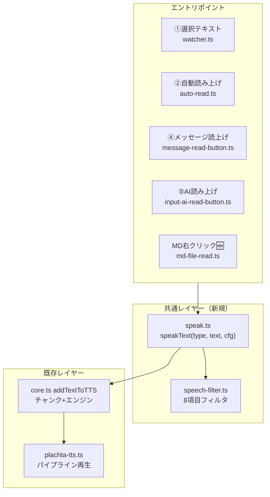
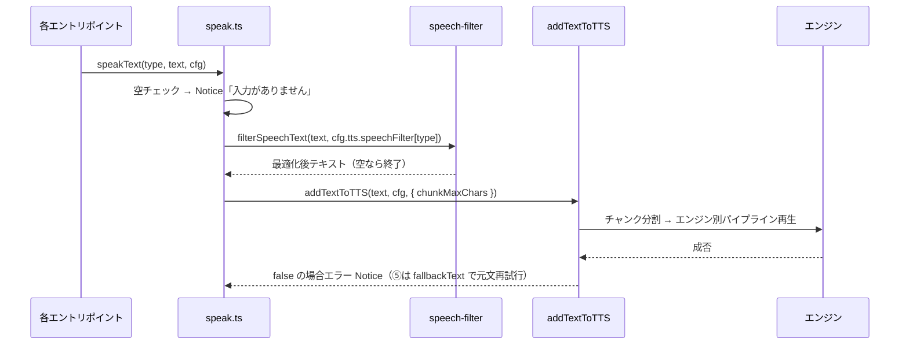

# TTS 読み上げ仕様改良設計書（v0.17.0）

> 📂 パス：`80_POC_Projects/POC_017_ClaudianBridge/02_設計文書/2026-08-16-tts-read-spec-enhancement-design.md`
> 📍 ソース：`D:/AI-Agent/ClaudianBridge/src/features/tts/`
> 📅 作成日：2026-08-16
> 🐕 担当：MiuMiu 🐾
> 🔗 関連：[[2026-08-16-input-ai-read-button-design|AI読み上げボタン設計]], [[2026-08-15-claudian-chat-toolbar-buttons-design|チャットツールバーボタン統合設計]]

---

## 一、背景と目的

Claudian Bridge の TTS 読み上げ機能（①選択テキスト / ②自動読み上げ / ④メッセージ読上げ / ⑤AI読み上げ / ⑥CLI）について、以下の 4 項目の仕様改良を行う。

1. **①〜⑤ 仕様統一**: 空テキスト時・失敗時の挙動を全タイプで統一
2. **MD ファイル右クリック「Add to TTS」**: 新たな読み上げ入口を追加
3. **長文分割（チャンク化）統一**: 3 エンジン共通のチャンク上限 + パイプライン再生
4. **speech_filter 個別設定**: 読み上げタイプごとにフィルタ項目を個別設定可能に

## 二、ユーザー決定事項（2026-08-16 確認済み）

| # | 項目 | 決定 |
|:-:|------|------|
| 1 | (4) 設定表のチェックの意味 | **チェック = 含めて読む**（チェックありの要素は読み上げに含める・除去しない） |
| 2 | (2) MD 読み上げ対象 | **本文のみ**（frontmatter・コードブロック除去）。コールアウト・テーブルは (4) の個別設定に従う |
| 3 | (4) フィルタ項目構成 | **8 項目 × 4 タイプ**（①選択・②自動・④メッセージ・⑤AI）。デフォルト: テーブルのみ ON、他 OFF |
| 4 | (1) ②自動読み上げの「📢報告なし」 | **対象なしは静かにスキップ**（実際の読み上げ失敗時のみエラー Notice） |
| 5 | (3) パイプライン再生 | **エンジン別パイプライン**（edge=先行 spawn / webspeech=ブラウザキュー / plachta=既存） |
| 6 | 実装アプローチ | **共通 `speakText(type, text, cfg)` 関数**を新設し全エントリポイントから呼ぶ |

## 三、アーキテクチャ

### 3.1 モジュール構成



| ファイル | 種別 | 責務 |
|:---------|:----:|:-----|
| `src/features/tts/speak.ts` | 🆕 新規 | 共通 `speakText(type, text, cfg)` — 空チェック・失敗 Notice・タイプ別 filter 解決・チャンク/エンジン委譲を一元化 |
| `src/features/tts/speech-filter.ts` | 🆕 新規 | `filterSpeechText` を core.ts から分離し 8 項目対応に拡張 |
| `src/features/tts/md-file-read.ts` | 🆕 新規 | MD ファイル右クリック「Add to TTS」登録 + 本文抽出（frontmatter・コード除去） |
| `src/features/tts/core.ts` | ✏️ 改修 | `addTextToTTS` を speakText の委譲先として整理（チャンク上限を設定値化・全エンジンパイプライン） |
| `src/core/settings.ts` | ✏️ 改修 | `tts.chunkMaxChars` + `tts.speechFilter`（4タイプ×8項目）追加 + マイグレーション |
| `src/settings/SettingTabTts.ts` | ✏️ 改修 | チャンク上限スライダー + speech_filter 表（チェックボックス） |
| `src/main.ts` | ✏️ 改修 | `setupMdFileRead(app, store)` 登録 |
| `src/core/i18n.ts` | ✏️ 改修 | 新規ラベル（ja/zh/en） |
| `styles.css` | ✏️ 改修 | speech_filter 表・MD メニュー項目のスタイル |

> 既存の `toolbar-buttons.ts`（ミュート・📖全文）は変更しない（③は設定切替のみで speech_filter 対象外）。

### 3.2 共通 speakText 関数（`speak.ts`）

```typescript
export type TtsReadType = 'selection' | 'autoRead' | 'message' | 'inputAi' | 'md';

export interface SpeakTextOpts {
  /** 空テキスト時に Notice「入力がありません」を出すか（②は対象なしスキップのため false） */
  noticeOnEmpty?: boolean;
  /** 失敗時のフォールバック（⑤AI のみ元文で再試行するため） */
  fallbackText?: string;
}

export async function speakText(
  type: TtsReadType,
  text: string,
  cfg: ClaudianBridgeSettings,
  opts?: SpeakTextOpts,
): Promise<boolean>;
```

- 空チェック → `opts.noticeOnEmpty` が true かつ空なら Notice「入力がありません」で終了
- `filterSpeechText(text, resolveFilter(cfg, type))` で最適化 → 空なら終了
  - `resolveFilter`: `type === 'md'` は `cfg.tts.speechFilter.selection` を共有（MD は 4 タイプに含まれない新規入口のため）
- `addTextToTTS(text, cfg, { chunkMaxChars: cfg.tts.chunkMaxChars })` へ委譲
- 失敗時（false 返却）: `opts.fallbackText` があれば元文で再試行（⑤）、なければエラー Notice

### 3.3 speech_filter（`speech-filter.ts`）

8 項目のフィルタ設定に拡張:

| 項目 | キー | 処理種別 | デフォルト（読む） |
|------|------|:-------:|:---:|
| 絵文字 | `emoji` | テキスト正規化 | false |
| 顔文字 | `kaomoji` | テキスト正規化 | false |
| ASCII 表情 | `ascii_emoticon` | テキスト正規化 | false |
| emoji 短コード | `emoji_shortcode` | テキスト正規化 | false |
| コールアウト | `callout` | DOM/Markdown 抽出除外 | false |
| テーブル | `table` | DOM/Markdown 抽出除外 | **true** |
| コードブロック | `code` | DOM/Markdown 抽出除外 | false |
| 思考ブロック | `thinking` | DOM 抽出除外 | false |

- **チェック = 含めて読む**（true の項目は除去しない）
- テキスト正規化 4 項目（絵文字系）は `filterSpeechText` で処理（既存実装を流用・反転）
- DOM 抽出除外 4 項目は `extract-report.ts` の除外セレクタをタイプ別に切替（`buildSpeechExclude` を拡張）
- MD ファイルは Markdown ソースから判定（frontmatter / コードフェンス / コールアウト構文 / テーブル構文）

## 四、設定スキーマ変更

```typescript
// src/core/settings.ts に追加
tts: {
  // ...既存フィールド...
  /** v0.17.0: 全エンジン共通の1チャンク上限（50〜140・既定 140） */
  chunkMaxChars: number;
  /** v0.17.0: 読み上げタイプ別フィルタ（チェック=含めて読む） */
  speechFilter: {
    selection: SpeechFilterOptions;  // ①選択テキスト
    autoRead:   SpeechFilterOptions; // ②自動読み上げ
    message:    SpeechFilterOptions; // ④メッセージ読上げ
    inputAi:    SpeechFilterOptions; // ⑤AI読み上げ
  };
}

interface SpeechFilterOptions {
  emoji: boolean;          // 絵文字を読む
  kaomoji: boolean;        // 顔文字を読む
  ascii_emoticon: boolean; // ASCII表情を読む
  emoji_shortcode: boolean;// emoji短コードを読む
  callout: boolean;        // コールアウトを読む
  table: boolean;          // テーブルを読む（既定 true）
  code: boolean;           // コードブロックを読む
  thinking: boolean;       // 思考ブロックを読む
}
```

### マイグレーション（後方互換）

既存ユーザー設定（`data.json`）からの引き継ぎ:

| 既存フィールド | 新フィールドへのマッピング |
|----------------|---------------------------|
| `cli.speech_filter.emoji` | 全タイプの `emoji` に**反転**（旧 ON=除去 → 新 true=読む には `!old`） |
| `cli.speech_filter.kaomoji` | 同上（`!old`） |
| `cli.speech_filter.ascii_emoticon` | 同上（`!old`） |
| `cli.speech_filter.emoji_shortcode` | 同上（`!old`） |
| `tts.excludeCallouts` | 全タイプの `callout` に**反転**（旧 true=除外 → 新 true=読む には `!old`） |
| なし | `table` = true（現行 full の挙動と整合） |
| なし | `code` / `thinking` = false |

- `cli.speech_filter` 自体は ⑥CLI 用（voice-config 同期）として**維持**
- 新設フィールド欠落時はデフォルト補完（`normalizeClaudianBridgeSettings`）

## 五、データフロー



## 六、エンジン別パイプライン再生

| エンジン | チャンク上限 | パイプライン方式 | 実装 |
|----------|:---:|------|------|
| edge | `chunkMaxChars`（140） | **先行 spawn**: チャンク N 再生中に N+1 の python 起動を開始 | `core.ts` の edge パスを先行キュー化 |
| webspeech | `chunkMaxChars`（140） | **ブラウザキュー**に依存（speechSynthesis が逐次再生で自然に連続） | 順次再生のまま（キューがギャップ解消） |
| plachta | `chunkMaxChars`（140） | 既存 `plachtaSpeakChunksPipelined`（先行合成） | 変更なし（上限値のみ設定化） |

> ⚠️ **性能確認**: edge は元々無制限（1 リクエスト）→ 140 分割で spawn 回数が増える。実装後 UAT で 1000 字級テキストの完了時間を測定し、過度な劣化があれば上限値を調整（設定 50-140 で変更可のため回避策あり）

## 七、MD ファイル右クリック「Add to TTS」

- 対象: `TFile` かつ拡張子 `.md`
- 配置: file-menu の**「Add to Claudian」の下**に「Add to TTS」を追加
- 本文抽出 (`md-file-read.ts`):
  1. frontmatter（先頭 `---` 〜 `---` の YAML）を除去
  2. コードブロック（``` フェンス）を除去
  3. コールアウト・テーブルはフィルタ設定（MD は `speechFilter.selection` を共有）に従い除去/維持
- `speakText('md', text, cfg, { noticeOnEmpty: true })` を呼ぶ
- 空なら Notice「入力がありません」

## 八、エラー処理の統一

| ケース | 挙動 |
|--------|------|
| 空テキスト（①④⑤・MD） | Notice「入力がありません」 |
| ②対象なし（📢なし） | 静かにスキップ（通常会話で警告しない） |
| 読み上げ失敗（⑤除く） | エラー Notice（エンジン固有の失敗文言） |
| ⑤AI読み上げ失敗 | 元文フォールバック（既存維持） |
| ミュート中（`tts.enabled=false`） | 各タイプで Notice「🔇 ミュート中」 |

## 九、テスト計画（vitest）

| # | テスト | 対象 |
|:-:|--------|------|
| 1 | `speakText`: 空テキスト Notice / タイプ別 filter 適用 / 失敗 Notice / ⑤fallback | `tests/features/tts/speak.test.ts`（新規） |
| 2 | `speech-filter`: 8 項目の ON/OFF 動作 | `tests/features/tts/speech-filter.test.ts`（新規） |
| 3 | MD 本文抽出（frontmatter・コードブロック除去・コールアウト/テーブル判定） | `tests/features/tts/md-file-read.test.ts`（新規） |
| 4 | 設定スキーマ normalize/validate + マイグレーション（反転マッピング） | `tests/core/settings.test.ts` 追加 |
| 5 | 既存 513 テストの回帰なし | 全テスト |

> jsdom 環境は既存 `message-read-button.test.ts` / `input-ai-read-button.test.ts` で実績あり。

## 十、リスクと対策

| リスク | 影響 | 対策 |
|--------|------|------|
| edge 140 分割で spawn 回数が増え遅くなる | 読み上げ体感が悪化 | 設定 50-140 で調整可。UAT で実測し必要なら初期値を調整 |
| 既存 `cli.speech_filter` の意味反転による混乱 | ユーザー設定が意図と逆になる | マイグレーションで `!old` マッピング + 設定 UI のラベルを「読む」表記に明確化 |
| MD ファイル本文抽出の Markdown 構文判定ミス | 装飾記号が読み上げに混入 | テーブル・コールアウト・フェンスの正規表現をテストで網羅 |
| ③📖トグル・⑥CLI と speech_filter の関係 | 適用範囲の混乱 | ③は設定切替のみ・⑥は CLI 側（voice-config）のため対象外と明記 |
| realclaudian の DOM 構造変更 | 除外セレクタの不一致 | 既存「アップグレード後 grep 再確認」運用で検知 |

## 十一、スコープ外（YAGNI）

- ⑥CLI（voice-config）へのタイプ別フィルタ同期（CLI 側は `cli.speech_filter` のまま）
- 音声速度・ピッチ等のエンジン別パラメータ調整 UI
- MD ファイル以外（PDF・Office）の右クリック読み上げ（既存 Office 変換が担当）
- タイプ別チャンク上限（`chunkMaxChars` は全タイプ共通）

---

*📅 2026-08-16 · MiuMiu 🐾 · ユーザー承認済み（6 項目の決定事項）*
