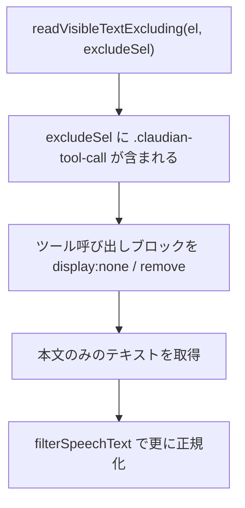
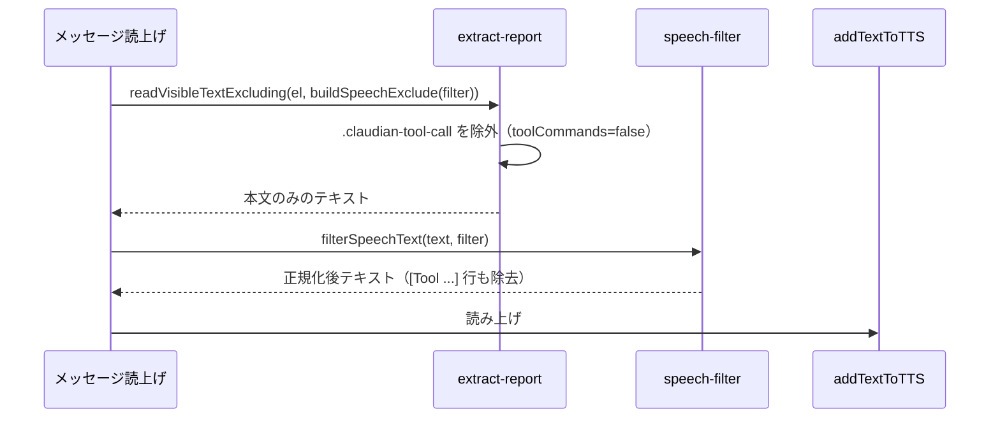

# TTS ツール呼び出し除外設計書

> 📂 パス：`80_POC_Projects/POC_017_ClaudianBridge/02_設計文書/2026-08-16-tts-tool-call-exclude-design.md`
> 📍 ソース：`D:/AI-Agent/ClaudianBridge/src/features/tts/`
> 📅 作成日：2026-08-16
> 🐕 担当：MiuMiu 🐾
> 🔗 関連：[[2026-08-16-tts-read-spec-enhancement-design|TTS 読み上げ仕様改良設計]], [[2026-08-16-tts-interrupt-playback-design|TTS 重複読み防止設計]]

---

## 一、背景と目的

ClaudianBridge の読み上げ（全文読み上げ・メッセージ読上げ・自動読上げ）で、会話内の **ツール呼び出し（コマンド系）** の記述がそのまま発話されてしまう。

例:
- `[Tool Read input: file_path=...]`
- `[Tool Bash input: command=...]`
- `[Tool TaskUpdate input: ...]`

これらは realclaudian 上では `.claudian-tool-call` ブロックとして表示されるが、現在の読み上げフィルタ（`buildSpeechExclude`）はこのセレクタを除外対象に含めていないため、**回答の本文と一緒に読み上げられてしまう**。

### ユーザー決定事項（2026-08-16 確認済み）

| # | 項目 | 決定 |
|:-:|------|------|
| 1 | 対象 | realclaudian の **`.claudian-tool-call`**（Read/Write/Task/Bash 等のツール呼び出しブロック） |
| 2 | 挙動 | 読み上げから**除外する**（発話しない） |
| 3 | 設定方式 | 既存の読み上げフィルタ表に **`toolCommands`** 項目を追加（チェック=読む・デフォルト **false=除外**） |

---

## 二、アーキテクチャ

### 2.1 変更ファイル

| ファイル | 種別 | 責務 |
|:---------|:----:|:-----|
| `src/core/settings.ts` | ✏️ 改修 | `SpeechFilterOptions` に `toolCommands: boolean` 追加・DEFAULT に `false`・validate のキー一覧に追加 |
| `src/features/tts/extract-report.ts` | ✏️ 改修 | `TOOL_CALL_SELECTOR = '.claudian-tool-call'` を追加し、`buildSpeechExclude` で `!filter.toolCommands` のとき除外 |
| `src/features/tts/speech-filter.ts` | ✏️ 改修 | （任意）テキスト正規化として `[Tool ...]` 行の除去を追加 |
| `src/settings/SettingTabTts.ts` | ✏️ 改修 | フィルタ表に「ツール呼び出し」行を追加 |
| `src/core/i18n.ts` | ✏️ 改修 | 新規ラベル（ja/zh/en） |

> `speech-filter.ts` の正規化追加は「DOM 抽出が効かないテキスト経路」への保険。まずは DOM 除外（extract-report）を主実装とし、正規化は任意とする。

### 2.2 除外の仕組み



---

## 三、実装詳細

### 3.1 `settings.ts` — `toolCommands` の追加

```typescript
export interface SpeechFilterOptions {
  emoji: boolean;
  kaomoji: boolean;
  ascii_emoticon: boolean;
  emoji_shortcode: boolean;
  callout: boolean;
  table: boolean;
  code: boolean;
  thinking: boolean;
  /** v0.18.1: ツール呼び出し（.claudian-tool-call）を読むか（false=除外） */
  toolCommands: boolean;
}

export const DEFAULT_SPEECH_FILTER_OPTIONS: SpeechFilterOptions = {
  emoji: false,
  kaomoji: false,
  ascii_emoticon: false,
  emoji_shortcode: false,
  callout: false,
  table: true,
  code: false,
  thinking: false,
  toolCommands: false, // デフォルト: ツール呼び出しは読まない
};
```

- `normalizeSpeechFilterOptions` は `Object.keys(base)` を走査するため、**DEFAULT に追加するだけで自動補完される**（追加実装不要）
- `validateClaudianBridgeSettings` のキー一覧（`['emoji', ... 'thinking']`）に `'toolCommands'` を追加

### 3.2 `extract-report.ts` — 除外セレクタの追加

```typescript
/** ツール呼び出し（Read/Write/Bash/Task 等）のコンテナ */
export const TOOL_CALL_SELECTOR = '.claudian-tool-call';

export function buildSpeechExclude(filter: SpeechFilterOptions): string {
  const parts: string[] = [];
  if (!filter.thinking) parts.push(THINKING_BLOCK_SELECTOR);
  if (!filter.code) parts.push(CODE_WRAPPER_SELECTOR);
  if (!filter.callout) parts.push(CALLOUT_SELECTOR);
  if (!filter.toolCommands) parts.push(TOOL_CALL_SELECTOR); // v0.18.1 追加
  return parts.join(', ');
}
```

### 3.2.5 ハードコードされたフォールバックオブジェクトの更新

`SpeechFilterOptions` は strict 型のため、フィールド追加時に**全メンバーを直書きしている箇所**も `toolCommands: false` を追加する必要がある:

| ファイル | 該当箇所 |
|----------|----------|
| `src/features/tts/extract-report.ts` | `extractReportText` 内のデフォルト filter オブジェクト（134-138 行付近） |
| `src/features/tts/message-read-button.ts` | `buildSpeechExclude` 呼び出し用の filter オブジェクト |
| 各テスト | `makeCfg` / `makeStore` 等のフル `SpeechFilterOptions` 構築箇所 |

> `normalizeSpeechFilterOptions` は `Object.keys(DEFAULT_SPEECH_FILTER_OPTIONS)` を走査するため、**設定ファイル経由の補完は自動**。上記はコード内の直書きオブジェクトのみの対応。

### 3.3 `speech-filter.ts` — テキスト正規化の保険（任意）

DOM 除外が効かないテキスト経路（CLI 等）向けに、`[Tool ...]` 行を除去:

```typescript
/** v0.18.1: ツール呼び出し行 [Tool Name input: ...] を除去（DOM 除外の保険） */
const TOOL_CALL_LINE_RE = /^\[Tool [^\n]+\]\s*$/gm;

export function filterSpeechText(text: string, filter: Partial<SpeechFilterOptions>): string {
  let t = text;
  // ...既存の正規化...
  if (filter.toolCommands === false) t = t.replace(TOOL_CALL_LINE_RE, ' ');
  return t.trim();
}
```

### 3.4 `SettingTabTts.ts` — フィルタ表に「ツール呼び出し」行

`FILTER_ROWS` 配列に追加:

```typescript
{ key: 'toolCommands', label: s.ttsSpeechFilterToolCommands },
```

### 3.5 `i18n.ts` — ラベル追加

| locale | ラベル |
|--------|--------|
| ja | `ツール呼び出し` |
| en | `Tool calls` |
| zh | `工具调用` |

---

## 四、データフロー



---

## 五、エラー処理

| ケース | 挙動 |
|--------|------|
| realclaudian アップグレードで `.claudian-tool-call` クラスが変わった | ツール呼び出しが読まれる（既存挙動に戻る）。grep 再確認運用で検知 |
| `toolCommands` が未設定の既存ユーザー | normalize がデフォルト `false` を自動補完（追加実装不要） |
| 全 true フィルタ（除外なし） | `buildSpeechExclude` が空文字 → 既存の `speechExclude === ''` 分岐で安全に処理 |

---

## 六、テスト計画（vitest）

| # | テスト | 対象 |
|:-:|--------|------|
| 1 | `buildSpeechExclude`: toolCommands=false で `.claudian-tool-call` を含む / true で含まない | `extract-report.test.ts` 追加 |
| 2 | `readVisibleTextExcluding` で `.claudian-tool-call` が除去される | 同上（jsdom） |
| 3 | `normalize`: 既存設定に `toolCommands: false` が補完される | `settings.test.ts` 追加 |
| 4 | `validate`: `toolCommands` の型検証 | 同上 |
| 5 | `filterSpeechText`: `[Tool Bash input: ...]` 行が除去される | `speech-filter.test.ts` 追加 |
| 6 | 既存テストの回帰なし | 全テスト |

---

## 七、リスクと対策

| リスク | 影響 | 対策 |
|--------|------|------|
| realclaudian の DOM 構造変更 | 除外が効かなくなる | 既存「アップグレード後 grep 再確認」運用で検知 |
| `toolCommands` を読む（true）設定ユーザー | 従来通り読まれる | 設定で選択可能（デフォルト false） |
| テキスト正規化の regex が本文を誤除去 | 意図しない欠落 | 行頭 `[Tool ` から行末 `]` まで限定（`^...$`） |

---

## 八、スコープ外（YAGNI）

- ツール種別ごとの個別除外（Bash だけ除外 等）
- ステータスパネル（`.claudian-status-panel-bash-entry`）の除外（読み上げ対象外のため）
- サブエージェントリスト（`.claudian-subagent-list`）の除外（必要なら別タスク）

---

## 九、実装手順（概略）

1. `settings.ts` に `toolCommands` 追加 → settings テスト更新
2. `extract-report.ts` に `TOOL_CALL_SELECTOR` 追加 → extract-report テスト追加
3. `speech-filter.ts` に `[Tool ...]` 行除去を追加 → speech-filter テスト追加
4. `SettingTabTts.ts` + `i18n.ts` に UI・ラベル追加
5. `npm run typecheck` + `npx vitest run` → 全パス
6. `npm run build` → vault へデプロイ
7. コミット

---

*📅 2026-08-16 · MiuMiu 🐾 · ユーザー確認済み（.claudian-tool-call 除外）*
