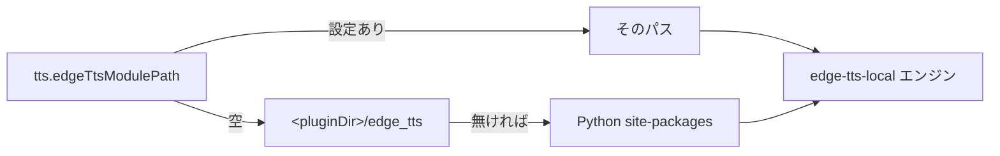
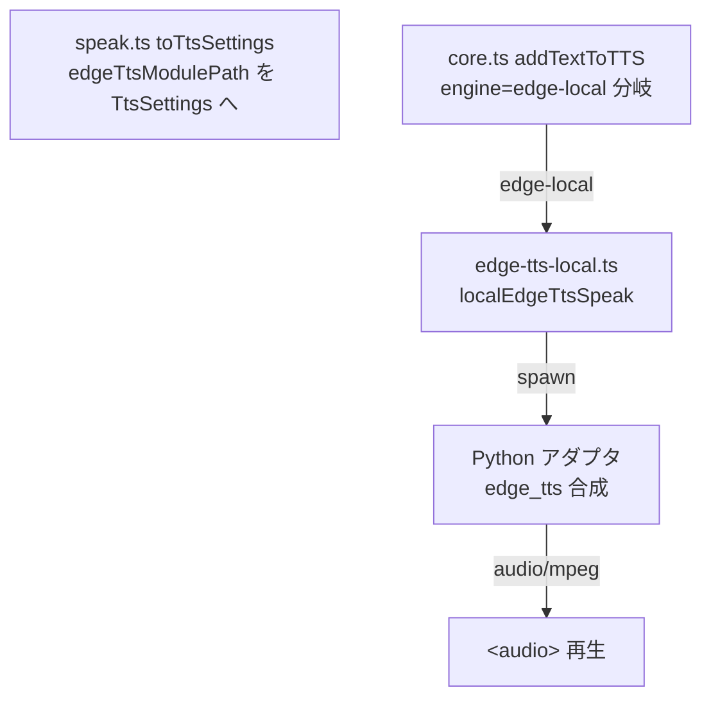

# ローカル EdgeTTS エンジン追加 設計書

> 📂 パス：`80_POC_Projects/POC_017_ClaudianBridge/02_設計文書/2026-08-17-edge-tts-local-engine-design.md`
> 📍 ソース：`D:/AI-Agent/ClaudianBridge/src/features/tts/`, `src/core/settings.ts`, `src/settings/SettingTabTts.ts`
> 📅 作成日：2026-08-17
> 🐕 担当：MiuMiu 🐾
> 🔗 関連：[[2026-08-16-edge-chunkmax-settings-design|EdgeTTS チャンク上限設定設計]]（v0.18.0）、[[2026-08-14-claude-tts-settings-merger-design|ClaudeTTS 設定融合設計]]

---

## 一、背景と目的

Claudian Bridge はプラグインディレクトリ配下に `edge_tts` Python パッケージ（rany2/edge-tts のソース）を同梱しているが、**現状どのコードからも参照されていない**。edge エンジンは ClaudeTTS スキル（`~/.claude/skills/claude-tts/scripts/commands.py speak`）を spawn し、**Pip 導入された `edge-tts` CLI に依存**している。

本件では、同梱 `edge_tts` モジュールを直接使う**新エンジン「ローカル EdgeTTS」を追加**し、モジュール場所を設定画面で変更可能にする。

- 既存 `edge`（ClaudeTTS スキル経由）は**無変更**で維持
- ClaudeTTS スキル / Pip に依存しない自己完結動作を実現
- モジュール場所の既定値 = プラグイン内 `edge_tts`、任意のパスへ変更可能

## 二、ユーザー決定事項（2026-08-17 確認済み）

| # | 項目 | 決定 |
|:-:|------|------|
| 1 | 追加方式 | **新エンジン選択肢「ローカル EdgeTTS」を 4 つ目として追加**（既存 edge は現状維持） |
| 2 | 呼び出し方式 | **方式 A**: Python アダプタを TS 定数として main.js に埋め込み、実行時に `os.tmpdir()` へ書き出して spawn（デプロイ変更なし） |
| 3 | モジュール場所設定 | `tts.edgeTtsModulePath`（既定 `''` = 自動）。解決順: 設定値 → プラグイン内 `edge_tts` → Python site-packages |
| 4 | 音声設定 | 既存 `voices.edge`（短縮名）を共有。短縮名→フル名変換マップをプラグイン側で持つ |

## 三、アーキテクチャ

### 3.1 設定スキーマ変更

```typescript
// src/core/settings.ts
export type TtsEngine = 'edge' | 'webspeech' | 'plachta' | 'edge-local';
```

`tts` インターフェースに追加:

```typescript
/** 次期バージョン: ローカル EdgeTTS の edge_tts モジュール場所（空=自動: プラグイン内 edge_tts → site-packages） */
edgeTtsModulePath: string;
```

- 既定: `edgeTtsModulePath: ''`
- normalize: 文字列でなければ `''`（trim はしない・設定 UI 側で trim）
- validate: `typeof cfg.tts.edgeTtsModulePath !== 'string'` ならエラー

### 3.2 モジュールパス解決



- プラグインDIR は `main.ts` onload で `initEdgeTtsLocal(pluginDataDir)` を呼び、モジュール内に保持
- 解決関数 `resolveEdgeTtsModulePath(configured: string): string`:
  1. `configured` が非空 → そのまま返す
  2. `pluginDir` があれば `<pluginDir>/edge_tts` を返す
  3. 空文字（= Python site-packages を使う）

### 3.3 エンジン実装（新規 `src/features/tts/edge-tts-local.ts`）

| 関数 | 責務 |
|------|------|
| `initEdgeTtsLocal(pluginDir)` | プラグインDIR をモジュール保持（main.ts から呼ぶ） |
| `resolveEdgeTtsModulePath(configured)` | 上記解決ロジック |
| `resolveEdgeVoiceFull(configured, lang)` | 短縮名→フル名（未知値はそのまま） |
| `localEdgeTtsSpeak(text, settings, noticeFn)` | アダプタ展開 → spawn → 音声 Blob → 再生 |

**音声名マッピング**（`EDGE_VOICE_FULL`）:

| 短縮名 | フル名 |
|--------|--------|
| xiaoxiao / yunxi / yunyang / yunjian / xiaoyi / yunxia | `zh-CN-*Neural` |
| nanami / keita | `ja-JP-*Neural` |
| aria / guy / jenny | `en-US-*Neural` |

未知の値はそのまま渡す（フル名を直接設定した場合も対応）。

**Python アダプタ**（`EDGE_TTS_ADAPTER_PY` 定数）:

- 起動: `python <tmp>/claudian_bridge_edge_tts.py --voice <full> --edge-tts-path <path>`（テキストは **stdin**）
- `_add_edge_tts_path()`: 指定パスが `edge_tts` フォルダなら親を sys.path へ / 親ならそのまま / それ以外はそのまま
- `edge_tts.Communicate(text, voice).stream()` で合成し、audio/mpeg を **stdout** へ（stderr はエラーのみ）
- stdin/stdout/stderr を UTF-8 に reconfigure（`commands.py` と同対策）

**再生**: stdout を Buffer 収集 → `new Blob(...)` → object URL → `playObjectUrl` で `<audio>` 再生。`playObjectUrl` を汎用化し、engine パラメータ（`'edge-local'`）で `registerPlayback` に登録（ミュート停止対応）。

### 3.4 データフロー（core.ts / speak.ts）



- `TtsSettings`（core.ts 最小 IF）に `edgeTtsModulePath?: string` を追加
- `speak.ts toTtsSettings`: `edgeTtsModulePath: cfg.tts.edgeTtsModulePath` を渡す
- `core.ts` 分岐追加:

```typescript
const result = await speakChunks(chunks, async (chunk) => {
  if (settings.engine === 'edge') return claudettsHttpSpeak(chunk, settings, noticeFn);
  if (settings.engine === 'edge-local') return localEdgeTtsSpeak(chunk, settings, noticeFn);
  return webSpeechSpeak(chunk, settings, noticeFn);
});
```

- **チャンク上限**: `edge-local` は `edge` と同値（既定 500）。`chunkMaxChars.edge` を共有
  - `engineDefault`: `(settings.engine === 'edge' || settings.engine === 'edge-local') ? DEFAULT_EDGE_CHUNK_MAX_CHARS : DEFAULT_CHUNK_MAX_CHARS`
  - limit 解決: `settings.chunkMaxChars?.[settings.engine === 'edge-local' ? 'edge' : settings.engine]`
- **engineLabels** に `'edge-local': 'ローカルEdgeTTS'` を追加
- 進行中メッセージ: edge-local も「⏳ 音声生成中…」を表示

### 3.5 設定 UI（SettingTabTts.ts）

| 項目 | 内容 |
|------|------|
| エンジン dropdown | `edge-local`（「ローカル EdgeTTS（同梱モジュール）」）を追加 |
| モジュール場所テキスト欄 | `edge-local` 選択時のみ表示。placeholder「自動（プラグイン内 edge_tts）」 |
| 音声セクション | 表示条件に `edge-local` を追加。**保存先は `voices.edge` にマップ**（`voiceEngine` 経由） |
| i18n | `ttsEngineEdgeLocal` / `ttsEdgeTtsModulePath` / `ttsEdgeTtsModulePathDesc` / `ttsEdgeTtsModulePathPlaceholder`（ja/zh/en）・`ttsEngineDesc` を 4 択に更新 |

### 3.6 同期・統合ポイント

| ファイル | 変更 |
|---------|------|
| `voice-config-sync.ts` | `ENGINE_PRIORITY['edge-local'] = ['edge-tts', 'pyttsx3', 'system']`（edge と同列） |
| `main.ts` | onload で `initEdgeTtsLocal(pluginDataDir)` 呼び出し |
| `toolbar-buttons.ts` | ミュートボタンの edge マーカー条件に `edge-local` を追加 |
| `playback-registry.ts` | 変更なし（`TtsEngine` 型が広がるのみ） |

## 四、エラー処理

| ケース | 挙動 |
|--------|------|
| Python が見つからない | spawn error → `⚠️ ローカル EdgeTTS 失敗: ...` Notice・false |
| `edge_tts` を import できない（パス誤り・site-packages なし） | アダプタが stderr にエラー・exit 1 → Notice・false |
| 合成タイムアウト（30 秒） | プロセス kill → Notice・false |
| 空テキスト | アダプタ前のチャンク処理で除外済み（addTextToTTS の trim） |
| モジュール場所が不正（設定パスに `edge_tts/__init__.py` が無い） | spawn 前に解決時に判定し `⚠️ 指定パスに edge_tts モジュールがありません: <path>` Notice・false |
| 合成失敗（exit 1・stderr にエラー） | stderr 先頭 200 文字を Notice 表示・false |

## 五、テスト計画（vitest）

| # | テスト | 対象 |
|:-:|--------|------|
| 1 | normalize: `edgeTtsModulePath` 文字列保持・欠落/非文字列は `''` | `settings.test.ts` |
| 2 | validate: `edgeTtsModulePath` 非文字列エラー・engine `'edge-local'` 許可 | 同上 |
| 3 | `resolveEdgeTtsModulePath`: 設定値優先 / プラグインDIR 既定 / 空=site-packages | `edge-tts-local.test.ts`（新規） |
| 4 | `resolveEdgeVoiceFull`: 短縮名→フル名 / 未知値はそのまま | 同上 |
| 5 | アダプタ展開: `os.tmpdir()` に書かれる・内容が Python 定数 | 同上 |
| 6 | core dispatch: `engine === 'edge-local'` で localEdgeTtsSpeak を呼ぶ | `core.test.ts` |
| 7 | i18n: 新キー 3 言語定義 | `i18n.test.ts` |
| 8 | voice-config-sync: `ENGINE_PRIORITY['edge-local']` が edge と同列 | `voice-config-sync.test.ts` |

## 六、リスクと対策

| リスク | 影響 | 対策 |
|--------|------|------|
| `TtsEngine` 拡張による switch / Record の型エラー | ビルド失敗 | `Record<TtsEngine, ...>`（engineLabels / ENGINE_PRIORITY）を全箇所更新 |
| Windows の `python` が Store 版（環境不一致） | 起動失敗 | 既存 `claudettsHttpSpeak` と同じ `python` を使用。必要なら将来 `pythonPath` 設定で拡張 |
| `edge_tts` の import で `typing.py` 衝突 | アダプタ失敗 | `_add_edge_tts_path` の親ディレクトリ判定（claudebot 実績あるロジック） |
| 同梱 edge_tts フォルダの削除・欠落 | 既定パスで失敗 | site-packages へフォールバック。Notice で案内 |

## 七、スコープ外（YAGNI）

- Python インタプリタ設定（`pythonPath`）は追加しない（既存 edge と同様 `python` 固定）
- デプロイスクリプト変更なし（`edge_tts` フォルダは既存同梱を利用）
- voice-config（`cli.max_chars`）との同期変更なし
- 既存 `edge`（ClaudeTTS スキル）の挙動変更なし

---

*📅 2026-08-17 · MiuMiu 🐾 · ユーザー承認済み（新エンジン追加・方式 A）*
