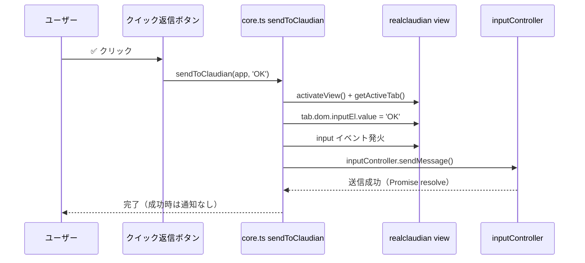

# Claudian チャット クイック返信ボタン 設計書（ワンクリック直接送信）

> 📂 路径：`80_POC_Projects/POC_017_ClaudianBridge/02_設計文書/2026-08-18-claudian-chat-quick-reply-buttons-design.md`
> 📍 対象：`Claudian Bridge v0.23.0` クイック返信機能
> 📅 作成日：2026-08-18
> 🐕 担当：MiuMiu 🐾
> 🔗 関連：`src/features/selection/core.ts`, `src/features/tts/toolbar-buttons.ts`, [[2026-08-15-claudian-chat-toolbar-buttons-design.md|ツールバーボタン統合設計]]

---

## 一、背景と目標

### 1.1 問題

Claudian チャットで処置確認（肯定 / NG / 方案選択）を行う際、毎回キーボード入力が必要で操作が煩雑。Claude Code が複数の処置案（方案1〜5）を提示した際の**ワンクリック応答手段**がない。

### 1.2 目標

- ✅ 処置確認用クイック返信ボタンをツールバーに表示
- ✅ ボタン押下で定型文を**直接送信**（入力欄への挿入のみに留めない）
- ✅ アイコンは絵文字のみ（視認性重視・既存 TTS ボタンと統一）
- ✅ ボタン重複注入を防止（`data-cb-quickreply` 属性）

### 1.3 ユーザー決定事項（2026-08-18 確認済み）

| # | 項目 | 決定 |
|:-:|------|------|
| 1 | 肯定系アイコン | ✅（単一ボタンに統合） |
| 2 | 否定系アイコン | ❌ |
| 3 | 方案ボタン表示 | 1️⃣ 2️⃣ 3️⃣ 4️⃣ 5️⃣（絵文字キーキャップ） |
| 4 | ボタン表示形式 | 絵文字のみ |
| 5 | 送信文言 | ✅→`OK` / ❌→`NG` / 方案→`方案1`〜`方案5` |
| 6 | 送信方式 | **直接送信**（`inputController.sendMessage()`） |
| 7 | 配置 | 既存ツールバー `.claudian-input-toolbar` |
| 8 | 既存ドラフトの扱い | 上書きして送信 |
| 9 | 方案ボタンの動的表示 | 選択肢の最大数に応じて表示数を調整 |
| 10 | デフォルト表示 | 選択肢なし（OK/NG のみ問い合わせ）は ✅ ❌ のみ |
| 11 | 方案ボタンの最大表示数 | 5（1️⃣〜5️⃣ で打ち止め） |
| 12 | 選択肢数の検出 | `方案N` の最大値 + 範囲表記（`方案1〜5` / `方案1-5` / `方案1〜方案5`） |
| 13 | 配置 | 他ボタンの**上の行・右寄せ**（`.cb-quickreply-row` をツールバー先頭に全幅挿入） |
| 9 | 推奨方案のハイライト | **自動検出**（assistant メッセージ解析で 1〜5 を特定・背景色強調） |

---

## 二、現状分析

### 2.1 realclaudian（Claudian v2.1.3）の API 調査結果

| API | 挙動 | 送信可否 |
|-----|------|:------:|
| `activateView()` | ビューを開く | - |
| `getView()` | ビュー取得 | - |
| `view.appendToActiveInput(text)` | 入力欄へ**挿入のみ**（input イベント発火・focus） | ❌ |
| `view.getActiveTab()` | アクティブタブ取得 | - |
| `tab.controllers.inputController.sendMessage()` | **入力内容を直接送信** | ✅ |

### 2.2 送信メカニズム（実証済み）

realclaudian 内部では Enter キー → `inputController.sendMessage()` → `executeSendMessage()` が `inputEl.value` を読んで送信する。`executeSendMessage` は**空入力時は何も送らないガード**あり。

```typescript
// クイック返信ボタンの送信フロー
const tab = view.getActiveTab();
tab.dom.inputEl.value = text;                                            // 入力欄を上書き
tab.dom.inputEl.dispatchEvent(new Event('input', { bubbles: true }));    // 状態同期
tab.controllers.inputController.sendMessage();                           // 直接送信
```

> 根拠（解析済み）: realclaudian 内で `this.deps.getInputEl().value = X` 直後に `this.sendMessage()` を呼ぶ自社実装パターンを確認。`sendMessage()` 引数なし時は `executeSendMessage` が `getInputEl().value` を `trim()` して送信する。

---

## 三、アーキテクチャ

### 3.1 モジュール構成

| ファイル | 種別 | 責務 |
|:---------|:----:|:-----|
| `src/features/quick-reply/core.ts` | 🆕 新規 | `sendToClaudian(app, text)` — 送信ロジック（機能検出 + フォールバック） |
| `src/features/quick-reply/recommend-detector.ts` | 🆕 新規 | `extractRecommendedOption(text)` 解析 + `setupRecommendDetection` メッセージ監視 |
| `src/features/quick-reply/toolbar-buttons.ts` | 🆕 新規 | ボタン注入・重複防止・クリック処理・推奨ハイライト |
| `src/core/i18n.ts` | ✏️ 改修 | ボタン title / aria 用キー追加 |
| `styles.css` | ✏️ 改修 | `.is-recommended` ハイライト等 |
| `src/main.ts` | ✏️ 改修 | `setupQuickReplyButtons` 登録 |

> **設定スキーマ変更なし**（`general.enabled` で全体制御・送信文言は定数化。設定タブ編集はスコープ外）

### 3.2 送信ヘルパー（core.ts）

```typescript
import { App, Notice } from 'obsidian';

// realclaudian プラグイン（plugin オブジェクト）
interface RealClaudianPlugin {
  activateView?: () => Promise<unknown>;
  getView?: () => RealClaudianView | null;
}

// realclaudian ビュー（getView() の戻り値）
interface RealClaudianView {
  appendToActiveInput?: (text: string) => boolean;
  getActiveTab?: () => RealClaudianTab | null;
}

// realclaudian アクティブタブ（getActiveTab() の戻り値）
// dom.inputEl / dom.messagesEl は推奨検出（§3.4）でも共用する
interface RealClaudianTab {
  dom: { inputEl: HTMLTextAreaElement; messagesEl: HTMLElement };
  controllers?: { inputController?: { sendMessage?: () => Promise<unknown> } };
}

export async function sendToClaudian(
  app: App,
  text: string,
  noticeFn: (m: string) => void = (m) => new Notice(m)
): Promise<boolean> {
  const p = (app as unknown as { plugins?: { plugins?: Record<string, RealClaudianPlugin | undefined> } })
    ?.plugins?.plugins?.['realclaudian'];
  if (!p) { noticeFn('⚠️ Claudian プラグインが見つかりません'); return false; }
  try {
    if (typeof p.activateView === 'function') await p.activateView();
    const view = p.getView?.() ?? null;
    const tab = view?.getActiveTab?.() ?? null;
    const inputController = tab?.controllers?.inputController;

    // 直接送信 API が使える場合（優先）
    if (tab?.dom?.inputEl && typeof inputController?.sendMessage === 'function') {
      tab.dom.inputEl.value = text;
      tab.dom.inputEl.dispatchEvent(new Event('input', { bubbles: true }));
      await inputController.sendMessage();
      return true;
    }

    // フォールバック: 挿入のみ（従来挙動）
    const ok = !!(view && typeof view.appendToActiveInput === 'function' && view.appendToActiveInput(text));
    if (!ok) noticeFn('⚠️ Claudian チャットが準備できていません');
    return ok;
  } catch (e) {
    noticeFn(`⚠️ Claudian への送信に失敗しました: ${(e as Error).message}`);
    return false;
  }
}
```

### 3.3 ツールバーボタン（toolbar-buttons.ts）

`setupQuickReplyButtons(app: App): () => void` を新設。

- 注入対象: `.claudian-input-toolbar`（既存 `toolbar-buttons.ts` の `MutationObserver` + 重複防止パターンを踏襲）
- コンテナ: `<span class="cb-quickreply-group">`（`data-cb-quickreply="true"`）
- ボタン: `claudian-action-btn` クラス + `data-cb-qr-*` 属性

| ボタン | 表示 | 送信内容 | title（i18n） |
|:------:|:----:|:-------:|:------------:|
| 肯定 | ✅ | `OK` | `quickReplySendOk` |
| 否定 | ❌ | `NG` | `quickReplySendNg` |
| 方案1〜5 | 1️⃣ 2️⃣ 3️⃣ 4️⃣ 5️⃣ | `方案1`〜`方案5` | `quickReplySendOption`（数字を埋込） |

**ボタン順**: `✅ → ❌ → | → 1️⃣ → 2️⃣ → 3️⃣ → 4️⃣ → 5️⃣`

**推奨ハイライト**: 自動検出された推奨方案のボタンに `.is-recommended` クラスを付与し、**背景色を他と異なる強調色**にする（詳細は §3.4 参照）。

```typescript
const BUTTONS: Array<{ mark: string; icon: string; text: string; titleKey: string }> = [
  { mark: 'data-cb-qr-ok', icon: '✅', text: 'OK', titleKey: 'quickReplySendOk' },
  { mark: 'data-cb-qr-ng', icon: '❌', text: 'NG', titleKey: 'quickReplySendNg' },
  ...Array.from({ length: 5 }, (_, i) => ({
    mark: `data-cb-qr-${i + 1}`,
    icon: ['1️⃣', '2️⃣', '3️⃣', '4️⃣', '5️⃣'][i],
    text: `方案${i + 1}`,
    titleKey: 'quickReplySendOption',
  })),
];
```

クリック処理（連打防止付き）:

```typescript
btn.addEventListener('click', () => {
  if (busy) return;
  busy = true;
  btn.disabled = true;
  // sendToClaudian は内部 try/catch でエラー処理済み（reject しない）
  void sendToClaudian(app, text, (m) => new Notice(m)).finally(() => {
    busy = false;
    btn.disabled = false;
  });
});
```

**title 設定**: 方案ボタンの title は i18n 文字列の `{n}` を `String(i + 1)` で置換する。

```typescript
btn.title = s.quickReplySendOption.replace('{n}', String(i + 1));
```

### 3.4 推奨方案の自動検出（recommend-detector.ts）

直近の Claudian 応答（assistant メッセージ）を解析し、推奨方案（1〜5）を特定して該当ボタンをハイライトする。

**メッセージ DOM アクセス**（realclaudian 解析済み）:

```typescript
const tab = view.getActiveTab();
const messagesEl = tab.dom.messagesEl;                                    // .claudian-messages
const assistantMsgs = messagesEl.querySelectorAll('[data-role="assistant"]');
const last = assistantMsgs[assistantMsgs.length - 1];
const text = last?.querySelector('.claudian-message-content')?.textContent ?? '';
```

**解析ルール（純関数 `extractRecommendedOption(text): number | null`）**:

| 言語 | パターン（抜粋） |
|------|------------------|
| ja | `推奨[は:：]?\s*(?:方案\s*)?([1-5])` / `おすすめ[は:：]?\s*(?:方案\s*)?([1-5])` |
| zh | `推荐\s*(?:方案)?\s*([1-5])` / `建议(?:选择)?\s*(?:方案)?\s*([1-5])` |
| en | `recommend(?:ed|ation)?\s*:?\s*(?:option\s*)?([1-5])`（case-insensitive） |

- 見つかった番号（1〜5）を返す。見つからない場合・範囲外は `null`
- 複数候補は最初の一致を採用
- 該当ボタンに `.is-recommended` を付与、それ以外の方案ボタンからは除去

**再スキャンのタイミング**:

- `messagesEl` を `MutationObserver`（childList + subtree）で監視し、**デバウンス（300ms）** 後に再解析
- ストリーミング中はメッセージ本文が追記されるため、デバウンスで過剰解析を防止
- タブ切替時は `view.getActiveTab()` の変化を検出して対象を更新

**CSS（styles.css）**:

```css
.cb-quickreply-group button[data-cb-qr].is-recommended {
  background: var(--color-accent);
  color: var(--text-on-accent);
}
.cb-quickreply-group button[data-cb-qr].is-recommended:hover {
  background: var(--color-accent-hover, var(--color-accent));
}
```

### 3.5 i18n（i18n.ts）

`LocaleStrings` に以下を追加（ja / zh / en 全ロケール）:

| キー | ja | zh | en |
|------|----|----|----|
| `quickReplySendOk` | ✅ OK を送信 | 发送 OK | Send OK |
| `quickReplySendNg` | ❌ NG を送信 | 发送 NG | Send NG |
| `quickReplySendOption` | 方案{n} を送信 | 发送方案{n} | Send option {n} |

> `{n}` は実行時に `1`〜`5` へ置換する（`String.replace('{n}', String(i + 1))`）

### 3.6 main.ts 配線

```typescript
import { setupQuickReplyButtons } from './features/quick-reply/toolbar-buttons';

// onload 内（ツールバーボタン登録の直後）
this.register(setupQuickReplyButtons(this.app));
```

---

## 四、設定スキーマ変更

- **変更なし**。`quickReply.enabled` 等の新規フィールドは導入しない（`general.enabled` で全体制御）
- 送信文言（`OK` / `NG` / `方案N`）は `quick-reply/core.ts` の定数として保持
- `validateClaudianBridgeSettings` / マイグレーションへの変更なし

---

## 五、データフロー



---

## 六、エラーハンドリング

| ケース | 挙動 |
|--------|------|
| realclaudian プラグインが無い | `⚠️ Claudian プラグインが見つかりません` |
| `getActiveTab()` / `sendMessage` が無い | `appendToActiveInput`（挿入のみ）にフォールバック + `⚠️ Claudian チャットが準備できていません` |
| 送信中に例外 | `⚠️ Claudian への送信に失敗しました: {message}` + ボタン状態復元 |
| 連打 | `busy` フラグ + `btn.disabled` で 2 重送信防止 |
| 空送信 | `executeSendMessage` 側にガードあり（追加対策不要） |
| ツールバー未出現 | `MutationObserver` が監視継続、出現後に自動注入 |

---

## 七、テスト計画

| # | テスト | 対象 |
|:-:|--------|------|
| 1 | `sendToClaudian` が realclaudian の `inputController.sendMessage()` を呼ぶ | `quick-reply/core.test.ts`（新規） |
| 2 | `sendMessage` 不在時は `appendToActiveInput` にフォールバック | 同上 |
| 3 | プラグイン不在時に `false` + Notice | 同上 |
| 4 | 入力欄に正しく文言がセットされ、input イベントが発火する | 同上 |
| 5 | ボタン注入: ✅ ❌ 1️⃣〜5️⃣ が順に配置される | `toolbar-buttons.test.ts`（新規・jsdom） |
| 6 | クリックで正しい文言が送信される（OK / NG / 方案1〜5） | 同上 |
| 7 | `extractRecommendedOption` が ja/zh/en の推奨パターンを検出 | `recommend-detector.test.ts`（新規） |
| 8 | 推奨なし / 範囲外 / 複数候補の処理 | 同上 |
| 9 | メッセージ監視で推奨ボタンに `.is-recommended` が付与・解除される | `toolbar-buttons.test.ts`（jsdom） |
| 10 | 二重注入しない / cleanup で削除 | 同上 |
| 11 | 連打防止（busy 中は無視） | 同上 |

> jsdom 環境は既存 `toolbar-buttons.test.ts` で実績あり（`// @vitest-environment jsdom`）。モックは `vi.hoisted` + 手作りモック方針を踏襲。

---

## 八、リスクと対策

| リスク | 影響 | 対策 |
|--------|------|------|
| `controllers.inputController` は realclaudian の**非公開 API** | バージョン更新で壊れる | 機能検出（`typeof sendMessage === 'function'`）+ `appendToActiveInput` フォールバック + 既存の「升级后 grep 复核」運用 |
| `sendMessage()` が非同期で reject | 未処理 Promise | `.catch` で Notice + ボタン復元 |
| realclaudian のツールバー構造変更 | ボタン非注入 | 既存 `MutationObserver` が追従。構造変更は grep 复核で検知 |
| 誤送信（うっかりクリック） | 不要なメッセージ送信 | ワンクリック送信が本質のため許容。確認ダイアログはスコープ外 |
| ストリーミング中の解析 | 途中メッセージで誤検出 | 300ms デバウンス + 最終 assistant メッセージのみ解析 |
| 推奨表現のバリエーション | 検出漏れ / 誤検出 | ja/zh/en の複数パターン対応。検出不能時はハイライトなし（無害） |
| `tab.dom.messagesEl` が非公開 | メッセージ取得失敗 | 取得不能時はハイライトなし（送信機能は維持）。機能検出で安全に fallback |

---

## 九、スコープ外（将来候補）

- 送信文言の設定タブ編集（C 案）
- ボタン押下時の確認ダイアログ
- 方案 6 以上（1️⃣0️⃣ 等）やボタンカスタマイズ（表示順・非表示）
- realclaudian 公式 API 化への追従（`sendMessage` が公開 API になったら置換）

---

## 十、方案ボタンの動的表示（追加要件 2026-08-18）

> ユーザー追加要望: 方案選択肢の最大数に応じて、表示する方案ボタン数を動的に調整する。デフォルト（選択肢なし・OK/NG のみ問い合わせ）は方案ボタンを表示しない。

### 10.1 表示パターン

| 状況 | 表示されるボタン |
|------|----------------|
| 選択肢なし（OK/NG のみ問い合わせ） | **✅ ❌**（デフォルト） |
| 方案1〜3 を提示 | ✅ ❌ **1️⃣2️⃣3️⃣** |
| 方案1〜5 を提示 | ✅ ❌ **1️⃣2️⃣3️⃣4️⃣5️⃣** |
| 方案1〜7 など 5 超 | ✅ ❌ **1️⃣2️⃣3️⃣4️⃣5️⃣**（5 で打ち止め） |

### 10.2 選択肢数の検出（recommend-detector.ts）

新規 `extractMaxOptionCount(text): number`（0 = 選択肢なし）。

| 表記 | 検出ルール | 例 |
|------|-----------|-----|
| 個別表記 | `方案N` の最大値 | `方案1、方案2、方案3` → **3** |
| 範囲表記 | `方案A〜B` / `方案A-方案B` / `方案A〜方案B` の終端値 | `方案1〜5` → **5** |

- 個別・範囲を併走し、収集した数値の最大値を返す（上限 99・表示側で 5 にクランプ）
- 推奨方案（`extractRecommendedOption`）とは別の独立した検出

### 10.3 状態通知の拡張（recommend-detector.ts）

`setupRecommendDetection` のコールバックを**状態オブジェクト**に変更:

```typescript
interface RecommendState {
  recommended: number | null;   // 推奨方案（1〜5・従来）
  maxOptionCount: number;       // 選択肢の最大数（0 = 選択肢なし）
}

setupRecommendDetection(app, (state: RecommendState) => { ... });
```

- メッセージ読取ロジック（`readLastAssistantText`）を共通化し、推奨方案と選択肢数を同時に返す

### 10.4 ツールバー表示（toolbar-buttons.ts）

- 全 7 ボタン（✅ ❌ 1️⃣〜5️⃣）を**生成時に作成**し、`cb-hidden` クラスで表示/非表示を切替
- `Math.min(state.maxOptionCount, 5)` 個だけ方案ボタンを表示
- 選択肢なし（`maxOptionCount === 0`）は方案ボタン全非表示 → ✅ ❌ のみ
- 推奨方案には引き続き `.is-recommended` を付与

### 10.5 CSS

```css
.cb-quickreply-btn.cb-hidden { display: none; }
```

### 10.6 テスト計画（追加）

| # | テスト | 対象 |
|:-:|--------|------|
| 1 | `extractMaxOptionCount`: 個別 / 範囲 / 混在 / 該当なし / 5 超 | `recommend-detector.test.ts` |
| 2 | `readRecommendationState`: recommended + maxOptionCount を返す | 同上 |
| 3 | ツールバー: 0 件 → ✅❌のみ / 3 件 → 3 ボタン表示 | `toolbar-buttons.test.ts` |
| 4 | 状態変化（選択肢あり→なし）でボタンが再描画される | 同上 |

### 10.7 配置（nav-actions 内 NewTab の左隣）— v0.29.0 更新

`.claudian-input-nav-actions` 内に配置された **NewTab ボタンの左隣** にクイック返信ボタンを挿入する。
`.claudian-input-toolbar`（既存ツールバー）とは別コンテナで、残量インジケータと同じ「NewTab 左隣」パターン。

```html
<div class="claudian-input-nav-actions">      <!-- flex row -->
  <div class="cb-quota-indicator">...</div>   <!-- 既存残量インジケータ -->
  <div class="cb-quickreply-row">             <!-- インライン化（v0.29.0） -->
    <span class="cb-quickreply-group">✅ ❌ 1️⃣2️⃣3️⃣</span>
  </div>
  <button class="claudian-new-tab-btn"></button>
</div>
<div class="claudian-input-toolbar">          <!-- flex-wrap: wrap -->
  [🔊 ミュート] [📖 全文] [📝 保存] ...       <!-- 既存ボタン（クイック返信はここから移動） -->
</div>
```

CSS（v0.29.0）:

```css
.cb-quickreply-row {
  display: inline-flex;      /* インライン化（NewTab と横並び） */
  align-items: center;
  gap: 2px;
}
```

実装（v0.29.0）:
- ファイル名: `src/features/quick-reply/toolbar-buttons.ts` → `nav-buttons.ts`
- `TOOLBAR_SELECTOR` → `NAV_SELECTOR` (`.claudian-input-nav-actions`)
- 新定数: `NEWTAB_SELECTOR` (`.claudian-new-tab-btn, [aria-label="New tab"]`)
- `inject`: `nav.insertBefore(row, newTab)` — NewTab 不在時は非注入
- `cleanup` は `[data-cb-quickreply-row]` も削除対象に含める（変更なし）
- 関連: `02_設計文書/2026-08-30-quick-reply-nav-actions-design.md`
```

---

*📅 2026-08-18 · MiuMiu 🐾 · ユーザー承認済み（9 + 4 + 1 項目の決定事項）*
