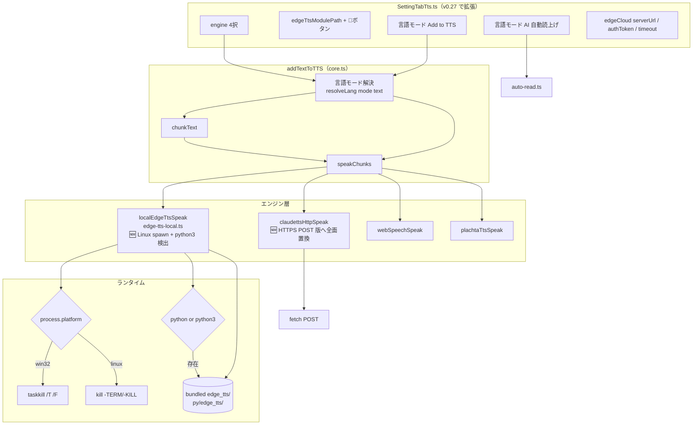

# TTS エンジン変更計画書 — ローカル EdgeTTS 同梱＋クラウドサーバ対応＋言語モード切替（v0.27.0）

> 📂 パス：`80_POC_Projects/POC_017_ClaudianBridge/02_設計文書/2026-08-19-tts-engine-change-local-bundle-cloud-server-language-mode.md`
> 📍 ソース：`D:/AI-Agent/ClaudianBridge/src/`
> 📅 作成日：2026-08-19
> 🐕 担当：MiuMiu 🐾
> 🔗 関連：[[2026-08-16-tts-read-spec-enhancement-design|TTS 読み上げ仕様改良設計（v0.17）]], [[2026-08-16-edge-chunkmax-settings-design|EdgeTTS チャンク上限単独設定設計（v0.18）]], [[2026-08-16-tts-auto-read-final-answer-design|自動読み上げ最終回答のみ改善設計（v0.19）]]

---

## 一、背景と目的

Claudian Bridge の TTS（Text-to-Speech）機能は v0.20.0 で「ローカル EdgeTTS（`edge-local` エンジン）」を追加し、`pip install edge-tts` 済みを前提に Python 子プロセスで音声合成する仕組みを実装した。しかし現状は次の 5 つの制約を抱えている：

| # | 制約 | 影響 |
|:-:|------|------|
| 1 | **edge_tts パッケージ未同梱** | ユーザーが `pip install edge-tts` を実行するまで動作しない（pip 依存） |
| 2 | **モジュール場所を開く導線なし** | 「`python -c "import edge_tts; print(edge_tts.__file__)"` で確認してください」という抽象的な案内しかできない |
| 3 | **言語判定が完全 auto のみ** | 多言語混在テキストで意図しない言語が選ばれる／AI 読上げで毎度判定が走り不安定 |
| 4 | **Windows 専用実装** | `taskkill /T /F` で強制停止、`spawn('python', ...)` で `python` 固定呼び出し。Ubuntu / Linux で動作不可 |
| 5 | **クラウド EdgeTTS サーバ指定不可** | `claudettsHttpSpeak` が `~/.claude/skills/claude-tts/scripts/commands.py` ハードコード。独自プロキシや別会社製プロキシへ切り替え不可 |

**本件の目的**: 上記 5 点を解消し、**全ユーザーが追加インストールなしで高品質 TTS を利用でき、サーバ・言語・OS を自由に選べる** 状態を実現する。

### 1.1 ゴール（Success Criteria）

- ✅ 新規ユーザーが **pip インストール 0 手順**でローカル EdgeTTS の音声を聴ける
- ✅ 既存ユーザー（`engine: 'edge'` 設定）は自動マイグレーションで `edge-local` へ移行される
- ✅ 設定タブのモジュール場所横に 📂 ボタンが表示され、クリックで Explorer / Files が開く
- ✅ `Add to TTS` と `AI 自動読上げ` のそれぞれで `auto / ja / zh / en` の言語モードを独立設定できる
- ✅ Ubuntu 22.04+ で同等動作（`python3` 自動検出、`kill -TERM/-KILL` 経由）
- ✅ `engine: 'edge'`（クラウド）選択時、任意の HTTPS POST プロキシ URL と認証トークンを指定できる

---

## 二、ユーザー決定事項（2026-08-19 確認済み）

| # | 項目 | 決定 |
|:-:|------|------|
| 1 | edge_tts 同梱範囲 | **完全同梱**（`py/edge_tts/` ディレクトリへ全ファイル配置、ビルドにも組み込み） |
| 2 | 同梱パッケージ管理 | **git subtree** で `https://github.com/rany2/edge-tts.git` を `py/edge_tts/` に取り込み、MIT ライセンス注記を `THIRD_PARTY_NOTICES.md` へ追加 |
| 3 | デフォルトエンジン | **新規 = `edge-local`** ／既存ユーザー = 自動 `edge` → `edge-local` マイグレーション（backup ログ同時記録） |
| 4 | 言語モード設定 | **`Add to TTS` と `AI 自動読上げ` で独立**（両系統に `auto / ja / zh / en` の 4 択） |
| 5 | クラウドサーバ設定 | **汎用プロキシ方式**：`tts.edgeCloud = { serverUrl, authToken, timeout }` の 3 フィールド |
| 6 | 既存ユーザー挙動 | `engine: 'edge'` → `edge-local` 自動変換 + `edgeCloud` フィールドは未設定のまま（必要なら手動入力） |
| 7 | Ubuntu / Linux 対応 | **`python3` 自動検出**（`spawn('python3', ...)` 優先・`python` フォールバック）／プロセス停止は `kill -TERM` → `kill -KILL` の二段フォールバック |
| 8 | 命名規則 | **変更計画書**は `-change-plan.md` サフィックス（既存 `-design.md` と区別） |

---

## 三、アーキテクチャ

### 3.1 全体像



### 3.2 影響ファイル一覧

| # | ファイル | 種別 | 変更内容 |
|:-:|------|:----:|---------|
| 1 | `py/edge_tts/**` | 🆕 同梱 | `git subtree add` で `rany2/edge-tts` v6.1.x を取り込み |
| 2 | `THIRD_PARTY_NOTICES.md` | 🆕 新規 | edge_tts MIT ライセンス注記 |
| 3 | `src/core/settings.ts` | ✏️ 改修 | `defaultEngine` を `edge-local` 化・`languageMode` 2系統・`edgeCloud` 型追加 |
| 4 | `src/core/migrator.ts` | ✏️ 改修 | `edge` → `edge-local` 自動変換、backup ログ |
| 5 | `src/features/tts/edge-tts-local.ts` | ✏️ 改修 | `python3` 検出／`kill` フォールバック／`languageMode` 適用／`openPath` UI 補助 |
| 6 | `src/features/tts/core.ts` | ✏️ 改修 | `claudettsHttpSpeak` → `edgeCloudHttpSpeak`（HTTPS POST 全面置換）／`languageMode` 引数追加 |
| 7 | `src/features/tts/lang.ts` | ✏️ 改修 | `pickLang(text, mode)` に mode 引数追加、`'auto'` 時は既存挙動 |
| 8 | `src/features/tts/auto-read.ts` | ✏️ 改修 | `tts.autoReadLanguageMode` を読み、`pickLang(text, mode)` に渡す |
| 9 | `src/settings/SettingTabTts.ts` | ✏️ 改修 | 📂ボタン／言語モード 2 系統／`edgeCloud` 3 フィールド追加 |
| 10 | `src/core/i18n.ts` | ✏️ 改修 | 新規ラベル（ja/zh/en） |
| 11 | `src/main.ts` | ✏️ 変更なし | 既存 `initEdgeTtsLocal(pluginDir)` が `py/edge_tts` を解決するのみ |
| 12 | `esbuild.config.mjs` | ✏️ 改修 | `py/` を `extraResources` に追加（Obsidian プラグインビルドの規約） |
| 13 | `tests/features/tts/edge-tts-local.test.ts` | ✏️ 改修 | `python3` パス／Linux kill パス／言語モード固定パス |
| 14 | `tests/features/tts/core.test.ts` | ✏️ 改修 | `edgeCloudHttpSpeak` の HTTPS POST モック／言語モード解決テスト |
| 15 | `tests/features/tts/lang.test.ts` | 🆕 新規 | `pickLang(text, mode)` 単体テスト |
| 16 | `tests/features/tts/auto-read.test.ts` | ✏️ 改修 | 言語モード適用テスト追加 |
| 17 | `styles.css` | ✏️ 改修 | 📂ボタン・edgeCloud フィールドのスタイル |
| 18 | `package.json` | ✏️ 改修 | scripts に `bundle:edge-tts`（subtree pull）追加 |
| 19 | `CHANGELOG.md` | ✏️ 改修 | v0.27.0 エントリ追加 |
| 20 | `08_説明書/03_リリースノート/リリースノート.md` | ✏️ 改修 | v0.27.0 エントリ |

---

## 四、データモデル

### 4.1 `ClaudianBridgeSettings.tts` の新フィールド

```typescript
// src/core/settings.ts

/** v0.27.0: 言語モード — auto / 固定言語 */
export type TtsLanguageMode = 'auto' | 'ja' | 'zh' | 'en';

export const TTS_LANGUAGE_MODES: readonly TtsLanguageMode[] = ['auto', 'ja', 'zh', 'en'] as const;

/** v0.27.0: クラウド EdgeTTS プロキシ設定 */
export interface TtsEdgeCloudSettings {
  /** HTTPS POST エンドポイント（空文字 = ローカル EdgeTTS へ自動フォールバック） */
  serverUrl: string;
  /** Authorization ヘッダー用トークン（任意） */
  authToken: string;
  /** タイムアウト（ミリ秒・既定 30000） */
  timeout: number;
}

export const DEFAULT_TTS_EDGE_CLOUD: TtsEdgeCloudSettings = {
  serverUrl: '',
  authToken: '',
  timeout: 30_000,
};

/** v0.27.0: TTS 設定本体に追加 */
export interface TtsSettings {
  engine: TtsEngine;                      // 既存
  voices: { edge: {...}; webspeech: {...}; };  // 既存
  plachta?: PlachtaSettings;              // 既存
  cli?: { speech_filter?: ... };          // 既存
  chunkMaxChars?: ...;                    // 既存
  edgeTtsModulePath?: string;             // 既存
  
  /** v0.27.0: 言語モード — Add to TTS 系 */
  addToTtsLanguageMode?: TtsLanguageMode;
  /** v0.27.0: 言語モード — AI 自動読上げ系 */
  autoReadLanguageMode?: TtsLanguageMode;
  /** v0.27.0: クラウド EdgeTTS プロキシ設定 */
  edgeCloud?: TtsEdgeCloudSettings;
}
```

### 4.2 既定値と正規化

```typescript
// src/core/settings.ts

export const DEFAULT_TTS_SETTINGS = {
  engine: 'edge-local' as TtsEngine,    // v0.20: 'edge' → v0.27: 'edge-local'
  voices: { edge: {...}, webspeech: {...} },
  // ...
  addToTtsLanguageMode: 'auto' as TtsLanguageMode,
  autoReadLanguageMode: 'auto' as TtsLanguageMode,
  edgeCloud: { ...DEFAULT_TTS_EDGE_CLOUD },
};

/** v0.27.0: 正規化（既存 normalizeTtsSettings を拡張） */
export function normalizeTtsSettings(raw: unknown): TtsSettings {
  // ... 既存処理 ...
  const normalized: TtsSettings = {
    ...raw,
    engine: isValidEngine(raw.engine) ? raw.engine : 'edge-local',  // ← v0.27 デフォルト変更
    addToTtsLanguageMode: TTS_LANGUAGE_MODES.includes(raw.addToTtsLanguageMode)
      ? raw.addToTtsLanguageMode : 'auto',
    autoReadLanguageMode: TTS_LANGUAGE_MODES.includes(raw.autoReadLanguageMode)
      ? raw.autoReadLanguageMode : 'auto',
    edgeCloud: { ...DEFAULT_TTS_EDGE_CLOUD, ...(raw.edgeCloud ?? {}) },
  };
  return normalized;
}
```

---

## 五、マイグレーション

### 5.1 既存ユーザー（v0.26.x → v0.27.0）

| 既存 `tts.engine` | 新 `tts.engine` | 補足 |
|--------------------|-----------------|------|
| `'edge'` | `'edge-local'` | **自動変換**（+ backup ログ） |
| `'webspeech'` | `'webspeech'` | 変更なし |
| `'plachta'` | `'plachta'` | 変更なし |
| `'edge-local'` | `'edge-local'` | 変更なし |
| 未定義 / 異常値 | `'edge-local'` | フォールバック |

### 5.2 マイグレーション実装

```typescript
// src/core/migrator.ts

/** v0.27.0: edge → edge-local 自動変換 */
export function migrateEdgeToEdgeLocal(tts: unknown, backup: MigratorBackup): void {
  if (typeof tts !== 'object' || tts === null) return;
  const t = tts as { engine?: string };
  if (t.engine === 'edge') {
    backup.record('tts.engine: edge → edge-local (v0.27.0)');
    t.engine = 'edge-local';
  }
}

export function runTtsMigration(tts: unknown, backup: MigratorBackup): TtsSettings {
  migrateEdgeToEdgeLocal(tts, backup);
  return normalizeTtsSettings(tts);
}
```

### 5.3 新規フィールドのデフォルト補完

`normalizeTtsSettings` 内で以下を保証：

- `addToTtsLanguageMode` 未設定 → `'auto'`
- `autoReadLanguageMode` 未設定 → `'auto'`
- `edgeCloud` 未設定 → `{ serverUrl: '', authToken: '', timeout: 30_000 }`

---

## 六、実装ステップ

### Step 1: edge_tts 同梱（🆕 最優先）

```bash
# 1.1 git subtree で取り込み（py/edge_tts/ 配下に展開）
cd D:/AI-Agent/ClaudianBridge
git subtree add --prefix=py/edge_tts https://github.com/rany2/edge-tts.git 7.2.8 --squash

# 1.2 取り込み確認
ls py/edge_tts/ | head -10
# → __init__.py, communicate.py, exceptions.py, ...

# 1.3 取り込み後のサイズ確認
du -sh py/edge_tts/
# → 推定 200〜400KB（数十 .py ファイル）
```

`THIRD_PARTY_NOTICES.md` を作成：

```markdown
# Third-Party Notices

## edge-tts (v6.1.x)

- **Repository**: https://github.com/rany2/edge-tts
- **License**: MIT License
- **Copyright**: (c) rany2 and contributors
- **Bundled Path**: `py/edge_tts/`

Permission is hereby granted, free of charge, to any person obtaining a copy
of this software and associated documentation files (the "Software"), to deal
in the Software without restriction, including without limitation the rights
to use, copy, modify, merge, publish, distribute, sublicense, and/or sell
copies of the Software, ...
```

### Step 2: 設定モデル拡張

```typescript
// src/core/settings.ts — 4.1 / 4.2 セクションの実装
```

### Step 3: 言語判定の拡張

```typescript
// src/features/tts/lang.ts

/** v0.27.0: 言語モードに応じた言語を解決 */
export function pickLang(text: string, mode: TtsLanguageMode): 'zh' | 'ja' | 'en' {
  if (mode === 'auto') return pickWebSpeechLang(text);
  return mode;  // 'ja' | 'zh' | 'en' はそのまま返す
}
```

### Step 4: `localEdgeTtsSpeak` の Linux 対応

```typescript
// src/features/tts/edge-tts-local.ts

/** v0.27.0: クロスプラットフォーム Python コマンド解決 */
function resolvePythonCmd(): 'python' | 'python3' {
  // Linux: python3 が標準、Windows: python が標準
  if (process.platform === 'win32') return 'python';
  return 'python3';
}

/** v0.27.0: クロス言語平台プロセス停止 */
function killProcessTree(child: ChildProcess): void {
  if (process.platform === 'win32') {
    try { execFileSync('taskkill', ['/PID', String(child.pid), '/T', '/F'], { stdio: 'ignore' }); } catch { /* ignore */ }
  } else {
    // POSIX: SIGTERM → 500ms 待機 → SIGKILL
    try { child.kill('SIGTERM'); } catch { /* ignore */ }
    setTimeout(() => {
      try { child.kill('SIGKILL'); } catch { /* ignore */ }
    }, 500);
  }
  try { child.kill(); } catch { /* ignore */ }
}
```

### Step 5: `claudettsHttpSpeak` → `edgeCloudHttpSpeak` 全面置換

```typescript
// src/features/tts/core.ts

/** v0.27.0: クラウド EdgeTTS（HTTPS POST プロキシ方式） */
export async function edgeCloudHttpSpeak(
  text: string,
  settings: TtsSettings,
  noticeFn: NoticeFn,
): Promise<boolean> {
  const cloud = settings.edgeCloud;
  if (!cloud?.serverUrl) {
    noticeFn('⚠️ クラウドサーバ URL 未設定。設定タブで edgeCloud.serverUrl を入力してください');
    return false;
  }
  const ctrl = new AbortController();
  const timer = setTimeout(() => ctrl.abort(), cloud.timeout);
  try {
    const headers: Record<string, string> = { 'Content-Type': 'application/json' };
    if (cloud.authToken) headers['Authorization'] = `Bearer ${cloud.authToken}`;
    // v0.27.0 初期仕様: { text, voice, lang } を POST する標準プロトコル
    // サーバ実装側は本形式を期待。独自仕様を持つプロキシはラッパ層で対応する。
    const lang = pickLang(text, settings.addToTtsLanguageMode ?? 'auto');
    const res = await fetch(cloud.serverUrl, {
      method: 'POST',
      headers,
      body: JSON.stringify({
        text,
        voice: settings.voices.edge[lang],
        lang,
      }),
      signal: ctrl.signal,
    });
    clearTimeout(timer);
    if (!res.ok) {
      noticeFn(`⚠️ クラウド EdgeTTS 失敗 (HTTP ${res.status})`);
      return false;
    }
    // レスポンスを音声 Blob として再生（audio/mpeg / audio/wav 想定）
    const blob = await res.blob();
    const url = URL.createObjectURL(blob);
    return await playObjectUrl(url, noticeFn, 'edge');
  } catch (e) {
    clearTimeout(timer);
    noticeFn(`⚠️ クラウド EdgeTTS エラー: ${(e as Error).message}`);
    return false;
  }
}
```

### Step 6: 設定タブ UI 拡張

```typescript
// src/settings/SettingTabTts.ts

// 6.1 edge-local 選択時のみ表示する edgeTtsModulePath に 📂 ボタンを追加
if (cfg.tts.engine === 'edge-local') {
  new Setting(containerEl)
    .setName(s.ttsEdgeTtsModulePath)
    .setDesc(s.ttsEdgeTtsModulePathDesc)
    .addText((t) => t.setPlaceholder(s.ttsEdgeTtsModulePathPlaceholder).setValue(...).onChange(...))
    .addButton((b) => b
      .setButtonText('📂')
      .setTooltip(s.ttsOpenFolderTooltip)
      .onClick(async () => {
        const path = resolveEdgeTtsModulePath(cfg.tts.edgeTtsModulePath ?? '');
        const displayPath = path || path.join(app.vault.adapter.basePath ?? '', 'py', 'edge_tts');
        const exists = await app.vault.adapter.exists(displayPath);
        if (!exists) {
          new Notice(`⚠️ モジュールが見つかりません: ${displayPath}`);
          return;
        }
        // Electron の shell.openPath を呼び出し
        require('electron').shell.openPath(displayPath);
      }),
    );
}

// 6.2 言語モード（Add to TTS 系）
new Setting(containerEl)
  .setName(s.ttsAddToTtsLanguageMode)
  .setDesc(s.ttsAddToTtsLanguageModeDesc)
  .addDropdown((d) => {
    for (const m of TTS_LANGUAGE_MODES) d.addOption(m, s[`ttsLang_${m}`] ?? m);
    d.setValue(cfg.tts.addToTtsLanguageMode ?? 'auto').onChange(...);
  });

// 6.3 言語モード（AI 自動読上げ系）
new Setting(containerEl)
  .setName(s.ttsAutoReadLanguageMode)
  .addDropdown((d) => {
    for (const m of TTS_LANGUAGE_MODES) d.addOption(m, s[`ttsLang_${m}`] ?? m);
    d.setValue(cfg.tts.autoReadLanguageMode ?? 'auto').onChange(...);
  });

// 6.4 edgeCloud 3 フィールド（engine: 'edge' 選択時のみ表示）
if (cfg.tts.engine === 'edge') {
  const cloud = cfg.tts.edgeCloud ?? DEFAULT_TTS_EDGE_CLOUD;
  new Setting(containerEl).setName('EdgeCloud serverUrl').addText(...);
  new Setting(containerEl).setName('EdgeCloud authToken').addText(...);  // type="password"
  new Setting(containerEl).setName('EdgeCloud timeout (ms)').addText(...);
}
```

### Step 7: i18n ラベル追加

```typescript
// src/core/i18n.ts — ja / zh / en に以下を追加

ttsEdgeTtsModulePath: 'EdgeTTS モジュール場所',
ttsEdgeTtsModulePathDesc: '同梱の `py/edge_tts/` を自動使用します。空欄推奨。',
ttsEdgeTtsModulePathPlaceholder: '例: D:\\path\\to\\edge_tts（空欄=同梱）',
ttsOpenFolderTooltip: 'モジュール場所をエクスプローラで開く',
ttsAddToTtsLanguageMode: '言語モード（Add to TTS）',
ttsAddToTtsLanguageModeDesc: 'auto=自動判定 / ja=日本語固定 / zh=中文固定 / en=English 固定',
ttsAutoReadLanguageMode: '言語モード（AI 自動読上げ）',
ttsAutoReadLanguageModeDesc: 'auto=自動判定 / 固定言語選択時は毎回その言語で再生',
ttsLang_auto: 'auto（自動判定）',
ttsLang_ja: 'ja（日本語固定）',
ttsLang_zh: 'zh（中文固定）',
ttsLang_en: 'en（English 固定）',
edgeCloudServerUrl: 'EdgeCloud サーバ URL',
edgeCloudAuthToken: 'EdgeCloud 認証トークン',
edgeCloudTimeout: 'EdgeCloud タイムアウト (ms)',
```

### Step 8: ビルド設定（esbuild）

```javascript
// esbuild.config.mjs

const buildOptions = {
  // ... 既存 ...
  // v0.27.0: py/ を extraResources としてコピー
  extraResources: ['py/'],
};
```

Obsidian のビルド規約に従い、`py/` をプラグインディレクトリ直下にコピー。

### Step 9: テスト追加

```typescript
// tests/features/tts/lang.test.ts — 🆕 新規
import { pickLang } from '../../../src/features/tts/lang';

describe('pickLang', () => {
  test('mode=ja は固定で ja', () => {
    expect(pickLang('Hello world', 'ja')).toBe('ja');
  });
  test('mode=zh は固定で zh', () => {
    expect(pickLang('Hello', 'zh')).toBe('zh');
  });
  test('mode=auto は pickWebSpeechLang と同じ', () => {
    expect(pickLang('こんにちは', 'auto')).toBe('ja');
    expect(pickLang('你好', 'auto')).toBe('zh');
    expect(pickLang('Hello', 'auto')).toBe('en');
  });
});

// tests/features/tts/edge-tts-local.test.ts — 拡張
describe('localEdgeTtsSpeak — Linux spawn', () => {
  test('process.platform=linux で python3 が呼ばれる', async () => {
    // platform を linux にスタブし、spawn 引数をアサート
  });
  test('killProcessTree は SIGTERM → SIGKILL の順で呼ぶ', () => {
    // kill の呼び出し履歴をアサート
  });
});

// tests/features/tts/core.test.ts — 拡張
describe('edgeCloudHttpSpeak', () => {
  test('serverUrl 未設定で false 返却 + Notice', async () => {...});
  test('POST が serverUrl に向かい Authorization ヘッダが付く', async () => {...});
  test('timeout で AbortController が発火', async () => {...});
});

// tests/features/tts/auto-read.test.ts — 拡張
describe('auto-read with languageMode', () => {
  test('mode=ja 設定時、中国語混在でも ja で再生', () => {...});
});
```

### Step 10: 動作確認（UAT）

| # | シナリオ | 期待結果 |
|:-:|----------|----------|
| 1 | 新規ユーザー（クリーン Obsidian）でプラグイン有効化 | デフォルト `edge-local` で起動、同梱 `py/edge_tts/` が即使用可能 |
| 2 | 既存ユーザー（`engine: 'edge'`）で v0.27.0 に更新 | 自動 `edge-local` に変換、backup ログに記録 |
| 3 | 設定タブで EdgeTTS モジュール場所に 📂 ボタンクリック | Explorer / Files が開き `py/edge_tts/` が表示される |
| 4 | 言語モード `ja` に設定 → 中国語混在テキストを Add to TTS | 日本語音声で再生 |
| 5 | Ubuntu 22.04 でプラグイン有効化 → `python3` 自動検出 | エラーなく音声再生、`kill -TERM` で停止 |
| 6 | `engine: 'edge'` 選択 → serverUrl に `https://my-proxy.local/speak` 設定 | HTTPS POST で音声取得・再生 |

---

## 七、エラーハンドリング

| 失敗ケース | 挙動 | ユーザーへの通知 |
|-----------|------|----------------|
| `python3` / `python` が見つからない | 即座に false 返却 | `⚠️ Python が見つかりません。python3 をインストールしてください` |
| 同梱 `py/edge_tts/` が壊れている（import 失敗） | spawn の stderr で通知 | `⚠️ ローカル EdgeTTS 失敗: No module named edge_tts` |
| `py/edge_tts/` のパス指定が空で同梱も見つからない | 即座に false 返却 | `⚠️ edge_tts モジュールが見つかりません。設定タブで確認してください` |
| クラウド EdgeTTS の URL が未設定 | 即座に false 返却 | `⚠️ クラウドサーバ URL 未設定。設定タブで edgeCloud.serverUrl を入力してください` |
| HTTPS POST が timeout | AbortController 発火 | `⚠️ クラウド EdgeTTS タイムアウト` |
| Linux で `kill -TERM` が失敗（プロセスゾンビ化） | 500ms 後に `kill -KILL` 実行 | エラー Notice なし（再生失敗は上の経路で通知済） |

---

## 八、テスト計画

| レベル | 種別 | 件数目標 |
|:------:|------|:--------:|
| 単体 | `lang.test.ts`（pickLang 4 モード × 5 テキスト = 20） | 20+ |
| 単体 | `edge-tts-local.test.ts`（Linux spawn / kill フォールバック / 言語モード） | 15+ |
| 単体 | `core.test.ts`（`edgeCloudHttpSpeak` の HTTPS POST / Abort / ヘッダ） | 12+ |
| 単体 | `auto-read.test.ts`（言語モード適用） | 8+ |
| 統合 | `integration.test.ts`（既存エンジン全種 + 新 `edge-cloud`） | 10+ |
| UAT | 手動（Windows + Ubuntu の二系統） | 6 シナリオ |

目標：既存テスト合格 + 新規 65 件以上追加で **全 800+ 件合格**。

---

## 九、ロールバック戦略

| 状況 | 対応 |
|------|------|
| 同梱した edge_tts の import 起因でクラッシュ多数発生 | `git revert` で v0.27.0 を打ち消し、v0.26.x 緊急リリース |
| マイグレーション失敗で既存ユーザーが `edge` に戻せない | `normalizeTtsSettings` のフォールバック既定値を `'edge-local'` → `'edge'` に一時変更（緊急リリース） |
| Linux spawn 周りで環境依存クラッシュ | Windows のみ強制分岐させ、`process.platform !== 'win32'` のとき即座に `'webspeech'` フォールバック |

---

## 十、変更履歴

| 日付 | バージョン | 内容 |
|------|----------|------|
| 2026-08-19 | v0.27.0 | 初版作成・5 つの制約解消計画 |

---

## 📚 参照文献

| # | 種別 | 参照元 |
|:--:|:----:|------|
| 1 | Vault MD | [[2026-08-16-tts-read-spec-enhancement-design]] |
| 2 | Vault MD | [[2026-08-16-edge-chunkmax-settings-design]] |
| 3 | Vault MD | [[2026-08-16-tts-auto-read-final-answer-design]] |
| 4 | Vault MD | [[../../00_Vault管理/MiuMiu行動ルール]] |
| 5 | Web | [edge-tts GitHub Repository](https://github.com/rany2/edge-tts) |
| 6 | Web | [Obsidian Plugin Guidelines — extraResources](https://docs.obsidian.md/Plugins/Getting+started/Build+and+distribute) |
| 7 | LLM | Claude Sonnet 4.5 (claude.ai) |