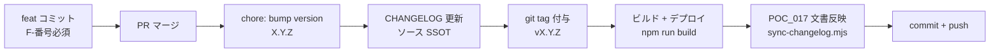
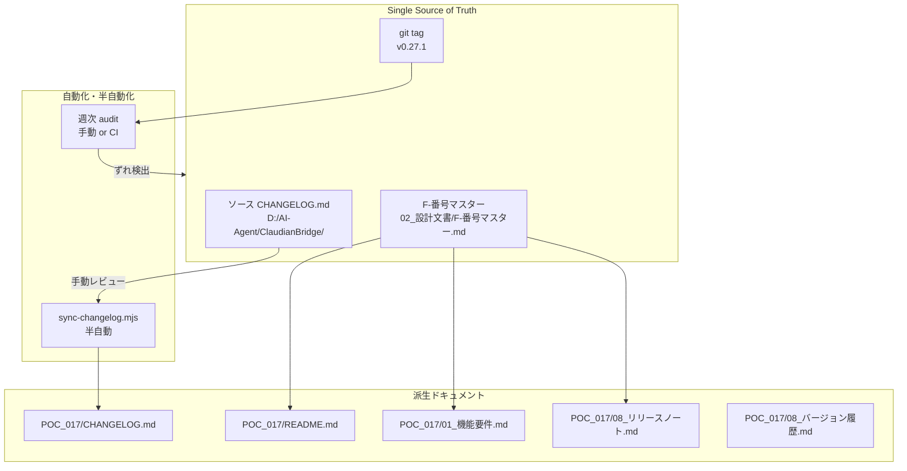

> 📂 **パス**: `80_POC_Projects/POC_017_ClaudianBridge/02_設計文書/2026-08-29-poc017-doc-integration-v0271-design.md`
> 📍 **ソース**: `D:\AI-Agent\ClaudianBridge\`（HEAD `346a339`・v0.27.1）
> 📅 **作成日**: 2026-08-29
> 🐕 **担当**: MiuMiu 🐾
> 🔗 **関連**: [[README]], [[CHANGELOG]], [[../01_要件定義/00_要件総覧]], [[../01_要件定義/01_機能要件]], [[../08_説明書/03_リリースノート/リリースノート]], [[../08_説明書/03_リリースノート/バージョン履歴]]

---

# 📐 POC_017 文書 v0.27.1 統合更新設計書 — 反省を踏まえた再発防止フローの確立

## 一、背景と目的

### 1.1 陳腐化の現状（2026-08-29 時点）

ソース・Plugin と POC_017 Vault ドキュメント間でバージョン・機能仕様に**19 バージョン分のずれ**が発生している。

| # | 項目 | ソース/Plugin | POC_017 文書 | 差分 |
|:-:|------|:-------------:|:------------:|------|
| 1 | 最新バージョン | **v0.27.1** | v0.25.0（README/CHANGELOG） | **2 ver 遅れ** |
| 2 | F-番号記載 | F025（実装） | F022（README）/ F013（機能要件） | **12 件欠落** |
| 3 | 機能要件 As-Built | v0.27.1 | v0.8.0 | **19 ver 遅れ** |
| 4 | 要件総覧 As-Built | v0.27.1 | v0.8.0 | **19 ver 遅れ** |
| 5 | リリースノート | v0.27.1 | v0.27.0 まで | **1 ver 遅れ** |
| 6 | バージョン履歴 | v0.27.1 | v0.22.0 まで | **5 ver 遅れ** |
| 7 | git タグ | v0.27.1 未付与 | — | **タグ戦略不在** |

**根本的な問題**: POC_017 文書は人手による手動同期に依存しており、19 ver 間にわたり一度も全体更新されなかった。

### 1.2 ゴール（Success Criteria）

- ✅ POC_017 全 6 文書が **v0.27.1 を反映**（As-Built ベース）
- ✅ F014〜F025 が全文書に整合的に記載される
- ✅ ソース CHANGELOG.md を **SSOT** 化、POC_017 側は派生
- ✅ git tag `v0.27.1` 付与でバージョン対応のトレーサビリティ確保
- ✅ 今後のリリースで同様の陳腐化を起こさない**再発防止フロー**が運用可能

---

## 二、反省点（なぜ POC_017 文書が v0.25.0 で止まったか）

### 2.1 反省点一覧（7 件）

| # | 反省点 | 影響範囲 | 根拠 |
|:-:|--------|----------|------|
| 1 | **ソース → 文書の手動同期** | 19 バージョン分の漏れ | 機能要件 v0.8.0 → v0.27.1 で未更新・F014 以降すべて欠落 |
| 2 | **フロントマター `modified` の放置** | 鮮度判定不能 | 機能要件 `modified: 2026-08-16` で停止・自動更新なし |
| 3 | **F-番号付与スキーマの不在** | 機能表の陳腐化 | README 機能表 F022 まで・F023-F025 未追加 |
| 4 | **As-Built 更新閾値の不明確さ** | 19 ver 放置の常態化 | v0.8.0 で As-Built 化されて以降、v0.27.1 まで未更新 |
| 5 | **git タグ戦略の不在** | バージョン対応の断絶 | git tag v0.3.0/v0.3.1 のみ・v0.27.x 未付与 |
| 6 | **Plugin `VERSION=1.3.8` の正体不明** | バージョン二重管理 | deploy スクリプト由来と推測・仕様未文書化 |
| 7 | **「人間系レビュー待ち」の滞留** | コミットと文書反映のタイムラグ | `modified` だけ増えて内容は古い状態が継続 |

### 2.2 根本原因の 5-Why 分析

**「なぜ v0.27.1 まで POC_017 文書が未更新だったのか？」**

1. なぜ？ → バージョン更新時に POC_017 文書が人手更新されなかった
2. なぜ？ → 更新トリガーが「コミット時」ではなく「リリース後」に手動設定
3. なぜ？ → リリースフローに「文書更新」が含まれていない
4. なぜ？ → 文書更新の SSOT（Single Source of Truth）が定義されていない
5. なぜ？ → 「ソース CHANGELOG.md」と「POC_017 CHANGELOG.md」の**関係性**が未定義で、両者が独立して進化

→ **根本原因**: 文書の SSOT 化と、リリースフローの統合が**過去 19 ver にわたって未着手**だった。

---

## 三、改善方向

### 3.1 ソース `CHANGELOG.md` を SSOT 化

| 項目 | 内容 |
|------|------|
| **SSOT** | `D:\AI-Agent\ClaudianBridge\CHANGELOG.md` |
| **派生先** | `80_POC_Projects/POC_017_ClaudianBridge/CHANGELOG.md` |
| **同期方法** | `scripts/sync-changelog.mjs`（半自動・人手レビュー挟む） |
| **同期単位** | リリースごと（タグ付けと同タイミング） |

### 3.2 リリースフロー SSOT 化



**原則**: 「タグ付け＝リリース完了」。タグなしは未完了。

### 3.3 F-番号マスター新設

| 項目 | 内容 |
|------|------|
| **SSOT** | `02_設計文書/F-番号マスター.md`（新規作成） |
| **記載内容** | F-番号 / 機能名 / 導入 ver / 概要 / 関連 commit / テスト数 |
| **参照元** | README 機能表・機能要件・リリースノート・CHANGELOG はすべてマスターを参照 |
| **付与タイミング** | feat コミット時に `feat(F024): ...` 形式で必須 |

### 3.4 半自動同期スクリプト

```javascript
// scripts/sync-changelog.mjs（Phase 2 で実装）
// 1. ソース CHANGELOG.md を読み込み
// 2. 派生先 CHANGELOG.md と diff
// 3. 新エントリのみ追記案を提示（人手確認）
// 4. 確認後、コミット + push 提案
```

**効果**: 手動コピーの負荷と漏れを削減しつつ、人手レビューの安全性を確保。

### 3.5 定期 audit チェックリスト

| 頻度 | チェック項目 |
|------|-------------|
| 週次 | ソース version vs POC_017 記載 version の差分 |
| 週次 | 機能要件 `modified` vs ソース最新コミット日 |
| リリース時 | F-番号マスターと README 機能表の整合性 |
| リリース時 | git タグと POC_017 リリースノートの対応 |

### 3.6 Plugin `VERSION=1.3.8` の正体調査 + 文書化

| 項目 | 内容 |
|------|------|
| **調査対象** | `D:\AI-Agent\ClaudianBridge\scripts\deploy.mjs` の VERSION 生成ロジック |
| **文書化先** | `05_デプロイ運用/` 配下 |
| **効果** | バージョン二重管理（manifest version と VERSION ファイル）の解消 |

---

## 四、作業計画 Phase 1: v0.27.1 までの統合更新

### 4.1 `01_要件定義/01_機能要件.md`（As-Built v0.27.1 全面書き換え）

| 項目 | 内容 |
|------|------|
| **フロントマター更新** | `version: 2.2.0` / `modified: 2026-08-29` / `manifest v0.27.1` リンク差し替え |
| **機能追加** | F013〜F025（13 件）を新規記載 |
| **各機能フロー詳細** | F013（AI読み上げ）・F014（MD 保存）・F017（最終回答ゲート）・F018（Chroma-fs）・F019（バックアップ）・F024（TTS エンジン変更）・F025（Thought 除外強化）を新規 |
| **推定工数** | 中（45 分） |

### 4.2 `01_要件定義/00_要件総覧.md`（As-Built v0.27.1 全面書き換え）

| 項目 | 内容 |
|------|------|
| **フロントマター更新** | `version: 2.1.0` / `modified: 2026-08-29` |
| **機能表更新** | F013〜F025 を追加・バージョン列を v0.27.1 までに拡張 |
| **プロジェクト範囲** | 「As-Built v0.8.0」→「As-Built v0.27.1」に書き換え |
| **推定工数** | 中（30 分） |

### 4.3 `README.md`（v0.27.1 に更新）

| 項目 | 内容 |
|------|------|
| **概要欄** | 「現在バージョン **v0.27.1**（2026-08-27 リリース）」に更新 |
| **ソース記載** | `git main · v0.25.0` → `git main · v0.27.1` |
| **機能表** | F023・F024・F025 を追加 |
| **テスト実績** | `740 passed / 1 skipped` → `787 passed / 1 skipped`（v0.27.1 時点）に更新 |
| **フロントマター** | `version: 1.9.0` / `modified: 2026-08-29` |
| **推定工数** | 小（15 分） |

### 4.4 `CHANGELOG.md`（v0.26.0/v0.27.0/v0.27.1 追記）

| 項目 | 内容 |
|------|------|
| **追記内容** | ソース `CHANGELOG.md` から v0.26.0 以降の 3 件を移植 |
| **整形** | POC_017 CHANGELOG 形式（漢数字セクション・絵文字）に整える |
| **推定工数** | 小（20 分） |

### 4.5 `08_説明書/03_リリースノート/リリースノート.md`（v0.27.1 追記）

| 項目 | 内容 |
|------|------|
| **追記内容** | v0.27.1「Thought 読上げ除外の防御的強化 🛡️」 |
| **整形** | 既存 v0.27.0 リリースノートと整合 |
| **推定工数** | 小（10 分） |

### 4.6 `08_説明書/03_リリースノート/バージョン履歴.md`（v0.23.0 以降追記）

| 項目 | 内容 |
|------|------|
| **追記内容** | v0.23.0・v0.24.0・v0.25.0・v0.26.0・v0.27.0・v0.27.1 の 6 件 |
| **フロントマター** | `version: 1.3.0` / `modified: 2026-08-29` |
| **推定工数** | 小（15 分） |

---

## 五、作業計画 Phase 2: 開発フロー改善

### 5.1 git tag v0.27.1 付与（必須）

```bash
cd D:\AI-Agent\ClaudianBridge
git tag -a v0.27.1 -m "release v0.27.1: Thought 読上げ除外の防御的強化"
git push origin v0.27.1
```

### 5.2 Plugin `VERSION=1.3.8` の正体調査（必須）

| 手順 | 内容 |
|------|------|
| 1 | `scripts/deploy.mjs` を読み、VERSION ファイル生成ロジックを特定 |
| 2 | 生成スクリプトが plugin id ベースか version ベースか判定 |
| 3 | 結果を `05_デプロイ運用/VERSION生成仕様.md` に文書化 |
| 4 | 必要なら VERSION 命名規則を manifest version と統一 |

### 5.3 F-番号マスター作成（推奨）

| 項目 | 内容 |
|------|------|
| **パス** | `02_設計文書/F-番号マスター.md` |
| **記載内容** | F001〜F025 の機能名・導入 ver・概要・関連 commit・テスト数の表 |
| **推定工数** | 中（30 分） |

### 5.4 半自動同期スクリプト（推奨）

| 項目 | 内容 |
|------|------|
| **パス** | `scripts/sync-changelog.mjs` |
| **機能** | ソース CHANGELOG.md → POC_017 CHANGELOG.md へ新エントリ追記案を提示 |
| **運用** | リリース前に `npm run sync:changelog` で実行 |
| **推定工数** | 中（45 分） |

### 5.5 release コミットメッセージ規約（推奨）

| 規約 | 内容 |
|------|------|
| **feat コミット** | `feat(F024): TTS エンジン変更 ...`（F-番号必須） |
| **chore リリース** | `chore(release): bump version to X.Y.Z` |
| **fix コミット** | `fix(F019): バックアップダイアログが開かない問題を修正` |
| **docs コミット** | `docs: v0.27.1 CHANGELOG 更新` |

---

## 六、持続可能な開発フロー（Mermaid）



### 再発防止の鍵（4 つの柱）

| # | 柱 | 内容 |
|:-:|----|------|
| 1 | **F-番号 SSOT 化** | feat コミット message に F-番号を必須化・マスターで一元管理 |
| 2 | **CHANGELOG SSOT 化** | ソース CHANGELOG.md を正本・POC_017 は sync スクリプトで派生 |
| 3 | **タグ付け完了条件** | タグなし＝リリース未完了（CI で強制 or 手動チェック） |
| 4 | **modified 自動同期** | `_sync_modified_to_mtime.py`（既存）を継続運用・鮮度判定 |

---

## 七、ユーザー決定事項（2026-08-29 確認済み）

| # | 質問 | 確認結果 |
|:-:|------|----------|
| 1 | 反省点 7 件の過不足 | **承認（そのまま進める）** |
| 2 | Phase 2 で必ず実施する改善 | **① git tag 付与・② VERSION 調査 は必須、他（③〜⑤）は推奨** |
| 3 | 文書更新のコミット粒度 | **文書ごとに分割**（変更理由の追跡性向上） |
| 4 | spec 保管先 | **`80_POC_Projects/POC_017_ClaudianBridge/02_設計文書/2026-08-29-poc017-doc-integration-v0271-design.md`**（Vault SSOT） |

---

## 八、成功基準チェックリスト

### Phase 1（即時・手動）

- [ ] `01_機能要件.md` が As-Built v0.27.1 に全面書き換え済み
- [ ] `00_要件総覧.md` が As-Built v0.27.1 に全面書き換え済み
- [ ] `README.md` が v0.27.1 を反映（機能表に F023-F025 追加）
- [ ] `CHANGELOG.md` に v0.26.0/v0.27.0/v0.27.1 が追記済み
- [ ] `リリースノート.md` に v0.27.1 が追記済み
- [ ] `バージョン履歴.md` に v0.23.0 以降が追記済み

### Phase 2（必須）

- [ ] git tag `v0.27.1` が付与されている
- [ ] `VERSION=1.3.8` の正体が `05_デプロイ運用/VERSION生成仕様.md` に文書化されている

### Phase 2（推奨）

- [ ] `02_設計文書/F-番号マスター.md` が作成されている
- [ ] `scripts/sync-changelog.mjs` が実装されている
- [ ] release コミットメッセージ規約が `00_Vault管理/MiuMiu行動ルール` または `03_開発文書/` に記載されている

### 検証（Phase 1 完了後・回帰検知）

- [ ] `npm run test`（vitest 787 件 PASS）が引き続き合格
- [ ] `npm run typecheck` が引き続き 0 エラー
- [ ] `npm run build` が引き続き成功（ビルド破壊がないこと）
- [ ] `git tag -l` で `v0.27.1` が出力される
- [ ] Plugin フォルダ `.obsidian/plugins/ClaudianBridge/manifest.json` が引き続き `version: "0.27.1"`
- [ ] POC_017 全 6 文書のフロントマター `modified` が `2026-08-29` になっている

---

## 九、参照文献

| # | 種別 | 参照元 |
|:-:|:----:|--------|
| 1 | Vault MD | [[README]] |
| 2 | Vault MD | [[CHANGELOG]] |
| 3 | Vault MD | [[../01_要件定義/00_要件総覧]] |
| 4 | Vault MD | [[../01_要件定義/01_機能要件]] |
| 5 | Vault MD | [[../08_説明書/03_リリースノート/リリースノート]] |
| 6 | Vault MD | [[../08_説明書/03_リリースノート/バージョン履歴]] |
| 7 | 設計書 | [[2026-08-19-tts-engine-change-local-bundle-cloud-server-language-mode]] |
| 8 | 設計書 | [[2026-08-18-claudian-chat-quick-reply-buttons-design]] |
| 9 | 設計書 | [[2026-08-17-edge-tts-local-engine-design]] |
| 10 | ソース | `D:\AI-Agent\ClaudianBridge\CHANGELOG.md` |
| 11 | ソース | `D:\AI-Agent\ClaudianBridge\package.json`（v0.27.1） |
| 12 | Plugin | `.obsidian/plugins/ClaudianBridge/manifest.json`（v0.27.1） |
| 13 | LLM | Claude Sonnet 4.5（claude.ai） |

---

*📐 POC_017 文書 v0.27.1 統合更新設計書 v1.0.0 · MiuMiu 🐾 · 2026-08-29*
