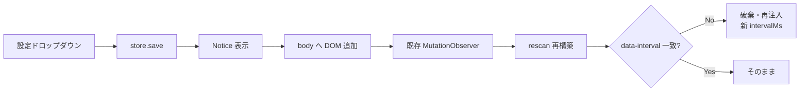

# トークン速度表示 更新周期設定機能 設計書

> 📂 パス：80_POC_Projects/POC_017_ClaudianBridge/02_設計文書/2026-09-01-token-rate-interval-setting-design.md
> 📍 源碼：`D:\AI-Agent\ClaudianBridge\src\core\settings.ts` / `src\core\i18n.ts` / `src\settings\SettingTabGeneral.ts` / `src\features\token-rate\index.ts` / `src\features\token-rate\counter.ts`
> 🏷️ バージョン：v1.0（設計 2026-09-01）
> 🔗 関連：[[2026-09-01-token-rate-display-select-design\|トークン速度表示 項目選択設計]]（v0.31.0）

---

## 1. 背景・目的

v0.31.0 で導入したトークン速度表示（`src/features/token-rate/counter.ts`）の更新周期 `intervalMs`（既定 500ms）が**コード埋め込みで変更不可**。利用環境や好みに合わせて、画面更新の細かさ（カクつき）と CPU 負荷のトレードオフを**ユーザーが設定画面で選べるようにする**。

---

## 2. 要件（ユーザー確定事項）

| # | 項目 | 決定内容 |
|:-:|------|------|
| 1 | 設定方式 | **プリセットから選ぶ**（ドロップダウン・5 値） |
| 2 | プリセット値 | **100 / 250 / 500 / 1000 / 2000 ms** |
| 3 | 既定値 | **250 ms**（v0.31.0 の 500ms から変更・後方互換は normalize で吸収） |
| 4 | 反映タイミング | **即時反映**（設定変更 → rescan で破棄・再注入） |

---

## 3. 実装方式

既存の v0.31.0 で確立した「設定 → store.save → rescan 再注入」パターンをそのまま踏襲する。新周期も intervalMs を `createTokenRateCounter` のオプションとして渡し、`data-interval` 属性を経由して設定変更検知する。

| # | ファイル | 変更内容 |
|:-:|------|------|
| 1 | `src/core/settings.ts` | `general.tokenRateIntervalMs: number` 追加（DEFAULTS・normalize・validate） |
| 2 | `src/core/i18n.ts` | ラベル 4 種（見出し＋プリセット 5 値）× 3 言語 |
| 3 | `src/settings/SettingTabGeneral.ts` | 表示項目トグル群の**上**に「更新周期」Setting（`addDropdown`）追加 |
| 4 | `src/features/token-rate/counter.ts` | `data-interval="<ms>"` 属性を出力（既存 `data-visible` と並列） |
| 5 | `src/features/token-rate/index.ts` | `intervalMs: loadInterval()` を `createTokenRateCounter` に渡す／rescan で `data-interval` 不一致時に破棄・再注入 |
| 6 | テスト | settings / i18n / SettingTabGeneral / counter / index を TDD で追加 |

---

## 4. 設定（src/core/settings.ts）

```ts
// GeneralSettings に追加
// === v0.32.0: トークン速度表示の更新周期 ===
tokenRateIntervalMs: number;
```

| # | 対応箇所 | 内容 |
|:-:|------|------|
| 1 | DEFAULTS | 既定 250 |
| 2 | normalize | `ALLOWED_INTERVALS.includes(raw) ? raw : 250`（不正値は既定） |
| 3 | validate | `ALLOWED_INTERVALS.includes(value)` をチェック |

```ts
export const ALLOWED_TOKEN_RATE_INTERVALS = [100, 250, 500, 1000, 2000] as const;
export const DEFAULT_TOKEN_RATE_INTERVAL_MS = 250;
export type TokenRateIntervalMs = typeof ALLOWED_TOKEN_RATE_INTERVALS[number];
```

---

## 5. i18n（src/core/i18n.ts）

| キー | ja | en | zh |
|------|----|----|----|
| `tokenRateIntervalLabel` | 更新周期 | Update interval | 更新周期 |
| `tokenRateIntervalDesc` | 表示の更新頻度（短いほど滑らか・CPU負荷増） | Display refresh rate (shorter = smoother, more CPU) | 显示更新频率（越短越流畅・CPU 负载越高） |
| `tokenRateInterval100` | 0.1 秒（高頻度） | 0.1 sec (frequent) | 0.1 秒（高频） |
| `tokenRateInterval250` | 0.25 秒（既定・推奨） | 0.25 sec (default) | 0.25 秒（默认） |
| `tokenRateInterval500` | 0.5 秒 | 0.5 sec | 0.5 秒 |
| `tokenRateInterval1000` | 1 秒（省 CPU） | 1 sec (low CPU) | 1 秒（低 CPU） |
| `tokenRateInterval2000` | 2 秒（最低負荷） | 2 sec (minimal) | 2 秒（最低负载） |

---

## 6. 設定 UI（src/settings/SettingTabGeneral.ts）

| # | 項目 | 内容 |
|:-:|------|------|
| 1 | 配置 | `tokenRateEnabled` の Setting の**直後**・表示項目 4 トグル群の**前** |
| 2 | UI | `Setting` + `addDropdown`（5 option + 値 → ラベル変換） |
| 3 | 保存 | 既存パターン: `store.load()` → merge → `store.save()` → Notice |
| 4 | 親トグル連動 | `tokenRateEnabled` が OFF のとき `setDisabled` |

---

## 7. 表示ロジック（src/features/token-rate/counter.ts）

### 7.1 `data-interval` 属性の追加

`Task 3` で実装した visible セグメント描画の直後に追加（innerHTML 組み立ての最終行）:

```ts
el.setAttribute('data-interval', String(opts.intervalMs));
```

### 7.2 不具合への影響

- 周期が短くなる（100/250ms）と `dt` が小さくなり rate の数値変動が激しくなるが、**rate 計算ロジック自体は周期に依存しない**
- `Task 4` の偽スパイク修正（baseline-only・検疫）は `dTokens` と `dt > 0` の関係で完結するため、**新周期でも同じく動作**
- 既存テストは `intervalMs: 250` がデフォルトとなるので、`npx vitest run tests/features/token-rate/counter.test.ts` の 15 件は**そのまま全 PASS**（Task 4 の擬似ヘッダで intervalMs を明示しているものを確認、必要なら微修正）

---

## 8. 設定反映のデータフロー



rescan の存在チェックを `data-visible` と `data-interval` の両方を比較する形に拡張:

```ts
const expectedVisible = visibleKey(loadVisible());
const expectedInterval = String(loadInterval());
counters.forEach((handle, el) => {
  const rate = el.querySelector('.cb-token-rate');
  const visibleOk = rate?.getAttribute('data-visible') === expectedVisible;
  const intervalOk = rate?.getAttribute('data-interval') === expectedInterval;
  if (!document.contains(el) || !rate || !visibleOk || !intervalOk) {
    handle.destroy();
    counters.delete(el);
  }
});
injectAll();
```

---

## 9. エラーハンドリング

| # | ケース | 挙動 |
|:-:|------|------|
| 1 | 設定 JSON 壊れ / キー欠落 | normalize で既定 250 を補完 |
| 2 | 不正値（例: 300） | normalize で 250 にフォールバック |
| 3 | 旧バージョン（v0.31.0 以前）の JSON | normalize が `typeof !== 'number'` 経路で既定 250 を補完 |

---

## 10. テスト（TDD / vitest）

| # | テスト | 検証内容 |
|:-:|------|------|
| 1 | `tokenRateIntervalMs` の normalize 既定 250 | 設定層 |
| 2 | `tokenRateIntervalMs` の normalize 不正値 → 250 | 設定層 |
| 3 | `validate` で `ALLOWED_TOKEN_RATE_INTERVALS` 外を拒否 | 設定層 |
| 4 | i18n 3 言語 × 7 キーが文字列 | i18n |
| 5 | SettingTabGeneral に interval ドロップダウン描画・初期値 | 設定 UI |
| 6 | interval 変更時にストアに保存される | 設定 UI |
| 7 | counter が `data-interval` 属性を出力 | counter |
| 8 | index が intervalMs を counter に渡す | index |
| 9 | interval 変更時に rescan で破棄・再注入 | index |

---

## 11. スコープ外（明示）

- スライダー/数値入力での連続指定（案 却下）
- 周期ごとのレート補正（短周期で dt ノイズが出やすくなる件は将来課題）
- 最大更新周期の物理的限界チェック（2000ms で十分実用範囲）

---

## 12. 影響範囲まとめ

| 既存機能 | 影響 | 対処 |
|------|:----:|------|
| 4 項目 ☑ 選択 | なし | UI 配置のみ・既存動作不変 |
| 偽スパイク修正（baseline-only・検疫） | なし | 周期に依存しないロジック |
| `data-visible` による再注入 | **強化** | `data-interval` と AND 条件で再注入判定 |
| テスト 847 件 | 影響最小 | counter.test.ts の intervalMs=500 明示箇所をデフォルト 250 に揃える（またはそのまま動くか確認） |

---

*📚 設計書 v1.0 · POC_017 ClaudianBridge · 2026-09-01*
