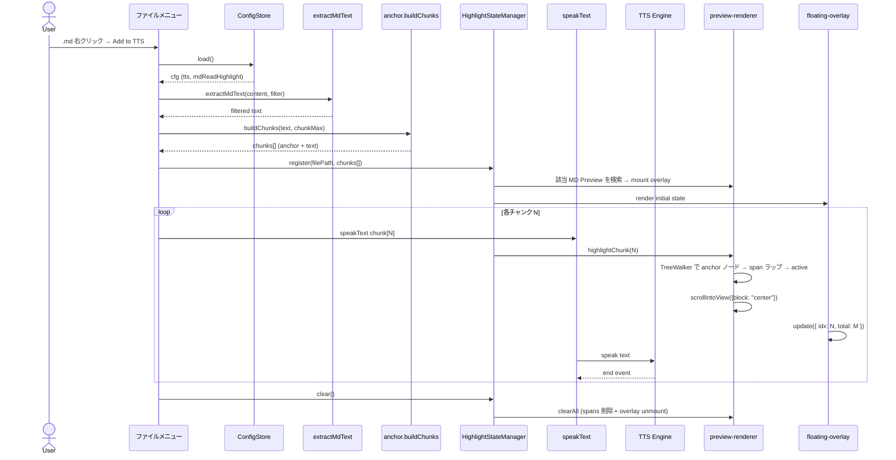
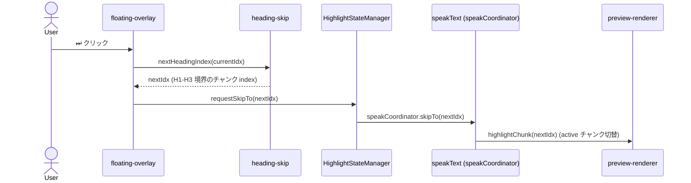
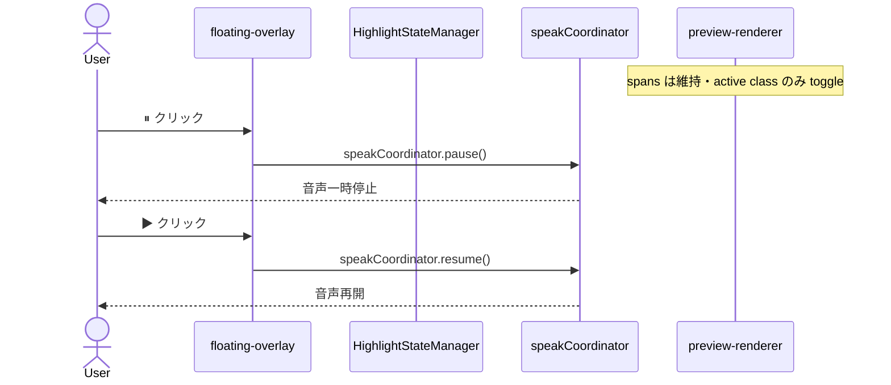
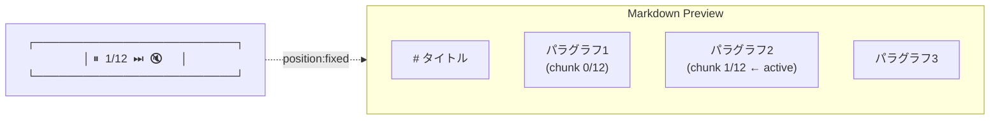

# MD ファイル読み上げ位置ハイライト設計

> 📂 パス：`02_設計文書/2026-09-02-md-read-position-highlight-design.md`
> 📍 ソース：`D:/AI-Agent/ClaudianBridge/src/features/tts/md-read-highlight/`
> 🏷️ バージョン：v0.33.0
> 👑 承認：済（2026-09-02）

---

## 1. 概要

ClaudianBridge の **MD ファイル右クリック「Add to TTS」** で本文を読み上げる際、**Obsidian Preview 表示中のチャンク位置に背景色ハイライト**を付与し、**フローティングオーバーレイの再生コントロール**（一時停止・再生・早送り・ミュート・N/M 進捗）で操作できるようにする。読み上げ中の視線移動・進捗把握・意図的なスキップを最小コストで実現する。

---

## 2. 背景・目的

### 2.1 背景（現状の問題）

| # | 問題 | 影響 |
|:-:|------|------|
| 1 | MD「Add to TTS」で読み上げ開始後、ユーザは **どこが読まれているか分からない** | 長い MD では「今どこ？」が頻発し集中が切れる |
| 2 | 再生コントロールが **Claudian Chat ツールバーにしか存在しない** | MD 読み上げ中に Chat から離れられない |
| 3 | 不要な章を読み飛ばす手段が **チャンク単位でも不可** | 読了スピードのテンポが常に均一 |

### 2.2 目的

| # | 目的 | 測定指標 |
|:-:|------|----------|
| 1 | **MD Preview 内で読み上げ位置を可視化** | チャンク単位ハイライトが機能する |
| 2 | **MD View 内で再生操作完結** | Chat に戻らず ⏸/▶/⏭ できる |
| 3 | **見出し単位のスキップ** | ⏭ で次の H1〜H3 へジャンプできる |

---

## 3. スコープ

### 3.1 ✅ In Scope

| 区分 | 内容 |
|------|------|
| 入口 | ファイルエクスプローラ右クリック「Add to TTS」（v0.17.0 の既存経路） |
| 対象モード | **Obsidian Preview** のみ（Live Preview / Source モードは除外） |
| 対応エンジン | **全エンジン共通**（edge / edge-local / webspeech / plachta）— 単語境界イベントに非依存 |
| ハイライト精度 | **チャンク単位**（chunk-level）— エンジンが変わっても精度一定 |
| コントロール | ⏸ 一時停止／▶ 再生再開／⏭ 次の見出しスキップ／🔇 ミュート／N/M 進捗 |
| スクロール | **自動追従 ON**（デフォルト） |
| 終了時挙動 | **ハイライト即クリア**（読み終えたら消える） |
| 再生中挙動 | **latest-wins**（同ファイル再起動で上書き） |
| 設定 | トグル（デフォルト ON）／ハイライト色（ユーザーが色指定可） |

### 3.2 ❌ Out of Scope（非目標 / YAGNI）

| 区分 | 理由 |
|------|------|
| Live Preview / Source モード対応 | DOM 構造が複雑で Preview 限定によりフォーカス |
| 単語単位ハイライト（webspeech 限定） | 全エンジン対応要件によりチャンク単位で妥協 |
| ハイライト色プリセット | v0.31.0+ で段階追加（カスタム色のみ先行） |
| ⏮ 巻き戻し | ⏭ スキップで代替可能・最小機能に絞る |
| 読み上げ速度調整 | プラグイン全体設定で扱う（独立機能） |
| 別 MD への切替時の継続再生 | 単一 MD 完結にフォーカス |
| 進捗バー（プログレスバー） | N/M 文字で十分 |

---

## 4. アーキテクチャ全体像

```mermaid
graph TB
    subgraph SS[Settings Tab]
        ST[TTS タブ<br/>mdReadHighlight.enabled<br/>mdReadHighlight.highlightColor]
    end

    subgraph FS[既存: ファイルメニュー]
        FMR[file-menu observer<br/>setupMdFileRead]
    end

    subgraph NEW[新規: ハイライト + コントロール]
        HSM[Highlight State Manager<br/>シングルトン状態保持]
        CAT[Chunk Anchor Table<br/>chunks[] と anchor 配列]
        MDR[MD Preview Renderer<br/>TreeWalker 走査 + span 注入]
        FCO[Floating Control Overlay<br/>⏸▶⏭🔇N-M]
        SH[Heading Skip Resolver<br/>next heading index 解決]
    end

    subgraph CORE[既存: TTS Core]
        SP[speakText<br/>チャンク分割 + speak]
        PL[PlaybackRegistry<br/>再生管理]
    end

    subgraph PRV[Obsidian Preview DOM]
        PVD[MarkdownView.previewMode<br/>レンダリング要素]
    end

    SS --> HSM
    FMR --> SP
    SP --> CAT
    SP --> PL
    PL --> HSM
    HSM --> MDR
    HSM --> FCO
    CAT --> MDR
    MDR --> PVD
    SH --> CAT
    SH --> MDR
    SH --> FCO
    FCO --> PL
```

---

## 5. コンポーネント設計

### 5.1 新しいディレクトリ構成

```text
D:/AI-Agent/ClaudianBridge/src/features/tts/
├── md-file-read.ts          # 既存（拡張ポイント追加）
├── md-read-highlight/        # 🆕 新規ディレクトリ
│   ├── types.ts              # MdReadState, MdReadChunkAnchor
│   ├── state.ts              # HighlightStateManager（シングルトン）
│   ├── anchor.ts             # チャンク化 + anchor 生成
│   ├── preview-renderer.ts   # TreeWalker + span 注入
│   ├── floating-overlay.ts   # フローティングコントロール UI
│   ├── heading-skip.ts       # 次見出しスキップ解決
│   ├── cleanup.ts            # クリア統合
│   └── index.ts              # 公開 I/F
```

### 5.2 各コンポーネント責務

| 名前 | 責務 | 公開 I/F |
|------|------|---------|
| `state.ts` HighlightStateManager | 現在再生中 MD パス・チャンク index・ハイライト状態を一元管理 | `getState()`, `setActiveChunk(idx)`, `clear()` |
| `anchor.ts` MdReadChunkAnchor | フィルタ後テキストをチャンク化し、各チャンクの **12-20 文字 anchor** を切り出す | `buildChunks(text, chunkMax): { index, anchor, text }[]` |
| `preview-renderer.ts` | 対象 MD の Preview DOM を取得し、`TreeWalker(NEXT_TEXT_NODE)` で anchor を含むテキストノードを発見 → 一致部分を `<span class="cb-md-read-chunk">` でラップ → active class をトグル | `highlightChunk(idx)`, `clearAll()`, `findSpan(idx): Element\|null` |
| `floating-overlay.ts` | Preview 右上にフローティング `<div class="cb-md-read-overlay">` を挿入。ボタンクリック → イベント発火 | `mount(view)`, `unmount()`, `update(state)`, `onPause(cb)`, `onResume(cb)`, `onSkip(cb)` |
| `heading-skip.ts` | 現在のチャンク index から **次の H1/H2/H3 に到達するチャンク index** を解決。H 判定は元 MD の `# 見出し` パターン解析で事前計算 | `nextHeadingIndex(currentIdx): number` |

---

## 6. データフロー

### 6.1 再生開始から終了までの流れ



### 6.2 早送りボタン押下時



### 6.3 一時停止 / 再開



---

## 7. ハイライト・コントロール UI

### 7.1 Preview 上での表示位置（フローティングオーバーレイ）



- **z-index**: `9999`（コードコピーボタンより上）
- **位置**: `position: fixed; top: 16px; right: 16px;`
- **既定**: 半透明ダーク `rgba(40,40,40,0.85)` + 白アイコン
- **操作**: ⏸ 一時停止／▶ 再開／⏭ 次の見出し／🔇 ミュート（既存ミュートと連動）

### 7.2 ハイライト視覚仕様

```css
/* 拡張可能性を考慮した class 設計 */
.cb-md-read-chunk {
  /* anchor span に付与するマーカー */
  background-color: transparent;
  border-radius: 2px;
  transition: background-color 200ms ease;
}

.cb-md-read-chunk.is-active {
  /* 現在再生中チャンク */
  background-color: var(--cb-md-read-highlight, rgba(100, 180, 255, 0.35));
  /* ↑ ユーザー設定色を変数経由で適用 */
}

.cb-md-read-chunk.is-paused {
  /* 一時停止中のチャンク（視覚的フィードバック） */
  background-color: var(--cb-md-read-highlight-paused, rgba(255, 180, 80, 0.30));
  animation: cb-md-read-pulse 1.5s ease-in-out infinite;
}

@keyframes cb-md-read-pulse {
  0%, 100% { opacity: 0.7; }
  50% { opacity: 1.0; }
}
```

**拡張余地**:
- `--cb-md-read-highlight` を変えるだけで色変更可能。設定タブで色を変えると、JS から `document.documentElement.style.setProperty('--cb-md-read-highlight', newColor)` で反映（`highlightColor` 設定 → CSS 変数のバインドは `SettingTab.onChange` で実施）
- 将来的に `.cb-md-read-chunk--underline`, `.cb-md-read-chunk--bold` を追加する余地あり

---

## 8. スキップ仕様（次の見出しへ）

### 8.1 見出し index の事前計算

```typescript
// anchor.ts で chunks 構築時に同時に計算
interface MdReadChunkAnchor {
  index: number;
  /** 元 MD で何行目から始まったか（0 始まり） */
  startLine: number;
  /** chunk テキスト先頭の anchor（12-20 文字） */
  anchor: string;
  /** チャンク本文 */
  text: string;
  /** このチャンクが属する heading level（直近の H1-H3）。0=プレアンブル */
  headingLevel: 0 | 1 | 2 | 3;
}
```

### 8.2 ⏭ 押下時の解決ロジック

```typescript
function nextHeadingIndex(
  chunks: MdReadChunkAnchor[],
  currentIdx: number
): number {
  const current = chunks[currentIdx];
  const startFrom = currentIdx + 1;
  // 現在の headingLevel より小さい（より大きい見出し）か
  // 等しいか大きい（より小さいレベル）に遭遇するまで探す
  for (let i = startFrom; i < chunks.length; i++) {
    if (chunks[i].headingLevel <= current.headingLevel && chunks[i].headingLevel > 0) {
      return i;
    }
  }
  // 末尾に到達 → current を返す（最後なので何もしない）
  return currentIdx;
}
```

---

## 9. 設定スキーマ

### 9.1 型拡張

```typescript
// src/core/settings.ts に追加
export interface ClaudianBridgeSettings {
  // ... 既存 ...
  tts: {
    // ... 既存 ...
    /** v0.31.0: MD 読み上げ位置ハイライト（Preview 連動） */
    mdReadHighlight: {
      /** ハイライト機能の有効/無効（デフォルト true） */
      enabled: boolean;
      /** チャンクのアクティブ背景色（CSS カラー）。空文字ならデフォルト色 */
      highlightColor: string;
    };
  };
}
```

### 9.2 設定タブ UI

```text
ClaudianBridge 設定 → TTS タブ → 新セクション「MD 読み上げハイライト」
  ☑ MD 読み上げ時にチャンク位置をハイライト（Preview）
  🎨 ハイライト色: [#a0c8ff]  （カラーピッカー）
```

### 9.3 デフォルト値

```json
{
  "mdReadHighlight": {
    "enabled": true,
    "highlightColor": ""
  }
}
```

### 9.4 マイグレーション

- 既存ユーザは `mdReadHighlight` が未定義 → `loadSettings()` で `DEFAULT_SETTINGS` から自動付与
- DEFAULT_SETTINGS に追加（v0.31.0 で展開）

---

## 10. 状態管理・ライフサイクル

### 10.1 HighlightStateManager（シングルトン）

```typescript
interface MdReadState {
  /** 再生対象ファイルパス */
  filePath: string;
  /** chunk 配列 */
  chunks: MdReadChunkAnchor[];
  /** 現在 active な chunk index（-1 = 未開始） */
  activeIdx: number;
  /** 一時停止中フラグ */
  paused: boolean;
  /** 状態（pending / playing / paused / completed / cleared） */
  phase: 'pending' | 'playing' | 'paused' | 'completed' | 'cleared';
}
```

### 10.2 ライフサイクル一覧

| イベント | 動作 |
|---------|------|
| `register(filePath, chunks)` | state 初期化・overlay mount・spans 未挿入 |
| `setActiveChunk(idx)` | preview-renderer に移譲（active span を切替） |
| `pause()` | overlay ⏸ 表示切替・speakCoordinator に通知 |
| `resume()` | overlay ▶ 表示切替・speakCoordinator に通知 |
| `requestSkipTo(idx)` | heading-skip 解決 → speakCoordinator.skipTo → ハイライト切替 |
| `clear()` | 全 spans 削除・overlay unmount・state cleared |
| `unmount()` (plugin unload) | clear と同じ |
| `onSettingChange('mdReadHighlight.enabled', false)` 再生中に OFF | 現チャンクを話終わったら `clear()` を実行（即停止は UX 配慮で避ける） |
| MD ファイルのタブが閉じられた場合 | `workspace.on('layout-change')` で検知 → `clear()`（**補訂 2026-09-02**: 当初 design では `'file-close'` を想定していたが、Obsidian の `Workspace.on` API 型には `file-close` が存在しない。タブクローズも含む `layout-change` で代替し、`state` が残っているときだけクリアする安全側実装に変更） |
| 他 MD に切替（再生中 MD が裏に） | ハイライト・overlay は **保持**（裏で見えなくなるだけ）。戻ってきたらハイライト表示復帰 |

### 10.3 同時再生の取り扱い（latest-wins）

```text
MD A 再生中 → MD A を再 Add to TTS
  → state を reset、activeIdx = 0 から再開
  → overlay / span はそのまま流用（再計算不要）
MD A 再生中 → MD B を Add to TTS
  → state を完全リセット、MD A の spans / overlay を unmount
  → MD B の新規 register を実行
```

---

## 11. 国際化

`src/core/i18n.ts` に追加（既存パターン踏襲）：

| キー | 日本語 | English |
|------|--------|---------|
| `tts.mdReadHighlight.enabled` | MD 読み上げ時にチャンク位置をハイライト | Highlight reading position in MD Preview |
| `tts.mdReadHighlight.highlightColor` | ハイライト色 | Highlight color |
| `tts.mdReadOverlay.pause` | 一時停止 | Pause |
| `tts.mdReadOverlay.resume` | 再開 | Resume |
| `tts.mdReadOverlay.skipToHeading` | 次の見出しへ | Skip to next heading |
| `tts.mdReadOverlay.mute` | ミュート | Mute |
| `tts.mdReadOverlay.noPreview` | Preview モードで表示中のみハイライトできます | Highlight only works in Preview mode |

---

## 12. テスト戦略

### 12.1 テストレベル

| レベル | ツール | 対象 |
|--------|--------|------|
| 単体テスト | vitest | anchor 分割ロジック・state 遷移・heading-skip 解決・CSS 注入関数 |
| DOM 統合テスト | vitest + jsdom | TreeWalker 走査・span ラップ・active class トグル |
| UAT | 手動 | Preview 表示中の視覚確認・コントロール操作 |

### 12.2 テストケース（主要）

| # | テスト | 期待値 |
|:-:|--------|--------|
| 1 | `buildChunks(text, 500)` でチャンク分割 | 各チャンク ≤ 500 字、anchor が各先頭 12-20 字 |
| 2 | `nextHeadingIndex([H2→H3→H1], currentIdx=0)` | H1 境界 (idx=2) を返す |
| 3 | Preview DOM に anchor のテキストがある → span ラップ | `<span class="cb-md-read-chunk is-active">` が生成 |
| 4 | anchor が見つからない場合（frontmatter フィルタ後） | no-op（throw しない） |
| 5 | `setActiveChunk(N)` 呼び出しで前の chunk の `is-active` が消える | 直前 chunk は active 解除 |
| 6 | `clear()` で全 spans と overlay が DOM から消える | 確認 |
| 7 | 設定 `enabled=false` で `Add to TTS` クリック → 既存挙動維持 | ハイライト・overlay なし |
| 8 | Live Preview で `Add to TTS` → `Preview で見られます` Notice | overlay mount せず |
| 9 | 同 MD を再生中に再 Add → latest-wins | activeIdx=0 から再開・overlay 維持 |
| 10 | ⏭ で H1 → H2 → H1 とスキップ | 正しい境界 |

### 12.3 カバレッジ目標

- 新規ファイル: 90% 以上
- 既存 `md-file-read.ts` の変更部分: 100%

---

## 13. リスク・対策

| # | リスク | 影響 | 対策 |
|:-:|--------|------|------|
| 1 | Obsidian Preview のレンダリング遅延で anchor が見つからない | ハイライトなしで読み上げ継続 | no-op フォールバック + Notice で予告 |
| 2 | MD 編集中（読み上げ中もファイル変更） | anchor ノード消滅・ハイライト消える | ファイル変更検知 (workspace.on('file-modify')) で clear |
| 3 | チャンク anchor が他のチャンクにも出現 | 誤マッチ（別の段落をハイライト） | anchor を 20 字に拡張・行頭/行末の改行位置でスコープ絞る |
| 4 | 複数 MD の同時再生（競合） | 状態競合 | latest-wins で完全リセット・古い state は clear |
| 5 | z-index 衝突（他プラグイン） | クリック奪われる | z-index 9999 + 自前の event.stopPropagation |
| 6 | Live Preview で DOM 不整合 | ハイライト消失 | Live Preview では機能無効 + Notice 案内 |
| 7 | 音声同期と表示の遅延（100-200ms） | ハイライトが先に動く | CSS transition で滑らかに・許容 |

---

## 14. 変更ファイル

### 14.1 新規

| パス | 内容 |
|------|------|
| `src/features/tts/md-read-highlight/types.ts` | MdReadState / MdReadChunkAnchor 型定義 |
| `src/features/tts/md-read-highlight/state.ts` | HighlightStateManager（シングルトン） |
| `src/features/tts/md-read-highlight/anchor.ts` | buildChunks + heading index 計算 |
| `src/features/tts/md-read-highlight/preview-renderer.ts` | TreeWalker + span 注入 + scrollIntoView |
| `src/features/tts/md-read-highlight/floating-overlay.ts` | フローティング UI 注入 + イベント発火 |
| `src/features/tts/md-read-highlight/heading-skip.ts` | nextHeadingIndex 解決 |
| `src/features/tts/md-read-highlight/cleanup.ts` | クリア統合 |
| `src/features/tts/md-read-highlight/index.ts` | 公開 I/F 集約 |
| `tests/features/tts/md-read-highlight/anchor.test.ts` | チャンク分割 + anchor テスト |
| `tests/features/tts/md-read-highlight/state.test.ts` | state 遷移テスト |
| `tests/features/tts/md-read-highlight/heading-skip.test.ts` | 見出しスキップテスト |
| `tests/features/tts/md-read-highlight/preview-renderer.test.ts` | DOM 操作テスト |

### 14.2 変更

| パス | 変更内容 |
|------|---------|
| `src/features/tts/md-file-read.ts` | `register(filePath, chunks)` + `setActiveChunk` 呼び出し追加 |
| `src/features/tts/speak.ts` | チャンク話中 / 話了イベントで state active index を更新する hook を追加 |
| `src/core/settings.ts` | `mdReadHighlight` 型 + DEFAULT_SETTINGS 追加 |
| `src/features/settings/SettingTab.ts` | TTS タブに「MD 読み上げハイライト」セクション追加 |
| `src/core/i18n.ts` | 7 個のキー追加（ja / en） |
| `src/main.ts` | `setupMdReadHighlight(app, store)` 登録 + cleanup 連動 |
| `styles.css` | `.cb-md-read-chunk*` / `.cb-md-read-overlay*` クラス追加 |
| `CHANGELOG.md` | v0.31.0 エントリ追加 |
| `manifest.json` | version を 0.30.2 → 0.31.0 |

### 14.3 ドキュメント同期

| パス | 内容 |
|------|------|
| `01_要件定義/01_機能要件.md` | F-番号発番（例: F025 MD Read Highlight）+ 動作仕様追記 |
| `08_説明書/02_ユーザーマニュアル/機能詳細.md` | 「MD 読み上げハイライト」セクション追記 |
| `08_説明書/03_リリースノート/リリースノート.md` | v0.31.0 リリースエントリ |
| `08_説明書/03_リリースノート/バージョン履歴.md` | v0.31.0 行追記 |

---

## 15. 非目標（YAGNI 明示）

| # | やらないこと | 理由 |
|:-:|-------------|------|
| 1 | 単語単位ハイライト（webspeech 限定） | 全エンジン要件で不可能 |
| 2 | Live Preview / Source 対応 | DOM 不整合・Preview 限定でフォーカス |
| 3 | ハイライト色プリセット追加 | カスタム色のみ先行 |
| 4 | ⏮ 巻き戻しボタン | ⏭ スキップで代替 |
| 5 | 別 MD への遷移時の継続再生 | 単一 MD 完結 |
| 6 | 再生速度調整 | プラグイン全体設定の独立機能 |
| 7 | 進捗バー（プログレスバー） | N/M 文字で十分 |
| 8 | CSS カスタム変数以外の UI 経由色変更 | カスタム色（テキスト）で代替 |

---

## 16. 関連文書 / 参照

| # | 種別 | ファイル |
|:-:|:----:|---------|
| 1 | Vault MD | [[80_POC_Projects/POC_017_ClaudianBridge/01_要件定義/01_機能要件]] — F015 TTS 読み上げ仕様統一（MD 右クリック Add to TTS） |
| 2 | Vault MD | [[80_POC_Projects/POC_017_ClaudianBridge/02_設計文書/2026-08-15-message-read-button-design]] — メッセージ読上げボタン設計（設計パターン踏襲） |
| 3 | ソース | `D:\AI-Agent\ClaudianBridge\src\features\tts\md-file-read.ts` — 既存 Add to TTS 実装 |
| 4 | ソース | `D:\AI-Agent\ClaudianBridge\src\features\tts\speak.ts` — TTS speak コア |
| 5 | ソース | `D:\AI-Agent\ClaudianBridge\src\features\tts\core.ts` — TTS エンジン共通 I/F |
| 6 | Web | https://developer.mozilla.org/en-US/docs/Web/API/TreeWalker — DOM 走査 API |
| 7 | Web | https://docs.obsidian.md/Reference/TypeScript API/MarkdownRenderer/ — Obsidian プレビュー API |

---

## 📝 更新履歴

| 版 | 日付 | 変更 | 担当 |
| ---- | ---- | ---- | ---- |
| draft | 2026-09-02 | 初版（10_Input/Check 格納） | MiuMiu 🐾 |
| 1.0 | 2026-09-02 | 👑承認済・v0.33.0 化・F-028 採番 | MiuMiu 🐾 |
| 1.1 | 2026-09-02 | §10.2 の `file-close` → `layout-change` 補訂（Obsidian 型制約対応）+ 承認後 v0.33.1 で SettingTab UI 補完 | MiuMiu 🐾 |
