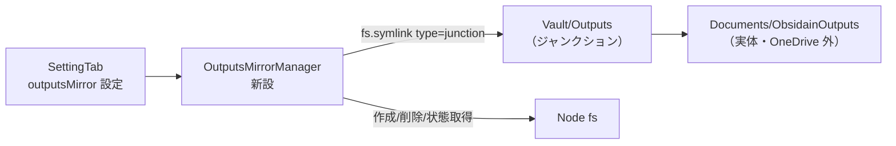
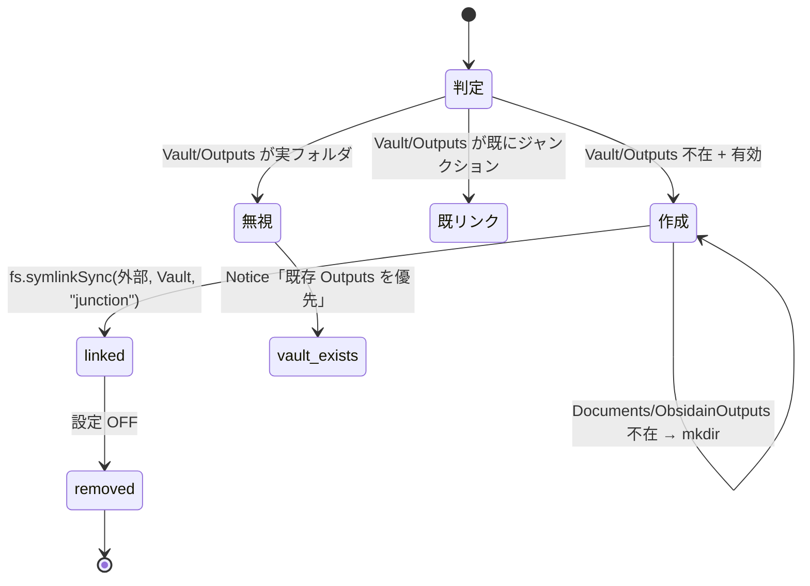
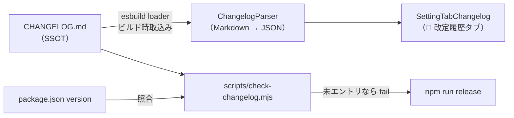
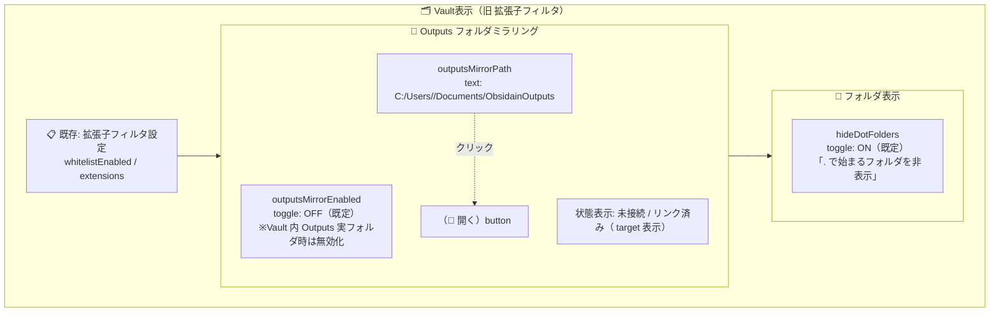

# ClaudianBridge Outputs フォルダミラリング設計

> 📂 路径：80_POC_Projects/POC_017_ClaudianBridge/02_設計文書/20_Outputsフォルダミラリング設計.md
> 📍 対象：POC_017 ClaudianBridge（D:\AI-Agent\ClaudianBridge）・F-番号起票前設計

---

## 1. 背景・目的

| 項目 | 内容 |
|------|------|
| 課題 | Obsidian Vault が OneDrive 同期配下にあり、出力データ（PPT・動画等）で容量が増加する |
| 目的 | ① Vault 容量削減 ② `Outputs` 出力データを**ユーザドキュメントフォルダで直接確認**できるようにする |
| 方式 | ドキュメントフォルダの `ObsidianOutputs` を Vault 内 `Outputs` に **NTFS ジャンクションでミラリング**（chroma_db と同方式・実績あり）。**既存 `200_Output` ジャンクションは廃止済み**（2026-09-13 統合・`Vault\Outputs` に一本化） |

## 2. 仕様

| # | 項目 | 仕様 |
|:--:|------|------|
| 1 | **設定画面の配置** | 設定タブ **「🗂️ 拡張子フィルタ」を「🗂️ Vault表示」に改名**（i18n `tabWhitelist`・`SettingTabWhitelist.ts`）し、そこに追加 |
| 2 | 設定 ① | `general.outputsMirrorEnabled`（既定 **OFF**）— 機能の有効/無効 |
| 3 | **設定 ① の有効化条件** | ⚠️ **Vault 内 `Outputs` が実フォルダで存在する場合は有効化不可**（トグルを無効化 + 理由を表示） |
| 4 | 設定 ② | `general.outputsMirrorPath`（既定 `C:\Users\<user>\Documents\ObsidainOutputs`・`app.getPath('documents')` + `ObsidainOutputs` を動的解決・設定画面で変更可） |
| 4a | 設定 ② の「📂 開く」ボタン <span class="new-badge">🆕</span> | パス入力欄の横に **「📂 開く」ボタン**を配置。クリックで `outputsMirrorPath` のフォルダを OS のファイルマネージャー（Explorer）で開く（Electron `shell.openPath`・フォルダ不在時は自動作成してから開く・失敗時は Notice 通知） |
| 5 | 設定 ③ <span class="new-badge">🆕</span> | **「`.` で始まるフォルダを非表示」**（`general.hideDotFolders`・既定 **ON**）— 「Vault表示」タブのオプションとして追加。プラグイン左側ファイル一覧から `.` で始まるフォルダを除外する |
| 6 | 有効時動作 | プラグイン起動時 + 設定反映時にジャンクションを作成/維持 |
| 7 | **Vault 内 `Outputs` 既存時** | ⚠️ **ドキュメント側を無視**（何もしない・既存実フォルダを優先・ジャンクション非作成）+ 仕様 #3 により設定は有効化不可 |
| 8 | 外部フォルダ不在時 | ドキュメント側 `ObsidianOutputs` を自動作成してからジャンクション作成 |
| 9 | 無効時動作 | ジャンクションを**削除**（Vault ツリーから消える・ドキュメント側の実ファイルは無傷） |
| 10 | 安全削除 | 削除前に `lstat` で **ジャンクション（シンボリックリンク）であることを確認**。実フォルダは絶対に削除しない |

## 3. アーキテクチャ



### モジュール構成

| モジュール | 責務 |
|-----------|------|
| `OutputsMirrorManager`（新設） | ジャンクションの作成・削除・状態取得。全 fs 操作を DI 可能な deps に分離 |
| `settings.ts` | 3 設定追加（`outputsMirrorEnabled` / `outputsMirrorPath` / `hideDotFolders`） |
| `i18n` | `tabWhitelist` を「🗂️ 拡張子フィルタ」→「🗂️ Vault表示」に改名 + ja/en 設定ラベル + 通知メッセージ |
| `SettingTabWhitelist.ts` | タブ名改名 + 「Vault表示」セクションにミラリング設定（#3 の有効化不可制御含む）+ 「`.で始まるフォルダを非表示`」トグル追加 |
| ファイル一覧 | `hideDotFolders` ON 時に `.` で始まるフォルダを一覧から除外 |

### OutputsMirrorManager IF（TypeScript）

```ts
interface OutputsMirrorDeps {
    vaultAdapter: { basePath: string };
    fs: Pick<typeof import("fs"), "existsSync" | "mkdirSync" | "symlinkSync" | "lstatSync" | "rmdirSync" | "rmSync">;
    app: { getPath: (name: "documents") => string };
    notice: (msg: string) => void;
}
type MirrorState = "linked" | "vault_exists" | "created" | "removed" | "inactive" | "error";

class OutputsMirrorManager {
    constructor(private deps: OutputsMirrorDeps) {}
    apply(enabled: boolean, externalPath: string): MirrorState;
    status(): { linked: boolean; target?: string };
}
```

### 動作フロー（apply）



## 4. エラーハンドリング

| ケース | 動作 |
|--------|------|
| ジャンクション作成失敗（権限等） | Notice でエラー通知・`status: "error"`・プラグインは継続動作 |
| パス空欄で有効化 | 設定画面でバリデーションエラー表示（既定値があるため稀） |
| Vault/Outputs が実フォルダ | **外部側を無視**（仕様 #4・Notice 1 回のみ） |
| 削除対象がジャンクションでない | 削除せず `vault_exists` を返す（実データ保護） |

## 5. テスト計画（vitest・TDD）

| # | テストケース |
|:--:|------------|
| 1 | 有効 + Vault/Outputs 不在 + 外部あり → ジャンクション作成（symlinkSync 呼び出し引数検証・外部パスは Documents/ObsidainOutputs） |
| 2 | 有効 + Vault/Outputs 実フォルダ存在 → **fs 操作なし**・`vault_exists` |
| 3 | 有効 + 外部不在 → 外部 mkdir を先に呼ぶ |
| 4 | 無効 + ジャンクション存在 → 削除される |
| 5 | 無効 + 実フォルダ → **削除しない**（実データ保護・最重要） |
| 6 | deps 未指定時に本物デフォルトで動く（DI デフォルト欠落防止の回帰テスト） |
| 7 | symlinkSync 例外 → error 状態 + Notice 呼び出し |
| 8 | <span class="new-badge">🆕</span> Vault/Outputs 実フォルダ存在時 → 設定 UI トグルが無効化され `outputsMirrorEnabled` を ON にできない |
| 9 | <span class="new-badge">🆕</span> `hideDotFolders` ON → 一覧に `.obsidian` 等 `.` 始まりフォルダが含まれない |
| 10 | <span class="new-badge">🆕</span> `hideDotFolders` OFF → `.` 始まりフォルダも一覧に表示される |
| 10a | <span class="new-badge">🆕</span> 「📂 開く」ボタン: クリックで `shell.openPath(outputsMirrorPath)` が呼ばれる（フォルダ不在時は作成後に開く・openPath 失敗時は Notice） |
| 11 | <span class="new-badge">🆕</span> ChangelogParser: 45 エントリ形式を全件パースし version/date/title を抽出 |
| 12 | <span class="new-badge">🆕</span> check-changelog.mjs: package.json バージョンが CHANGELOG に無い場合 → 非 0 終了（リリースゲート） |
| 13 | <span class="new-badge">🆕</span> 改定履歴タブ: 全エントリ描画・アコーディオン開閉 |

## 6. リスクと対策

| ID | リスク | 対策 |
|----|--------|------|
| R-1 | 実フォルダ誤削除 | lstat でジャンクション判定を必須化（テスト 5） |
| R-2 | OneDrive 配下でのジャンクション挙動 | chroma_db で実績あり。Vault 内ジャンクション自体は同期対象外になるため容量削減に寄与 |
| R-3 | OS 非対応（macOS/Linux） | Windows 判定（`process.platform === 'win32'`）で機能無効化・設定非表示 |
| R-4 | 外部パスの誤設定 | 作成前にパス存在/作成可否チェック + エラー通知 |

## 7. 改定履歴ページ（<span class="new-badge">🆕</span> v1.6 追加）

### 仕様

| # | 項目 | 仕様 |
|:--:|------|------|
| 1 | 設定タブ | **「📜 改定履歴」タブを新設**（i18n `tabChangelog`・タブ一覧の最下部に配置） |
| 2 | データソース | リポジトリの **`CHANGELOG.md` を SSOT として単一参照**（ビルド時に esbuild loader で同梱・二重管理しない） |
| 3 | 表示内容 | **全バージョン（現在 45 エントリ以上）を全表示**：`バージョン / 日付 / タイトル（機能概要）` をアコーディオン（折りたたみ）リストで表示。展開で Added/Changed/Fixed 詳細 |
| 4 | ソート | 新しい順（CHANGELOG.md 記載順） |
| 5 | 必須更新の仕組み | **リリースチェックを自動化**: `npm run release` 内で「`package.json` のバージョンが CHANGELOG.md に `## [X.Y.Z]` エントリとして存在するか」を検証するスクリプト（`scripts/check-changelog.mjs` 新設）を挟み、**未更新ならリリース失敗**させる |
| 6 | 表示の軽量化 | 45+ エントリは仮想化せず折りたたみ既定（閉）で対応。パース結果はビルド時生成 JSON をキャッシュ利用 |

### アーキテクチャ



### 追加モジュール

| モジュール | 責務 |
|-----------|------|
| `SettingTabChangelog.ts`（新設） | 改定履歴タブの UI（アコーディオン描画） |
| `ChangelogParser`（新設） | CHANGELOG.md → `{version, date, title, sections[]}[]` パース |
| `scripts/check-changelog.mjs`（新設） | package.json バージョンと CHANGELOG エントリの突合（リリースゲート） |
| `esbuild.config.mjs` | CHANGELOG.md のテキスト取込み loader 追加 |
| `package.json` | `release` スクリプトにチェック組み込み |

## 8. Vault表示タブ UI イメージ（🆕 v1.8 追加）



### 各設定の初期値一覧

| # | 設定キー | UI 要素 | 初期値 | 備考 |
|:--:|---------|---------|--------|------|
| 1 | `whitelistEnabled`（既存） | トグル | 変更なし | 既存の拡張子フィルタ |
| 2 | `general.outputsMirrorEnabled` | トグル | **OFF** | Vault 内 Outputs 実フォルダ既存時はトグル無効化 |
| 3 | `general.outputsMirrorPath` | テキスト + 「📂 開く」ボタン | `C:\Users\<user>\Documents\ObsidainOutputs` | `app.getPath('documents')` から動的解決 |
| 4 | `general.hideDotFolders` | トグル | **ON**（非表示） | 「`.` で始まるフォルダを非表示」 |

## 9. 成果物・リリース

| 項目 | 内容 |
|------|------|
| 実装 | D:\AI-Agent\ClaudianBridge（inline TDD・SDD 🟡M 相当） |
| 設定画面 | 「🗂️ Vault表示」タブ（旧 拡張子フィルタ）+「📜 改定履歴」タブ新設 |
| バージョン | **v0.41.0**（現行 v0.40.0 の次・機能追加のためマイナーアップ） |
| ドキュメント | CHANGELOG（**リリースゲートにより更新必須化**）・リリースノート更新 |

## 📝 更新記録

| バージョン | 日付 | 変更内容 | 変更者 |
|-----------|:----:|---------|:------:|
| v1.0 | 2026-09-13 | 初版作成（方式 3 点確定済み：ジャンクション/ドキュメント既定/OFF 削除） | MiuMiu 🐾 |
| v1.1 | 2026-09-13 | 外部フォルダ既定を `Documents\ObsidainOutputs` に変更（設定で変更可） | MiuMiu 🐾 |
| v1.2 | 2026-09-13 | 想定バージョンを実勢に合わせ v0.36.0 → **v0.41.0** に修正（現行 v0.40.0 確認） | MiuMiu 🐾 |
| v1.3 | 2026-09-13 09:20 | 既存実フォルダ実名に合わせ既定パスを `Documents\ObsidainOutputs` に確定・200_Output ジャンクション修復（リンク先 typo 修正） | MiuMiu 🐾 |
| v1.4 | 2026-09-13 09:35 | **統合確定**: 200_Output ジャンクション廃止 → `Vault\Outputs → Documents\ObsidainOutputs` に一本化・テンプレートリンク更新・データは ObsidainOutputs に一元化 | MiuMiu 🐾 |
| v1.5 | 2026-09-13 09:50 | **仕様改良**: ①設定配置を「拡張子フィルタ」タブ（`tabWhitelist` 改名 → 「Vault表示」）に変更・Vault 内 Outputs 実フォルダ既存時は有効化不可 ②「`.`で始まるフォルダを非表示」（`general.hideDotFolders`・既定 ON）を追加 | MiuMiu 🐾 |
| v1.6 | 2026-09-13 10:05 | **改定履歴ページ追加**: 「📜 改定履歴」タブ新設（CHANGELOG.md を SSOT・全エントリ表示）+ リリースゲートで更新必須化 | MiuMiu 🐾 |
| v1.7 | 2026-09-13 10:15 | `outputsMirrorPath` に「📂 開く」ボタン追加（`shell.openPath`・フォルダ不在時は自動作成してから開く） | MiuMiu 🐾 |
| v1.9 | 2026-09-13 10:45 | **承認** → 02_設計文書/16_ に移動・改名（行動ルール v2.28） | MiuMiu 🐾 |
| v1.8 | 2026-09-13 10:30 | **Vault表示タブ UI イメージ（Mermaid）+ 各設定初期値一覧**を §8 に追加 | MiuMiu 🐾 |

---

*🔗 ClaudianBridge Outputs フォルダミラリング設計 v1.0 · MiuMiu 🐾 · 2026-09-13*
