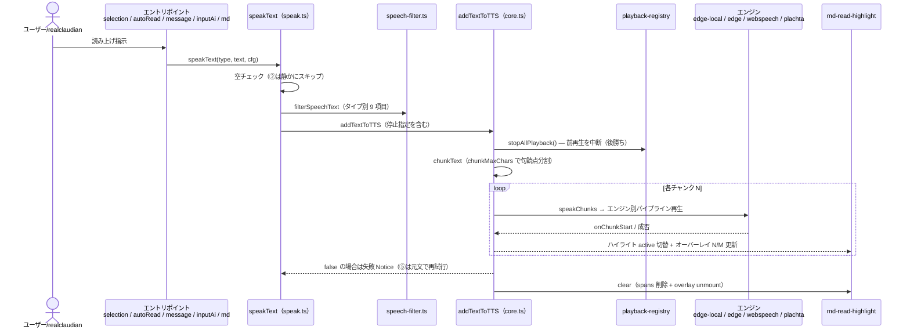

# TTS 読み上げ統合設計

> 📂 路径：`80_POC_Projects/POC_017_ClaudianBridge/02_設計文書/23_TTS読み上げ統合設計.md`
> 📍 対象：`ClaudianBridge v0.41.0`（`D:\AI-Agent\ClaudianBridge\src\features\tts\`）
> 📅 作成日：2026-09-13
> 🐕 担当：MiuMiu 🐾
> 🔗 関連：原本設計 12 件（[[#五、原本リンク]]）・[[80_POC_Projects/POC_017_ClaudianBridge/08_説明書/03_リリースノート/リリースノート]]

---

## 一、概要

本書は POC_017 ClaudianBridge の TTS（テキスト読み上げ）機能に関する原本設計 12 件を統合し、**現行仕様（v0.41.0 時点）を SSOT として一望できる**ようにした統合設計書である。個別の経緯・判断・実装差分は原本を参照し、本書は「今どうなっているか」「どの設計が現行に効いているか」を示す。

### 対象機能（本統合設計のスコープ）

| # | 機能 | 由来する原本設計 | 実装モジュール |
|:-:|------|------|------|
| 1 | ClaudeTTS 設定同期（voice-config.json） | 2026-08-14 settings-merger | `voice-config-sync.ts` |
| 2 | タスク終了時自動読み上げ | 2026-08-14 auto-tts / 2026-08-16 final-answer | `auto-read.ts` / `extract-report.ts` |
| 3 | 長文チャンキング + 連続再生 | 2026-08-14 chunking / 2026-08-16 chunkmax | `chunking.ts` / `core.ts` |
| 4 | 割り込み再生（後勝ち・重複読み防止） | 2026-08-16 interrupt | `playback-registry.ts` / `speak-coordinator.ts` |
| 5 | エンジン構成（edge-cloud / edge-local / webspeech / plachta） | 2026-08-17 / 2026-08-19 | `core.ts` / `edge-tts-local.ts` / `plachta-tts.ts` |
| 6 | 読み上げ仕様統一・フィルタ | 2026-08-16 spec-enhancement / tool-call-exclude | `speak.ts` / `speech-filter.ts` |
| 7 | 完了報告の読上げスクリプト整形 | 2026-08-30 report-script | `report-script.ts` |
| 8 | MD 読み上げ位置ハイライト・再生制御・プロファイル/LLM 原稿 | 2026-09-02 highlight + 後続 F-032/F-033 | `md-read-highlight/` / `profile.ts` / `llm-rewrite.ts` |

---

## 二、現行仕様（v0.41.0 時点）

### 2.1 エンジン構成（4 種）

| エンジン | 値 | 実装 | 音声合成方式 | チャンク上限（既定） |
|---------|:--:|------|------|------|
| クラウド EdgeTTS | `edge` | `core.ts`（`edgeCloudHttpSpeak`） | HTTPS POST プロキシ（`tts.edgeCloud.serverUrl` + `authToken` + `timeout`）。旧 ClaudeTTS スキル spawn 方式（`commands.py`）は置換済 | 500（100〜2000） |
| ローカル EdgeTTS | `edge-local` | `edge-tts-local.ts` | **同梱 `py/edge_tts/`**（git subtree・rany2/edge-tts）を Python アダプタ経由で合成。**デフォルト エンジン**。`python3`/`python` 自動検出・プロセス停止は Windows `taskkill /T` / POSIX `SIGTERM→SIGKILL` の二段 | 500（edge と共有） |
| Web Speech | `webspeech` | `core.ts`（`webSpeechSpeak`） | ブラウザ `speechSynthesis`。`onend` で完了判定 | 140（50〜140） |
| Plachta | `plachta` | `plachta-tts.ts` | HF Space API（先行合成パイプライン） | 140（50〜140） |

- 既定値: `tts.engine = 'edge-local'`（v0.27.0 で `'edge'` から自動マイグレーション + backup ログ）
- 音声名は `tts.voices.edge` / `tts.voices.webspeech`（zh/ja/en、短縮名。edge-local は `EDGE_VOICE_FULL` でフル名 `zh-CN-XiaoxiaoNeural` 等へ変換）
- 言語モード: `tts.addToTtsLanguageMode` / `tts.autoReadLanguageMode`（`auto | ja | zh | en`）→ `lang.ts` の `pickLang(text, mode)` で解決

### 2.2 設定体系

**プラグイン内 `tts.*`（SSOT）**:

| 設定 | 型・既定 | 内容 |
|------|------|------|
| `tts.enabled` | boolean | 読み上げ ON/OFF（ミュート） |
| `tts.engine` | `edge-local`（既定） | エンジン 4 択 |
| `tts.voices.edge / webspeech` | zh/ja/en | 音声名 |
| `tts.autoRead` | `enabled: true` / `scope: 'header' \| 'full'` | タスク終了時自動読上げ |
| `tts.autoReadReportScript` | `true` | 完了報告スクリプト整形（F-026） |
| `tts.autoReadLanguageMode` / `addToTtsLanguageMode` | `auto` | 言語モード（F-027 系・v0.27.0） |
| `tts.chunkMaxChars` | `{ edge: 500, webspeech: 140, plachta: 140 }` | エンジン別チャンク上限（v0.18.0） |
| `tts.speechFilter` | 4 タイプ × 9 項目 | 読み上げフィルタ（チェック = 読む） |
| `tts.edgeCloud` | `{ serverUrl: '', authToken: '', timeout: 30000 }` | クラウドプロキシ |
| `tts.edgeTtsModulePath` | `''`（自動 = 同梱 → site-packages） | edge-local モジュール場所 |
| `tts.mdReadHighlight` | `{ enabled: true, highlightColor: '' }` | MD ハイライト（F-028） |
| `tts.readProfile`（F-032）/ `tts.termsDict` | `original` / `''` | 聴き手プロファイル 7 種 + 用語辞書 MD |
| `tts.llmRewriteCache` / `llmRewriteConcurrency` | `true` / `2` | LLM 原稿キャッシュ（LRU 100）/ 並列数 1〜8（F-033） |

**CLI 同期（`voice-config-sync.ts`）**: Claudian Bridge をマスターとして `~/.claude/skills/claude-tts/voice-config.json` へ双方向同期。`engine_priority`・`voice_overrides[zh-CN/ja-JP/en-US]`・`cli.{full_text, max_chars, debounce_ms, speech_filter}` を出力し、Claude Code CLI（POC_015）の `stop_hook` を下位互換で動作させ続ける。初回起動時に既存 voice-config.json からインポート（`migratedFrom` フラグで冪等）。

### 2.3 読み上げフロー

**エントリポイント 6 系統 → 共通 `speakText(type, text, cfg)`**:

| # | 経路 | モジュール | read type |
|:-:|------|------|------|
| ① | テキスト選択ポップアップ | `watcher` 系 | `selection` |
| ② | タスク終了自動読上げ（`onTabStreamingChanged` true→false → 最終回答ゲート `detectFinalAnswerState` → 📢 抽出 / スクリプト整形） | `auto-read.ts` / `extract-report.ts` / `report-script.ts` | `autoRead` |
| ③ | 📖 全文トグル | 設定切替のみ | `autoRead` 同経路 |
| ④ | メッセージ読上げボタン | `message-read-button.ts` | `message` |
| ⑤ | AI 読上げボタン（失敗時元文フォールバック） | `input-ai-read-button.ts` | `inputAi` |
| ⑥ | MD 右クリック「Add to TTS」（ハイライト・プロファイル・LLM 原稿付き） | `md-file-read.ts` / `md-read-highlight/` | `md` |
| ⑦ | Claude Code CLI | 別経路（voice-config.json 経由） | ― |

**共通パイプライン**: `speakText` → 空チェック → `filterSpeechText`（タイプ別フィルタ）→ `addTextToTTS` 冒頭で `stopAllPlayback()`（割り込み・後勝ち）→ `chunkText`（句読点優先分割）→ `speakChunks`（エンジン別パイプライン再生 + `onChunkStart` hook）→ エンジン。

**MD 読み上げ拡張（v0.33.0〜0.37.x）**: フィルタ後テキストを TTS 本体と同一の分割で `buildChunks`（anchor 12-20 文字付与）→ Preview の TreeWalker で anchor ノードを `` にラップし active 切替（背景色ハイライト + 自動スクロール）→ フローティングオーバーレイ（⏸/▶/⏭ 見出しスキップ/🔇/N-M 進捗）→ 完了で clear。聴き手プロファイル非 `original` 時は Claude CLI（`claude -p`）でセクション単位に口頭原稿へ書き換え（`llm-rewrite-cache.json` LRU キャッシュ、失敗時トークン変換へフォールバック、書き換え時は見出し単位の粗ハイライト）。

### 2.4 読み上げフロー（Mermaid sequenceDiagram）

### 2.5 フィルタ仕様

`SpeechFilterOptions` 9 項目 × 4 タイプ（`selection` / `autoRead` / `message` / `inputAi`）。**チェック = 含めて読む**:

| 項目 | キー | 種別 | 既定 |
|------|------|------|:---:|
| 絵文字 | `emoji` | テキスト正規化 | false（読まない） |
| 顔文字 | `kaomoji` | テキスト正規化 | false |
| ASCII 表情 | `ascii_emoticon` | テキスト正規化 | false |
| emoji 短コード | `emoji_shortcode` | テキスト正規化 | false |
| コールアウト | `callout` | DOM 抽出除外 | false |
| テーブル | `table` | DOM/MD 抽出除外 | **true（読む）** |
| コードブロック | `code` | DOM/MD 抽出除外 | false |
| 思考ブロック | `thinking` | DOM 抽出除外 | false |
| ツール呼び出し | `toolCommands` | DOM 抽出除外 + `[Tool ...]` 行除去 | false |

- DOM 経路は `buildSpeechExclude(filter)` → `.claudian-thinking-block` / `.claudian-tool-call` / コールアウト / コード / テーブルの除外セレクタ組立
- MD 経路は Markdown ソースから frontmatter・コードフェンス・コールアウト・テーブル構文を判定
- `cli.speech_filter` は ⑥CLI 用として独立維持（voice-config 同期対象）

---

## 三、🕘 改定履歴

| # | 原本設計 | 実装バージョン | 現在の状態 | 要点 |
|:-:|------|:---:|:---:|------|
| 1 | 2026-08-14-claude-tts-settings-merger-design | v0.10.0 | ✅ 現行仕様に反映 | VoiceConfigSync 双方向同期・`tts.cli.*` 設定・claude-tts-settings プラグイン廃止。CLI 系フィルタは後に `speechFilter`（タイプ別 9 項目）へ発展 |
| 2 | 2026-08-14-task-completion-auto-tts-design | v0.11.0〜v0.12.3 | ✅ 現行仕様に反映 | 自動読上げ（hook 方式 A・latest-wins・`autoRead` 設定）。hook 先は実測で `view.getTabManager().callbacks` に修正。speech_filter 全経路適用（v0.12.2）・ミュート停止を `taskkill /T` 化（v0.12.3） |
| 3 | 2026-08-14-tts-long-text-chunking-design | v0.10.0 | 🔄 後続設計で置換 | `chunking.ts`（句読点優先 + `speakChunks`）と WebSpeech `onend` 完了判定は現行に存続。エンジン別固定上限（Plachta 500/WebSpeech 200）は v0.17 の設定化 → v0.18 のエンジン別マップへ置換 |
| 4 | 2026-08-16-tts-read-spec-enhancement-design | v0.17.0 | ✅ 現行仕様に反映 | 共通 `speakText(type,...)`・8 項目フィルタ（4 タイプ・チェック=読む）・MD 右クリック「Add to TTS」・エラー処理統一。chunkMaxChars の number 型は v0.18 で置換 |
| 5 | 2026-08-16-edge-chunkmax-settings-design | v0.18.0 | ✅ 現行仕様に反映 | `chunkMaxChars` をエンジン別マップ化（edge 500 / webspeech・plachta 140）。旧 number からのマイグレーション込み |
| 6 | 2026-08-16-tts-tool-call-exclude-design | v0.18.1 | ✅ 現行仕様に反映 | `toolCommands` 項目（既定 false）+ `TOOL_CALL_SELECTOR` 除外 + `[Tool ...]` 行除去。9 項目目 |
| 7 | 2026-08-16-tts-interrupt-playback-design | v0.18.1 | ✅ 現行仕様に反映 | `addTextToTTS` 冒頭 `stopAllPlayback()` + `createLatestWinsSpeaker` を即割り込み型へ変更（世代カウンタ）。auto-read の「保留 1 件」方式を置換 |
| 8 | 2026-08-16-tts-auto-read-final-answer-design | v0.19.0 | ✅ 現行仕様に反映 | 最終回答ゲート `detectFinalAnswerState`（tool-call / thinking 終端はスキップ）+ `.claudian-text-block` 構造抽出。思考混入・最終回答スキップ問題を解消 |
| 9 | 2026-08-17-edge-tts-local-engine-design | v0.20.0 | 🔄 後続設計で置換 | `edge-local` エンジン新設（方式 A: アダプタ tmp 展開）。pip 前提・Windows 専用部分は v0.27.0 の完全同梱 + Linux 対応で置換 |
| 10 | 2026-08-19-tts-engine-change-local-bundle-cloud-server-language-mode | v0.27.0 | ✅ 現行仕様に反映 | `py/edge_tts/` 完全同梱・デフォルト `edge-local` 化 + `edge`→`edge-local` 自動移行・言語モード 2 系統・`tts.edgeCloud`（HTTPS POST 版 `edgeCloudHttpSpeak` へ全面置換）・python3 検出 / SIGTERM→SIGKILL |
| 11 | 2026-08-30-report-speech-script-design | v0.28.0（F-026） | ✅ 現行仕様に反映 | 完了報告を「📢 ヘッダー → 🎯 結論。→ 🔜 次のアクション提案です。」の敬体スクリプトへ整形。成果物・検証結果・参照文献は読まない。`tts.autoReadReportScript`（既定 ON） |
| 12 | 2026-09-02-md-read-position-highlight-design | v0.33.0〜0.33.2（F-028） | ✅ 現行仕様に反映 | MD Preview チャンクハイライト + フローティングオーバーレイ（⏸/▶/⏭/🔇/N-M）。v0.32.3〜0.32.9 で下線（正規化マッチング）化とチャンク index 一致化、以降 F-032/F-033 へ拡張 |

> 🔎 追記: F-028 以降の拡張（v0.36.0 聴き手プロファイル F-032、v0.37.0 LLM 原稿書き換え F-033）は原本 12 件の範囲外で、本書 §2.3 に現行仕様としてのみ記載する。

---

## 四、廃止・置換された仕様

| 旧仕様 | 由来 | 置換後 | 経緯 |
|------|------|------|------|
| **claude-tts-settings プラグイン（独立設定 UI）** | 設定融合設計（v0.10.0） | Claudian Bridge 設定タブへ一元化 | 設定重複解消。voice-config.json は CLI 用に維持 |
| **エンジン別固定チャンク上限（Plachta 500 / WebSpeech 200 のハードコード）** | 長文チャンキング設計（v0.10.0） | `tts.chunkMaxChars` 設定化（v0.17）→ エンジン別マップ（v0.18） | 保守的固定値をユーザー設定へ。edge は 500 既定へ |
| **`chunkMaxChars` の number 型（全エンジン共通）** | 仕様改良設計（v0.17） | `TtsChunkMaxChars` マップ型（v0.18） | edge に文字数制限がないため別上限が必要 |
| **auto-read の「最新 1 件を保留」方式** | 自動読上げ設計（v0.11） | 即割り込み（後勝ち + 世代カウンタ）（v0.18.1） | edge の子プロセス同時発声（重複読み）を根治 |
| **`claudettsHttpSpeak`（ClaudeTTS スキル spawn・`commands.py` ハードコード）** | 初期 edge 実装 | `edgeCloudHttpSpeak`（HTTPS POST プロキシ）（v0.27.0） | スキル依存を排除し独自プロキシへ切替可能に |
| **pip 前提・Windows 専用の edge-local（v0.20.0）** | ローカル EdgeTTS 設計（v0.20.0） | `py/edge_tts/` 完全同梱 + python3 検出 + SIGTERM/SIGKILL（v0.27.0） | pip 0 手順・Ubuntu 対応 |
| **デフォルトエンジン `edge`** | 初期実装 | `edge-local`（v0.27.0・自動マイグレーション + backup ログ） | 追加インストール不要の即動作を優先 |
| **v0.26 系 voice-config の `speech_filter`（ON=除去）意味論** | 設定融合設計 | 新 `speechFilter` は「チェック = 読む」に反転（`!old` マッピング・v0.17） | UI ラベルを「読む」表記へ統一し混乱を防止 |
| **MD ハイライトの背景マーカー方式・`buildChunks` 独自行パッキング分割** | 位置ハイライト設計（v0.33.0 前提） | 正規化マッチング（`match.ts`・下線）+ TTS 本体と同一の `filterSpeechText + chunkText` 分割（v0.32.3〜0.32.9） | 500 字超文書での index ズレ・anchor 不一致（下線停止）を根治 |

---

## 五、原本リンク

| # | 原本（`_superpowers原本/` 配下） |
|:-:|------|
| 1 | [[2026-08-14-claude-tts-settings-merger-design]] |
| 2 | [[2026-08-14-task-completion-auto-tts-design]] |
| 3 | [[2026-08-14-tts-long-text-chunking-design]] |
| 4 | [[2026-08-16-tts-auto-read-final-answer-design]] |
| 5 | [[2026-08-16-tts-interrupt-playback-design]] |
| 6 | [[2026-08-16-tts-read-spec-enhancement-design]] |
| 7 | [[2026-08-16-tts-tool-call-exclude-design]] |
| 8 | [[2026-08-16-edge-chunkmax-settings-design]] |
| 9 | [[2026-08-17-edge-tts-local-engine-design]] |
| 10 | [[2026-08-19-tts-engine-change-local-bundle-cloud-server-language-mode]] |
| 11 | [[2026-08-30-report-speech-script-design]] |
| 12 | [[2026-09-02-md-read-position-highlight-design]] |

---

*📚 TTS 読み上げ統合設計 v1.0.0 · MiuMiu 🐾 · 2026-09-13*

## 📝 更新記録

| バージョン | 日付 | 変更内容 | 変更者 |
|-----------|:----:|---------|:------:|
| v1.0.0 | 2026-09-13 11:30 | 初版作成（原本 12 件統合） | MiuMiu 🐾 |
