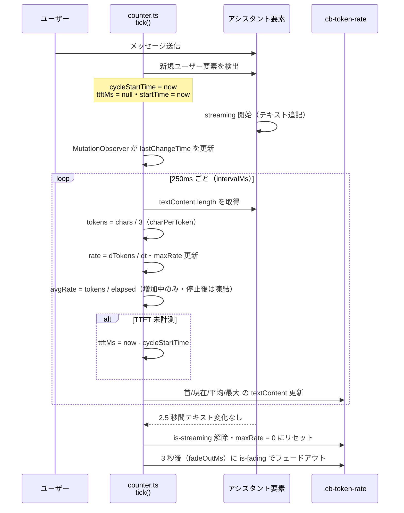
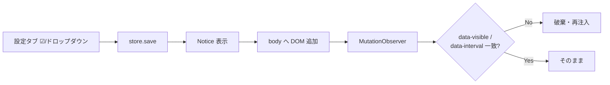

# トークン速度表示統合設計

> 📂 路径：80_POC_Projects/POC_017_ClaudianBridge/02_設計文書/24_トークン速度表示統合設計.md
> 📍 源碼：`D:\AI-Agent\ClaudianBridge\src\features\token-rate\counter.ts` / `src\features\token-rate\index.ts` / `src\features\token-rate\counter.css`
> 🏷️ バージョン：v1.0.0（原本 3 件統合 / 現行仕様 v0.41.0 時点）
> 🔗 関連：[[80_POC_Projects/POC_017_ClaudianBridge/08_説明書/03_リリースノート/リリースノート|リリースノート]]（F-027 トークン速度表示）

---

## 1. 概要

Claudian チャット利用時、LLM の応答生成速度（tok/s）は体感品質に直結する重要な指標である。本機能（F-027）は、realclaudian ホストのレスポンス DOM を MutationObserver で監視し、**入力画面に TTFT（首）・現在・平均・最大の 4 値をライブ表示**する。

本設計書は以下の原本 3 件（superpowers 生成）を統合し、CHANGELOG（v0.30.x〜v0.38.4）の修正履歴を反映した **SSOT 統合版** である。原本は `_superpowers原本/` に原本として保持される（二重管理しない・本書が現行仕様の正）。

| # | 原本設計 | 実装バージョン |
|:-:|------|:----:|
| 1 | トークン速度（tok/s）表示 設計書 | v0.30.0 |
| 2 | トークン速度表示 項目選択機能 + 最大 tok/s 不具合修正 設計書 | v0.31.0 |
| 3 | トークン速度表示 更新周期設定機能 設計書 | v0.32.0 |

---

## 2. 現行仕様（v0.41.0 時点）

### 2.1 4 値表示

`
` に以下のセグメントを `·` 区切りで描画する。

| セグメント | CSS クラス | 表示例 | 計算式 |
|------|------|------|------|
| 首（TTFT） | `.cb-token-rate-ttft` | `首 0.4s` | ユーザー送信（新規ユーザー要素検出）→ 最初のアシスタントコンテンツまでの ms |
| 現在 | `.cb-token-rate-value` | `12.3 tok/s` | `(tokens - lastTokens) / dt`（charPerToken = 3 で推定） |
| 平均 | `.cb-token-rate-avg` | `平均 10.1 tok/s` | `累積 tokens / 経過秒`（**新規コンテンツ増加中のみ更新・停止後は凍結**） |
| 最大 | `.cb-token-rate-max` | `最大 18.7 tok/s` | `rate > maxRate` のとき更新（**streaming 終了遷移 / stop() で 0 リセット**） |

末尾にパルスドット（`.cb-token-rate-dot`）を持ち、streaming 中は `is-streaming` クラスで点滅、停止から 3 秒（`fadeOutMs`）後に `is-fading` でフェードアウトする。

### 2.2 表示項目選択（v0.31.0）

| 設定キー（general） | 既定 | 対象 |
|------|:----:|------|
| `tokenRateEnabled` | `false` | 機能全体の ON/OFF（親トグル） |
| `tokenRateShowTtft` | `true` | 首（TTFT） |
| `tokenRateShowCurrent` | `true` | 現在 |
| `tokenRateShowAvg` | `true` | 平均 |
| `tokenRateShowMax` | `true` | 最大 |

- counter は **表示 ON のセグメントのみ** を描画し、選択状態を `data-visible="ttft,current,..."` 属性に反映
- 区切り `·` は表示セグメント間のみ挿入（全 OFF でも要素は存続・ドットのみ）
- 親トグル OFF 時は 4 項目とも `setDisabled` で視覚的無効化

### 2.3 更新周期（v0.32.0）

| 項目 | 値 |
|------|------|
| 設定キー | `general.tokenRateIntervalMs` |
| 選択方式 | ドロップダウン（プリセット 5 値） |
| 許可値 | **100 / 250 / 500 / 1000 / 2000 ms**（`ALLOWED_TOKEN_RATE_INTERVALS`） |
| 既定値 | **250 ms**（v0.31.0 の 500 ms から変更・旧設定は normalize で 250 補完、不正値も 250 にフォールバック） |
| 反映タイミング | 即時（`data-interval` 属性不一致を rescan が検知 → 破棄・再注入） |

### 2.4 表示位置（YOLO トグル左）

| 優先 | 注入位置 |
|:----:|------|
| 1 | `.claudian-permission-toggle`（YOLO/Safe トグル）の**直前**（トグルの左・`margin-left: auto` で右寄せ） |
| 2 | フォールバック: `.claudian-messages` の直後（トグルが見つからない環境） |

監視対象は `querySelectorAll('[data-role="assistant"], .claudian-message-assistant')` の**最後の要素**（`:last-of-type` は兄弟要素の位置依存で不安定なため不使用）。

### 2.5 クランプ（偽スパイク防止）

DOM 再構成・再注入時の偽レートスパイクを防ぐクランプ機構。

| # | 状況 | 挙動 |
|:-:|------|------|
| 1 | アシスタント要素消失（chars = null） | body 全文字数フォールバックは**廃止**。レート計算をスキップし `lastUpdateTime` のみ更新・アンカー解除 |
| 2 | 縮小窓（`dTokens < 0`） | ベースラインのみ引き直し（rate/maxRate 不更新） |
| 3 | 縮小窓の直後 1 窓（quarantine） | baseline-only で隔離し、復帰分の一括計上を防止 |
| 4 | 要素交代 / 初回アンカー確立 | baseline-only。同時に `state.startTime` を now に再設定（avgRate 分母の同期） |
| 5 | mid-stream 再注入 | `start()` 時点で既存コンテンツを `lastTokens` に同期し、初回 tick を `dTokensForAvg = 0` 扱いに |
| 6 | `elapsed = 0` の tick | `intervalMs / 1000` を経過時間の下限として採用（avgRate = 0 凍結回帰の防止） |
| 7 | streaming 終了遷移 / `stop()` | `maxRate = 0` にリセット（複数ストリーム跨ぎの累積防止） |
| 8 | コンテンツ増加停止後 | avgRate は**最終値で凍結**（elapsed だけ増えて 0 に shrink する現象の防止） |

### 2.6 streaming 中の token 計測フロー

### 2.7 設定反映フロー

### 2.8 クリック個別リセット（v0.38.4）

4 セグメントの数値は **マウスクリックで個別に 0 にリセット** できる（`.cb-token-rate-clickable`・cursor: pointer + hover underline）。

- `reset(key: 'ttft' | 'current' | 'avg' | 'max')` を factory return に追加
- `.cb-token-rate` に click イベント委譲リスナー 1 つで全セグメントをカバー（`stopPropagation` で chat 入力欄への伝播を防止）
- カウンタ自体は継続（`state.startTime` / `lastTokens` / streaming 状態は維持）し、次の新規コンテンツ増加時に通常ロジックで再計算

---

## 3. 🕘 改定履歴

| 原本設計 | 実装バージョン | 現在の状態 | 要点 |
|------|:----:|------|------|
| トークン速度（tok/s）表示 設計書 | v0.30.0 | ✅ 実装済 | DOM MutationObserver + インターバル計測方式（方式 A）を採用。`tokenRateEnabled`（既定 OFF）トグル・`.claudian-messages` 直後への注入・`charPerToken = 3` 推定 |
| （設計書なし・実機調整） | v0.30.1 | ✅ 実装済 | 表示位置を **YOLO トグルの左** に変更・TTFT を実測化（ユーザー送信起点）・`:last-of-type` 廃止・自己フィードバック修正・CSS をルート `styles.css` に集約・**3 値 → 4 値に拡張**・周期 250 → 500 ms |
| （設計書なし・機能強化） | v0.30.2 | ✅ 実装済 | トークン速度表示本体は変更なし（完了報告推奨検出強化のみ） |
| トークン速度表示 項目選択機能 + 最大 tok/s 不具合修正 設計書 | v0.31.0 | ✅ 実装済 | 4 項目 ☑ トグル（既定全 ON）・`data-visible` 属性 + rescan 再注入・最大 tok/s 偽スパイク修正（フォールバック廃止 / baseline-only / quarantine / アンカー解除） |
| トークン速度表示 更新周期設定機能 設計書 | v0.32.0 | ✅ 実装済 | `tokenRateIntervalMs` ドロップダウン（100/250/500/1000/2000 ms）・既定 250 ms・`data-interval` による即時反映 |
| （設計書なし・バグ修正） | v0.38.1 | ✅ 実装済 | **avgRate 分母の同期**：新規ユーザーサイクル開始時に `state.startTime` を now にリセット（長い沈黙 → ユーザー送信で「平均 0.0 tok/s」になる症状の防止） |
| （設計書なし・バグ修正） | v0.38.2 | ✅ 実装済 | **最大値リセット**：streaming 終了遷移（true → false）と `stop()` で `maxRate = 0`（同一カウンターが複数ストリームを跨いで最大値が累積する問題の防止） |
| （設計書なし・バグ修正） | v0.38.3 | ✅ 実装済 | **avgRate 凍結**：`dTokensForAvg > 0`（新規コンテンツ増加中）のみ avgRate を更新し、停止後は最終値で凍結。加えて `elapsed = 0` 時は `intervalMs` を下限に採用し、一括配信で avgRate = 0 のまま凍結される回帰を修正 |
| （設計書なし・機能追加） | v0.38.4 | ✅ 実装済 | **数値セグメントクリック個別リセット**：`reset(key)` メソッド + click イベント委譲（`cb-token-rate-clickable`）。カウンタは継続 |

---

## 4. 廃止・置換された仕様

| # | 廃止された仕様 | 置換後 | 発生バージョン |
|:-:|------|------|:----:|
| 1 | 更新周期 250 ms（v0.30.0 設計時の既定） → v0.30.1 で 500 ms に変更 | **既定 250 ms に戻し、ドロップダウン選択化**（100〜2000 ms・`tokenRateIntervalMs`） | v0.32.0 |
| 2 | 表示位置「入力画面下部（`.claudian-messages` 直後）」 | **YOLO トグル（`.claudian-permission-toggle`）の直前**（messages 直後はフォールバックに降格） | v0.30.1 |
| 3 | 監視セレクタ `:last-of-type` | `querySelectorAll().at(-1)`（兄弟要素の位置依存を解消） | v0.30.1 |
| 4 | 3 値表示（現在/平均/最大） | **4 値表示（首 TTFT 追加・実測化）** | v0.30.1 |
| 5 | `counter.css` 独立ファイル読み込み | ルート `styles.css` に集約（未ロードバグ解消。`counter.css` ファイル自体は `cb-token-rate-clickable` 追加のため維持） | v0.30.1 |
| 6 | アシスタント要素消失時の body 全文字数フォールバック | **廃止**（レート計算スキップ + null 返却） | v0.31.0 |
| 7 | 最大値のセッション中維持（v0.31.0 設計時のスコープ外判断） | **streaming 終了遷移 / `stop()` で 0 リセット** | v0.38.2 |
| 8 | 平均値の常時更新（elapsed で shrink） | **コンテンツ増加中のみ更新・停止後は最終値で凍結** | v0.38.3 |
| 9 | 数値のリセット手段なし | **セグメントクリックで個別リセット** | v0.38.4 |

---

## 5. 原本リンク

| # | 原本設計書 | 実装バージョン |
|:-:|------|:----:|
| 1 | [[80_POC_Projects/POC_017_ClaudianBridge/02_設計文書/_superpowers原本/2026-08-30-token-rate-display-design|2026-08-30-token-rate-display-design]] | v0.30.0 |
| 2 | [[80_POC_Projects/POC_017_ClaudianBridge/02_設計文書/_superpowers原本/2026-09-01-token-rate-display-select-design|2026-09-01-token-rate-display-select-design]] | v0.31.0 |
| 3 | [[80_POC_Projects/POC_017_ClaudianBridge/02_設計文書/_superpowers原本/2026-09-01-token-rate-interval-setting-design|2026-09-01-token-rate-interval-setting-design]] | v0.32.0 |

> 📍 CHANGELOG 由来のバグ修正（v0.38.1〜v0.38.4）は設計書原本を持たない（実装 + リリースノート由来）。詳細は `D:\AI-Agent\ClaudianBridge\CHANGELOG.md` および [[80_POC_Projects/POC_017_ClaudianBridge/08_説明書/03_リリースノート/リリースノート|リリースノート]] を参照。

---

## 📝 更新記録

| バージョン | 日付 | 変更内容 | 変更者 |
|-----------|:----:|---------|:------:|
| v1.0.0 | 2026-09-13 11:30 | 初版作成（原本 3 件統合） | MiuMiu 🐾 |
