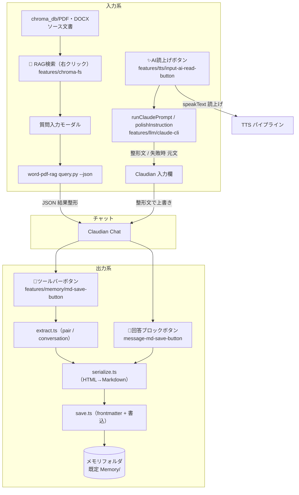

# 入出力補助統合設計

> 📂 路径：`80_POC_Projects/POC_017_ClaudianBridge/02_設計文書/26_入出力補助統合設計.md`
> 📍 ソース：`D:\AI-Agent\ClaudianBridge\src\features\chroma-fs\` / `src\features\memory\` / `src\features\llm\` / `src\features\tts\`
> 🐕 担当：MiuMiu 🐾
> 🔗 関連：[[README]] / [[../01_要件定義/01_機能要件]] / [[F-番号マスター]]

---

## 1. 概要

本書は、ClaudianBridge の「入出力補助」系機能 4 件の原本設計書を統合した As-Built 設計書である。

| # | 対象機能 | 概要 | 原本設計 |
|:-:|------|------|------|
| 1 | ChromaFs 仮想フォルダ | `chroma_db/` の DB 内部非表示 + 右クリック RAG 検索 → Claudian チャット挿入 | [[2026-08-16-chroma-fs-virtual-folder-design]] |
| 2 | Input への AI 読上げ追加 | 入力欄の文章を LLM で意図解釈整形 → 上書き → TTS 読上げ（✨ボタン） | [[2026-08-16-input-ai-read-button-design]] |
| 3 | MD 保存ボタン | チャット結果（pair / conversation / block）をメモリフォルダへ MD 保存（📝ボタン） | [[2026-08-16-md-save-button-design]] |
| 4 | v0.27.1 ドキュメント統合 | ソース CHANGELOG SSOT 化・F-番号マスター・タグ戦略など文書陳腐化 19 ver 分の再発防止 | [[2026-08-29-poc017-doc-integration-v0271-design]] |

---

## 2. 現行仕様（v0.41.0 時点）

### 2.1 全体の入出力フロー

チャットで生成した内容が MD 保存（features/memory）で Vault へ出力され、chroma-fs の RAG 検索結果がチャットへ入力される循環構造。AI 読上げ（features/llm + tts）は入力欄を起点とする入力補助として動作する。

<div style="max-width:1000px">



</div>

### 2.2 ChromaFs 仮想フォルダ（`src/features/chroma-fs/`）

| ファイル | 責務 |
|------|------|
| `hide-internal.ts` | `chroma_db` 直下のハッシュフォルダ・`chroma.sqlite3` 等を CSS で非表示（`PDF/`・`DOCX/` 以外のサブフォルダと直下ファイルを対象） |
| `rag-menu.ts` | `chroma_db/PDF・DOCX` 配下の pdf / docx へ右クリック「🔎 RAG検索」を登録 |
| `question-modal.ts` | 質問入力モーダル |
| `rag-query.ts` | `query.py --json` を spawn・結果を整形して Claudian チャットへ挿入（タイムアウト 120 秒） |

設定（`chroma` セクション・`src/core/settings.ts` で現行確認済み）:

| フィールド | 型 | 既定 |
|------|------|------|
| `hideInternal` | `boolean` | `true` |
| `ragEnabled` | `boolean` | `false` |
| `ragScriptPath` | `string` | `''` |
| `ragConfigPath` | `string` | `''` |

- 非表示は CSS 注入方式（「Excluded files」は検索インデックスから除外されるため不使用）
- ハッシュフォルダは「PDF/DOCX 以外」で判定（UUID 変化に追従）

### 2.3 Input AI 読上げ（`features/llm/` + `features/tts/input-ai-read-button.ts`）

- ✨ボタンを `.claudian-input-toolbar` 右端へ注入（`margin-inline-start: auto`・`data-cb-input-ai` マーカー）
- `polishInstruction()`（`claude-cli.ts`）が `claude -p` で入力文を指令文に整形（タイムアウト 30 秒・同一言語維持）
- 成功時: 入力欄を整形文で上書き + 元文を Notice 表示 → `speakText('inputAi', 整形文)` で読上げ
- 失敗時（CLI 不在・タイムアウト・空応答）: 元文を保持したまま元文を読上げ + ⚠️ Notice
- 設定: `tts.inputAi.enabled`（既定 `true`）
- v0.39.0/v0.40.0（F-039/F-040）以降、`features/llm/` は `LlmClient` 抽象化 + `dispatch.ts` により Claude / DeepSeek / Zhipu / MiniMax / Kimi の 5 プロバイダ対応に拡張済み（`claude-cli.ts` は `createClaudeClient` も提供）

### 2.4 MD 保存ボタン（`src/features/memory/`）

| ファイル | 責務 |
|------|------|
| `md-save-button.ts` | ツールバー 📝 注入・クリックフロー |
| `message-md-save-button.ts` | 回答ブロック右下 📝 注入（当該ブロックのみ保存・`inset-inline-end:44px`） |
| `extract.ts` | `.claudian-messages` から scope 別にメッセージ抽出（純関数） |
| `serialize.ts` | 内製 HTML→Markdown 変換器（見出し・テーブル・コードフェンス・callout・リスト・インライン装飾） |
| `save.ts` | パス解決・ファイル名生成・frontmatter 組立・`mkdir + writeFile` |
| `constants.ts` | 既定値等の定数（実装時に追加） |

設定（`memory` セクション・`normalizeMemorySettings` 実装確認済み）:

```typescript
interface MemorySettings {
  enabled: boolean;      // 既定 true
  scope: 'pair' | 'conversation';   // 既定 'pair'（ブロックボタンは常に block）
  folder: string;        // 既定 'Memory/'（相対 = Vault 内 / 絶対 = そのまま）
}
```

- ファイル名: `YYYY-MM-DD-HHMM_<先頭見出し>.md`（サニタイズ・見出し無しは `claudian-chat`・衝突時は秒/連番）
- frontmatter: `title / type: claudian-chat / scope / created / source: Claudian Chat`
- vaultRoot は `app.vault.adapter.getBasePath()` で解決（`__dirname` 不使用）
- 保存先を設定画面（Memory タブ）で変更可能

### 2.5 v0.27.1 ドキュメント統合（文書運用）

- **SSOT**: ソース `CHANGELOG.md` を正本とし、POC_017 側 CHANGELOG は派生（`sync-changelog.mjs` 想定）
- **F-番号マスター**: `02_設計文書/F-番号マスター.md` に一元化・feat コミットに `feat(F-xxx)` 必須
- **タグ付け完了条件**: git tag なし = リリース未完了
- v0.41.0 ではこの流れを強化する `scripts/check-changelog.mjs`（`npm run check:changelog`）+ 「📜 改定履歴」設定タブ（CHANGELOG.md を SSOT として全バージョン表示）が実装済み
- テスト実績: v0.41.0 時点で **1267 PASS / 1 skipped / typecheck 0**

---

## 3. 🕘 改定履歴

| 原本設計 | 実装バージョン | 現在の状態 | 要点 |
|------|------|------|------|
| [[2026-08-16-chroma-fs-virtual-folder-design\|chroma-fs 仮想フォルダ表示]] | v0.18.0 → **v0.19.0** | 🟢 実装済み・現行仕様に取込 | `features/chroma-fs/` 4 ファイル（hide-internal / rag-menu / question-modal / rag-query）。word-pdf-rag に `--json` 出力モード追加、chroma_db 実体化 + PDF/DOCX 移行をセットで実施 |
| [[2026-08-16-input-ai-read-button-design\|AI読み上げボタン]] | v0.19 系（F013 旧番号） | 🟢 実装済み・その後拡張 | `features/llm/claude-cli.ts` + `features/tts/input-ai-read-button.ts`。その後 `features/llm/` は v0.39.0/v0.40.0（F-039/F-040）で LlmClient 抽象化・5 プロバイダ対応に発展。`speakText('inputAi')` 経由に変更済み |
| [[2026-08-16-md-save-button-design\|MD保存ボタン]] | v0.19 系（F014 旧番号） | 🟢 実装済み・現行仕様に取込 | `features/memory/` 6 ファイル（実装で `constants.ts` 追加）。Memory 設定タブ・pair/conversation/block の 3 スコープ・内製 HTML→Markdown 変換器 |
| [[2026-08-29-poc017-doc-integration-v0271-design\|POC_017 文書 v0.27.1 統合更新]] | v0.27.1（文書運用） | 🟢 運用中・v0.41.0 で強化 | CHANGELOG SSOT 化・F-番号マスター・git tag 戦略・再発防止 4 柱。v0.41.0 の check-changelog.mjs ゲート + 改定履歴タブで自動化が進展 |

---

## 4. 廃止・置換された仕様

| 廃止・置換された仕様 | 廃止時期 | 現在の方式 |
|------|------|------|
| AI 読上げの意図解釈を `claude -p`（Claude CLI 単一バックエンド）で行う方式 | v0.39.0（F-039/F-040） | `features/llm/` を LlmClient 抽象化 + `dispatch.ts` で 5 プロバイダ（Claude / DeepSeek / Zhipu / MiniMax / Kimi）対応に置換。`claude-cli.ts` は Claude プロバイダ実装として存続 |
| AI 読上げの直接 `addTextToTTS()` 呼び出し | v0.19 系実装時 | `speakText('inputAi', ...)` 経由（TTS プロファイル・PlaybackController 統合後の統一 API）に置換 |
| POC_017 文書の手動同期（人手コピー）運用 | v0.27.1 | ソース CHANGELOG.md SSOT + sync スクリプト + check-changelog.mjs リリースゲートに置換 |
| README / 機能要件への F-番号直接記載（F022 までで停止） | v0.27.1 | F-番号マスター SSOT 参照方式に置換（F-013〜F-040 以降はマスターで一元管理） |
| `features/chroma/`（Database Browser）の改修による chroma_db 表示対応 | v0.19.0 設計時点で非対象確定 | 別フィーチャー `features/chroma-fs/` を新設する方式に分離（chroma は現行も併存） |

---

## 5. 原本リンク

| # | 原本設計書 | パス |
|:-:|------|------|
| 1 | [[2026-08-16-chroma-fs-virtual-folder-design\|chroma-fs 仮想フォルダ表示 設計書]] | `_superpowers原本/2026-08-16-chroma-fs-virtual-folder-design.md` |
| 2 | [[2026-08-16-input-ai-read-button-design\|AI読み上げボタン設計]] | `_superpowers原本/2026-08-16-input-ai-read-button-design.md` |
| 3 | [[2026-08-16-md-save-button-design\|MD保存ボタン設計]] | `_superpowers原本/2026-08-16-md-save-button-design.md` |
| 4 | [[2026-08-29-poc017-doc-integration-v0271-design\|POC_017 文書 v0.27.1 統合更新設計書]] | `_superpowers原本/2026-08-29-poc017-doc-integration-v0271-design.md` |

---

## 📝 更新記録

| バージョン | 日付 | 変更内容 | 変更者 |
|------|------|------|------|
| v1.0.0 | 2026-09-13 11:30 | 初版作成（原本 4 件統合） | MiuMiu 🐾 |

---

*📐 入出力補助統合設計 v1.0.0 · MiuMiu 🐾 · 2026-09-13*
