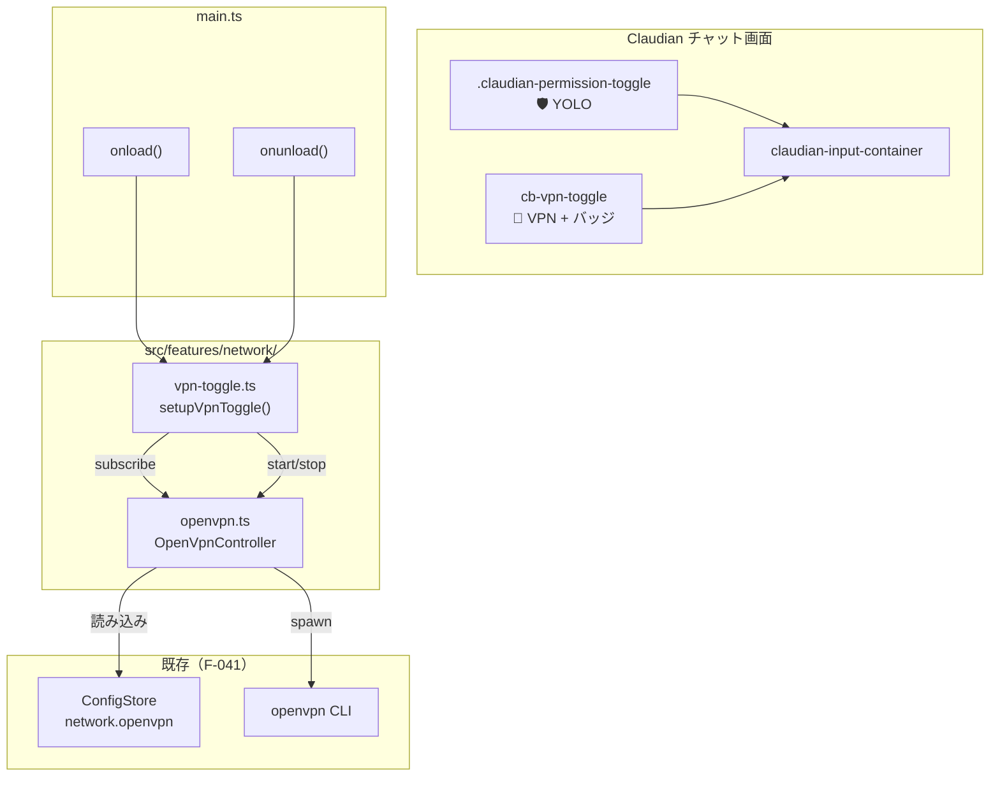

# Claudian 画面 OpenVPN 制御トグル 設計仕様書

> 📂 パス：80_POC_Projects/POC_017_ClaudianBridge/02_設計文書/28_Claudian画面VPNトグル設計.md
> 📍 源码：D:\AI-Agent\ClaudianBridge\src\features\network\vpn-toggle.ts
> 🏷️ バージョン：v1.0（2026-09-13 設計・承認待ち → 移動済）
> 🔗 機能番号：F-043（Claudian 画面 VPN トグル）
> 🔗 関連：F-041（OpenVPN 接続）/ F-042（ネットワークタブ）

---

## 1. 背景・目的

F-041（OpenVPN 接続）+ F-042（ネットワークタブ）で OpenVPN 機能の実装が確定したが、現状では **ネットワークタブを開いて手動で 🔌 接続ボタンを押す**以外に VPN 接続を開始する手段がない。

Claudian チャット利用中に「いますぐ VPN を立ち上げたい」「現在の接続状態を一目で確認したい」というニーズに対し、**YOLO トグル隣にワンショットボタン + 状態バッジ**を追加する。

| # | 現状課題 |
|:-:|----------|
| A | VPN 接続の開始 / 停止のたびに設定タブを開く必要がある |
| B | 接続状態がバックグラウンドで変化しても UI に反映されない |
| C | トークン速度表示（YOLO の隣に並ぶ UI）と同じ「即時可視性」が VPN にも欲しい |
| D | 設定未完了時に何が起きるかが予測しづらい |

本設計で次を実現する：

| # | 項目 |
|:-:|------|
| A | YOLO トグル隣に `[🔌 VPN]` ボタンを配置（ワンクリックで start / stop） |
| B | OpenVpnController.subscribe() で状態変化をリアルタイム反映 |
| C | 状態バッジ（🔴 / 🟡 pulse / 🟢 / 🔴 エラー）で色分け可視化 |
| D | 設定未完了時はクリックで Notice + 設定タブ自動遷移 |

---

## 2. 要件（決定済み）

| # | 要件 | 決定 |
|:-:|------|------|
| R1 | スコープ | **F-041 の `OpenVpnController` を購読する純 UI 追加のみ** |
| R2 | 配置 | **YOLO トグル（`.claudian-permission-toggle`）の左に配置** |
| R3 | クリック挙動 | **ワンショットボタン**（status に応じて start / stop を即実行） |
| R4 | 状態可視化 | **状態バッジ + pulse アニメ**（接続中のみ） |
| R5 | 未設定時 | **disabled 表示 + クリックで Notice + 設定タブ自動遷移** |
| R6 | 対象プラットフォーム | **デスクトップのみ**（F-041 R7 に準拠） |
| R7 | 段階リリース | **v0.43.1**（または v0.44.0）で F-041/F-042 と分離リリース |
| R8 | 後方互換 | 既存 `OpenVpnController` API に変更なし、購読のみ |
| R9 | ダークモード対応 | **`theme-dark` メディアクエリで背景色を切替** |
| R10 | 多重起動防止 | **`connecting` 中は `button.disabled = true`** |

---

## 3. アーキテクチャ

### 3.1 全体構成図



### 3.2 ファイル変更計画

| 種別 | パス | 内容 |
|------|------|------|
| 🆕 新規 | `src/features/network/vpn-toggle.ts` | トグル UI コンポーネント + 注入ロジック |
| 🆕 新規 | `src/features/network/vpn-toggle.css` | スタイル（既存 CSS に import） |
| 🆕 新規 | `tests/features/network/vpn-toggle.test.ts` | ユニットテスト |
| ✏️ 変更 | `src/main.ts` | `setupVpnToggle()` 呼び出し追加 |
| ✏️ 変更 | `src/core/i18n.ts` | i18n キー追加（vpnToggle 系 8 個） |

---

## 4. UI レイアウト

### 4.1 画面上の配置

```
[claudian-input-container]
  ├─ .claudian-messages (メッセージ履歴)
  └─ 入力エリア
       ├─ [🔌 VPN]   ← 新規 (cb-vpn-toggle) ← ★ YOLO の左に配置
       ├─ [🛡️ YOLO] ← 既存 (.claudian-permission-toggle)
       └─ [📨 Send]
```

### 4.2 トグル構造

```html
<div class="cb-vpn-toggle">
  <button class="cb-vpn-toggle__button" data-status="disconnected">
    <span class="cb-vpn-toggle__icon">🔌</span>
    <span class="cb-vpn-toggle__label">VPN</span>
  </button>
  <span class="cb-vpn-badge cb-vpn-badge--disconnected" title="切断中">
    🔴
  </span>
</div>
```

### 4.3 状態による DOM 変化

| status | ボタン label | バッジ色 | バッジ text | アニメ |
|--------|------------|---------|-----------|-------|
| `disconnected` | `VPN` | `--cb-vpn-badge--disconnected`（グレー `#adb5bd`） | `🔴` | なし |
| `connecting` | `接続中...` | `--cb-vpn-badge--connecting`（オレンジ `#f08c00`） | `🟡` | **pulse（1.5s 周期）** |
| `connected` | `接続済` | `--cb-vpn-badge--connected`（緑 `#2f9e44`） | `🟢` | なし |
| `error` | `エラー` | `--cb-vpn-badge--error`（赤 `#c92a2a`） | `🔴` | なし |

### 4.4 クリックハンドラ

| 現在の status | クリック時 |
|--------------|----------|
| `disconnected` | `controller.start(settings)` 呼び出し |
| `connecting` | 何もしない（二重起動防止、`disabled` クラス付与） |
| `connected` | `controller.stop()` 呼び出し（確認ダイアログなし、即切断） |
| `error` | `controller.start(settings)` で再試行 |

### 4.5 未設定時の挙動

`enabled=false` または `configPath=''` のとき、トグルは **disabled 表示**。クリック時：

```typescript
new Notice(s.vpnToggleNotConfigured);
app.setting?.open();
app.setting?.openTabById?.('claudian-bridge');
```

---

## 5. スタイル詳細（vpn-toggle.css）

```css
/* === v0.43.x (F-043): Claudian 画面 OpenVPN トグル === */

.cb-vpn-toggle {
  display: inline-flex;
  align-items: center;
  gap: 6px;
  margin-right: 8px;
}

.cb-vpn-toggle__button {
  display: inline-flex;
  align-items: center;
  gap: 4px;
  padding: 4px 10px;
  border-radius: 6px;
  border: 1px solid var(--background-modifier-border);
  background: var(--background-primary);
  cursor: pointer;
  font-size: 13px;
  transition: background 0.15s, border-color 0.15s;
}

.cb-vpn-toggle__button:hover:not(:disabled) {
  background: var(--background-modifier-hover);
  border-color: var(--interactive-accent);
}

.cb-vpn-toggle__button:disabled {
  opacity: 0.5;
  cursor: not-allowed;
}

.cb-vpn-toggle__icon { font-size: 14px; }
.cb-vpn-toggle__label { font-weight: 500; }

.cb-vpn-badge {
  display: inline-flex;
  align-items: center;
  justify-content: center;
  width: 20px;
  height: 20px;
  border-radius: 50%;
  font-size: 11px;
  line-height: 1;
}

.cb-vpn-badge--disconnected { background: #adb5bd; color: #fff; }
.cb-vpn-badge--connecting   { background: #f08c00; color: #fff; animation: cb-vpn-pulse 1.5s ease-in-out infinite; }
.cb-vpn-badge--connected    { background: #2f9e44; color: #fff; }
.cb-vpn-badge--error        { background: #c92a2a; color: #fff; }

@keyframes cb-vpn-pulse {
  0%, 100% { transform: scale(1);   opacity: 1; }
  50%      { transform: scale(1.2); opacity: 0.7; }
}

.theme-dark .cb-vpn-badge--disconnected { background: #495057; }
```

---

## 6. コンポーネント API

### 6.1 公開関数

```typescript
export function setupVpnToggle(app: App, store: ConfigStore): () => void;
```

### 6.2 実装スケッチ（vpn-toggle.ts）

```typescript
import type { App } from 'obsidian';
import { Notice } from 'obsidian';
import type { ConfigStore } from '../../core/config-store';
import { getOpenVpnController } from './openvpn';
import type { OpenVpnStatus } from './types';
import { getLocaleStrings, getUILanguage } from '../../core/i18n';

const CONTAINER_SELECTOR = '.claudian-input-container';
const YOLO_TOGGLE_SELECTOR = '.claudian-permission-toggle';

export function setupVpnToggle(app: App, store: ConfigStore): () => void {
  const handles = new Map<Element, VpnToggleHandle>();

  const injectInto = (container: Element): void => {
    if (handles.has(container)) return;
    const yolo = container.querySelector(YOLO_TOGGLE_SELECTOR);
    if (!yolo || !yolo.parentElement) return;
    const handle = createVpnToggle(app, store, yolo.parentElement, yolo);
    handles.set(container, handle);
  };

  const injectAll = (): void => {
    document.querySelectorAll(CONTAINER_SELECTOR).forEach(injectInto);
  };

  const removeAll = (): void => {
    handles.forEach((h) => h.destroy());
    handles.clear();
  };

  const rescan = (): void => {
    handles.forEach((handle, el) => {
      if (!document.contains(el)) {
        handle.destroy();
        handles.delete(el);
      }
    });
    injectAll();
  };

  injectAll();

  const observer = new MutationObserver(() => rescan());
  observer.observe(document.body, {
    childList: true,
    subtree: true,
    attributes: true,
    attributeFilter: ['class'],
  });

  return () => {
    observer.disconnect();
    removeAll();
  };
}

interface VpnToggleHandle { destroy: () => void; }

function createVpnToggle(
  app: App, store: ConfigStore, parent: HTMLElement, insertBefore: Element,
): VpnToggleHandle {
  const controller = getOpenVpnController();
  const s = getLocaleStrings(getUILanguage());

  const wrapper = document.createElement('div');
  wrapper.className = 'cb-vpn-toggle';

  const button = document.createElement('button');
  button.className = 'cb-vpn-toggle__button';
  button.setAttribute('data-status', 'disconnected');

  const icon = document.createElement('span');
  icon.className = 'cb-vpn-toggle__icon';
  icon.textContent = '🔌';

  const label = document.createElement('span');
  label.className = 'cb-vpn-toggle__label';
  label.textContent = s.vpnToggleLabel;

  button.append(icon, label);

  const badge = document.createElement('span');
  badge.className = 'cb-vpn-badge cb-vpn-badge--disconnected';
  badge.title = s.vpnToggleTitleDisconnected;
  badge.textContent = '🔴';

  wrapper.append(button, badge);
  parent.insertBefore(wrapper, insertBefore);

  const applyStatus = (status: OpenVpnStatus): void => {
    button.setAttribute('data-status', status);
    badge.className = `cb-vpn-badge cb-vpn-badge--${status}`;
    badge.textContent = status === 'connected' ? '🟢' : status === 'connecting' ? '🟡' : '🔴';
    label.textContent = status === 'connecting' ? s.vpnToggleConnecting
                      : status === 'connected' ? s.vpnToggleConnected
                      : status === 'error' ? s.vpnToggleError
                      : s.vpnToggleLabel;
    button.disabled = status === 'connecting';
    button.title = status === 'connected' ? s.vpnToggleTitleConnected : s.vpnToggleTitleDisconnected;
  };

  const checkEnabledAndUpdate = (): boolean => {
    const cfg = store.load();
    const enabled = cfg.network.openvpn.enabled && cfg.network.openvpn.configPath !== '';
    button.disabled = !enabled;
    if (!enabled) button.title = s.vpnToggleTitleNotConfigured;
    return enabled;
  };

  const onClick = async (): Promise<void> => {
    if (!checkEnabledAndUpdate()) {
      new Notice(s.vpnToggleNotConfigured);
      // @ts-expect-error: setting API access
      app.setting?.open();
      // @ts-expect-error: setting API access
      app.setting?.openTabById?.('claudian-bridge');
      return;
    }
    const status = controller.getStatus();
    const cfg = store.load();
    try {
      if (status === 'connected') {
        await controller.stop();
      } else if (status === 'disconnected' || status === 'error') {
        await controller.start(cfg.network.openvpn);
      }
    } catch (e) {
      new Notice(`⚠️ OpenVPN 操作に失敗: ${(e as Error).message}`);
    }
  };

  button.addEventListener('click', onClick);
  checkEnabledAndUpdate();
  applyStatus(controller.getStatus());
  const unsubscribe = controller.subscribe((status) => applyStatus(status));

  return {
    destroy: () => {
      unsubscribe();
      button.removeEventListener('click', onClick);
      wrapper.remove();
    },
  };
}
```

### 6.3 i18n キー追加

| キー | ja | en | zh-CN |
|------|----|----|-------|
| `vpnToggleLabel` | `VPN` | `VPN` | `VPN` |
| `vpnToggleConnecting` | `接続中...` | `Connecting...` | `连接中...` |
| `vpnToggleConnected` | `接続済` | `Connected` | `已连接` |
| `vpnToggleError` | `エラー` | `Error` | `错误` |
| `vpnToggleNotConfigured` | `⚠️ OpenVPN 設定が未完了です。設定タブで有効化してください。` | `⚠️ OpenVPN not configured. Please enable it in Settings.` | `⚠️ OpenVPN 未配置。请在设置中启用。` |
| `vpnToggleTitleDisconnected` | `クリックで VPN 接続` | `Click to connect VPN` | `点击连接 VPN` |
| `vpnToggleTitleConnected` | `クリックで VPN 切断` | `Click to disconnect VPN` | `点击断开 VPN` |
| `vpnToggleTitleNotConfigured` | `設定が必要です` | `Configuration required` | `需要配置` |

---

## 7. テスト戦略

### 7.1 テストレイヤー

| レイヤー | 対象 | 手法 | 新規ファイル |
|---------|------|------|------------|
| ユニット | `vpn-toggle.ts` 状態反映・クリックハンドラ | vitest + jsdom | `tests/features/network/vpn-toggle.test.ts` |

### 7.2 ユニットテストケース

```typescript
describe('vpn-toggle', () => {
  // ── DOM 注入 ──
  it('renders toggle next to YOLO toggle in container')
  it('does not duplicate toggle if already injected')
  it('removes toggle on destroy()')

  // ── 状態反映 ──
  it('initial status is disconnected with gray badge')
  it('subscribe callback updates DOM when status changes to connecting')
  it('subscribe callback updates DOM when status changes to connected')
  it('subscribe callback updates DOM when status changes to error')
  it('pulse animation class is applied only on connecting state')
  it('button is disabled when status is connecting')

  // ── クリックハンドラ ──
  it('click while disconnected calls controller.start')
  it('click while connected calls controller.stop')
  it('click while error calls controller.start (retry)')
  it('click while connecting is no-op (button disabled)')

  // ── 未設定時 ──
  it('button is disabled when enabled=false')
  it('button is disabled when configPath is empty')
  it('click while not configured shows Notice and opens settings tab')
  it('tooltip title updates when not configured')

  // ── main.ts 統合 ──
  it('setupVpnToggle is called from main.ts onload')
  it('setupVpnToggle cleanup runs on plugin unload')

  // ── MutationObserver ──
  it('injects toggle when new claudian-input-container is appended')
  it('removes toggle when container is removed from DOM')
});
```

### 7.3 目標テスト数

| 既存 | F-041/F-042 追加 | F-043 追加 | 合計 |
|------|------------|---------|------|
| 1300〜1320 | +50〜70 | +16〜20 | 1366〜1410 |

### 7.4 手動 UAT チェックリスト

- [ ] Claudian チャット画面を開くと YOLO トグル横に `[🔌 VPN]` トグルが表示される
- [ ] 未設定時にクリック → Notice 表示 + 設定タブのネットワークタブへ自動遷移
- [ ] 設定タブで OpenVPN 有効化 → トグルが enabled 表示に変わる
- [ ] 接続ボタンクリック → バッジがオレンジに変わり pulse アニメ開始
- [ ] 接続完了 → バッジが緑に変わる（`🟢`）
- [ ] 切断ボタンクリック → バッジがグレーに戻る（`🔴`）
- [ ] エラー発生時 → バッジが赤、`エラー` ラベル表示
- [ ] YOLO トグルをクリックしても VPN トグルは影響を受けない
- [ ] 複数の Claudian タブを開いてもトグルが重複しない
- [ ] ダークモードでバッジ色が暗背景でも視認できる

---

## 8. 既存設計への影響

### 8.1 F-041/F-042 との関係

| 項目 | F-041 | F-042 | F-043 |
|------|------|------|------|
| 機能 | openvpn CLI spawn/管理 | 設定タブ UI | Claudian 画面 UI 制御 |
| 配置 | `src/features/network/` | `src/settings/` | `src/features/network/` |
| 公開 API | `OpenVpnController` | `renderNetworkTab` | `setupVpnToggle` |
| 連携 | `ensureVpnConnected()` | 設定保存 | `subscribe()` で状態購読 |

**重要**: F-043 は **F-041 の `OpenVpnController` を購読するだけ**で、Core API には影響なし。

### 8.2 既存設計書 §11 への追記

```markdown
| 6 | Claudian 画面 VPN 制御トグル | F-043 で実装。YOLO トグル隣に状態バッジ付きボタン |
| 7 | GijiObsidian MyWhisper からの VPN 利用 | OS 共有トンネルなので手動接続で利用可能 |
```

### 8.3 段階リリース計画

| バージョン | 内容 |
|----------|------|
| v0.43.0 | F-041（OpenVPN）+ F-042（ネットワークタブ） |
| **v0.43.1**（または v0.44.0） | **F-043（VPN トグル）追加** |

**理由**: F-043 は F-041/F-042 の上に成り立つ純粋な UI 追加。コア機能の安定後にリリースすることで、テスト・ロールバックの粒度が細かくなる。

### 8.4 CHANGELOG エントリ（F-043 用）

```markdown
## [v0.43.1] - 2026-09-xx

### ✨ 新機能

- 🔌 **Claudian 画面 OpenVPN トグル**（F-043）: YOLO トグル横に VPN 接続制御ボタンを追加
  - ワンショット方式（クリックで start / stop 即実行）
  - 状態バッジ（🔴 切断 / 🟡 接続中 pulse / 🟢 接続済 / 🔴 エラー）
  - 設定未完了時はクリックで設定タブへ誘導
```

### 8.5 ドキュメント更新

| 種別 | パス | 内容 |
|------|------|------|
| 機能要件 | `80_POC_Projects/POC_017_ClaudianBridge/01_要件定義/02_機能要件/F-043_Claudian画面VPNトグル.md` | 新規 |
| 設計書 | `80_POC_Projects/POC_017_ClaudianBridge/02_設計文書/28_Claudian画面VPNトグル設計.md` | 本スペックをベース |
| 実装計画 | `80_POC_Projects/POC_017_ClaudianBridge/03_開発文書/25_Claudian画面VPNトグル実装計画.md` | writing-plans で作成 |

---

## 9. オープン項目・将来課題

| # | 項目 | 対応 |
|:-:|------|------|
| 1 | 接続状態のトースト通知 | VPN 状態変化時に一時通知（YOLO トグル OFF 時の挙動と整合） |
| 2 | アイコンセット切替 | 現状は 🔌 / 🔴 / 🟡 / 🟢 の絵文字、SVG アイコン化も検討 |
| 3 | 複数 Claudian タブでの状態同期 | 現状は各コンテナに独立注入で OK。将来的に zustand 等の状態管理に切替検討 |

---

*📐 Claudian 画面 OpenVPN 制御トグル 設計仕様書 v1.0 · MiuMiu 🐾 · 2026-09-13*
*🔗 機能番号 F-043 · 関連: F-041 / F-042 · R10 OpenVPN 調査*
