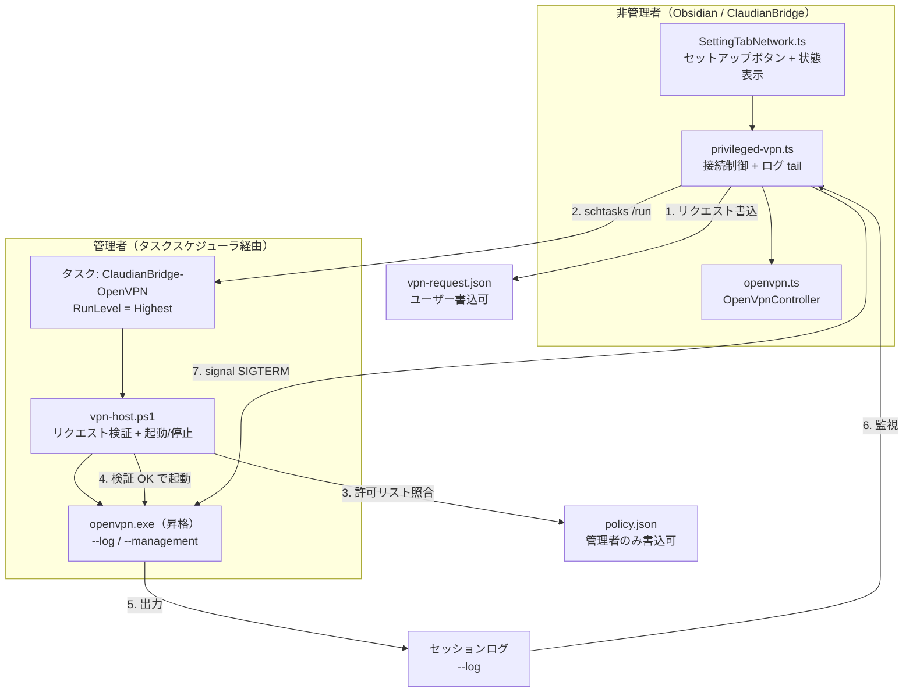
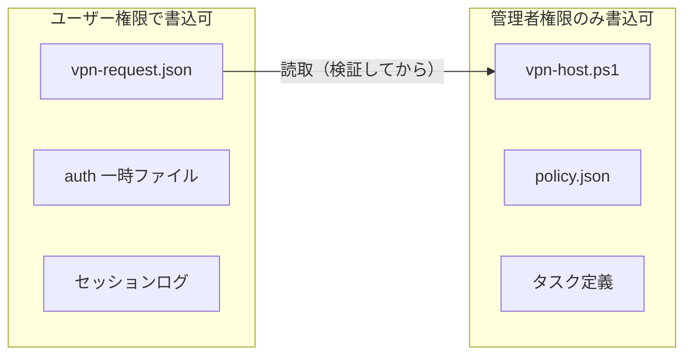
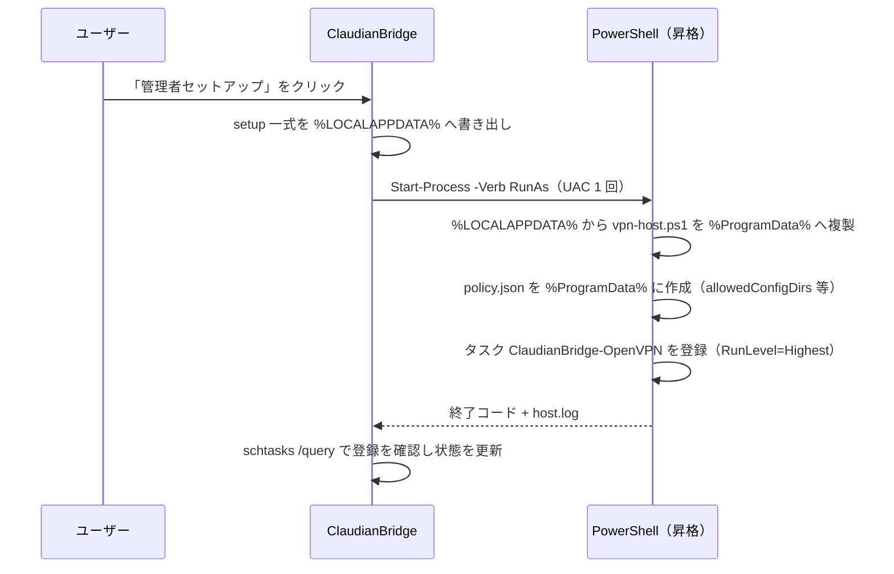
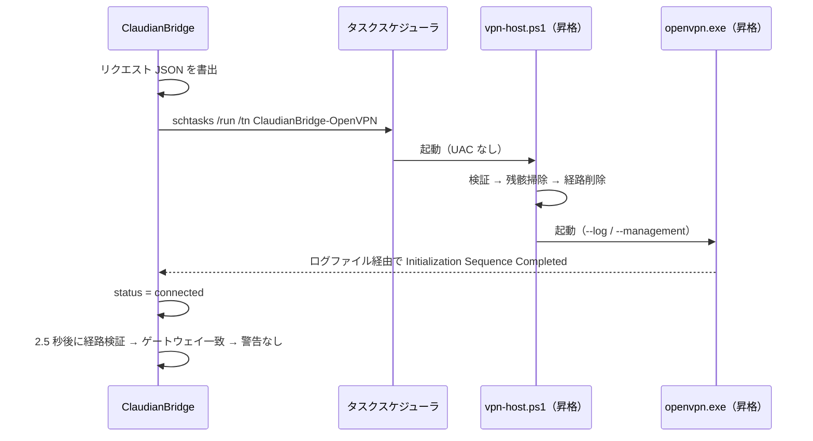
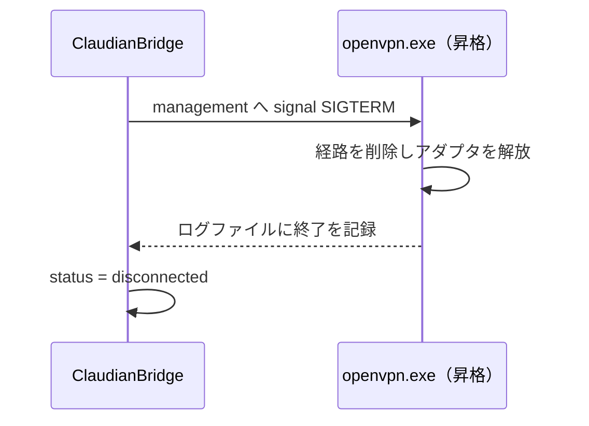

# 管理者権限分離による OpenVPN 経路確立 設計仕様書

> 📂 パス：80_POC_Projects/POC_017_ClaudianBridge/02_設計文書/29_管理者権限分離によるOpenVPN経路確立設計.md
> 📍 源码：D:\AI-Agent\ClaudianBridge\src\features\network\privileged-vpn.ts（新規）
> 🏷️ バージョン：v1.0（2026-09-13 設計・承認済）
> 🔗 機能番号：F-045（管理者権限分離による OpenVPN 経路確立）
> 🔗 関連：F-041（OpenVPN 接続）/ F-044（サーバ上書き）/ v0.44.1（経路未確立の検知）/ v0.45.0（残骸経路の検知）

---

## 1. 背景・目的

### 1.1 事象

ClaudianBridge から OpenVPN に接続すると、**接続は最終的に成功する（🟢 接続済 になる）が、その途中で警告が表示される**。ユーザーからは「アラームが出る」と報告された。

実測したログ（`=== ClaudianBridge OpenVPN log ===` のコピー出力）:

| 時刻 | ログ行 |
|------|------|
| 23:23:54 | `TUN: Setting IPv4 mtu failed: アクセスが拒否されました。 [status=5 if_index=14]` |
| 23:23:59 | `ERROR: route addition failed using CreateIpForwardEntry: アクセスが拒否されました。 [status=5 if_index=19]` |
| 23:23:59 | `ERROR: Windows route add command failed [adaptive]: returned error code 1`（×3 ほか） |
| 23:23:59 | `Initialization Sequence Completed` |

### 1.2 根本原因

`start()` が `openvpn.exe` を **Obsidian の子プロセスとして非管理者権限で spawn** している（`src/features/network/openvpn.ts:388`）。Windows では、

| 操作 | 必要権限 | 実測結果 |
|------|------|------|
| TAP アダプタの MTU 設定 | 管理者 | `status=5`（アクセス拒否） |
| 経路追加（`CreateIpForwardEntry` / `route.exe`） | 管理者 | `status=5`（アクセス拒否） |

その結果、サーバが push した 4 本の経路がすべて失敗する。それでも openvpn は `Initialization Sequence Completed` を出力するため、ClaudianBridge は 🟢 接続済 に遷移する。2.5 秒後に `verifyRoutes()` が `route print` を検査し、**今回のゲートウェイ（`10.8.0.13`）の経路が無く、過去セッションの残骸経路（`10.8.0.5` / `10.8.0.9`）だけが存在する**ため、v0.45.0 の警告が発火する。

**すなわち「アラーム」は ClaudianBridge 自身の警告であり、その内容は正しい診断である。** 問題は「警告が煩いこと」ではなく「**経路が本当に入っていないこと**」である。

### 1.3 サーバが push している経路（残骸経路からの逆算）

失敗した経路追加はログで 4 本。過去セッションが残した成功済み経路の足跡と一致する。

| # | 経路 | 出典 | 実測状態 |
|:--:|------|------|------|
| 1 | `118.105.79.130/32` → `192.168.43.1` | サーバ到達用ホスト経路 | 残存（WLAN） |
| 2 | `0.0.0.0/1` → `<peer>` | `redirect-gateway def1` | 失敗（旧 `10.8.0.5` のみ残存） |
| 3 | `128.0.0.0/1` → `<peer>` | `redirect-gateway def1` | 失敗（旧 `10.8.0.9` のみ残存） |
| 4 | `10.8.0.0/24` → `<peer>` | `route 10.8.0.0 255.255.255.0` | 失敗（旧 `10.8.0.5`／`10.8.0.9` のみ残存） |

### 1.4 制約の確認（実測）

| # | 調査項目 | 実測値 | 影響 |
|:--:|------|------|------|
| C1 | `OpenVPNServiceInteractive` | 起動中 | ただし後述 C2/C3 により利用不可 |
| C2 | レジストリ `config_dir` | `C:\Program Files\OpenVPN\config\` | 実際の `.ovpn` は `C:\Users\superlambkin\OpenVPN\` → パス検査で拒否 |
| C3 | `ovpn_admin_group` | `OpenVPN Administrators`（**グループが存在しない**） | 非管理者からのサービス要求はすべて拒否 |
| C4 | OpenVPN バージョン | 2.7.7 (Windows) | `--pull-filter` / `--management` 利用可 |

**結論：どの「本当の修正」も初回 1 回の管理者操作を回避できない。**（Windows がルート追加に管理者権限を要求するため）

### 1.5 目的

| # | 目的 |
|:--:|------|
| G1 | OpenVPN に **経路を本当に確立させる**（エラー行ゼロ・警告ゼロ） |
| G2 | 権限範囲を **`openvpn.exe` のみ**に限定し、Obsidian は非管理者のまま維持する |
| G3 | 初回の管理者操作は **1 回だけ**（UAC 1 回）に抑え、以降は UAC なしで接続できる |
| G4 | インターネット通信は **直通のまま**（`redirect-gateway` を無効化） |
| G5 | 未セットアップ時に **警告ではなく案内**を出す（アラームを出さない） |

---

## 2. 要件（決定済み）

| # | 要件 | 決定 |
|:--:|------|------|
| R1 | スコープ | `openvpn.exe` の昇格のみ。**Obsidian 自体は昇格しない** |
| R2 | 昇格方式 | 予め登録した**タスクスケジューラのタスク**（`RunLevel = Highest`）を `schtasks /run` で起動 |
| R3 | 初回セットアップ | **ネットワークタブのボタンから UAC 1 回**で自動実行 |
| R4 | `redirect-gateway` | **無視する**（`--pull-filter ignore "redirect-gateway"`）。`.ovpn` は書き換えない |
| R5 | 停止方式 | **`--management` 経由の `signal SIGTERM`**（正常終了。強制終了は経路とアダプタが残るため不可） |
| R6 | 未セットアップ時 | 従来の非昇格 spawn にフォールバックし、**警告ではなく案内**を 1 回だけ表示 |
| R7 | ログ取得 | 昇格プロセスの出力は **`--log <file>` のファイルを tail** して取得 |
| R8 | 後方互換 | 既存メソッド（`start` / `stop` / `getStatus` / `getRecentLog` / `getLastError` / `getWarning` / `subscribe` / `detectExternalConnection`）の**シグネチャと意味は変更しない**。セットアップ状態参照のための**追加は可** |
| R9 | 対象プラットフォーム | Windows のみ（非 Windows は従来の直接 spawn を維持） |
| R10 | 残骸の掃除 | 接続時に**自前の残存 openvpn と残骸経路を昇格側で削除**する |

---

## 3. アーキテクチャ

### 3.1 全体構成図



### 3.2 コンポーネント一覧

| # | コンポーネント | 種別 | 責務 |
|:--:|------|:----:|------|
| 1 | `src/features/network/privileged-vpn.ts` | 新規 | セットアップ検出・リクエスト生成・タスク起動・ログ tail・management 停止 |
| 2 | `src/features/network/vpn-host-script.ts` | 新規 | 管理者側ラッパー `vpn-host.ps1` の**本体を文字列定数として保持（唯一のソース）**。個別の `.ps1` ファイルは持たない |
| 3 | `src/features/network/openvpn.ts` | 改修 | 警告文の差し替え、フォールバック時の案内、経路検証の接続 |
| 4 | `src/settings/SettingTabNetwork.ts` | 改修 | セットアップボタン・セットアップ状態・案内表示 |

> 📌 **単一ソースの原則**：`vpn-host.ps1` は TS 定数のみを正とし、独立した `.ps1` ファイルをリポジトリに置かない（二重管理の禁止）。実際のファイルは「セットアップ時に `%LOCALAPPDATA%` へ書き出し → 昇格ヘルパーが `%ProgramData%` へ複製」の 2 段で生成する。

### 3.3 権限境界



**不変条件**：昇格プロセスが信用してよい入力は `vpn-request.json` の内容のみであり、**許可範囲はすべて管理者側の `policy.json` で定義**する。リクエスト側に「許可ディレクトリ」を書かせてはならない。

---

## 4. コンポーネント設計

### 4.1 リクエストスキーマ（`vpn-request.json`）

```json
{
  "version": 1,
  "action": "start",
  "configPath": "C:\\Users\\superlambkin\\OpenVPN\\KentoCloud.ovpn",
  "authFilePath": "C:\\Users\\superlambkin\\AppData\\Local\\Temp\\cb-openvpn-auth-<uuid>",
  "logFilePath": "C:\\Users\\superlambkin\\AppData\\Local\\ClaudianBridge\\vpn-session.log",
  "pidFilePath": "C:\\Users\\superlambkin\\AppData\\Local\\ClaudianBridge\\vpn-session.pid",
  "managementPort": 47913,
  "managementPwPath": "C:\\Users\\superlambkin\\AppData\\Local\\ClaudianBridge\\vpn-mgmt.pw",
  "serverOverride": "KentoCloud.myqnapcloud.com:1194",
  "binaryPath": ""
}
```

### 4.2 ポリシースキーマ（`policy.json`／管理者側）

| キー | 内容 |
|------|------|
| `allowedConfigDirs` | `.ovpn` を許可するディレクトリ（セットアップ時に UI で指定。既定は設定済み `.ovpn` の親ディレクトリ） |
| `allowedWriteDirs` | `--log` / `--writepid` の出力先を許可するディレクトリ |
| `allowedBinaries` | `openvpn.exe` として起動を許可する実行ファイルの絶対パス一覧。**セットアップ時（UAC を許可した信頼できる瞬間）に現在の設定値から登録**し、変更には管理者によるセットアップ再実行が必要。リクエストの `binaryPath` はこの一覧に含まれる場合のみ採用する |
| `allowedOptions` | ラッパーが openvpn に渡してよいオプション名の許可リスト |
| `deniedOptions` | 明示的に拒否するオプション名（`--plugin` / `--up` / `--down` / `--script-security` / `--daemon` 等） |

### 4.3 `vpn-host.ps1` の処理

| # | action | 処理 |
|:--:|------|------|
| 1 | 共通 | `vpn-request.json` を読み、スキーマ検証（型・必須項目・`version`） |
| 2 | 共通 | `policy.json` と照合（config 実体パスが `allowedConfigDirs` 配下か、`..` を含まないか、実在するか） |
| 3 | 共通 | 組み立てる引数が `allowedOptions` のみで構成されることを検証し、`deniedOptions` を含まないことを確認 |
| 3b | 共通 | **起動する実行ファイルが `policy.allowedBinaries` に含まれることを検証**（リクエストの `binaryPath` を無検証で起動しない）。実在チェックより先に許可リスト照合は行わない順序でも可だが、両方必須 |
| 4 | `start` | 自前の残存 `openvpn.exe`（PID ファイル＋コマンドライン照合）を停止し、アダプタを解放 |
| 5 | `start` | 残骸経路（`0.0.0.0/1`・`128.0.0.0/1`・`10.8.0.0/24`）を削除 |
| 6 | `start` | `openvpn.exe` を起動（`--log` / `--writepid` / `--management` を付与） |
| 7 | `stop` | management へ `signal SIGTERM` を送り、応答が無ければ強制終了してから残骸経路を削除 |
| 8 | 共通 | 結果を `%ProgramData%\ClaudianBridge\host.log` に追記 |

### 4.4 付与する openvpn 引数（v0.45.0 からの差分）

| 引数 | 目的 |
|------|------|
| `--pull-filter ignore "redirect-gateway"` | 全トラフィック VPN 経由を抑止（R4） |
| `--log <file>` | 昇格プロセスの出力を非管理者から読むため |
| `--writepid <file>` | 停止・残骸回収のため（既存引数を維持） |
| `--management 127.0.0.1 <port> <pwfile>` | 非管理者から正常終了させる唯一の手段（R5） |

> ⚠️ `--route-method netsh` は**使用しない**。経路処理を迂回してしまい、本設計の前提が崩れる。

### 4.5 `openvpn.ts` の改修

| # | 改修 |
|:--:|------|
| 1 | Windows かつセットアップ済みなら `privileged-vpn.ts` 経由で接続する分岐を追加 |
| 2 | ログの供給元を `child_process` の stdout/stderr から**ログファイル tail** に差し替え可能にする（既存 `handleStreamChunk` を共用） |
| 3 | `process.kill()` による停止を、`privileged-vpn` 経由の management 停止に差し替え |
| 4 | 警告文を差し替え（`ROUTE_MISSING_MESSAGE` の「Obsidian を管理者として実行」→「ネットワークタブの『管理者セットアップ』を実行」） |
| 5 | 未セットアップ時は `getWarning()` に警告を入れず、**追加メソッド `isSetupRequired()`** で「セットアップが必要」を返す（既存メソッドは変更しない／R8） |

### 4.6 `SettingTabNetwork.ts` の改修

| # | 追加 UI |
|:--:|------|
| 1 | 「管理者セットアップ」ボタン（未セットアップ時のみ活性） |
| 2 | セットアップ状態の表示（未 / 済 + タスク名） |
| 3 | セットアップ実行時の UAC 同意説明文（何がインストールされるかを明示） |
| 4 | 未セットアップ時に「警告」ではなく「セットアップが必要です」の案内行 |

---

## 5. データフロー

### 5.1 初回セットアップ（UAC 1 回）



> ⚠️ **非管理者は `%ProgramData%` に書けない**ため、ClaudianBridge は `%LOCALAPPDATA%` に書き、**`%ProgramData%` への複製は昇格ヘルパーが行う**。
```

### 5.2 接続



### 5.3 切断



---

## 6. エラー処理・フォールバック

| # | 状況 | 挙動 |
|:--:|------|------|
| E1 | タスク未登録 | 従来の非昇格 spawn にフォールバック。**警告は出さず**「管理者セットアップが必要です」を 1 回だけ案内（G5） |
| E2 | `schtasks /run` 失敗 | 同上。失敗理由を `recentLog` に記録 |
| E3 | ラッパーの検証で拒否 | 昇格側は openvpn を起動しない。`host.log` に拒否理由を記録し、ClaudianBridge は `status = error` + 理由を表示 |
| E4 | 経路検証で不一致 | 警告文を「管理者セットアップを実行してください」に変更（R4-5） |
| E5 | 停止要求に無応答 | management のタイムアウト後、同じタスクの `action = stop` で強制終了 + 経路掃除 |
| E6 | ログファイルが読めない | 既存の `lastError` 経路で `status = error`。無限リトライしない |
| E7 | 非 Windows | 従来の直接 spawn（R9） |

---

## 7. セキュリティ考察

| # | 脅威 | 対策 |
|:--:|------|------|
| S1 | ラッパーのすり替え | `vpn-host.ps1` は `%ProgramData%\ClaudianBridge\`（管理者のみ書込可）に配置 |
| S2 | リクエストによる任意オプション注入 | 許可リスト方式（`allowedOptions` / `deniedOptions`）で検証。OpenVPN 公式 Interactive Service と同じ設計 |
| S3 | 任意パスへの書込 | `--log` / `--writepid` は `allowedWriteDirs` 配下のみ |
| S4 | パス・トラバーサル | 実体パス（`Resolve-Path`）で照合し `..` を拒否 |
| S5 | リクエストの取り違え | リクエストに `version` と生成時刻を含め、古いリクエストは拒否 |
| S6 | management ポートの悪用 | `127.0.0.1` バインド + パスワードファイル必須。外部公開しない |
| S7 | リクエストの `binaryPath` による任意 exe の昇格起動 | `binaryPath` は `policy.allowedBinaries`（管理者のみ書換可）に含まれる場合のみ起動する。ポリシーはセットアップ時に現在の設定値から生成するため、ユーザー権限のプロセスが後から起動対象を差し替えることはできない |

**残存リスク（明示）**：同一ユーザー権限で動く任意のプロセスが「許可された範囲で openvpn を管理者起動」できる。これは OpenVPN 公式 Interactive Service が採用する設計と同じトレードオフであり、本設計でも受容する。完全に避けるには管理者パスワードの都度入力（UAC 毎回）が必要になる。

---

## 8. テスト方針（TDD）

| # | 層 | 内容 |
|:--:|------|------|
| T1 | vitest | リクエスト生成（パス正規化・`version`・`action`） |
| T2 | vitest | セットアップ状態判定（`schtasks /query` の出力パース） |
| T3 | vitest | ログファイル tail の状態遷移（`Initialization Sequence Completed` → connected、`AUTH_FAILED` → error） |
| T4 | vitest | フォールバック（未セットアップ → 非昇格 spawn、警告を出さない） |
| T5 | vitest | 警告文の差し替えと `getWarning()` の条件 |
| T6 | PowerShell | ラッパーの検証関数（許可リスト／拒否リスト／パス検証）を純粋関数化しテーブルテスト |
| T7 | UAT（実機） | セットアップ → 接続 → **ERROR 行 0 件・警告 0 件** → NAS 到達 → 切断 → **経路が残らない** |
| T8 | UAT（実機） | 未セットアップ状態で接続 → **アラームが出ず案内のみ** |

`schtasks` / `spawn` / `fs` は注入可能にして、実機に依存せずテストできる構造にする。

---

## 9. 非目標（スコープ外）

| # | 項目 |
|:--:|------|
| N1 | Obsidian 自体の昇格 |
| N2 | OpenVPN GUI 連携 |
| N3 | OpenVPN Interactive Service 連携（C2/C3 のため現状は利用不可） |
| N4 | `redirect-gateway` の受け入れ（全トラフィック VPN 経由） |
| N5 | NAS 側（QVPN）の設定変更 |
| N6 | 手動運用の改善（残骸経路の手動削除手順の整備など）。本設計が行うのは**接続時の自動掃除のみ** |

---

## 10. 影響範囲・リリース

| # | 項目 | 内容 |
|:--:|------|------|
| 1 | 新規ファイル | `privileged-vpn.ts` / `vpn-host-script.ts` / `resources/vpn-host.ps1` |
| 2 | 改修ファイル | `openvpn.ts` / `SettingTabNetwork.ts` / `i18n.ts` / `styles.css` |
| 3 | バージョン | v0.46.0（F-045） |
| 4 | マイグレーション | 不要（既存設定キーは変更しない） |
| 5 | ロールバック | セットアップ未実行なら従来動作のまま。タスクを削除すれば元に戻る |

---

## 付録 A　手動セットアップ手順（ボタンが使えない場合）

1. `%ProgramData%\ClaudianBridge\` に `vpn-host.ps1` と `policy.json` を配置する（ ClaudianBridge が書き出す）
2. 管理者として PowerShell を開き、次を実行する

```powershell
$action  = New-ScheduledTaskAction -Execute 'powershell.exe' `
  -Argument '-NoProfile -ExecutionPolicy Bypass -File "C:\ProgramData\ClaudianBridge\vpn-host.ps1"'
$principal = New-ScheduledTaskPrincipal -UserId $env:USERNAME -LogonType Interactive -RunLevel Highest
$settings  = New-ScheduledTaskSettingsSet -AllowStartIfOnBatteries -DontStopIfGoingOnBatteries `
  -ExecutionTimeLimit ([TimeSpan]::Zero) -MultipleInstances IgnoreNew
Register-ScheduledTask -TaskName 'ClaudianBridge-OpenVPN' -Action $action `
  -Principal $principal -Settings $settings -Force
```

3. `schtasks /query /tn ClaudianBridge-OpenVPN` で登録を確認する

> ⚠️ 過去に `C:\Users\superlambkin\OpenVPN\_cb_setup_admin_task.ps1`（Obsidian 自体を管理者起動する案）が作成されたが未実行のまま残っている。本設計では **Obsidian を昇格しない**（R1）ため不要。削除してよい。

---

## 付録 B　実測証跡（2026-09-13）

| # | 計測 | 結果 |
|:--:|------|------|
| 1 | 稼働中 `openvpn.exe` のコマンドライン | ClaudianBridge 起動（`--writepid` / `cb-openvpn-auth-` マーカー付き） |
| 2 | `ping 10.8.0.13` | 100% ロス（ICMP は NAS 側で応答なし） |
| 3 | TAP（if14）のカウンタ | TCP 試行中に RX +310 / TX +432 → **トンネル自体は双方向に疎通** |
| 4 | `tracert 8.8.8.8` | 1 hop = `192.168.43.1` → インターネットは VPN 非経由 |
| 5 | `route print -4` | 経路は `10.8.0.5` / `10.8.0.9` の残骸のみ。`10.8.0.13` の経路なし |
| 6 | `route print` の `0.0.0.0/0` | `192.168.43.1`（metric 55）。残骸 `0.0.0.0/1` は next-hop 解決不能で実質無効 |
| 7 | タスク `Obsidian-Admin` | **未登録**（`schtasks /query` が「ファイルが見つかりません」） |
| 8 | `policy` 相当のレジストリ | `config_dir = C:\Program Files\OpenVPN\config\`／グループ `OpenVPN Administrators` 不在 |

---

*📚 v1.0 · ClaudianBridge F-045 · MiuMiu 🐾 · 2026-09-13 設計*
