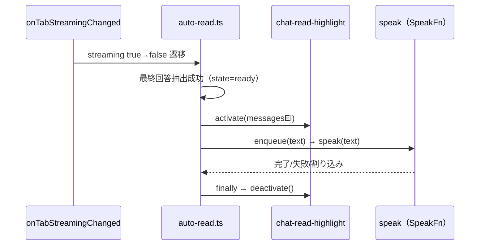

> 📂 **パス**: `80_POC_Projects/POC_017_ClaudianBridge/02_設計文書/32_チャット読上げハイライト設計.md`
> 📍 **ソース**: `D:\AI-Agent\ClaudianBridge`（v0.48.0 時点）
> 🎯 **用途**: F-050 チャット読上げハイライト + F-051 MD 画面 Add to TTS ボタン + Memory タブアイコン追加の設計

---

# 🎨 チャット読上げハイライト設計（F-050 / F-051 / v0.49.0）

## 一、概要

v0.49.0 として 3 機能を実装する。

| # | 機能 | F-番号 |
|:--:|------|:--:|
| 1 | **チャット読上げハイライト**: Claudian 画面の最終回答の自動読み上げ実行中に、読み上げ対象のメッセージブロックをハイライト + スクロール追随（MD 読上げハイライト F-028 の Claudian 画面版） | F-050 |
| 2 | **MD 画面 Add to TTS ボタン**: MD 表示画面のビューヘッダ右上（✏️ 編集切替・⋮ メニューの左側）に「Add to TTS」ボタンを追加 | F-051 |
| 3 | **Memory タブのアイコン追加**: 設定タブ「Memory」に 🧠 を付与（i18n 修正・F-番号なし） | ― |

| 項目 | 内容 |
|------|------|
| 対象読上げパス（F-050） | **最終回答の自動読み上げのみ**（✨ AI 読み上げボタン・💬 メッセージ個別読み上げは対象外） |
| ハイライト粒度（F-050） | **メッセージ単位**（チャンク範囲ハイライトは行わない） |
| 有効/無効（F-050） | 設定トグル `tts.chatReadHighlight.enabled`（既定 ON） |
| 導入バージョン | v0.49.0（Minor・F-050 + F-051 一括） |

## 二、背景と現状

| # | 現状 | 場所 |
|:--:|------|------|
| 1 | MD 読上げハイライトは MarkdownView の Preview（Reading モード）のみ対応。Claudian チャット DOM には未接続 | `src/features/tts/md-read-highlight/preview-renderer.ts` |
| 2 | 自動読み上げは realclaudian の `onTabStreamingChanged` フックで最終回答を抽出し `enqueue(text)` で読み上げ。完了/割り込みは `createLatestWinsSpeaker` の世代カウンタで管理 | `src/features/tts/auto-read.ts` |
| 3 | 設定タブのラベルは i18n 文字列先頭に絵文字を埋め込む方式。`tabMemory` のみ 3 ロケール全て絵文字なし | `src/core/i18n.ts` L920 / L1418 / L1916 |
| 4 | MD ファイルの「Add to TTS」は**ファイル右クリックメニューのみ**で提供。読みたい MD を開いた状態からは 1 クリックで読み上げを始められない | `src/features/tts/md-file-read.ts`（`file-menu` → `addMdToTts`） |

## 三、方式決定

3 案を比較し **案 A（新規モジュール + auto-read への薄いラップ）** を採用。

| 案 | 方式 | 判定 |
|:--:|------|------|
| **A（採用）** | `chat-read-highlight` モジュールを新設し、`auto-read.ts` の speak を薄くラップして activate/deactivate | 既存コードへの影響が auto-read の 1 箇所に限定・モジュール単位テスト可能 |
| B | 既存 `preview-renderer.ts` を DOM 抽象化して再利用 | チャンク範囲・オーバーレイ等 MD 用の複雑さを引きずり過剰設計 |
| C | `auto-read.ts` に直書き | auto-read の責務肥大・テスト困難 |

## 四、機能①： Memory タブのアイコン追加

| 項目 | 内容 |
|------|------|
| 変更内容 | `src/core/i18n.ts` の `tabMemory` を 3 ロケール（ja / en / zh）とも `'Memory'` → `'🧠 Memory'` に変更 |
| 設計判断 | 既存の「ラベル先頭絵文字埋め込み」方式にそのまま準拠（`setIcon` 等のコード変更はしない） |
| テスト | `tabMemory` の期待値を持つ既存テストがあれば更新 |

## 五、機能②： チャット読上げハイライト

### 5.1 モジュール構成

```text
src/features/tts/chat-read-highlight/
├── index.ts     # createChatReadHighlighter ファクトリ（公開 API）
└── （CSS は styles.css に cb-chat-read-* で追記）
```

### 5.2 公開 API

| 関数 | 責務 |
|------|------|
| `createChatReadHighlighter({ store })` | `{ activate, deactivate }` を返す |
| `activate(messagesEl)` | 設定 ON の場合のみ動作。アクティブタブ内の最後の `.claudian-message-assistant` に ①`cb-chat-read-active` クラス付与 ②ハイライト色のインライン背景付与 ③`scrollIntoView({ block: 'center', behavior: 'smooth' })` を 1 回実行 |
| `deactivate()` | クラス・インラインスタイルを除去 |

### 5.3 auto-read.ts への配線



| 項目 | 設計判断 |
|------|------|
| ラップ方式 | `createLatestWinsSpeaker` に渡す `SpeakFn` を `activate → deps.speak(text).finally(deactivate)` で包む |
| 解除タイミング | **Promise の finally** で一律解除 → 読上げ完了・失敗・後勝ち割り込み・手動停止（`stopAllPlayback`）の全経路を網羅（F-031 で学習済みの abort 対応パターン） |
| 割り込み時の誤解除防止 | 世代トークンでガード（旧 speak の `finally` が新ハイライトを解除しない。`speak-coordinator` と同パターン） |
| 対象要素 | `onStreamState` が捕捉した `messagesEl`（アクティブタブの `.claudian-messages`）から最後の `.claudian-message-assistant` を取得 |
| 要素欠落時 | 静かにスキップ（既存 `findMessagesEl` のアノマリ扱いに準拠・Notice 出力なし） |

### 5.4 設定

| 項目 | 内容 |
|------|------|
| キー | `tts.chatReadHighlight: { enabled: boolean }` |
| 既定値 | **ON**（`tts.mdReadHighlight.enabled` と一貫） |
| normalize | 欠落 → 既定 ON・型不正 → 既定 ON（既存パターン準拠） |
| 設定 UI | `SettingTabTts.ts` の MD 読上げハイライトセクション内にトグル 1 つ追加 |
| i18n | `ttsChatReadHighlightEnabled` を ja / en / zh に追加 |
| ハイライト色 | 既存 `tts.mdReadHighlight.highlightColor` を流用（設定項目を増やさない YAGNI 判断） |

### 5.5 スタイル

| 項目 | 内容 |
|------|------|
| クラス | `cb-chat-read-active`（`styles.css` に追記・既存 `cb-` 接頭辞規約準拠） |
| 見た目 | 背景色 = ハイライト色の薄い透過 + 左ボーダー強調。色は activate 時にインライン付与（既存ハイライト色設定に追随） |

## 六、機能③： MD 画面ビューヘッダ Add to TTS ボタン（F-051）

### 6.1 UI イメージ

MD 表示画面（MarkdownView）のビューヘッダ右上、既存アイコン（✏️ 編集/読切切替・⋮ その他のメニュー）の**左側**に 🔊 ボタンを 1 つ追加する。

```mermaid
graph LR
    subgraph MD タブヘッダ（右端）
        A["🔊 Add to TTS<br/>(本機能で追加)"] --> B["✏️ 編集/読切切替<br/>(既存)"] --> C["⋮ メニュー<br/>(既存)"]
    end
```

### 6.2 実装方式

| 項目 | 設計判断 |
|------|------|
| 追加 API | `MarkdownView.addAction('volume-2', title, cb)` — Obsidian 公開 API（ItemView.addAction）。アクションボタンは既定でビルトインアイコン群の左側に描画されるため**位置指定の DOM ハック不要** |
| 表示条件 | `extension === 'md'` の MarkdownView すべて（編集/読切両モード・設定トグルは新設しない — 右クリックメニューと条件を統一） |
| 重複防止 | `layout-change` / `active-leaf-change` での再スキャン時、`[data-cb-add-tts]` マーカーの有無で冪等追加（既存ボタンがあればスキップ） |
| クリック動作 | 既存フローをそのまま呼び出し: `addMdToTts(app, view.file, store.load())`（右クリックメニューと同一経路 → ハイライト連動も自動的に有効） |
| view 閉鎖時 | ボタンは view header の子要素のため自動破棄。追加の cleanup は不要（本体は `setupMdViewButton(app, store)` のイベント offref のみ） |
| 配置箇所 | `src/features/tts/md-file-read.ts` に `setupMdViewButton` を追加（抽出・正規化ロジックを共有するため別モジュール化しない） |
| i18n | ボタン title に既存 `s.ttsAddToTts` を使用（新キー不要） |

### 6.3 エラー処理

| ケース | 動作 |
|------|------|
| `view.file` が null（新規空タブ等） | ボタン自体は表示するが、クリック時に静かにスキップ（Notice なし） |
| `addAction` 非存在（将来の API 変更） | `typeof view.addAction !== 'function'` でガードし静かにスキップ |

## 七、テスト計画

| 対象 | 内容 |
|------|------|
| `tests/features/tts/chat-read-highlight/`（新設） | ①activate でクラス/背景色/スクロール付与 ②deactivate で完全解除 ③世代ガード（割り込み時に旧 finally が新ハイライトを解除しない）④設定 OFF で不発 ⑤messagesEl / 対象要素欠落時に無害動作 |
| `tests/features/tts/md-view-button.test.ts`（新設） | ①md ファイルの view にボタン追加 ②重複追加されない（冪等）③非 md ファイルでは不発 ④クリックで `addMdToTts` が呼ばれる ⑤`addAction` 欠落時の無害動作 |
| `tests/core/settings.test.ts` | `tts.chatReadHighlight` の normalize（欠落/型不正 → 既定 ON・`enabled: false` の保持） |
| i18n テスト | `tabMemory` 3 ロケール絵文字付き・`ttsChatReadHighlightEnabled` 3 ロケール存在 |

## 八、非ゴール

| # | 非ゴール |
|:--:|------|
| 1 | チャンク範囲ハイライト（MD 読上げと同等の粒度）— メッセージ単位のみ |
| 2 | ✨ AI 読み上げボタン・💬 メッセージ個別読み上げへの適用 |
| 3 | ハイライト色の独立設定 |
| 4 | Live Preview（エディタ）ハイライトの再有効化（v0.33.10 で緊急無効化のまま） |
| 5 | MD 画面ボタンの表示/非表示設定トグル（右クリックメニューと条件を統一） |

## 九、成功基準

| # | 基準 |
|:--:|------|
| 1 | 最終回答の自動読み上げ中、該当メッセージがハイライトされ画面内に自動スクロールする |
| 2 | 読上げ完了・割り込み・手動停止のいずれでもハイライトが確実に消える |
| 3 | 設定 OFF でハイライトが一切出ない |
| 4 | MD 画面右上（✏️ の左）に 🔊 ボタンが表示され、クリックで読み上げ（+ ハイライト）が開始する。複数回レイアウト変更してもボタンが重複しない |
| 5 | 設定タブ「🧠 Memory」にアイコンが表示される |
| 6 | `npm run test`（全件 PASS）・`npm run typecheck` 0・`npm run build` + デプロイ成功 |

---

*🎨 32_チャット読上げハイライト設計 v1.1 · POC_017 Claudian Bridge · MiuMiu 🐾 · 2026-09-14 F-051 追加*
