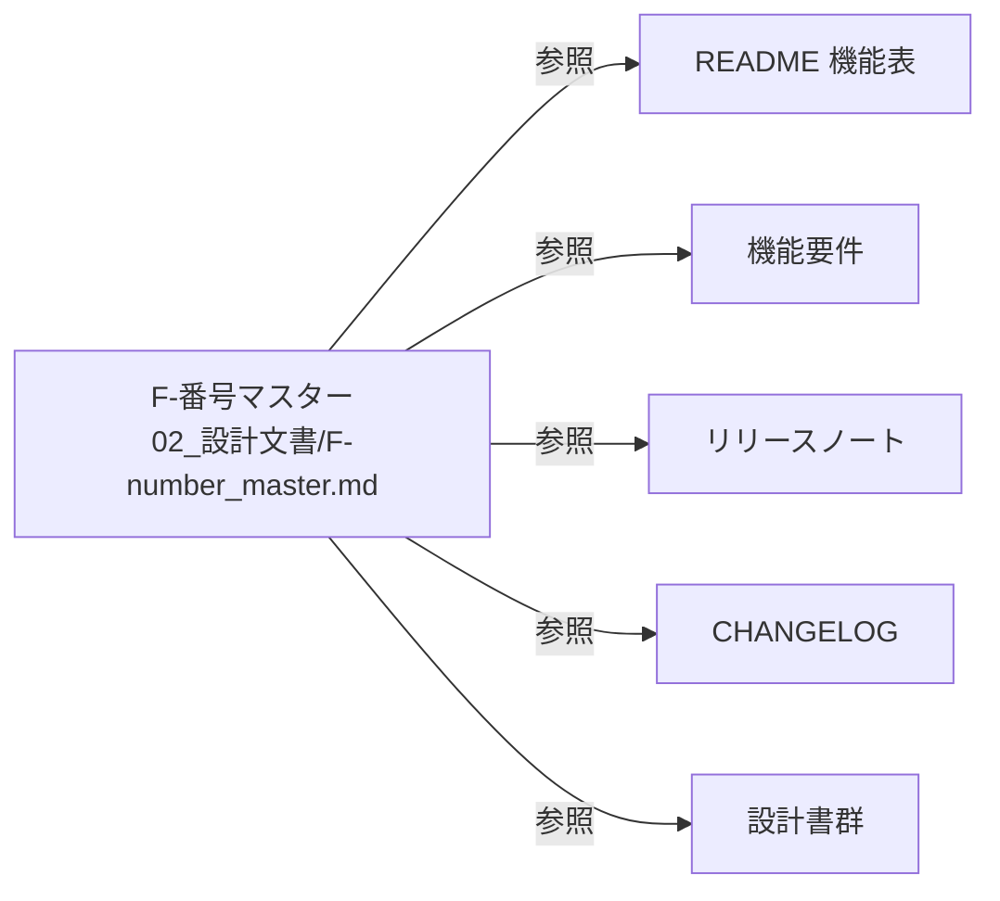

> 📂 **パス**: `80_POC_Projects/POC_017_ClaudianBridge/02_設計文書/F-number_master.md`
> 🎯 **用途**: Claudian Bridge の全機能に付与された F-番号の Single Source of Truth（SSOT）

---

# 📚 F-番号マスター

## F-番号一覧（F001 〜 F049）

| F-番号 | 機能名 | 導入 ver | 概要 | 関連 commit / 設計書 |
|:------:|--------|:--------:|------|---------------------|
| F001 | テキスト挿入 | v0.1.0 | 選択テキスト → Claudian 入力欄 | `[[01_機能要件#F001]]` |
| F002 | 音声読み上げ（TTS） | v0.1.0 | edge / WebSpeech / Plachta の 3 エンジン | `[[2026-08-19-tts-engine-change-local-bundle-cloud-server-language-mode]]` |
| F003 | フォルダ参照追加 | v0.1.0 | フォルダ右クリック → `@path` 挿入 | |
| F004 | Office 変換 | v0.2.0 | markitdown ベース | |
| F005 | 拡張子フィルタ | v0.3.0 | CSS 注入で拡張子絞り込み | |
| F006 | 設定画面 | v0.1.0〜 | 8 タブ構成 | |
| F007 | 設定自動移行 | v0.1.0 | 旧 5 プラグインの data.json | |
| F008 | 旧プラグイン無効化 | v0.1.0 | 1 度だけ無効化 | |
| F009 | オブジェクトコンテキストメニュー | v0.2.0 | `@object[type]` 挿入 | `[[10_オブジェクトコンテキストメニュー設計]]` |
| F010 | Chroma DB ブラウザ | v0.3.0 | サイドバービュー | `[[2026-08-15-zhipu-quota-provider-design]]` |
| F011 | LLM 残量検知 | v0.5.0 | 5 プロバイダの残量 | `[[11_LLM残量検知設計]]` |
| F012 | 診断ログ | v0.3.0 | グローバルエラーハンドラ | |
| F013 | AI 読み上げボタン（✨） | v0.16.0 | `claude -p` で整形 | `[[2026-08-16-input-ai-read-button-design]]` |
| F014 | MD 保存ボタン | v0.17.0 | 回答ブロック → Markdown 保存 | `[[2026-08-16-md-save-button-design]]` |
| F015 | TTS 読み上げ仕様統一 | v0.17.0 | `speakText` 統合 | `[[2026-08-16-tts-read-spec-enhancement-design]]` |
| F016 | EdgeTTS チャンク上限 | v0.18.0 | エンジン別上限 | `[[2026-08-16-edge-chunkmax-settings-design]]` |
| F017 | 自動読み上げ最終回答のみ | v0.19.0 | `detectFinalAnswerState()` ゲート | `[[2026-08-16-tts-auto-read-final-answer-design]]` |
| F018 | Chroma-fs + RAG | v0.20.0 | 仮想フォルダ + RAG 検索 | `[[2026-08-16-chroma-fs-virtual-folder-design]]` |
| F019 | 右クリックバックアップ | v0.21.0 | `BackupMenuRegistrar` | `[[2026-08-17-backup-feature-design]]` |
| F020 | アンダースコアフォルダ非表示 | v0.22.0 | `_` プレフィックス | `[[2026-08-17-underscore-folder-hide-design]]` |
| F021 | 方案ボタン常時表示 | v0.24.0 | `quickReplyShowAllOptions` | `[[2026-08-18-claudian-chat-quick-reply-buttons-design]]` |
| F022 | クイック返信ボタン全体 ON/OFF | v0.25.0 | `quickReplyEnabled` | 同上 |
| F023 | 方案検出パターン拡張 | v0.26.0 | 「案N」「第一選択」等 | 同上 |
| F024 | TTS エンジン変更 | v0.27.0 | edge_tts 同梱 + cloud + 言語モード + Linux | `[[2026-08-19-tts-engine-change-local-bundle-cloud-server-language-mode]]` |
| F025 | Thought 読上げ除外強化 | v0.27.1 | 複数クラス OR | |
| F026 | 完了報告読上げスクリプト整形 | v0.28.0 | ✅ 完了報告を ヘッダー/結論/次のアクション提案 のサマリーのみ読み上げ（成果物・検証結果・参照文献・表は除外） | `[[2026-08-30-report-speech-script-design]]` |
| F027 | トークン速度（tok/s）表示 | v0.30.0〜v0.32.0 | `general.tokenRateEnabled`。4 値（首/現在/平均/最大）表示・項目選択（v0.31.0）・更新周期プリセット既定 250ms（v0.32.0） | `[[2026-08-30-token-rate-display-design]]` |
| F028 | MD 読み上げ位置ハイライト | v0.33.0 | MD「Add to TTS」本文を Preview 上でチャンク単位ハイライト + フローティングオーバーレイ | `[[2026-09-02-md-read-position-highlight-design]]` |
| F029 | 自己更新機能 | v0.32.10 | プラグインの自己更新（GitHub Releases から取得） | CHANGELOG v0.32.10（main リポジトリ） |
| F030 | チャット内 Mermaid 自動描画 | v0.34.0 | チャットの mermaid フェンスを MarkdownRenderer で自動図化 + `</>` 切替 | `[[13_Mermaidチャット内自動描画設計]]` |
| F031 | MD 読み上げ再生制御強化 | v0.35.0〜v0.35.1 | PlaybackController（⏸/⏭ 実働）・自然分割・Edge 先行変換・色パレット・自動スクロール | `[[14_MD読み上げ再生制御強化設計]]` |
| F032 | 選択ポップアップ位置設定 | v0.38.0 | `selection.popupPosition: 'top-right' \| 'bottom'` 新設（既定 `top-right`）・`positionPopup` に第3引数 `mode`・ビューポート端のクランプ/反転両モード共通・既存ユーザー可視挙動変更（下 → 右上、設定で `bottom` に戻せる）・i18n ja/en/zh | `[[17_選択ポップアップ位置設定設計]]` |
| F033 | MD 読み上げ LLM 原稿書き換え | v0.37.0〜v0.37.1 | 「Add to TTS」本文を LLM でです・ます調原稿に書き換えてから読み上げ（v0.37.1 で統一・並列生成・ストリーミング読上げ） | `[[15_MD読み上げLLM原稿書き換え設計]]` |
| F038 | 文生図機能（Text-to-Image） | v0.38.0 | MiniMax image-01 / Zhipu GLM-Image の 2 プロバイダ対応・モーダル UI・`output/Assets/` 固定保存・アクティブノートへ `![[]]` 挿入・i18n ja/en/zh・既存 quota の API キーを流用 | `[[18_文生図機能設計]]` |
| F039 | Think モード選択機能 | v0.39.0 | 設定 → 一般 → Think モード で Claude / DeepSeek / Zhipu / MiniMax / Kimi ごとの Think モード（ON/OFF + エフォート low/medium/high）を選択・`LlmClient` インターフェース抽象化・quota ステータスバーに 🧠 バッジ | `[[2026-09-08-think-mode-selection-design]]` |
| F040 | Think モード選択機能 Phase 2 | v0.40.0 | Phase 1 (F-039) で Claude のみだった Think モードを **DeepSeek / Zhipu / MiniMax / Kimi** の 4 プロバイダに拡張。`createDeepSeekClient` / `createZhipuClient` / `createMiniMaxClient` / `createKimiClient` の 4 API 直接呼び出しクライアントを新設。`resolveApiKey` 関数で 4 プロバイダの API キーを統一解決、`resolveLlmClient` dispatch を 5 プロバイダ対応に拡張。**Kimi は body の `thinking` フィールド非サポートのため `moonshot-v1-128k` ↔ `kimi-thinking-preview` のモデル切替方式で実装**。MiniMax モデル名は現行 `MiniMax-M3` | `[[2026-09-08-think-mode-selection-design]]` |
| F041 | OpenVPN 接続機能 | v0.43.0 | `.ovpn` による VPN トンネル確立（デスクトップのみ・Win/Mac/Linux）。手動接続/切断 + LLM 呼び出し時自動接続（`network.openvpn.autoConnectOnLlm`）・auth-user-pass 対応・状態 4 値 + stderr 監視・`ensureVpnConnected()` フック・無効化時自動切断 | `[[27_ネットワークタブOpenVPN設計]]` |
| F042 | ネットワークタブ新設 | v0.43.0 | 一般タブとテキスト挿入タブの間に「🌐 ネットワーク」タブ新設。プロキシ設定（v0.38.0）を一般タブから移動（`general.proxy` → `network.proxy`・旧キー自動移送）+ OpenVPN 接続セクション新設 | `[[27_ネットワークタブOpenVPN設計]]` |
| F043 | Claudian 画面 OpenVPN トグル | v0.43.1 | YOLO トグル横に VPN 接続制御ボタン追加。ワンショット方式・状態バッジ（🔴/🟡 pulse/🟢/🔴）リアルタイム反映・設定未完了時はネットワークタブへ自動遷移・複数 Claudian タブ自動追随 | `[[28_Claudian画面VPNトグル設計]]` |
| F044 | Server Override（サーバ上書き） | v0.43.2 | ネットワークタブに「サーバ上書き（任意）」設定。ドメイン名（DDNS）で `.ovpn` の接続先を上書き（`host` または `host:port`・openvpn CLI `--remote` 方式）・空欄時は後方互換 | `docs/superpowers/specs/2026-09-13-vpn-server-override-design.md`（main リポジトリ） |
| F045 | 残骸経路（死んだセッション）の検知 | v0.45.0 | openvpn ログの `[DHCP-serv: x.x.x.x]` から正しいゲートウェイを記録し `route print` の経路と照合。①経路未確立＋残骸あり ②残骸混在 ③正常 の 3 分岐警告。`On-link` 行はゲートウェイ扱いしない | `docs/superpowers/plans/2026-09-14-stale-route-removal.md`（main リポジトリ） |
| F046 | 残骸経路の 1 クリック削除 | v0.46.0 | 🧹 Remove stale routes ボタン（管理者ゲート）。`getVpnRoutes()` 拡張・`isRunningAsAdmin()`（route delete 試行プローブ）・`findStaleRoutes()`（期待ゲートウェイでフィルタ）・`removeStaleRoutes()`。VPN 関連ルートのみホワイトリスト化しローカル LAN は触らない | `[[30_残骸経路1クリック削除設計]]` |
| F047 | 切断時の残骸経路自動削除 | v0.47.0 | `cleanupAfterDisconnect()` — OpenVPN 切断後 3 秒待機 → バックグラウンド stale 検出 → 管理者起動時のみ自動削除。v0.46.0 の手動 🧹 ボタンは併存 | `[[31_切断時残骸経路自動削除設計]]` |
| F048 | Zhipu 残量取得の純 TypeScript 化 | v0.48.0 | `createZhipuProvider` を Python スクリプト spawn（Vault 内 `_query_zhipu_quota.py` + `py` + zai-sdk）から `httpGet`（`/api/monitor/usage/quota/limit`・生 Bearer キー・JWT/SDK 不要）に置換。`quota/python.ts`・`zhipuPythonPath` 設定・i18n 3 ロケール廃止。テスト 1348 total | CHANGELOG v0.48.0（inline TDD・設計書なし） |
| F049 | Outputs フォルダミラリング + Vault表示タブ + 改定履歴ページ | v0.41.0 | ドキュメント/ObsidainOutputs を Vault/Outputs に NTFS ジャンクションで表示（Vault 容量削減・実フォルダ優先で有効化不可制御）。「📂 開く」ボタン（shell.openPath）。「`.` で始まるフォルダを非表示」（hideDotFolders 既定 ON）。「📜 改定履歴」タブ（CHANGELOG.md SSOT・45+ エントリ全表示）+ check:changelog リリースゲート。タブ改名: 拡張子フィルタ → Vault表示。⚠️ 旧 F041 → **F049 に振り直し**（main リポジトリで F-041 は OpenVPN 接続機能として使用済みのため衝突解消）
`[[20_Outputsフォルダミラリング設計]]` |

> 💡 **欠番**: F034 / F035（未使用）。F-036（画像生成）/ F-037（セルフアップデート）は `03_ソース構造.md` の表記だが、本マスターでは文生図 = F038・自己更新 = F029 が正（main CHANGELOG 準拠）。
> ⚠️ **F041 振り直し履歴**: v0.41.0 の Outputs 機能に誤って F041 を付与していたが、main リポジトリ（v0.43.0 リリース・実装 plan）が F-041 = OpenVPN 接続機能を使用したため、Outputs を F049 に振り直した（2026-09-14）。

## 付与規約

- feat コミット message に F-番号を含める: `feat(F024): TTS エンジン変更 ...`
- 新規機能は**必ず**本マスターに追記してから commit
- 関連設計書・要件・リリースノートの F-番号は本マスターを参照

## SSOT 関係図

---

*📚 F-番号マスター v1.3.0 · Claudian Bridge · MiuMiu 🐾 · 2026-09-14 As-Built v0.48.0 対応（F029/F033/F041〜F048 追加・F041 衝突解消で Outputs を F049 に振り直し）*
