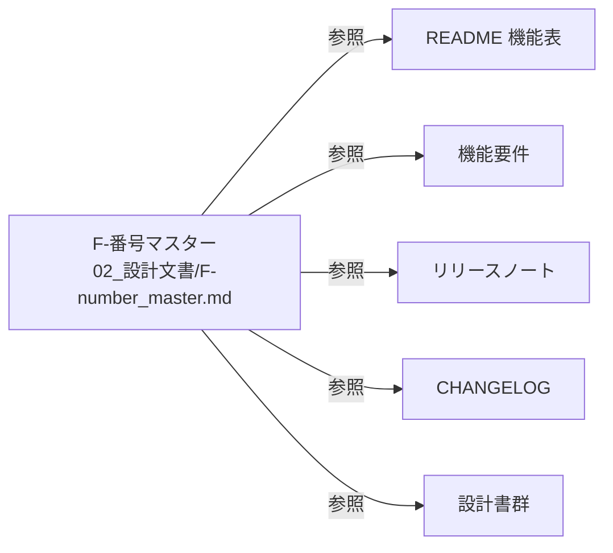

> 📂 **パス**: `80_POC_Projects/POC_017_ClaudianBridge/02_設計文書/F-number_master.md`
> 🎯 **用途**: Claudian Bridge の全機能に付与された F-番号の Single Source of Truth（SSOT）

---

# 📚 F-番号マスター

## F-番号一覧（F001 〜 F026）

| F-番号 | 機能名 | 導入 ver | 概要 | 関連 commit / 設計書 |
|:------:|--------|:--------:|------|---------------------|
| F001 | テキスト挿入 | v0.1.0 | 選択テキスト → Claudian 入力欄 | `[[01_機能要件#F001]]` |
| F002 | 音声読み上げ（TTS） | v0.1.0 | edge / WebSpeech / Plachta の 3 エンジン | `[[2026-08-19-tts-engine-change-local-bundle-cloud-server-language-mode]]` |
| F003 | フォルダ参照追加 | v0.1.0 | フォルダ右クリック → `@path` 挿入 | |
| F004 | Office 変換 | v0.2.0 | markitdown ベース | |
| F005 | 拡張子フィルタ | v0.3.0 | CSS 注入で拡張子絞り込み | |
| F006 | 設定画面 | v0.1.0〜 | 8 タブ構成 | |
| F007 | 設定自動移行 | v0.1.0 | 旧 5 プラグインの data.json | |
| F008 | 旧プラグイン無効化 | v0.1.0 | 1 度だけ無効化 | |
| F009 | オブジェクトコンテキストメニュー | v0.2.0 | `@object[type]` 挿入 | `[[10_オブジェクトコンテキストメニュー設計]]` |
| F010 | Chroma DB ブラウザ | v0.3.0 | サイドバービュー | `[[2026-08-15-zhipu-quota-provider-design]]` |
| F011 | LLM 残量検知 | v0.5.0 | 5 プロバイダの残量 | `[[11_LLM残量検知設計]]` |
| F012 | 診断ログ | v0.3.0 | グローバルエラーハンドラ | |
| F013 | AI 読み上げボタン（✨） | v0.16.0 | `claude -p` で整形 | `[[2026-08-16-input-ai-read-button-design]]` |
| F014 | MD 保存ボタン | v0.17.0 | 回答ブロック → Markdown 保存 | `[[2026-08-16-md-save-button-design]]` |
| F015 | TTS 読み上げ仕様統一 | v0.17.0 | `speakText` 統合 | `[[2026-08-16-tts-read-spec-enhancement-design]]` |
| F016 | EdgeTTS チャンク上限 | v0.18.0 | エンジン別上限 | `[[2026-08-16-edge-chunkmax-settings-design]]` |
| F017 | 自動読み上げ最終回答のみ | v0.19.0 | `detectFinalAnswerState()` ゲート | `[[2026-08-16-tts-auto-read-final-answer-design]]` |
| F018 | Chroma-fs + RAG | v0.20.0 | 仮想フォルダ + RAG 検索 | `[[2026-08-16-chroma-fs-virtual-folder-design]]` |
| F019 | 右クリックバックアップ | v0.21.0 | `BackupMenuRegistrar` | `[[2026-08-17-backup-feature-design]]` |
| F020 | アンダースコアフォルダ非表示 | v0.22.0 | `_` プレフィックス | `[[2026-08-17-underscore-folder-hide-design]]` |
| F021 | 方案ボタン常時表示 | v0.24.0 | `quickReplyShowAllOptions` | `[[2026-08-18-claudian-chat-quick-reply-buttons-design]]` |
| F022 | クイック返信ボタン全体 ON/OFF | v0.25.0 | `quickReplyEnabled` | 同上 |
| F023 | 方案検出パターン拡張 | v0.26.0 | 「案N」「第一選択」等 | 同上 |
| F024 | TTS エンジン変更 | v0.27.0 | edge_tts 同梱 + cloud + 言語モード + Linux | `[[2026-08-19-tts-engine-change-local-bundle-cloud-server-language-mode]]` |
| F025 | Thought 読上げ除外強化 | v0.27.1 | 複数クラス OR | |
| F026 | 完了報告読上げスクリプト整形 | v0.28.0 | ✅ 完了報告を ヘッダー/結論/次のアクション提案 のサマリーのみ読み上げ（成果物・検証結果・参照文献・表は除外） | `[[2026-08-30-report-speech-script-design]]` |

## 付与規約

- feat コミット message に F-番号を含める: `feat(F024): TTS エンジン変更 ...`
- 新規機能は**必ず**本マスターに追記してから commit
- 関連設計書・要件・リリースノートの F-番号は本マスターを参照

## SSOT 関係図

---

*📚 F-番号マスター v1.0.0 · Claudian Bridge · MiuMiu 🐾 · 2026-08-29*
